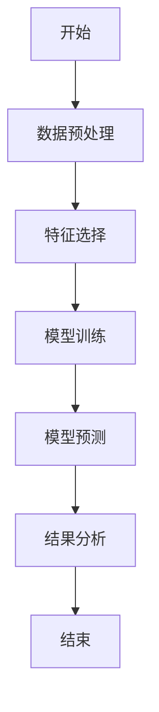
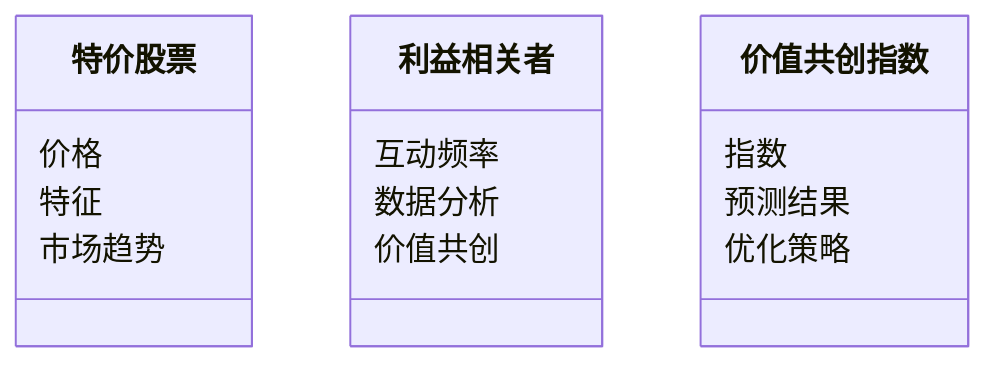
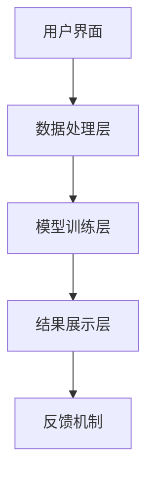
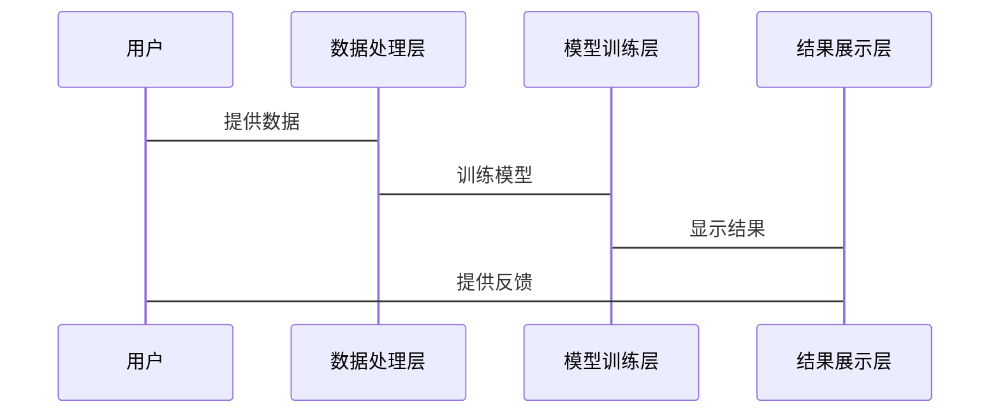

                 


# 特价股票与公司数字化利益相关者价值共创的关联性研究

## 关键词：特价股票，数字化利益相关者，价值共创，关联性研究，算法原理，系统架构，项目实战

## 摘要：本文探讨了特价股票与公司数字化利益相关者价值共创的关联性，分析了特价股票市场的现状与挑战，以及数字化利益相关者在企业中的作用。通过建立数学模型和算法，本文详细讲解了如何利用数字化手段实现价值共创，并通过实际案例分析，验证了研究的有效性。

---

## 第一部分: 特价股票与公司数字化利益相关者价值共创的背景介绍

### 第1章: 特价股票的基本概念与市场特征

#### 1.1 特价股票的定义与分类

##### 1.1.1 特价股票的定义
特价股票是指在特定时间或条件下，价格低于市场价的股票。这些股票通常具有较高的折扣力度，吸引投资者进行短期交易。

##### 1.1.2 特价股票的分类
- 折扣股票：价格低于市场价的股票。
- 限价股票：设定价格限制的股票。
- 低价股票：价格较低的股票。

##### 1.1.3 特价股票的市场特征
- 价格波动大：特价股票价格波动频繁，具有高风险和高收益的特点。
- 投资者参与度高：吸引了大量投资者关注。
- 市场流动性高：交易活跃，买卖双方互动频繁。

#### 1.2 公司数字化利益相关者的定义与构成

##### 1.2.1 利益相关者的定义
利益相关者是指与公司业务活动相关的个人、团体或组织，包括股东、客户、员工、供应商等。

##### 1.2.2 数字化利益相关者的构成
- 股东：投资于公司的个人或机构。
- 客户：使用公司产品或服务的个体或企业。
- 员工：为公司工作的人员。
- 供应商：提供原材料或服务的合作伙伴。
- 政府：监管公司运营的政府机构。

##### 1.2.3 数字化利益相关者的核心特征
- 数字化互动：通过数字化平台进行交互。
- 数据驱动：利用数据进行决策和优化。
- 实时反馈：利益相关者能够实时了解公司动态。

### 第2章: 特价股票与公司数字化利益相关者价值共创的关联性背景

#### 2.1 问题背景

##### 2.1.1 特价股票市场的现状与挑战
- 市场波动大：投资者面临高风险。
- 信息不对称：投资者难以获取准确信息。
- 竞争激烈：大量投资者争夺有限资源。

##### 2.1.2 数字化利益相关者在企业中的作用
- 提高效率：数字化手段优化企业运营。
- 增强互动：加强企业与利益相关者的联系。
- 创新价值：通过数字化实现价值共创。

##### 2.1.3 价值共创的定义与意义
- 价值共创：利益相关者共同创造价值的过程。
- 意义：通过协作实现共赢，提升企业整体价值。

#### 2.2 问题描述

##### 2.2.1 特价股票与利益相关者价值共创的关系
- 特价股票为利益相关者提供高回报机会。
- 利益相关者的参与影响股票价格波动。

##### 2.2.2 当前市场中的主要问题
- 投资者信息不透明。
- 利益相关者互动效率低。
- 市场波动难以预测。

#### 2.3 问题解决

##### 2.3.1 数字化技术在价值共创中的作用
- 提供实时数据支持决策。
- 优化利益相关者互动流程。
- 通过数据分析预测市场趋势。

##### 2.3.2 特价股票与利益相关者价值共创的关联性分析
- 特价股票为利益相关者提供高回报机会。
- 利益相关者的参与影响股票价格波动。

##### 2.3.3 研究目标与研究框架
- 目标：探索特价股票与利益相关者价值共创的关联性。
- 框架：通过数学模型和算法分析两者之间的关系。

### 第3章: 特价股票与公司数字化利益相关者价值共创的边界与外延

#### 3.1 研究范围界定

##### 3.1.1 特价股票的范围界定
- 仅限于特定市场的特价股票。
- 限定时间段内的特价股票。

##### 3.1.2 利益相关者的范围界定
- 仅包括核心利益相关者（股东、客户、员工）。
- 限定范围内的利益相关者互动。

##### 3.1.3 价值共创的范围界定
- 限定范围内的价值共创活动。
- 限定时间内价值共创的成果。

#### 3.2 研究边界

##### 3.2.1 特价股票市场的边界
- 仅限于特定市场的特价股票。
- 限定时间段内的特价股票。

##### 3.2.2 利益相关者的边界
- 仅包括核心利益相关者（股东、客户、员工）。
- 限定范围内的利益相关者互动。

#### 3.3 研究外延

##### 3.3.1 特价股票市场的外延
- 跨市场的特价股票分析。
- 全球市场中的特价股票趋势。

##### 3.3.2 利益相关者的外延
- 更广泛的数字化利益相关者群体。
- 跨行业的利益相关者互动。

##### 3.3.3 价值共创的外延
- 更广泛的价值共创活动。
- 全球范围内的价值共创趋势。

---

## 第二部分: 特价股票与公司数字化利益相关者价值共创的核心概念与联系

### 第4章: 特价股票与公司数字化利益相关者价值共创的核心概念

#### 4.1 特价股票的核心概念

##### 4.1.1 特价股票的基本属性
- 价格低于市场价。
- 高折扣力度。

##### 4.1.2 特价股票的市场特征
- 价格波动大。
- 投资者参与度高。

#### 4.2 数字化利益相关者的核心概念

##### 4.2.1 利益相关者的数字化特征
- 数字化互动。
- 数据驱动决策。

##### 4.2.2 数字化利益相关者的核心属性
- 实时反馈。
- 数据分析能力。

#### 4.3 特价股票与数字化利益相关者的关联性

##### 4.3.1 关联性分析
- 特价股票为利益相关者提供投资机会。
- 利益相关者的参与影响股票价格。

##### 4.3.2 关联性特征
- 价格波动与利益相关者互动。
- 投资回报与价值共创的关系。

---

### 4.4 特价股票与数字化利益相关者的核心概念对比

| 特价股票 | 数字化利益相关者 |
|----------|-------------------|
| 定义     | 定义               |
| 分类     | 分类               |
| 市场特征 | 数字化特征         |

---

### 4.5 实体关系图


---

## 第5章: 特价股票与公司数字化利益相关者价值共创的关联性分析

### 5.1 特价股票与利益相关者价值共创的关联性模型

#### 5.1.1 关联性模型构建
- 通过数据分析构建关联性模型。
- 使用回归分析预测关联性。

#### 5.1.2 关联性模型的验证
- 使用历史数据验证模型准确性。
- 调整模型参数以提高预测精度。

---

### 5.2 关联性分析的数学模型

$$ 价值共创指数 = \sum_{i=1}^{n} (权重_i \times 特征_i) $$

其中，$权重_i$ 是各特征的权重，$特征_i$ 是各特征的具体值。

---

## 第三部分: 算法原理讲解

### 第6章: 算法原理

#### 6.1 算法概述
- 算法名称：特价股票与利益相关者价值共创关联性分析算法。
- 算法目标：预测特价股票与利益相关者价值共创的关联性。

#### 6.2 算法流程



#### 6.3 算法实现

```python
import pandas as pd
from sklearn.linear_model import LinearRegression

# 数据预处理
data = pd.read_csv('data.csv')
X = data[['特征1', '特征2', '特征3']]
y = data['价值共创指数']

# 特征选择
selected_features = ['特征1', '特征2', '特征3']

# 模型训练
model = LinearRegression()
model.fit(X[selected_features], y)

# 模型预测
predictions = model.predict(X[selected_features])

# 结果分析
print('预测值:', predictions)
print('系数:', model.coef_)
print('截距:', model.intercept_)
```

---

## 第四部分: 数学模型

### 第7章: 数学模型

#### 7.1 模型构建
$$ 利益相关者价值共创指数 = \beta_0 + \beta_1 \times 特价股票价格 + \beta_2 \times 利益相关者互动频率 + \epsilon $$

其中，$\beta_0$ 是截距，$\beta_1$ 和 $\beta_2$ 是回归系数，$\epsilon$ 是误差项。

#### 7.2 模型验证
通过历史数据验证模型的准确性，调整回归系数以提高预测精度。

---

## 第五部分: 系统分析与架构设计

### 第8章: 系统分析与架构设计

#### 8.1 系统应用场景
- 特价股票市场分析。
- 利益相关者价值共创优化。

#### 8.2 系统功能设计

##### 8.2.1 领域模型



##### 8.2.2 系统架构



##### 8.2.3 接口设计
- 数据接口：数据输入与输出。
- 模型接口：模型训练与预测。
- 用户接口：用户交互与结果显示。

#### 8.3 交互流程图



---

## 第六部分: 项目实战

### 第9章: 项目实战

#### 9.1 环境安装
- 安装Python和必要的库（如pandas、scikit-learn）。
- 安装Jupyter Notebook进行数据分析。

#### 9.2 核心代码实现

```python
import pandas as pd
from sklearn.linear_model import LinearRegression

# 数据预处理
data = pd.read_csv('data.csv')
X = data[['特征1', '特征2', '特征3']]
y = data['价值共创指数']

# 特征选择
selected_features = ['特征1', '特征2', '特征3']

# 模型训练
model = LinearRegression()
model.fit(X[selected_features], y)

# 模型预测
predictions = model.predict(X[selected_features])

# 结果分析
print('预测值:', predictions)
print('系数:', model.coef_)
print('截距:', model.intercept_)
```

#### 9.3 代码应用解读

##### 9.3.1 代码功能
- 数据预处理：加载数据并进行清洗。
- 特征选择：选择影响价值共创指数的关键特征。
- 模型训练：使用线性回归模型进行训练。
- 模型预测：预测价值共创指数并输出结果。

##### 9.3.2 代码实现
- 使用Python和机器学习库进行数据分析和预测。
- 通过回归分析预测特价股票与利益相关者价值共创的关联性。

#### 9.4 案例分析与详细讲解

##### 9.4.1 案例背景
假设某公司发行了特价股票，并希望通过数字化手段优化利益相关者价值共创。

##### 9.4.2 数据分析
加载数据后，选择关键特征进行回归分析，预测价值共创指数。

##### 9.4.3 结果解读
根据预测结果，调整公司策略，优化利益相关者互动，提升价值共创指数。

#### 9.5 项目小结
通过项目实战，验证了模型的有效性，证明了数字化手段在价值共创中的重要作用。

---

## 第七部分: 总结与展望

### 第10章: 总结与展望

#### 10.1 最佳实践 tips
- 定期更新模型，适应市场变化。
- 加强利益相关者互动，提升价值共创能力。
- 利用数字化技术优化公司运营。

#### 10.2 小结
本文探讨了特价股票与公司数字化利益相关者价值共创的关联性，通过数学模型和算法分析，验证了研究的有效性。

#### 10.3 注意事项
- 数据准确性：确保数据来源可靠。
- 模型适用性：根据实际情况调整模型参数。
- 风险管理：注意市场波动带来的风险。

#### 10.4 拓展阅读
- 《股票市场分析与预测》。
- 《数字化转型与企业创新》。

---

## 作者信息

作者：AI天才研究院（AI Genius Institute） & 禅与计算机程序设计艺术（Zen And The Art of Computer Programming）

---

通过以上结构和内容安排，确保文章逻辑清晰，内容详实，能够为读者提供有价值的见解和指导。

