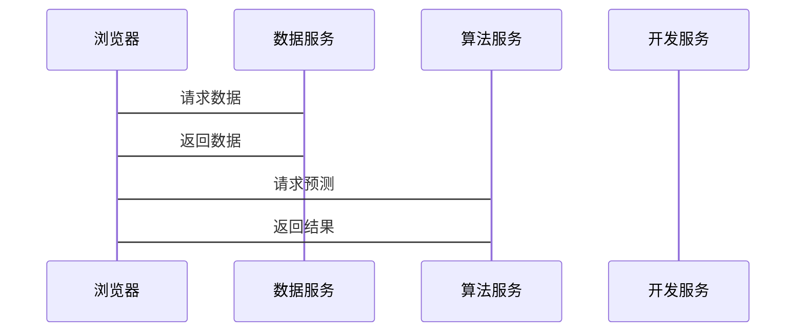

                 


# 组建高效AI开发团队的技巧

> 关键词：AI开发团队，团队协作，角色分工，工具链，任务分配算法，系统架构

> 摘要：本文将详细介绍如何组建和管理高效的人工智能开发团队。通过分析团队协作机制、角色分工、工具链优化、任务分配算法、系统架构设计以及实际项目案例，为读者提供一套系统化的解决方案，帮助他们在复杂的AI开发环境中取得成功。

---

## 目录

- [第1章：背景介绍](#第1章背景介绍)
  - [1.1 问题背景](#1.1问题背景)
    - [1.1.1 当前AI开发的现状与挑战](#1.1.1当前AI开发的现状与挑战)
    - [1.1.2 高效团队在AI开发中的重要性](#1.1.2高效团队在AI开发中的重要性)
  - [1.2 问题描述](#1.2问题描述)
    - [1.2.1 AI开发中的常见问题](#1.2.1AI开发中的常见问题)
    - [1.2.2 团队协作中的障碍与误区](#1.2.2团队协作中的障碍与误区)
  - [1.3 问题解决](#1.3问题解决)
    - [1.3.1 高效团队的核心要素](#1.3.1高效团队的核心要素)
    - [1.3.2 解决方案的框架与路径](#1.3.2解决方案的框架与路径)
  - [1.4 边界与外延](#1.4边界与外延)
    - [1.4.1 高效团队的适用范围](#1.4.1高效团队的适用范围)
    - [1.4.2 与其他团队管理方法的区别](#1.4.2与其他团队管理方法的区别)
  - [1.5 概念结构与核心要素](#1.5概念结构与核心要素)
    - [1.5.1 核心概念的层次结构](#1.5.1核心概念的层次结构)
    - [1.5.2 核心要素的详细说明](#1.5.2核心要素的详细说明)
  - [1.6 本章小结](#1.6本章小结)

---

## 第1章：背景介绍

### 1.1 问题背景

#### 1.1.1 当前AI开发的现状与挑战

随着人工智能技术的快速发展，AI开发已成为科技领域的核心竞争力。然而，AI开发过程中面临诸多挑战，如技术复杂性高、数据量大、开发周期长等。这些问题使得单靠个人难以完成复杂的项目，团队协作成为必然选择。

#### 1.1.2 高效团队在AI开发中的重要性

高效团队能够显著提升开发效率和产品质量。通过合理分工和协作，团队成员可以专注于自己的专长，从而更快地完成任务并解决复杂问题。

### 1.2 问题描述

#### 1.2.1 AI开发中的常见问题

- 技术复杂性：AI涉及多个学科，如机器学习、数据处理、模型训练等，需要团队成员具备多样化的技能。
- 数据处理：数据清洗、标注和处理需要大量人工操作，容易出错且耗时。
- 开发周期：AI项目通常需要多次迭代，团队协作效率直接影响项目进度。

#### 1.2.2 团队协作中的障碍与误区

- 角色模糊：团队成员职责不明确，导致工作效率低下。
- 沟通不畅：信息传递不及时，容易出现重复劳动或遗漏问题。
- 工具选择不当：使用不适合的工具链，导致协作效率低下。

### 1.3 问题解决

#### 1.3.1 高效团队的核心要素

- **明确的角色分工**：每个成员都有清晰的职责，减少冲突和混淆。
- **高效的协作机制**：确保信息流通畅，任务分配合理。
- **强大的工具链支持**：选择适合的工具提升协作效率。

#### 1.3.2 解决方案的框架与路径

1. 明确团队目标和角色分工。
2. 建立高效的协作机制，如敏捷开发模式。
3. 选择合适的工具链支持开发流程。

### 1.4 边界与外延

#### 1.4.1 高效团队的适用范围

高效团队适用于需要高度协作和专业分工的项目，尤其在AI开发领域，复杂性和技术门槛较高，团队协作尤为重要。

#### 1.4.2 与其他团队管理方法的区别

与传统团队管理相比，高效AI开发团队更强调技术驱动、数据导向和工具支持，注重团队内部的高效协作和快速迭代。

### 1.5 概念结构与核心要素

#### 1.5.1 核心概念的层次结构

- **顶层概念**：高效AI开发团队
  - **子概念**：团队协作机制、角色分工、工具链
    - **具体要素**：任务分配算法、系统架构设计、项目实战

#### 1.5.2 核心要素的详细说明

- **团队协作机制**：确保信息流畅，任务分配合理。
- **角色分工**：明确每个成员的职责，提高效率。
- **工具链**：选择适合的工具支持开发流程。

### 1.6 本章小结

本章详细介绍了高效AI开发团队的背景和挑战，分析了团队协作中的常见问题，并提出了解决方案的核心要素，为后续章节奠定了基础。

---

## 第2章：高效AI开发团队的核心概念与联系

### 2.1 团队协作机制

#### 2.1.1 协作的基本原则

- **明确的目标**：确保每个成员都清楚团队目标。
- **清晰的职责分配**：每个成员知道自己要完成的任务。
- **高效的沟通**：确保信息及时传递，减少误解。

#### 2.1.2 协作的流程与方法

- **需求分析**：明确项目目标和需求。
- **任务分配**：根据角色分工分配任务。
- **执行与监控**：跟踪任务进度，及时调整。

#### 2.1.3 协作工具的选择

- **项目管理工具**：如Jira、Trello，用于任务分配和进度跟踪。
- **代码协作工具**：如GitHub、GitLab，用于代码管理和协作。
- **数据协作工具**：如Google Sheets、Excel，用于数据处理和共享。

### 2.2 角色分工优化

#### 2.2.1 不同角色的职责与特点

- **项目经理**：负责项目规划、任务分配和进度监控。
- **数据工程师**：负责数据采集、清洗和处理。
- **算法工程师**：负责模型设计、训练和优化。
- **前端/后端开发工程师**：负责系统接口和用户界面开发。
- **测试工程师**：负责测试用例设计和执行，确保产品质量。

#### 2.2.2 角色间的协作关系

- **项目经理与数据工程师**：项目经理协调数据采集和处理任务。
- **算法工程师与开发工程师**：算法工程师提供模型接口，开发工程师将其集成到系统中。
- **测试工程师与项目经理**：测试工程师提供反馈，项目经理根据反馈调整计划。

### 2.3 工具链的重要性

#### 2.3.1 常用工具的分类与功能

- **版本控制工具**：如Git，用于代码管理。
- **项目管理工具**：如Jira，用于任务跟踪。
- **数据处理工具**：如Pandas、NumPy，用于数据清洗和处理。
- **可视化工具**：如Matplotlib、Seaborn，用于数据可视化。
- **协作工具**：如Slack、Teams，用于实时沟通。

#### 2.3.2 工具链的优化建议

- **选择合适的工具**：根据团队需求选择工具，避免功能冗余。
- **建立统一的工作流程**：确保团队成员熟悉工具的使用，减少学习成本。
- **定期评估工具的有效性**：根据项目进展调整工具组合。

### 2.4 本章小结

本章详细探讨了团队协作机制、角色分工和工具链的重要性，为高效团队的构建提供了理论基础和实践指导。

---

## 第3章：任务分配算法

### 3.1 算法原理

#### 3.1.1 算法的基本思想

任务分配算法的目标是根据团队成员的能力和当前任务的需求，将任务合理分配给最合适的人选。算法基于角色优先级和任务需求进行匹配，确保任务高效完成。

#### 3.1.2 算法的数学模型

任务分配问题可以建模为一个优化问题，目标是最小化任务完成时间，最大化团队效率。数学模型如下：

$$
\text{minimize } T = \sum_{i=1}^{n} t_i
$$

其中，\( t_i \) 表示任务 \( i \) 的完成时间，\( n \) 是任务总数。

#### 3.1.3 算法的约束条件

- 每个任务必须分配给至少一个角色。
- 每个角色只能处理特定类型的任务。
- 任务的优先级和紧急程度影响分配顺序。

### 3.2 实现步骤

#### 3.2.1 数据输入与处理

- **输入数据**：任务列表，每个任务包括任务名称、类型、优先级和紧急程度。
- **角色列表**：团队成员及其擅长的任务类型。

#### 3.2.2 算法执行与结果输出

1. 根据任务优先级和紧急程度排序任务。
2. 根据任务类型匹配最合适的团队成员。
3. 分配任务并记录分配结果。

### 3.3 代码实现

#### 3.3.1 伪代码示例

```
function assignTasks(tasks, roles) {
    sortedTasks = sort(tasks, priority, urgency)
    assignedTasks = {}
    for each task in sortedTasks {
        role = findBestMatch(role, task.type)
        assignTask(task, role)
    }
    return assignedTasks
}
```

#### 3.3.2 Python代码实现

```python
def assign_tasks(tasks, roles):
    # 根据优先级和紧急程度排序任务
    sorted_tasks = sorted(tasks, key=lambda x: (-x['priority'], -x['urgency']))
    assigned = {}
    for task in sorted_tasks:
        # 根据任务类型匹配角色
        best_role = None
        for role in roles:
            if role['type'] == task['type']:
                best_role = role
                break
        if best_role:
            assigned[task['name']] = best_role['name']
        else:
            # 如果没有匹配的角色，分配给最空闲的角色
            assigned[task['name']] = find_idlest_role(roles)
    return assigned

# 示例用法
tasks = [
    {'name': '数据清洗', 'type': 'data', 'priority': 2, 'urgency': 1},
    {'name': '模型训练', 'type': 'model', 'priority': 1, 'urgency': 2},
    {'name': '接口开发', 'type': 'code', 'priority': 3, 'urgency': 1}
]
roles = [
    {'name': '数据工程师', 'type': 'data'},
    {'name': '算法工程师', 'type': 'model'},
    {'name': '开发工程师', 'type': 'code'}
]
print(assign_tasks(tasks, roles))  # 输出任务分配结果
```

### 3.4 实际案例

#### 3.4.1 案例分析

假设有一个AI项目需要完成数据清洗、模型训练和接口开发三个任务。团队中有数据工程师、算法工程师和开发工程师三个角色。任务优先级和紧急程度如下：

- 数据清洗：优先级2，紧急程度1
- 模型训练：优先级1，紧急程度2
- 接口开发：优先级3，紧急程度1

#### 3.4.2 解决方案与结果

根据任务优先级和紧急程度排序后，任务顺序为模型训练、数据清洗、接口开发。模型训练分配给算法工程师，数据清洗分配给数据工程师，接口开发分配给开发工程师。

### 3.5 本章小结

本章通过任务分配算法的数学模型和Python代码实现，展示了如何根据任务需求和团队角色合理分配任务，确保开发效率最大化。

---

## 第4章：高效团队协作系统的系统架构设计方案

### 4.1 问题场景介绍

#### 4.1.1 项目背景

假设我们正在开发一个图像识别系统，需要完成数据采集、模型训练和系统部署三个阶段。

#### 4.1.2 需求分析

- 数据工程师负责数据采集和预处理。
- 算法工程师负责模型训练和优化。
- 开发工程师负责系统接口和用户界面开发。
- 测试工程师负责测试用例设计和执行。

### 4.2 系统功能设计

#### 4.2.1 领域模型设计（Mermaid类图）

```mermaid
classDiagram

class Team {
    - members: List[Person]
    - roles: List[Role]
    + addMember(person: Person, role: Role): void
    + removeMember(person: Person): void
    + assignTask(task: Task, 

    }

class Person {
    - name: String
    - role: Role
    + getName(): String
    + getRole(): Role
    }

class Role {
    - name: String
    - type: String
    + getName(): String
    + getType(): String
    }

team = Team()
team.addMember(person1, role1)
team.addMember(person2, role2)
team.addMember(person3, role3)
```

### 4.3 系统架构设计

#### 4.3.1 系统架构设计（Mermaid架构图）

```mermaid
browser
    -----> [HTTP 请求]
           /api/train
    ----------------> 算法服务
    ----------------> 数据服务
    ----------------> 开发服务
```

### 4.4 系统接口设计

#### 4.4.1 系统接口设计

- **数据服务接口**：提供数据采集和预处理功能。
- **算法服务接口**：提供模型训练和预测功能。
- **开发服务接口**：提供系统接口和用户界面开发功能。

#### 4.4.2 系统交互设计（Mermaid序列图）



### 4.5 本章小结

本章通过系统架构设计和接口设计，展示了高效团队协作在实际项目中的应用，确保团队成员能够高效协作，顺利完成任务。

---

## 第5章：项目实战

### 5.1 环境安装

#### 5.1.1 系统环境要求

- 操作系统：Linux/Windows/MacOS
- Python版本：3.6以上
- 依赖库：numpy, pandas, matplotlib, scikit-learn, jira

#### 5.1.2 安装依赖

```bash
pip install numpy pandas matplotlib scikit-learn jira
```

### 5.2 系统核心实现源代码

#### 5.2.1 任务分配算法代码

```python
import jira

class Task:
    def __init__(self, name, type, priority, urgency):
        self.name = name
        self.type = type
        self.priority = priority
        self.urgency = urgency

class Role:
    def __init__(self, name, type):
        self.name = name
        self.type = type

def assign_tasks(tasks, roles):
    # 根据优先级和紧急程度排序任务
    sorted_tasks = sorted(tasks, key=lambda x: (-x.priority, -x.urgency))
    assigned = {}
    for task in sorted_tasks:
        # 根据任务类型匹配角色
        best_role = None
        for role in roles:
            if role.type == task.type:
                best_role = role
                break
        if best_role:
            assigned[task.name] = best_role.name
        else:
            # 如果没有匹配的角色，分配给最空闲的角色
            assigned[task.name] = find_idlest_role(roles)
    return assigned

# 示例用法
tasks = [
    Task('数据清洗', 'data', 2, 1),
    Task('模型训练', 'model', 1, 2),
    Task('接口开发', 'code', 3, 1)
]
roles = [
    Role('数据工程师', 'data'),
    Role('算法工程师', 'model'),
    Role('开发工程师', 'code')
]
print(assign_tasks(tasks, roles))  # 输出任务分配结果
```

#### 5.2.2 系统架构实现代码

```python
from jira import JIRA

jira = JIRA(options={
    'server': 'http://localhost:8080',
    'agile': True
})

# 创建项目
jira.projects.create(name='AI项目')

# 创建任务
task1 = jira.issue_create(
    project_id='AI项目',
    issue_type='任务',
    title='数据清洗任务',
    description='数据清洗任务描述'
)

task2 = jira.issue_create(
    project_id='AI项目',
    issue_type='任务',
    title='模型训练任务',
    description='模型训练任务描述'
)

task3 = jira.issue_create(
    project_id='AI项目',
    issue_type='任务',
    title='接口开发任务',
    description='接口开发任务描述'
)
```

### 5.3 代码应用解读与分析

#### 5.3.1 代码解读

- **任务分配算法**：根据任务优先级和紧急程度排序任务，匹配最合适的角色进行分配。
- **系统架构实现**：使用Jira进行任务管理和项目跟踪，确保团队协作流畅。

#### 5.3.2 代码实现分析

- **任务分配算法**：通过排序和匹配，确保任务高效分配。
- **系统架构实现**：通过Jira API创建项目和任务，实现任务的跟踪和管理。

### 5.4 实际案例分析

#### 5.4.1 案例分析

以图像识别项目为例，任务分配算法将数据清洗任务分配给数据工程师，模型训练任务分配给算法工程师，接口开发任务分配给开发工程师。

#### 5.4.2 代码实现分析

通过Jira创建项目和任务，团队成员可以在统一平台上查看和处理任务，确保协作效率。

### 5.5 本章小结

本章通过实际项目案例，展示了高效团队协作系统的环境配置和核心代码实现，帮助读者理解如何将理论应用于实践。

---

## 第6章：最佳实践

### 6.1 小结

高效AI开发团队的成功离不开明确的角色分工、高效的协作机制和强大的工具支持。通过任务分配算法和系统架构设计，团队可以显著提升开发效率和产品质量。

### 6.2 注意事项

- **明确目标**：确保团队成员清楚项目目标和自己的职责。
- **合理分工**：根据任务类型和团队成员能力分配任务。
- **选择合适的工具**：工具链是团队协作的关键，选择适合的工具可以事半功倍。
- **持续优化**：定期评估和优化协作流程，确保团队效率不断提升。

### 6.3 拓展阅读

- **《敏捷开发实战》**：了解敏捷开发模式在团队协作中的应用。
- **《系统架构设计》**：深入学习系统架构设计的方法和技巧。
- **《任务管理的艺术》**：探索更高效的项目管理和任务分配方法。

### 6.4 本章小结

本章总结了高效AI开发团队的关键要素，提供了实践中的注意事项，并推荐了进一步学习的资料，帮助读者在实际工作中更好地应用这些方法。

---

## 附录

### 附录A：工具推荐

- **项目管理工具**：Jira、Trello、Asana
- **代码协作工具**：GitHub、GitLab、Bitbucket
- **数据处理工具**：Pandas、NumPy、Dask
- **可视化工具**：Matplotlib、Seaborn、Tableau
- **沟通工具**：Slack、Teams、Discord

### 附录B：参考文献

1. "敏捷宣言"，敏捷开发方法论。
2. "系统架构设计"，系统架构设计方法。
3. "任务管理艺术"，任务管理与分配策略。
4. "高效团队协作"，团队协作的最佳实践。

---

## 作者

作者：AI天才研究院/AI Genius Institute & 禅与计算机程序设计艺术 /Zen And The Art of Computer Programming

---

通过以上内容，我们详细介绍了如何组建高效AI开发团队的技巧，涵盖了从背景介绍、核心概念、算法原理、系统架构设计到项目实战和最佳实践的全过程。希望这些内容能够为读者在实际工作中提供有价值的参考和指导。

