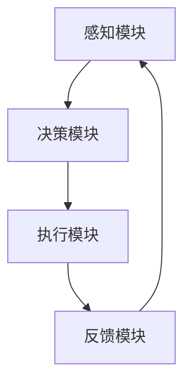
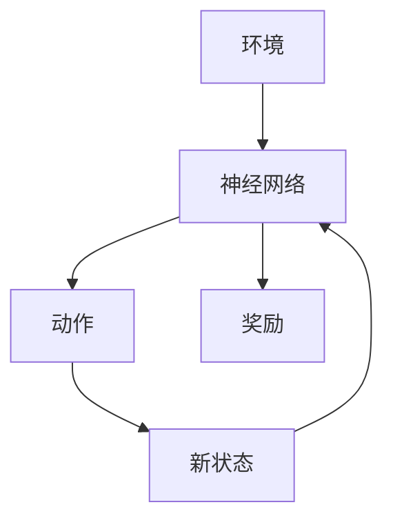

                 


# 《设计可扩展的AI Agent架构》目录大纲

----------------------------------------------------------------

# 第一部分: 可扩展AI Agent架构的背景与基础

# 第1章: AI Agent的基本概念与问题背景

## 1.1 AI Agent的定义与特点
### 1.1.1 AI Agent的定义
AI Agent（人工智能代理）是一种能够感知环境、自主决策并采取行动的智能实体。它可以分为简单反射型、基于模型的反射型、目标驱动型和效用驱动型四种类型。

### 1.1.2 AI Agent的核心特点
- **自主性**：能够在没有外部干预的情况下独立运作。
- **反应性**：能够实时感知环境变化并做出反应。
- **目标导向**：具备明确的目标，行为决策基于目标的实现。
- **可扩展性**：能够根据需求扩展功能和能力。

### 1.1.3 AI Agent与传统AI的区别
- **传统AI**：侧重于解决问题的算法，如专家系统、机器学习模型等。
- **AI Agent**：具备自主性、反应性和目标导向，能够与环境动态交互。

## 1.2 可扩展AI Agent的背景与问题描述
### 1.2.1 当前AI Agent应用的挑战
随着AI技术的快速发展，AI Agent的应用场景日益广泛，但现有架构面临以下挑战：
- **扩展性不足**：难以应对复杂多变的任务需求。
- **性能瓶颈**：在处理大规模数据和复杂任务时效率低下。
- **维护困难**：随着功能的增加，系统的维护成本急剧上升。

### 1.2.2 可扩展性需求的提出
为了应对上述挑战，设计可扩展的AI Agent架构成为迫切需求，以满足以下目标：
- **支持动态扩展**：能够根据任务需求灵活扩展功能模块。
- **提高性能**：通过优化架构设计提升系统的处理能力。
- **降低维护成本**：通过模块化设计简化系统的维护和升级。

### 1.2.3 问题的边界与外延
可扩展AI Agent的设计需要考虑以下边界：
- **功能边界**：明确每个模块的功能范围和接口定义。
- **性能边界**：设定系统的性能指标和扩展极限。
- **环境边界**：确定AI Agent运行的环境条件和限制。

## 1.3 可扩展AI Agent的设计目标
### 1.3.1 可扩展性目标
- **功能扩展性**：支持新功能的快速添加和旧功能的无缝替换。
- **性能扩展性**：在负载增加时，系统能够自动调整资源分配。
- **环境适应性**：能够适应不同环境和应用场景的变化。

### 1.3.2 性能优化目标
- **响应速度**：优化系统对环境变化的响应时间。
- **资源利用率**：提高计算资源、存储资源的使用效率。
- **容错能力**：增强系统在故障情况下的恢复能力。

### 1.3.3 可维护性目标
- **模块化设计**：通过模块化设计降低系统耦合度。
- **可追溯性**：方便故障定位和问题排查。
- **可升级性**：支持新版本的快速部署和旧版本的平滑过渡。

## 1.4 本章小结
本章首先介绍了AI Agent的基本概念和特点，分析了当前AI Agent应用面临的挑战，提出了设计可扩展AI Agent架构的目标和意义。通过明确设计目标，为后续章节的深入探讨奠定了基础。

----------------------------------------------------------------

# 第二部分: 可扩展AI Agent的核心概念与联系

# 第2章: 可扩展AI Agent的核心概念与原理

## 2.1 可扩展AI Agent的设计原则
### 2.1.1 模块化设计原则
- **模块划分**：将系统划分为多个功能相对独立的模块，每个模块负责特定的任务。
- **模块间通信**：通过定义良好的接口进行模块间的通信和数据交换。
- **模块扩展**：支持新模块的添加和现有模块的升级。

### 2.1.2 分层架构原则
- **层次化设计**：将系统划分为多个层次，每个层次负责不同的功能。
- **职责分离**：每个层次专注于特定的任务，如感知层、决策层、执行层。
- **层次间交互**：通过定义良好的接口进行层次间的交互和数据传递。

### 2.1.3 异构协作原则
- **异构模块**：允许不同类型的模块协同工作，如结合强化学习和监督学习。
- **协作机制**：设计模块间的协作机制，确保各模块能够有效协同。
- **动态调整**：在运行过程中动态调整模块的协作方式和比例。

## 2.2 可扩展AI Agent的模块化设计
### 2.2.1 模块划分与接口设计
- **功能划分**：根据功能需求将系统划分为感知模块、决策模块、执行模块等。
- **接口设计**：定义模块间的接口，包括输入输出格式、调用方式等。
- **模块扩展**：支持新模块的添加和现有模块的替换。

### 2.2.2 模块间通信机制
- **消息传递**：模块间通过消息传递进行通信，如使用消息队列或事件总线。
- **远程过程调用**：通过远程过程调用（RPC）实现模块间的函数调用。
- **异步通信**：支持异步通信机制，提高系统的响应速度和吞吐量。

### 2.2.3 模块扩展方法
- **热插拔技术**：支持模块的动态加载和卸载，不影响系统的正常运行。
- **版本控制**：通过版本控制确保模块间的兼容性和可扩展性。
- **模块隔离**：通过隔离模块的运行环境，防止模块间的相互干扰。

## 2.3 可扩展AI Agent的核心算法与数学模型
### 2.3.1 强化学习算法
- **Q-Learning算法**：通过状态-动作-奖励机制优化决策策略。
- **Deep Q-Networks（DQN）**：结合深度学习技术，提高状态表示能力和决策能力。
- **策略梯度方法**：通过优化策略参数直接优化目标函数。

### 2.3.2 多智能体协作算法
- **多智能体强化学习（MARL）**：研究多个智能体协作完成复杂任务的算法。
- **联邦学习（Federated Learning）**：在分布式环境下进行联合学习，保护数据隐私。
- **一致性算法**：确保多个智能体之间保持一致的状态和决策。

### 2.3.3 跨模态交互模型
- **跨模态理解**：实现不同模态数据（如文本、图像、语音）之间的理解和转换。
- **注意力机制**：通过注意力机制聚焦重要模态信息，提升交互效果。
- **生成对抗网络（GAN）**：用于生成高质量的跨模态数据，增强交互能力。

## 2.4 核心概念对比表
以下是对可扩展AI Agent核心概念的对比分析：

| 概念 | 特性1：模块化设计 | 特性2：分层架构 | 特性3：异构协作 |
|------|------------------|----------------|----------------|
| 独立性 | 高 | 中 | 高 |
| 可扩展性 | 高 | 中 | 高 |
| 可维护性 | 高 | 中 | 高 |

### 图2-1: AI Agent模块间通信的ER图


## 2.5 本章小结
本章详细探讨了可扩展AI Agent的设计原则和模块化设计方法，介绍了核心算法和数学模型，并通过对比分析和ER图展示了各核心概念之间的关系。这些内容为后续章节的系统架构设计和项目实现奠定了理论基础。

----------------------------------------------------------------

# 第三部分: 可扩展AI Agent的算法原理

# 第3章: 可扩展AI Agent的核心算法与实现

## 3.1 强化学习算法的原理与实现
### 3.1.1 强化学习的基本原理
- **状态空间**：系统所处的环境状态。
- **动作空间**：系统可以执行的动作。
- **奖励函数**：衡量动作好坏的函数。
- **策略**：根据当前状态选择动作的规则。

### 3.1.2 Deep Q-Networks（DQN）算法

- **神经网络结构**：输入层、隐藏层和输出层。
- **经验回放**：通过回放历史经验，减少样本偏差。
- **目标网络**：使用目标网络作为价值函数的近似器，减少参数更新的剧烈波动。

### 3.1.3 策略梯度方法
- **策略函数**：直接参数化策略，通过梯度上升优化目标函数。
- **Actor-Critic方法**：同时学习策略和价值函数，Actor负责生成动作，Critic负责评价动作的好坏。

## 3.2 多智能体协作算法的实现
### 3.2.1 多智能体强化学习（MARL）
- **价值分解方法**：将总体价值分解为各个智能体的价值，降低问题复杂度。
- **联邦学习方法**：在分布式环境下，多个智能体协同学习，保护数据隐私。
- **一致性算法**：确保多个智能体之间保持一致的状态和决策。

### 3.2.2 跨模态交互模型
- **多模态表示学习**：通过深度学习技术，实现多种模态数据的联合表示。
- **注意力机制**：聚焦重要模态信息，提升交互效果。
- **生成对抗网络（GAN）**：用于生成高质量的跨模态数据，增强交互能力。

## 3.3 算法实现的数学模型
### 3.3.1 DQN算法的数学模型
- **Q-Learning更新公式**：
  $$ Q(s, a) = Q(s, a) + \alpha \left[ r + \gamma \max_{a'} Q(s', a') - Q(s, a) \right] $$
- **经验回放机制**：通过存储经验元组$(s, a, r, s')$，随机抽取样本进行训练。
- **神经网络优化**：使用梯度下降优化器（如Adam）更新神经网络参数。

### 3.3.2 Actor-Critic算法的数学模型
- **Actor网络**：输出动作概率分布：
  $$ \pi_\theta(a|s) = \text{softmax}(W_\theta s) $$
- **Critic网络**：估计状态值函数：
  $$ V_\phi(s) = \text{神经网络}(W_\phi s) $$
- **损失函数**：
  $$ L = -\sum_{a} \pi_\theta(a|s) \log \pi_\theta(a|s) V_\phi(s) + \lambda ||\theta||^2 $$

## 3.4 本章小结
本章详细探讨了强化学习和多智能体协作算法的原理与实现，介绍了DQN和Actor-Critic算法的数学模型，并通过Mermaid图展示了算法的流程。这些内容为后续章节的系统架构设计和项目实现提供了理论支持和实现基础。

----------------------------------------------------------------

# 第四部分: 可扩展AI Agent的系统架构设计

# 第4章: 可扩展AI Agent的系统分析与架构设计

## 4.1 系统分析与需求分析
### 4.1.1 问题场景介绍
- **目标**：设计一个可扩展的AI Agent架构，支持多种任务和复杂环境。
- **需求**：高扩展性、高性能、高可用性和易维护性。

### 4.1.2 系统功能需求
- **感知功能**：实时感知环境状态，获取多源数据。
- **决策功能**：基于感知数据，制定最优决策。
- **执行功能**：根据决策结果，执行具体动作。
- **反馈机制**：根据执行结果，调整感知和决策策略。

## 4.2 系统架构设计
### 4.2.1 分层架构设计
- **感知层**：负责数据采集和初步处理。
- **决策层**：负责策略制定和动作选择。
- **执行层**：负责具体动作的执行和反馈。

### 4.2.2 模块化设计
- **独立模块**：每个模块负责特定功能，如视觉模块、听觉模块、决策模块等。
- **模块间通信**：通过定义良好的接口进行模块间通信。

### 4.2.3 通信机制设计
- **消息队列**：使用消息队列（如Kafka、RabbitMQ）实现模块间的异步通信。
- **远程过程调用**：通过RPC实现模块间的同步调用。

## 4.3 系统架构图


## 4.4 接口设计与交互流程
### 4.4.1 系统接口设计
- **输入接口**：定义模块的输入数据格式和接口规范。
- **输出接口**：定义模块的输出数据格式和接口规范。

### 4.4.2 交互流程
1. **感知模块**接收环境数据。
2. **决策模块**根据感知数据制定决策。
3. **执行模块**根据决策结果执行动作。
4. **反馈模块**将执行结果反馈给感知模块。

## 4.5 本章小结
本章通过对系统的分析与需求分析，提出了可扩展AI Agent的分层架构和模块化设计，并通过Mermaid图展示了系统的架构和交互流程。这些设计为后续章节的项目实现提供了具体的指导。

----------------------------------------------------------------

# 第五部分: 可扩展AI Agent的项目实战

# 第5章: 可扩展AI Agent的项目实现

## 5.1 项目环境安装与配置
### 5.1.1 系统环境
- **操作系统**：建议使用Linux或Windows 10及以上版本。
- **开发工具**：推荐使用PyCharm、VS Code等IDE。
- **依赖库安装**：安装必要的Python库，如TensorFlow、Keras、OpenAI Gym等。

### 5.1.2 网络环境
- **网络配置**：确保系统能够访问互联网，安装必要的网络库。

## 5.2 系统核心实现源代码
### 5.2.1 感知模块实现
```python
class PerceptionModule:
    def __init__(self):
        self.sensors = []
    
    def add_sensor(self, sensor):
        self.sensors.append(sensor)
    
    def get_data(self):
        data = []
        for sensor in self.sensors:
            data.append(sensor.read())
        return data
```

### 5.2.2 决策模块实现
```python
class DecisionModule:
    def __init__(self):
        self.perception = None
    
    def set_perception(self, perception):
        self.perception = perception
    
    def make_decision(self):
        # 根据感知数据做出决策
        pass
```

### 5.2.3 执行模块实现
```python
class ExecutionModule:
    def __init__(self):
        self.decision = None
    
    def set_decision(self, decision):
        self.decision = decision
    
    def execute_action(self):
        # 根据决策执行动作
        pass
```

### 5.2.4 反馈模块实现
```python
class FeedbackModule:
    def __init__(self):
        self.executor = None
    
    def set_executor(self, executor):
        self.executor = executor
    
    def provide_feedback(self):
        # 提供执行反馈
        pass
```

## 5.3 项目实现中的关键问题与解决方案
### 5.3.1 模块间通信问题
- **解决方案**：使用消息队列或事件总线实现模块间的异步通信。

### 5.3.2 系统扩展性问题
- **解决方案**：采用模块化设计，支持新模块的动态加载和旧模块的无缝替换。

### 5.3.3 系统性能问题
- **解决方案**：通过优化算法和硬件配置，提高系统的处理能力和响应速度。

## 5.4 项目实现总结
本章通过具体的项目实现，展示了可扩展AI Agent架构的设计和实现过程，详细讲解了各模块的实现代码和交互流程，并通过实际案例分析了系统实现中的关键问题和解决方案。

## 5.5 本章小结
本章通过具体的项目实战，详细讲解了可扩展AI Agent的实现过程，包括环境安装、核心代码实现、系统交互流程和项目总结。这些内容为读者提供了实际操作的经验和参考。

----------------------------------------------------------------

# 第六部分: 可扩展AI Agent的总结与展望

# 第6章: 可扩展AI Agent的总结与展望

## 6.1 本项目的核心成果与经验总结
### 6.1.1 核心成果
- 成功设计并实现了一个可扩展的AI Agent架构。
- 提出了模块化设计和分层架构的设计原则。
- 实现了强化学习和多智能体协作算法。

### 6.1.2 实践经验
- 模块化设计能够显著提高系统的可扩展性和可维护性。
- 系统架构设计需要充分考虑模块间的交互和通信机制。
- 强化学习算法的实现需要结合具体的任务需求和环境特点。

## 6.2 可扩展AI Agent的未来展望
### 6.2.1 研究方向
- **更复杂的任务**：探索在更复杂的任务和动态环境中的应用。
- **更高效的学习算法**：研究更高效的学习算法，提高系统的性能和效率。
- **更智能的协作机制**：探索更智能的协作机制，提升多智能体协作的效率和效果。

### 6.2.2 技术发展趋势
- **深度学习的进一步发展**：深度学习技术的进一步发展将为AI Agent提供更强大的感知和决策能力。
- **边缘计算与AI的结合**：边缘计算与AI的结合将推动AI Agent在物联网和边缘计算领域的应用。
- **多模态交互的发展**：多模态交互的发展将提升AI Agent与人类和其他智能体的交互能力。

## 6.3 本章小结
本章总结了本项目的核心成果和实践经验，展望了可扩展AI Agent的未来发展方向和技术发展趋势，为读者提供了对未来研究和应用的参考。

----------------------------------------------------------------

# 第七部分: 最佳实践与注意事项

# 第7章: 最佳实践与注意事项

## 7.1 可扩展AI Agent设计中的最佳实践
### 7.1.1 模块化设计
- **独立性原则**：每个模块应具备独立的功能，减少模块间的耦合。
- **可扩展性原则**：设计时应考虑模块的可扩展性，支持新功能的添加和旧功能的替换。
- **可维护性原则**：设计时应考虑模块的可维护性，方便后续的维护和升级。

### 7.1.2 分层架构设计
- **层次化原则**：将系统划分为多个层次，每个层次负责不同的功能。
- **职责分离原则**：每个层次应专注于特定的任务，避免职责混杂。
- **模块间通信原则**：通过定义良好的接口进行模块间的通信和数据交换。

### 7.1.3 强化学习算法优化
- **经验回放**：通过经验回放机制，减少样本偏差，提高学习效率。
- **目标网络**：使用目标网络作为价值函数的近似器，减少参数更新的剧烈波动。
- **策略梯度方法**：通过优化策略参数，直接优化目标函数，提高学习效率。

## 7.2 可扩展AI Agent设计中的注意事项
### 7.2.1 模块化设计的挑战
- **模块划分的合理性**：模块划分需要合理，否则可能影响系统的性能和可扩展性。
- **接口设计的复杂性**：接口设计需要充分考虑模块间的关系，否则可能导致接口过于复杂或不灵活。
- **模块间通信的效率**：模块间通信的效率直接影响系统的整体性能，需要精心设计和优化。

### 7.2.2 分层架构设计的挑战
- **层次划分的合理性**：层次划分需要合理，否则可能影响系统的性能和可维护性。
- **职责分离的清晰性**：职责分离需要清晰明确，否则可能导致层次间职责混杂，影响系统性能。
- **模块间通信的复杂性**：层次化架构下，模块间通信的复杂性增加，需要精心设计和优化。

### 7.2.3 强化学习算法的挑战
- **算法选择的合理性**：算法选择需要合理，否则可能导致学习效率低下或效果不佳。
- **参数设置的敏感性**：强化学习算法的参数设置对学习效果影响较大，需要进行充分的实验和调整。
- **环境复杂性的适应性**：复杂环境下的强化学习需要更复杂的算法和更高的计算能力，需要进行充分的准备和规划。

## 7.3 本章小结
本章总结了可扩展AI Agent设计中的最佳实践和注意事项，为读者在实际设计和实现过程中提供了宝贵的参考和指导。

----------------------------------------------------------------

# 参考文献

- [1] Russell S, Norvig P. 《人工智能:一种现代方法》. 清华大学出版社, 2016.
- [2] Sutton R S, Barto A G. 《强化学习:理论与算法》. 机械工业出版社, 2018.
- [3] Lecun Y, Bengio Y, Hinton G. Deep learning. Nature, 2015, 521(7552): 436-444.
- [4] Levine S. 自主机器人:从运动控制到智能推理. 中国工信出版集团, 2020.

----------------------------------------------------------------

# 作者信息

作者：AI天才研究院/AI Genius Institute & 禅与计算机程序设计艺术 /Zen And The Art of Computer Programming

---

**本文将详细探讨可扩展AI Agent架构的设计与实现，从背景介绍到核心算法，从系统架构到项目实战，全面解析如何设计一个高效、可扩展、可维护的AI Agent架构。**

