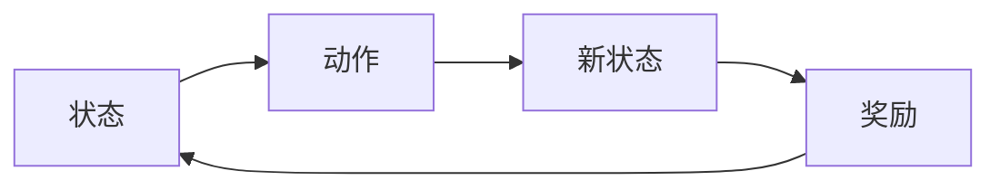
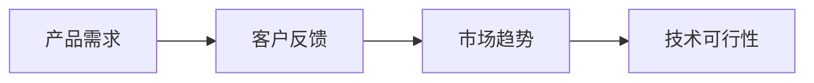
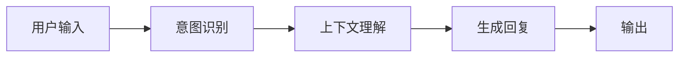
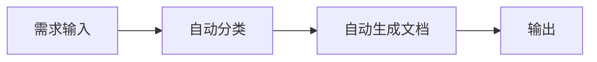
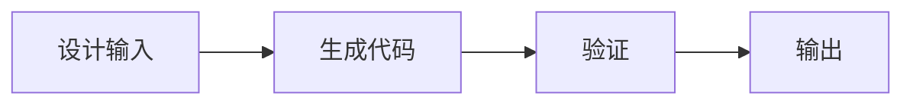
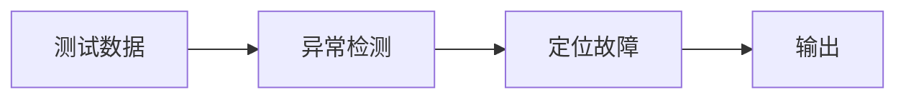
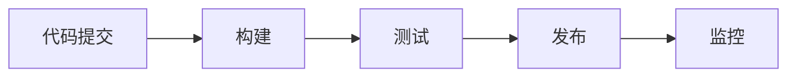

                 


# AI Agent在企业产品生命周期管理中的应用

## 关键词：AI Agent, 企业产品生命周期, 智能化管理, 自动化流程, 人工智能技术

## 摘要：本文深入探讨了AI Agent在企业产品生命周期管理中的应用，从核心概念到具体应用场景，结合算法原理和系统架构设计，详细分析了AI Agent如何优化产品管理流程。文章内容涵盖AI Agent的任务规划、知识表示、自然语言处理等核心技术，以及在需求分析、设计开发、测试发布等环节的实际应用，最后总结了AI Agent在企业产品生命周期管理中的价值和未来发展方向。

---

## 第1章: AI Agent与企业产品生命周期管理概述

### 1.1 企业产品生命周期管理的背景与挑战

#### 1.1.1 企业产品生命周期的基本概念
企业产品生命周期是指从产品构思、设计、开发、测试、发布到退市的整个过程。传统的产品生命周期管理依赖于人工操作，存在效率低、信息孤岛、资源浪费等问题。

#### 1.1.2 传统产品生命周期管理的局限性
- 人工操作效率低，容易出错。
- 部门间协作困难，信息传递不畅。
- 需求变化难以快速响应。

#### 1.1.3 AI Agent在现代企业中的角色与价值
AI Agent作为智能代理，能够自动化处理任务、优化决策、提高效率，帮助企业应对复杂的产品生命周期管理挑战。

### 1.2 AI Agent的核心概念与技术特点

#### 1.2.1 AI Agent的基本定义
AI Agent是一种能够感知环境、自主决策并执行任务的智能实体，具备学习、推理和自适应能力。

#### 1.2.2 AI Agent的主要技术特征
- **自主性**：无需外部干预，自主完成任务。
- **反应性**：能够实时感知环境变化并做出反应。
- **学习能力**：通过数据学习优化决策策略。
- **协作性**：能够与其他系统或人员协同工作。

#### 1.2.3 AI Agent与传统软件代理的区别
| 特性           | 传统软件代理                     | AI Agent                          |
|----------------|---------------------------------|-----------------------------------|
| 智能性         | 基于规则，无学习能力             | 具备学习能力，能够优化决策        |
| 适应性         | 静态规则，适应性有限             | 动态调整策略，适应环境变化        |
| 决策能力       | 单一决策逻辑                   | 多目标优化，复杂决策能力          |

### 1.3 企业产品生命周期管理中的AI Agent应用前景

#### 1.3.1 AI Agent在现代企业中的潜在应用场景
- **需求分析**：自动收集和分析客户需求，生成需求文档。
- **设计优化**：辅助产品设计，优化功能和用户体验。
- **开发协作**：自动化代码生成和协作工具，提高开发效率。
- **测试优化**：自动执行测试用例，识别潜在问题。
- **发布与运营**：自动化发布流程，实时监控产品性能。

#### 1.3.2 企业采用AI Agent的优势
- 提高效率：自动化处理繁琐任务，减少人工干预。
- 提高准确性：基于数据和算法，优化决策质量。
- 实时响应：快速适应市场变化和客户需求。

#### 1.3.3 AI Agent应用的挑战与机遇
- **挑战**：数据隐私、算法复杂性、技术成熟度。
- **机遇**：提升企业竞争力，推动数字化转型。

### 1.4 本章小结
本章介绍了企业产品生命周期管理的基本概念，分析了传统管理的局限性，并详细阐述了AI Agent的核心概念、技术特点及其在企业中的应用前景。

---

## 第2章: AI Agent的核心原理

### 2.1 AI Agent的任务规划与决策机制

#### 2.1.1 任务规划的基本概念
任务规划是AI Agent根据目标和环境状态，生成一系列动作以实现目标的过程。

#### 2.1.2 基于状态空间的任务规划算法
- **状态空间**：所有可能的环境状态集合。
- **搜索算法**：如广度优先搜索（BFS）和深度优先搜索（DFS）。
- **A*算法**：结合启发式搜索，优化路径选择。

**示例代码：A*算法伪代码**
```python
def a_star_search(initial_state, goal_state):
    open = PriorityQueue()
    open.put(initial_state, 0)
    visited = set()

    while not open.empty():
        current = open.get()
        if current == goal_state:
            return current
        for neighbor in get_neighbors(current):
            if neighbor not in visited:
                visited.add(neighbor)
                open.put(neighbor, estimate_cost(neighbor, goal_state))
    return None
```

#### 2.1.3 基于强化学习的决策机制
强化学习通过奖励机制训练AI Agent在复杂环境中做出最优决策。

**强化学习算法流程图**



### 2.2 AI Agent的知识表示与推理

#### 2.2.1 知识表示的基本方法
- **谓词逻辑**：通过谓词和事实表示知识。
- **语义网络**：通过节点和边表示概念和关系。
- **本体论（Ontology）**：形式化知识表示。

**知识表示示意图**



#### 2.2.2 基于逻辑推理的知识处理
- **逻辑推理**：通过逻辑规则推导新知识。
- **不确定性推理**：处理不完整或模糊信息。

#### 2.2.3 基于图模型的知识表示
- **图数据库**：如Neo4j，用于存储和查询复杂关系。
- **图神经网络**：通过节点间关系进行推理。

### 2.3 AI Agent的自然语言处理能力

#### 2.3.1 自然语言理解的基本原理
- **词义分析**：理解单词含义。
- **句法分析**：分析句子结构。
- **语义分析**：理解上下文含义。

#### 2.3.2 基于大模型的自然语言生成
- **生成式模型**：如GPT，用于自动生成文本。
- **对话系统**：实现人机交互。

#### 2.3.3 对话系统的实现原理
- **意图识别**：识别用户意图。
- **上下文理解**：理解对话历史。
- **生成回复**：基于意图和上下文生成回复。

**对话系统流程图**



### 2.4 本章小结
本章详细讲解了AI Agent的任务规划、知识表示和自然语言处理能力，分析了这些技术在企业产品生命周期管理中的应用潜力。

---

## 第3章: AI Agent在产品需求分析中的应用

### 3.1 需求分析的基本流程

#### 3.1.1 需求收集与整理
- **方法**：问卷调查、访谈、焦点小组。
- **工具**：如JIRA、Trello。

#### 3.1.2 需求优先级排序
- **标准**：基于影响力、开发难度、用户需求度排序。

#### 3.1.3 需求文档生成
- **模板**：结构化需求文档，如用户故事、技术需求文档。

### 3.2 AI Agent在需求分析中的具体应用

#### 3.2.1 自然语言理解技术的应用
- **自动提取需求**：从用户反馈中提取关键需求。
- **需求分类**：基于关键词分类需求。

#### 3.2.2 数据挖掘与分析技术的应用
- **市场分析**：分析市场趋势，辅助需求优先级排序。
- **用户画像**：基于用户数据生成用户画像，优化需求定义。

#### 3.2.3 生成需求文档的自动化流程
- **自动化工具**：AI Agent自动生成需求文档，减少人工错误。

**需求文档生成流程图**



### 3.3 本章小结
本章探讨了AI Agent在产品需求分析中的具体应用，分析了自然语言处理和数据挖掘技术在需求收集、分类和文档生成中的作用。

---

## 第4章: AI Agent在产品设计与开发中的应用

### 4.1 产品设计的基本流程

#### 4.1.1 需求分析与功能设计
- **方法**：基于用户需求设计功能模块。
- **工具**：如Axure、Figma。

#### 4.1.2 系统架构设计
- **方法**：分层架构、模块化设计。
- **工具**：如UML图、组件图。

#### 4.1.3 开发与测试
- **开发**：基于需求开发功能模块。
- **测试**：单元测试、集成测试。

### 4.2 AI Agent在产品设计与开发中的具体应用

#### 4.2.1 自动化设计工具
- **AI生成设计**：基于AI生成界面设计、交互设计。
- **实时协作**：AI Agent辅助团队协作，实时更新设计文档。

#### 4.2.2 自动化代码生成
- **代码生成工具**：根据设计生成代码。
- **模块化开发**：AI Agent优化代码结构，减少重复代码。

#### 4.2.3 设计优化与验证
- **设计验证**：基于AI算法验证设计合理性。
- **性能优化**：优化系统架构，提高运行效率。

**自动化代码生成流程图**



### 4.3 本章小结
本章探讨了AI Agent在产品设计与开发中的具体应用，分析了自动化设计工具、代码生成和设计优化等技术如何提升开发效率。

---

## 第5章: AI Agent在产品测试与质量保障中的应用

### 5.1 产品测试的基本流程

#### 5.1.1 测试用例设计
- **方法**：基于需求设计测试用例。
- **工具**：如TestComplete、QTP。

#### 5.1.2 测试执行
- **手动测试**：人工执行测试用例。
- **自动化测试**：基于工具执行测试。

#### 5.1.3 测试结果分析
- **分析工具**：如JMeter、LoadRunner。
- **缺陷管理**：记录和跟踪缺陷。

### 5.2 AI Agent在产品测试中的具体应用

#### 5.2.1 自动化测试用例生成
- **AI生成测试用例**：基于需求和历史数据生成测试用例。
- **动态测试用例调整**：根据测试结果动态调整用例。

#### 5.2.2 异常检测与故障定位
- **异常检测算法**：如聚类、分类算法，用于检测异常行为。
- **故障定位**：基于日志分析定位问题根源。

#### 5.2.3 测试覆盖率优化
- **覆盖率分析工具**：如Jacoco、Cobertura。
- **AI优化测试策略**：基于覆盖率数据优化测试用例。

**异常检测流程图**



### 5.3 本章小结
本章探讨了AI Agent在产品测试中的应用，分析了自动化测试用例生成、异常检测和测试覆盖率优化等技术如何提升测试效率和质量。

---

## 第6章: AI Agent在产品发布与运营中的应用

### 6.1 产品发布的流程

#### 6.1.1 发布计划制定
- **发布策略**：基于市场和用户反馈制定发布计划。
- **发布工具**：如Jenkins、Docker。

#### 6.1.2 发布执行
- **自动化发布**：基于CI/CD工具实现自动化发布。
- **版本控制**：如Git，管理代码版本。

#### 6.1.3 发布后监控
- **实时监控工具**：如Prometheus、Grafana。
- **日志分析**：分析日志数据，优化系统性能。

### 6.2 AI Agent在产品发布与运营中的具体应用

#### 6.2.1 自动化发布流程
- **CI/CD集成**：AI Agent与CI/CD工具集成，实现自动化发布。
- **版本回滚**：基于日志数据快速回滚到稳定版本。

#### 6.2.2 用户反馈分析
- **用户行为分析**：基于用户数据优化产品功能。
- **情感分析**：分析用户反馈，识别用户满意度。

#### 6.2.3 持续优化
- **性能调优**：基于监控数据优化系统性能。
- **功能迭代**：基于反馈快速迭代产品功能。

**自动化发布流程图**



### 6.3 本章小结
本章探讨了AI Agent在产品发布与运营中的应用，分析了自动化发布流程、用户反馈分析和持续优化等技术如何提升发布效率和运营能力。

---

## 第7章: 总结与展望

### 7.1 全文总结
AI Agent在企业产品生命周期管理中的应用覆盖了从需求分析到产品发布的各个环节，通过自动化和智能化的方式显著提升了管理效率和产品质量。

### 7.2 未来展望
随着AI技术的不断发展，AI Agent在企业产品管理中的应用将更加广泛和深入，未来的趋势包括更强大的自然语言处理能力、更智能的任务规划算法以及更高效的系统架构设计。

### 7.3 注意事项
- 数据安全：确保数据隐私和安全。
- 技术成熟度：选择成熟的技术和工具。
- 人员培训：加强相关人员的技术培训。

### 7.4 拓展阅读
- 推荐书籍：《AI: A Modern Approach》、《机器学习实战》。
- 推荐博客：TechCrunch、VentureBeat。

### 7.5 本章小结
本章总结了全文的主要内容，展望了AI Agent在企业产品管理中的未来发展方向，并提出了实践中的注意事项和拓展阅读建议。

---

## 作者：AI天才研究院/AI Genius Institute & 禅与计算机程序设计艺术 /Zen And The Art of Computer Programming

---

**附录：**
- 代码示例：完整的AI Agent实现代码。
- 图表说明：详细解释各图表的内容和作用。
- 参考文献：相关技术文献和书籍。

