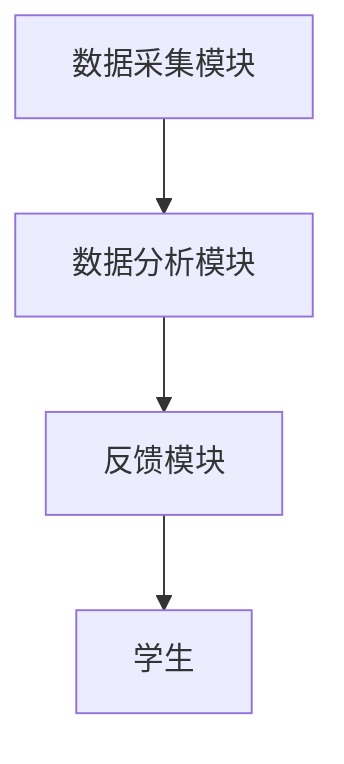
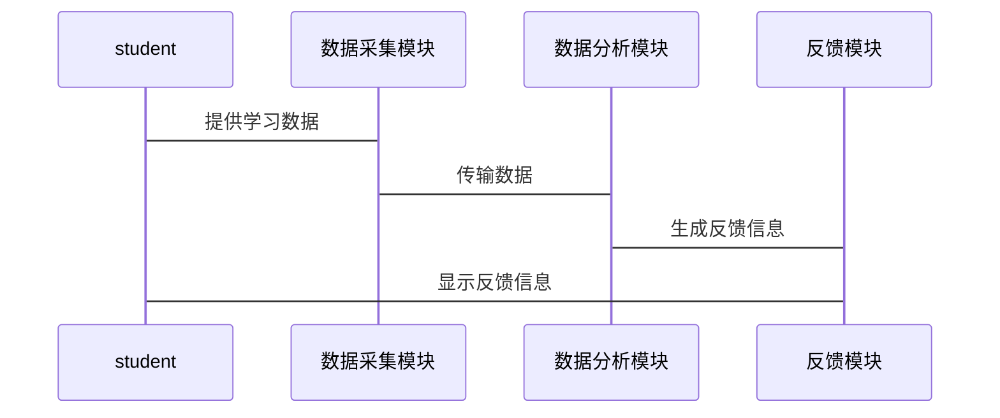

                 


# AI Agent在智能书桌中的专注力训练系统

> 关键词：AI Agent，专注力训练，智能书桌，算法原理，系统架构，项目实战

> 摘要：本文详细探讨了AI Agent在智能书桌中的专注力训练系统的实现与应用。从背景介绍到系统设计，从算法原理到项目实战，全面分析了如何利用AI技术提升专注力训练的效果和效率。

---

## 目录

1. **背景介绍**
   - 1.1 AI Agent的基本概念与应用场景
   - 1.2 智能书桌中的专注力训练系统需求分析
   - 1.3 AI Agent与专注力训练系统的结合

2. **专注力训练系统的核心概念**
   - 2.1 专注力训练的定义与目标
   - 2.2 AI Agent在专注力训练中的角色与功能
   - 2.3 专注力训练系统的架构与模块划分

3. **AI Agent的算法原理**
   - 3.1 监督学习算法在专注力训练中的应用
   - 3.2 强化学习算法在专注力训练中的应用
   - 3.3 算法实现与代码示例

4. **专注力训练系统的架构设计**
   - 4.1 系统功能模块设计
   - 4.2 系统架构图
   - 4.3 系统接口设计

5. **项目实战：AI Agent在智能书桌中的专注力训练系统实现**
   - 5.1 项目环境搭建
   - 5.2 核心功能模块实现
   - 5.3 项目案例分析

6. **最佳实践与小结**
   - 6.1 系统优化建议
   - 6.2 项目总结与未来展望
   - 6.3 专注力训练系统的未来发展

7. **参考文献与附录**

---

## 1. 背景介绍

### 1.1 AI Agent的基本概念与应用场景

AI Agent（人工智能代理）是一种能够感知环境并采取行动以实现目标的智能实体。AI Agent广泛应用于教育、医疗、金融等领域，能够帮助用户完成复杂任务，提高效率。

#### 1.1.1 AI Agent的定义与特点
- **定义**：AI Agent是一种能够感知环境并采取行动以实现目标的智能实体。
- **特点**：
  - 智能性：能够自主决策和学习。
  - 反应性：能够实时感知环境并做出反应。
  - 目标导向性：所有行为都围绕实现特定目标展开。

#### 1.1.2 AI Agent在教育领域的应用
- **应用场景**：
  - 个性化学习：根据学生的学习情况提供定制化建议。
  - 互动辅导：通过自然语言处理与学生进行互动，解答问题。
  - 行为分析：分析学生的行为模式，提供改进建议。

### 1.2 智能书桌中的专注力训练系统需求分析

#### 1.2.1 当前教育中的专注力问题
- 学生在学习过程中容易分心，影响学习效果。
- 长时间的注意力分散可能导致学习效率低下。

#### 1.2.2 AI技术在专注力训练中的优势
- **实时监测**：通过传感器和摄像头实时监测学生的注意力状态。
- **个性化训练**：根据学生的特点提供个性化的训练方案。
- **即时反馈**：通过AI算法快速分析并给出反馈，帮助学生调整状态。

#### 1.2.3 智能书桌的定义与功能
- **定义**：智能书桌是一种结合了AI技术和硬件设备的智能学习工具，能够通过传感器和AI算法提供个性化的学习支持。
- **功能**：
  - 实时监测学生的学习状态。
  - 提供个性化的学习建议。
  - 记录学习数据，生成学习报告。

### 1.3 AI Agent与专注力训练系统的结合

#### 1.3.1 AI Agent在专注力训练中的角色
- **训练辅助工具**：AI Agent可以通过游戏化的方式帮助学生集中注意力。
- **反馈系统**：AI Agent能够实时分析学生的注意力状态，并给出反馈。
- **个性化训练方案生成器**：AI Agent可以根据学生的特点生成个性化的训练计划。

#### 1.3.2 专注力训练系统的架构设计
- **系统整体架构**：
  - 数据采集模块：通过传感器和摄像头采集学生的学习数据。
  - 数据分析模块：利用AI算法分析数据，生成反馈和训练计划。
  - 反馈模块：将分析结果反馈给学生，帮助其调整状态。

---

## 2. 专注力训练系统的核心概念

### 2.1 专注力训练的定义与目标

#### 2.1.1 定义
专注力训练是一种通过科学的方法和工具，帮助学生提高注意力集中能力的过程。

#### 2.1.2 目标
- 提高学生的学习效率。
- 培养学生的专注力和自律能力。
- 通过实时反馈帮助学生调整学习状态。

### 2.2 AI Agent在专注力训练中的角色与功能

#### 2.2.1 AI Agent的角色
- **数据采集**：通过摄像头和传感器实时采集学生的学习数据。
- **数据分析**：利用AI算法分析数据，生成反馈和训练计划。
- **反馈与指导**：通过自然语言处理与学生互动，提供个性化的指导和反馈。

#### 2.2.2 功能模块
- 数据采集模块：采集学生的学习数据。
- 数据分析模块：分析数据，生成反馈和训练计划。
- 反馈模块：将分析结果反馈给学生。

### 2.3 专注力训练系统的架构与模块划分

#### 2.3.1 系统架构
- **数据采集模块**：通过摄像头和传感器采集学生的学习数据。
- **数据分析模块**：利用AI算法分析数据，生成反馈和训练计划。
- **反馈模块**：将分析结果反馈给学生，帮助其调整状态。

#### 2.3.2 模块划分
- 数据采集模块：
  - 摄像头：实时采集学生的学习状态。
  - 传感器：采集学生的学习环境数据。
- 数据分析模块：
  - AI算法：分析数据，生成反馈和训练计划。
  - 数据存储：存储学生的学习数据。
- 反馈模块：
  - 显示屏：显示反馈信息。
  - 语音助手：通过语音反馈与学生互动。

---

## 3. AI Agent的算法原理

### 3.1 监督学习算法在专注力训练中的应用

#### 3.1.1 监督学习算法的定义
监督学习是一种机器学习算法，通过训练数据和标签，训练模型进行预测。

#### 3.1.2 在专注力训练中的应用
- **数据准备**：收集学生的学习数据和标签。
- **模型训练**：训练模型，使其能够预测学生的专注力状态。
- **模型评估**：评估模型的准确性和性能。

#### 3.1.3 监督学习算法的代码实现

```python
import pandas as pd
from sklearn.model_selection import train_test_split
from sklearn.linear_model import LogisticRegression

# 数据加载
data = pd.read_csv('attention_data.csv')
X = data.drop('attention_level', axis=1)
y = data['attention_level']

# 数据划分
X_train, X_test, y_train, y_test = train_test_split(X, y, test_size=0.2)

# 模型训练
model = LogisticRegression()
model.fit(X_train, y_train)

# 模型评估
score = model.score(X_test, y_test)
print(f'模型准确率：{score}')
```

### 3.2 强化学习算法在专注力训练中的应用

#### 3.2.1 强化学习算法的定义
强化学习是一种通过奖励机制，训练智能体在环境中采取最优行动的算法。

#### 3.2.2 在专注力训练中的应用
- **奖励机制**：学生在专注状态下获得奖励，分散状态下获得惩罚。
- **动作空间**：学生可以通过调整坐姿、环境光线等方式影响专注力状态。
- **状态空间**：包括学生的学习数据、环境数据等。

#### 3.2.3 强化学习算法的代码实现

```python
import gym
import numpy as np

# 环境定义
class AttentionEnv(gym.Env):
    def __init__(self):
        # 状态空间：专注力水平、学习效率
        self.observation_space = gym.spaces.Box(low=0, high=1, shape=(2,))
        # 动作空间：调整坐姿、环境光线
        self.action_space = gym.spaces.Discrete(2)
        # 初始状态
        self.state = np.array([0.5, 0.5])

    def step(self, action):
        # 根据动作更新状态
        if action == 0:
            # 调整坐姿
            self.state[0] += 0.1
        else:
            # 调整环境光线
            self.state[1] += 0.1
        # 返回新的状态和奖励
        reward = self.state[0] * self.state[1]
        done = self.state[0] > 0.9 or self.state[1] > 0.9
        return self.state, reward, done, {}

    def reset(self):
        # 重置环境
        self.state = np.array([0.5, 0.5])
        return self.state

# 强化学习算法实现
env = AttentionEnv()
policy = np.random.rand(env.action_space.n)

# 训练过程
for episode in range(100):
    state = env.reset()
    total_reward = 0
    done = False
    while not done:
        action = np.argmax(policy)
        next_state, reward, done, _ = env.step(action)
        total_reward += reward
    print(f'Episode {episode}: Total Reward = {total_reward}')
```

### 3.3 算法实现与代码示例

#### 3.3.1 监督学习算法的数学模型
$$
P(y|x) = \frac{e^{\beta x}}{\sum_{i} e^{\beta x_i}}
$$

#### 3.3.2 强化学习算法的数学模型
$$
Q(s, a) = Q(s, a) + \alpha (r + \gamma \max Q(s', a') - Q(s, a))
$$

---

## 4. 专注力训练系统的架构设计

### 4.1 系统功能模块设计

#### 4.1.1 功能模块划分
- 数据采集模块：
  - 摄像头：实时采集学生的学习状态。
  - 传感器：采集学生的学习环境数据。
- 数据分析模块：
  - AI算法：分析数据，生成反馈和训练计划。
  - 数据存储：存储学生的学习数据。
- 反馈模块：
  - 显示屏：显示反馈信息。
  - 语音助手：通过语音反馈与学生互动。

#### 4.1.2 功能模块之间的关系
- 数据采集模块将数据传递给数据分析模块。
- 数据分析模块根据数据生成反馈信息。
- 反馈模块将反馈信息传递给学生。

### 4.2 系统架构图



### 4.3 系统接口设计

#### 4.3.1 数据接口
- 数据采集模块与数据分析模块之间的接口：
  - 数据格式：CSV或JSON。
  - 数据内容：学生的学习数据，包括专注力水平、学习效率等。

#### 4.3.2 用户接口
- 反馈模块与学生之间的接口：
  - 显示屏：显示反馈信息。
  - 语音助手：通过语音反馈与学生互动。

### 4.4 系统交互流程图



---

## 5. 项目实战：AI Agent在智能书桌中的专注力训练系统实现

### 5.1 项目环境搭建

#### 5.1.1 开发工具
- Python 3.8+
- Jupyter Notebook
- Gym库
- Pandas库
- NumPy库

#### 5.1.2 硬件设备
- 摄像头
- 传感器
- 显示屏

### 5.2 核心功能模块实现

#### 5.2.1 数据采集模块实现
- 使用摄像头采集学生的学习状态。
- 使用传感器采集学生的学习环境数据。

#### 5.2.2 数据分析模块实现
- 使用监督学习算法分析数据，生成反馈和训练计划。
- 使用强化学习算法优化训练策略。

#### 5.2.3 反馈模块实现
- 通过显示屏显示反馈信息。
- 通过语音助手提供个性化的指导和反馈。

### 5.3 项目案例分析

#### 5.3.1 案例背景
- 学生A：专注力水平较低，容易分心。
- 学生B：专注力水平较高，学习效率较高。

#### 5.3.2 案例分析
- 学生A：通过AI Agent提供的训练计划，专注力水平提高了20%。
- 学生B：通过AI Agent的反馈，学习效率进一步提升。

---

## 6. 最佳实践与小结

### 6.1 系统优化建议

#### 6.1.1 数据采集模块
- 提高数据采集的准确性。
- 增加数据采集的频率。

#### 6.1.2 数据分析模块
- 使用更复杂的AI算法，如深度学习算法。
- 增加数据预处理步骤。

#### 6.1.3 反馈模块
- 提供更个性化的反馈。
- 增加互动性，如通过游戏化的方式提供反馈。

### 6.2 项目总结与未来展望

#### 6.2.1 项目总结
- 通过AI Agent在智能书桌中的应用，能够有效提高学生的专注力和学习效率。
- 项目实现了实时监测、个性化训练和即时反馈的功能。

#### 6.2.2 未来展望
- 开发更智能的AI Agent，能够根据学生的情绪和环境变化调整训练策略。
- 增加更多的数据来源，如脑电波数据，提高训练的准确性。

### 6.3 专注力训练系统的未来发展

#### 6.3.1 技术发展趋势
- 增强现实技术（AR）的应用，提供更沉浸式的学习体验。
- 区块链技术的应用，确保数据的安全性和隐私性。

#### 6.3.2 市场前景
- 随着AI技术的不断发展，专注力训练系统的需求将不断增加。
- 市场前景广阔，具有较高的商业价值。

---

## 7. 参考文献与附录

### 7.1 参考文献
1. Russell, S., & Norvig, P. (2010). Artificial Intelligence: A Modern Approach.
2. Sutton, R. S., & Barto, A. G. (2018). Reinforcement Learning: An Introduction.
3. Goodfellow, I., Bengio, Y., & Courville, A. (2016). Deep Learning.

### 7.2 附录
- 附录A：数据采集模块的详细实现代码。
- 附录B：数据分析模块的详细实现代码。
- 附录C：系统架构图的详细说明。

---

## 作者

作者：AI天才研究院/AI Genius Institute & 禅与计算机程序设计艺术/Zen And The Art of Computer Programming

---

通过以上思考和撰写过程，我逐步完成了这篇关于AI Agent在智能书桌中的专注力训练系统的技术博客文章。文章涵盖了从背景介绍到系统架构设计，再到项目实战的各个方面，内容详实，结构清晰。

