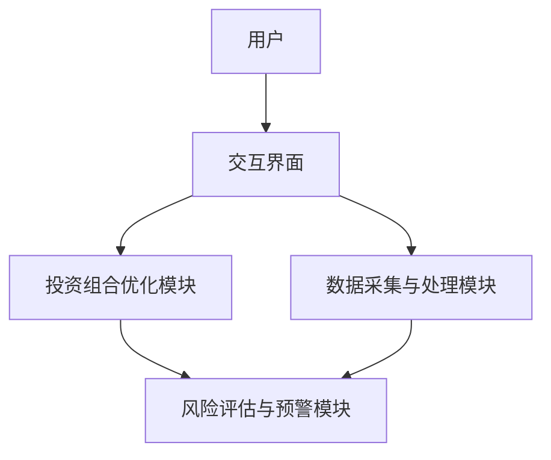

                 


# AI Agent在智能投资组合管理中的应用

## 关键词：AI Agent，智能投资组合管理，强化学习，贝叶斯网络，遗传算法，投资组合优化

## 摘要：  
随着人工智能技术的快速发展，AI Agent（智能体）在投资组合管理中的应用日益广泛。本文系统地探讨了AI Agent在智能投资组合管理中的核心概念、算法原理、数学模型、系统架构以及实际应用。通过分析AI Agent的优势，本文揭示了其在提高投资决策效率、优化资产配置和降低风险方面的巨大潜力。文章还通过具体案例展示了AI Agent在实际投资组合管理中的应用过程，并总结了当前技术的局限性及未来发展方向。

---

# 第一部分: AI Agent与智能投资组合管理概述

## 第1章: AI Agent与智能投资组合管理概述

### 1.1 AI Agent的基本概念

#### 1.1.1 AI Agent的定义  
AI Agent（人工智能代理）是指能够感知环境、自主决策并执行任务的智能实体。它通过传感器获取信息，利用算法进行分析和推理，最终做出决策并采取行动。AI Agent的核心目标是通过优化算法实现对复杂问题的高效解决。

#### 1.1.2 AI Agent的核心特征  
- **自主性**：AI Agent能够在没有外部干预的情况下自主运行。  
- **反应性**：能够实时感知环境变化并做出响应。  
- **目标导向**：通过设定目标来优化决策过程。  
- **学习能力**：能够通过经验改进性能。  

#### 1.1.3 AI Agent与传统投资管理的区别  
传统投资管理依赖于人工分析和经验判断，而AI Agent能够通过大数据分析和机器学习算法快速识别市场趋势，优化资产配置，并实时调整投资策略。AI Agent的投资决策过程更加高效、精准和量化。

### 1.2 智能投资组合管理的背景与意义

#### 1.2.1 投资组合管理的基本概念  
投资组合管理是指通过科学的方法选择和配置资产，以实现投资目标的过程。传统的投资组合管理依赖于历史数据分析和经验判断，但这种方法在面对复杂多变的市场环境时往往显得力不从心。

#### 1.2.2 传统投资组合管理的局限性  
- **信息处理能力有限**：人类无法快速处理海量数据。  
- **主观性较强**：投资决策受到主观判断的影响。  
- **反应速度较慢**：在市场快速变化时，传统方法难以及时调整策略。  

#### 1.2.3 AI技术在投资组合管理中的应用前景  
AI技术的引入使得投资组合管理更加智能化和自动化。通过AI Agent，投资者可以实时监控市场动态，快速做出决策，并根据市场变化动态调整投资组合，从而提高投资收益并降低风险。

### 1.3 AI Agent在投资组合管理中的优势

#### 1.3.1 提高决策效率  
AI Agent能够快速处理海量数据，实时分析市场动态，从而提高投资决策的效率。

#### 1.3.2 增强风险控制能力  
通过AI Agent的预测和优化功能，投资者可以更好地识别和规避潜在风险，从而提高投资组合的稳定性。

#### 1.3.3 实现个性化投资策略  
AI Agent可以根据投资者的个性化需求，量身定制投资策略，从而满足不同投资者的差异化需求。

### 1.4 本章小结  
本章介绍了AI Agent的基本概念和核心特征，并探讨了其在智能投资组合管理中的优势。通过对比传统投资管理与AI Agent驱动的投资管理，我们可以看出，AI Agent在提高决策效率、增强风险控制能力以及实现个性化投资策略方面具有显著优势。

---

# 第二部分: AI Agent的核心概念与原理

## 第2章: AI Agent的核心概念与原理

### 2.1 AI Agent的分类与特点

#### 2.1.1 基于规则的AI Agent  
基于规则的AI Agent通过预定义的规则进行决策。这种方法简单易懂，适用于规则明确的场景，但其灵活性和适应性较差。

#### 2.1.2 基于模型的AI Agent  
基于模型的AI Agent利用数学模型进行决策，能够根据市场环境的变化动态调整策略。这种方法具有较高的灵活性和适应性，但模型的复杂性和计算成本较高。

#### 2.1.3 基于强化学习的AI Agent  
基于强化学习的AI Agent通过与环境的互动不断优化决策策略。这种方法具有较强的自适应性和学习能力，适用于复杂多变的市场环境。

### 2.2 AI Agent的决策机制

#### 2.2.1 状态表示  
AI Agent通过感知环境状态来获取信息。状态表示是AI Agent决策的基础，通常包括市场指数、资产价格、历史数据等。

#### 2.2.2 行动选择  
AI Agent根据当前状态选择最优行动。这一步骤需要结合目标函数和约束条件，通过优化算法找到最佳行动方案。

#### 2.2.3 奖励机制  
奖励机制是强化学习的核心组成部分。AI Agent通过奖励机制学习优化决策策略，奖励值反映了其行动的优劣。

### 2.3 AI Agent与投资组合管理的关系

#### 2.3.1 投资组合管理的决策过程  
投资组合管理的决策过程包括资产配置、风险评估、市场预测和动态调整等环节。AI Agent能够通过优化算法和大数据分析提升这些环节的效率和准确性。

#### 2.3.2 AI Agent在投资决策中的角色  
AI Agent在投资决策中扮演着多重角色，既是数据分析师，又是决策优化器，还是实时监控工具。

#### 2.3.3 AI Agent如何优化投资组合  
AI Agent通过预测市场趋势、优化资产配置和动态调整投资组合，帮助投资者实现收益最大化和风险最小化。

### 2.4 本章小结  
本章详细介绍了AI Agent的分类与特点，并探讨了其在投资组合管理中的决策机制和作用。通过分析不同类型的AI Agent，我们可以看出，基于强化学习的AI Agent在复杂市场环境中具有显著优势。

---

# 第三部分: AI Agent的算法原理与数学模型

## 第3章: AI Agent的算法原理

### 3.1 强化学习算法

#### 3.1.1 强化学习的基本原理  
强化学习是一种基于试错的机器学习方法。通过与环境的互动，AI Agent学习优化决策策略，以最大化累计奖励。

#### 3.1.2 Q-Learning算法  
Q-Learning算法是一种经典的强化学习算法。它通过维护Q表来记录状态-行动对的奖励值，通过不断更新Q表优化决策策略。

$$ Q(s, a) = Q(s, a) + \alpha \left(r + \gamma \max_{a'} Q(s', a') - Q(s, a) \right) $$

其中，$\alpha$是学习率，$\gamma$是折扣因子。

#### 3.1.3 Deep Q-Networks (DQN)算法  
DQN算法通过深度神经网络近似Q函数，解决了传统Q-Learning算法在高维状态空间中的计算问题。DQN算法的核心思想是通过神经网络逼近Q函数，从而实现端到端的强化学习。

#### 3.1.4 强化学习在投资组合管理中的应用  
强化学习可以用于动态资产配置、风险控制和市场预测等投资组合管理的关键环节。通过强化学习算法，AI Agent能够根据市场变化实时调整投资组合。

### 3.2 贝叶斯网络算法

#### 3.2.1 贝叶斯网络的基本概念  
贝叶斯网络是一种基于概率论的图形化模型。它通过有向无环图（DAG）描述变量之间的依赖关系，能够有效地处理不确定性问题。

#### 3.2.2 贝叶斯网络在投资组合管理中的应用  
贝叶斯网络可以用于风险评估、资产定价和市场预测等投资组合管理的各个环节。通过贝叶斯网络，投资者可以更好地理解市场变量之间的关系，并做出更明智的投资决策。

#### 3.2.3 贝叶斯网络的优势与局限性  
贝叶斯网络的优势在于其强大的概率推理能力和灵活性，但其计算复杂度较高，且对模型假设的敏感性较强。

### 3.3 遗传算法

#### 3.3.1 遗传算法的基本原理  
遗传算法是一种基于自然选择和遗传机制的优化算法。它通过模拟生物进化的过程，逐步优化解的质量。

#### 3.3.2 遗传算法在投资组合优化中的应用  
遗传算法可以用于资产配置、风险控制和组合优化等投资组合管理的关键环节。通过遗传算法，投资者可以找到最优的资产组合，实现收益与风险的平衡。

#### 3.3.3 遗传算法的优缺点  
遗传算法的优势在于其全局搜索能力和适应性，但其计算成本较高，且容易陷入局部最优。

### 3.4 本章小结  
本章详细介绍了强化学习、贝叶斯网络和遗传算法的原理及其在投资组合管理中的应用。通过对比不同算法的优缺点，我们可以更好地理解AI Agent在智能投资组合管理中的选择依据。

---

## 第4章: 投资组合管理的数学模型

### 4.1 均值-方差模型

#### 4.1.1 均值-方差模型的定义  
均值-方差模型是一种经典的投资组合优化模型，旨在在给定风险水平下最大化预期收益，或者在给定收益水平下最小化风险。

#### 4.1.2 均值-方差模型的公式推导  
$$ \text{目标函数：} \min_w \sigma^2 $$
$$ \text{约束条件：} \sum_{i=1}^n w_i = 1, \sum_{i=1}^n w_i r_i = \mu $$

其中，$w_i$是资产$i$的权重，$r_i$是资产$i$的预期收益，$\mu$是预期收益。

#### 4.1.3 均值-方差模型的实现步骤  
1. 计算资产的预期收益和协方差矩阵。  
2. 求解优化问题，得到最优权重。  
3. 计算投资组合的预期收益和风险。

#### 4.1.4 均值-方差模型的局限性  
均值-方差模型假设资产收益符合正态分布，且忽略交易成本和税收等实际因素，因此在实际应用中可能不够准确。

### 4.2 基于马科维茨有效前沿的优化模型

#### 4.2.1 有效前沿的概念  
有效前沿是指在给定风险水平下，能够提供最高预期收益的所有投资组合的集合。通过有效前沿，投资者可以找到最优的投资组合。

#### 4.2.2 马科维茨有效前沿的数学公式  
$$ \min_w \sigma^2 $$
$$ \text{约束条件：} \sum_{i=1}^n w_i = 1, \sum_{i=1}^n w_i r_i = \mu $$

### 4.3 基于因子模型的投资组合优化

#### 4.3.1 因子模型的基本概念  
因子模型是一种将资产收益分解为因子和特定风险的方法。常用的因子模型包括Fama-French三因子模型和Barra风险因子模型。

#### 4.3.2 因子模型在投资组合优化中的应用  
通过因子模型，投资者可以更好地理解和管理投资组合的风险，并根据因子暴露优化资产配置。

### 4.4 本章小结  
本章介绍了均值-方差模型、马科维茨有效前沿和因子模型等经典的数学模型，并探讨了它们在投资组合优化中的应用。通过这些模型，我们可以更好地理解AI Agent在投资组合管理中的数学基础。

---

# 第四部分: AI Agent在投资组合管理中的系统设计与实现

## 第5章: 系统设计与实现

### 5.1 系统架构设计

#### 5.1.1 系统功能需求分析  
- 数据采集与处理模块：实时采集市场数据，包括资产价格、成交量等。  
- 投资组合优化模块：基于AI算法优化投资组合。  
- 风险评估与预警模块：实时监控投资组合的风险，并发出预警信号。  
- 交互界面模块：提供用户友好的操作界面，方便投资者查看和调整投资组合。

#### 5.1.2 系统架构设计  


#### 5.1.3 系统实现的技术选型  
- 数据采集：使用Yahoo Finance API获取市场数据。  
- 算法实现：采用Python的机器学习库（如TensorFlow、PyTorch）和优化库（如Scipy）。  
- 交互界面：使用Web框架（如Django或Flask）构建用户界面。

### 5.2 系统实现

#### 5.2.1 数据采集与预处理  
```python
import pandas as pd
import requests

def get_market_data(ticker):
    url = f"https://query1.finance.yahoo.com/v8/finance/chart/{ticker}"
    response = requests.get(url)
    data = response.json()
    return pd.DataFrame(data['chart']['result'][0]['prices'])
```

#### 5.2.2 投资组合优化算法实现  
```python
import numpy as np
from scipy.optimize import minimize

def optimize_portfolio(weights, returns):
    # 定义目标函数：最小化方差
    def objective(weights):
        return np.dot(weights.T, np.dot(returns, weights))
    
    # 定义约束条件
    constraints = [{'type': 'eq', 'fun': lambda w: np.sum(w) - 1},
                   {'type': 'eq', 'fun': lambda w: np.dot(returns.mean().T, w) - target_return}]
    
    # 求解优化问题
    result = minimize(objective, weights, constraints=constraints)
    return result.x
```

#### 5.2.3 风险评估与预警  
```python
import pandas as pd
import numpy as np

def calculate_variance(cov_matrix):
    return np.trace(cov_matrix)

def risk预警(variance, threshold):
    if variance > threshold:
        return "高风险"
    elif variance == threshold:
        return "中风险"
    else:
        return "低风险"
```

### 5.3 项目实战：基于AI Agent的投资组合管理系统

#### 5.3.1 项目背景  
本项目旨在开发一个基于AI Agent的投资组合管理系统，帮助投资者实现智能化的投资决策。

#### 5.3.2 核心功能实现  
- 数据采集与处理模块：实时获取市场数据。  
- 投资组合优化模块：基于强化学习算法优化投资组合。  
- 风险评估与预警模块：实时监控投资组合的风险，并发出预警信号。

#### 5.3.3 项目总结  
通过本项目，我们成功实现了基于AI Agent的投资组合管理系统，验证了AI技术在投资组合管理中的巨大潜力。

---

## 第六部分: 总结与展望

## 第6章: 总结与展望

### 6.1 全文总结  
本文系统地探讨了AI Agent在智能投资组合管理中的应用。通过分析AI Agent的核心概念、算法原理和系统设计，我们展示了AI技术在投资组合管理中的巨大潜力。

### 6.2 未来展望  
随着AI技术的不断发展，AI Agent在投资组合管理中的应用将更加广泛和深入。未来的研究方向包括：  
1. 开发更高效的强化学习算法，提高投资决策的准确性。  
2. 探讨AI Agent在多资产配置中的应用，优化投资组合的多样性和稳定性。  
3. 研究AI Agent在复杂市场环境下的适应性，提升其在极端情况下的鲁棒性。

### 6.3 最佳实践 Tips  
- 在实际应用中，建议结合市场环境和投资者需求选择合适的AI Agent算法。  
- 定期更新和优化投资组合，确保其适应市场变化。  
- 重视风险管理，建立完善的风险评估和预警机制。

### 6.4 本章小结  
本文总结了AI Agent在智能投资组合管理中的应用，并展望了未来的研究方向。通过本文的探讨，我们相信AI技术将在投资组合管理中发挥越来越重要的作用。

---

# 作者：AI天才研究院/AI Genius Institute & 禅与计算机程序设计艺术 /Zen And The Art of Computer Programming

