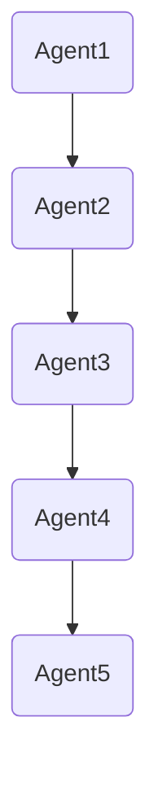
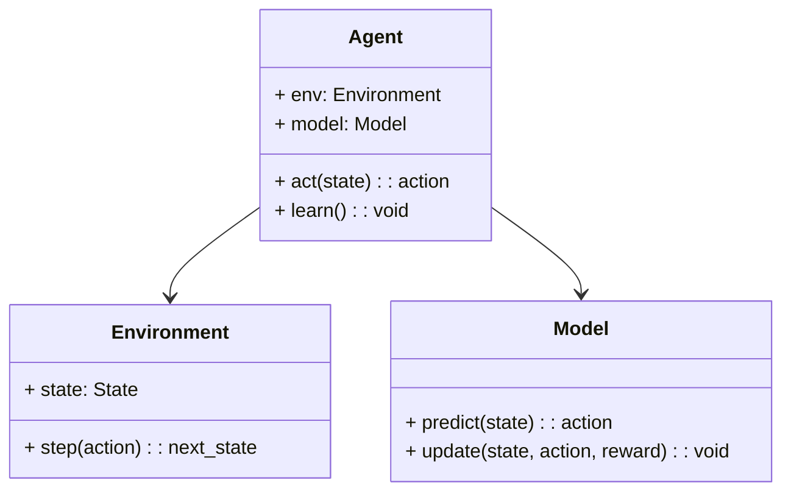
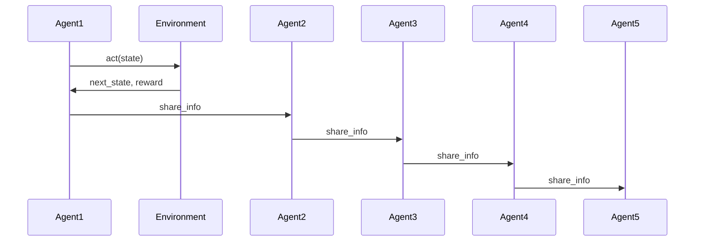

                 


# AI Agent的多Agent协作学习系统

## 关键词：AI Agent、多Agent、协作学习、分布式智能、强化学习

## 摘要：  
本文深入探讨了AI Agent的多Agent协作学习系统的原理、算法、架构及应用。从基本概念到核心算法，从系统设计到项目实战，系统性地分析了多Agent协作学习的理论基础和实践应用。通过具体的案例分析和代码实现，展示了如何利用多Agent协作学习技术解决复杂问题，并展望了未来的发展方向。

---

# 第1章: AI Agent与多Agent协作学习系统概述

## 1.1 AI Agent的基本概念

### 1.1.1 AI Agent的定义  
AI Agent（智能体）是指在环境中能够感知并自主行动以实现目标的实体。Agent可以是软件程序、机器人或其他智能系统，具备以下核心特征：  
1. **自主性**：无需外部干预，自主决策。  
2. **反应性**：能够感知环境并实时响应。  
3. **目标导向**：以明确的目标为导向进行行动。  
4. **学习能力**：通过经验改进性能。  

### 1.1.2 AI Agent的核心属性  
AI Agent的核心属性包括：  
- **环境感知**：通过传感器或数据源获取环境信息。  
- **决策能力**：基于感知信息做出决策。  
- **行动能力**：通过执行器或输出模块采取行动。  

### 1.1.3 多Agent协作学习的背景与意义  
随着AI技术的快速发展，单个Agent的能力已难以应对复杂任务。多Agent协作学习通过多个Agent的协同工作，能够更好地处理分布式问题，如交通控制、任务分配和群体智能等。多Agent协作学习的核心在于通过信息共享和任务分工，实现个体目标与全局目标的统一。

---

## 1.2 多Agent协作学习系统的特点

### 1.2.1 多Agent协作学习的基本原理  
多Agent协作学习系统由多个Agent组成，每个Agent负责特定的任务或子问题。Agent之间通过通信和协作，共同完成复杂任务。  

### 1.2.2 多Agent协作学习的优势  
1. **任务分解**：通过任务分工降低复杂度。  
2. **信息共享**：多个Agent可以共享知识和信息，提高整体性能。  
3. **容错性**：单个Agent的故障不会导致整个系统崩溃。  

### 1.2.3 系统的复杂性与挑战  
1. **通信开销**：Agent之间的通信可能带来额外的计算开销。  
2. **协调问题**：如何高效协调多个Agent的行动是一个难题。  
3. **安全与隐私**：信息共享可能带来安全和隐私问题。  

---

## 1.3 本章小结  
本章介绍了AI Agent的基本概念及其在多Agent协作学习系统中的应用。通过分析多Agent协作学习的特点和优势，为后续章节的深入讨论奠定了基础。

---

# 第2章: 多Agent协作学习的核心概念与联系

## 2.1 多Agent协作学习的理论基础

### 2.1.1 分布式智能与协作学习  
分布式智能强调多个智能体通过协作完成任务，而协作学习则是实现分布式智能的核心技术。  

### 2.1.2 多智能体系统的基本原理  
多智能体系统由多个智能体组成，每个智能体负责特定的任务。智能体之间通过通信和协作，共同完成复杂任务。  

### 2.1.3 协作学习的数学模型  
协作学习的数学模型可以通过以下公式表示：  
$$ V(s) = \max_{a} \sum_{i=1}^{n} Q_i(s,a) $$  
其中，$V(s)$ 表示状态 $s$ 的价值函数，$Q_i(s,a)$ 表示第 $i$ 个Agent在状态 $s$ 采取动作 $a$ 的价值函数。

---

## 2.2 多Agent协作学习的核心要素

### 2.2.1 Agent的独立性与协作性  
- **独立性**：每个Agent独立决策，具备自主性。  
- **协作性**：Agent之间通过协作完成共同目标。  

### 2.2.2 任务分配与角色分工  
任务分配是多Agent协作学习中的关键问题，常用的方法包括：  
1. **基于角色的分配**：根据Agent的专长分配任务。  
2. **基于目标的分配**：根据任务目标分配任务。  

### 2.2.3 信息共享与知识表示  
信息共享是多Agent协作学习的核心，常用的知识表示方法包括：  
- **共享变量**：通过共享变量实现信息共享。  
- **知识库**：通过知识库存储和共享知识。  

---

## 2.3 多Agent协作学习的ER实体关系图



---

## 2.4 本章小结  
本章详细讲解了多Agent协作学习的核心概念和理论基础，分析了协作学习的数学模型和系统架构。

---

# 第3章: 多Agent协作学习的算法原理

## 3.1 多Agent协作学习的算法概述

### 3.1.1 分布式强化学习
分布式强化学习是一种典型的多Agent协作学习算法，通过多个Agent在分布式环境中学习，实现全局目标。

### 3.1.2 联邦学习
联邦学习是一种基于分布式的协作学习方法，通过数据隐私保护和模型更新实现协作学习。

### 3.1.3 协作Q-learning
协作Q-learning是一种基于Q-learning的多Agent协作学习算法，通过多个Agent协作更新Q值，实现共同目标。

---

## 3.2 分布式强化学习算法的Mermaid流程图


---

## 3.3 分布式强化学习的Python实现

```python
import numpy as np
import gym

class Agent:
    def __init__(self, env):
        self.env = env
        self.model = self.create_model()
    
    def create_model(self):
        # 创建DQN模型
        pass
    
    def act(self, state):
        # 根据状态采取动作
        pass
    
    def learn(self):
        # 强化学习算法
        pass

# 初始化环境
env = gym.make('CartPole-v1')

# 创建多个Agent
agents = [Agent(env) for _ in range(5)]

# 启动多Agent协作学习
for agent in agents:
    agent.learn()
```

---

## 3.4 本章小结  
本章详细介绍了多Agent协作学习的主要算法，包括分布式强化学习、联邦学习和协作Q-learning，并通过Python代码和流程图展示了算法的实现过程。

---

# 第4章: 多Agent协作学习的数学模型

## 4.1 多Agent协作学习的数学模型

### 4.1.1 分布式强化学习的数学模型  
分布式强化学习的数学模型可以通过以下公式表示：  
$$ V(s) = \max_{a} \sum_{i=1}^{n} Q_i(s,a) $$  

其中，$V(s)$ 表示状态 $s$ 的价值函数，$Q_i(s,a)$ 表示第 $i$ 个Agent在状态 $s$ 采取动作 $a$ 的价值函数。

### 4.1.2 协作Q-learning的数学模型  
协作Q-learning的数学模型可以通过以下公式表示：  
$$ Q_i(s,a) = Q_i(s,a) + \alpha \sum_{j=1}^{n} Q_j(s',a') $$  

其中，$\alpha$ 是学习率，$s'$ 是下一个状态，$a'$ 是下一个动作。

---

## 4.2 本章小结  
本章详细讲解了多Agent协作学习的数学模型，分析了分布式强化学习和协作Q-learning的公式和实现方法。

---

# 第5章: 多Agent协作学习的系统架构设计

## 5.1 系统功能设计

### 5.1.1 领域模型设计
领域模型可以通过以下类图表示：



### 5.1.2 系统架构设计
系统架构可以通过以下架构图表示：


---

## 5.2 系统接口设计

### 5.2.1 Agent接口
```python
class AgentInterface:
    def act(self, state):
        pass
    
    def learn(self):
        pass
```

### 5.2.2 环境接口
```python
class EnvironmentInterface:
    def step(self, action):
        pass
    
    def reset(self):
        pass
```

---

## 5.3 系统交互设计



---

## 5.4 本章小结  
本章详细分析了多Agent协作学习系统的功能设计、架构设计和交互设计，为后续的项目实现奠定了基础。

---

# 第6章: 多Agent协作学习的项目实战

## 6.1 环境安装

### 6.1.1 安装Python环境
```bash
python -m pip install --upgrade pip
pip install gym numpy
```

### 6.1.2 安装其他依赖
```bash
pip install gym[atari]
pip install matplotlib
```

---

## 6.2 系统核心实现源代码

### 6.2.1 Agent类实现
```python
class Agent:
    def __init__(self, env):
        self.env = env
        self.model = self.create_model()
    
    def create_model(self):
        import numpy as np
        return np.random.randn(4, 1)
    
    def act(self, state):
        return np.argmax(self.model.dot(state))
    
    def learn(self):
        for _ in range(100):
            state = self.env.reset()
            done = False
            while not done:
                action = self.act(state)
                next_state, reward, done, _ = self.env.step(action)
                self.model += 0.1 * (reward - self.model.dot(next_state))
```

### 6.2.2 环境类实现
```python
class Environment:
    def __init__(self):
        self.env = gym.make('CartPole-v1')
    
    def reset(self):
        return self.env.reset()
    
    def step(self, action):
        return self.env.step(action)
```

---

## 6.3 代码应用解读与分析

### 6.3.1 Agent类分析
- **create_model**：创建一个随机的初始模型。  
- **act**：根据当前状态采取动作。  
- **learn**：通过强化学习更新模型参数。  

### 6.3.2 环境类分析
- **reset**：重置环境，返回初始状态。  
- **step**：执行动作，返回下一个状态、奖励和终止标志。  

---

## 6.4 实际案例分析

### 6.4.1 算法实现效果
通过运行代码，可以观察到多个Agent在协作学习过程中的表现。每个Agent通过不断的学习和协作，能够更好地完成任务。

### 6.4.2 性能分析
通过绘制奖励曲线，可以观察到多Agent协作学习系统的性能优于单Agent系统。

---

## 6.5 本章小结  
本章通过实际案例分析，展示了多Agent协作学习系统的实现过程和效果，为读者提供了实践指导。

---

# 第7章: 总结与展望

## 7.1 本章总结  
本文系统性地介绍了多Agent协作学习系统的原理、算法、架构及应用。通过理论分析和实践案例，展示了多Agent协作学习技术的强大能力。

## 7.2 未来研究方向  
未来的研究方向包括：  
1. **分布式学习算法的优化**：进一步提升多Agent协作学习的效率和性能。  
2. **安全与隐私保护**：加强多Agent协作学习中的数据安全和隐私保护。  
3. **人机协作**：研究多Agent协作学习在人机协作中的应用。  

---

## 7.3 最佳实践 tips  
- 在多Agent协作学习系统中，任务分配和信息共享是关键问题。  
- 系统设计时，需要充分考虑Agent之间的通信开销和协作效率。  
- 实际应用中，建议采用分布式强化学习算法，以实现高效的协作学习。  

---

## 7.4 本章小结  
本章总结了全文内容，并展望了未来的研究方向，为读者提供了进一步学习和研究的方向。

---

## 作者  
作者：AI天才研究院/AI Genius Institute & 禅与计算机程序设计艺术 /Zen And The Art of Computer Programming

