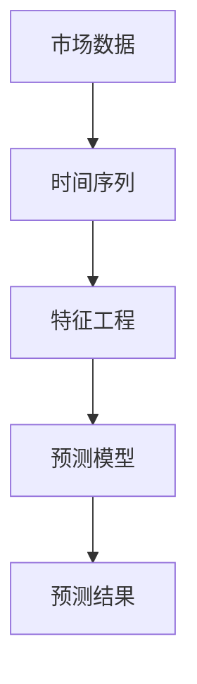
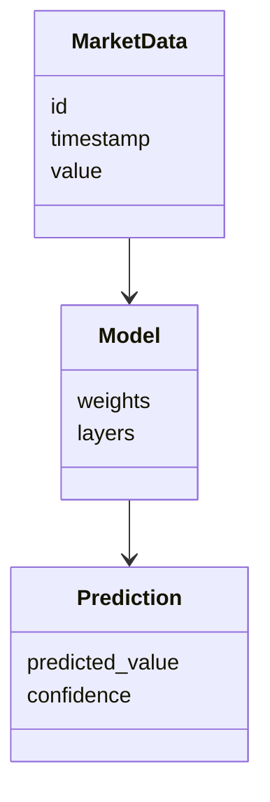
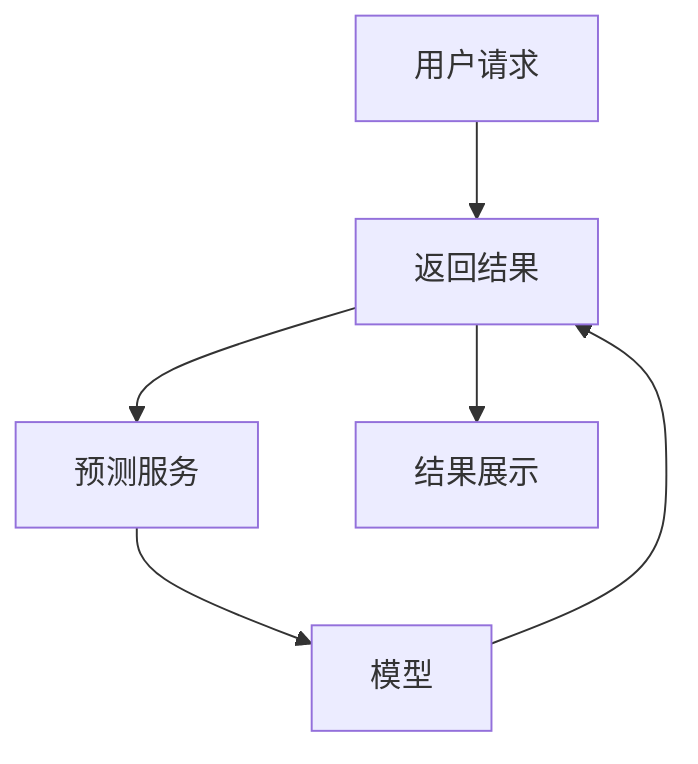
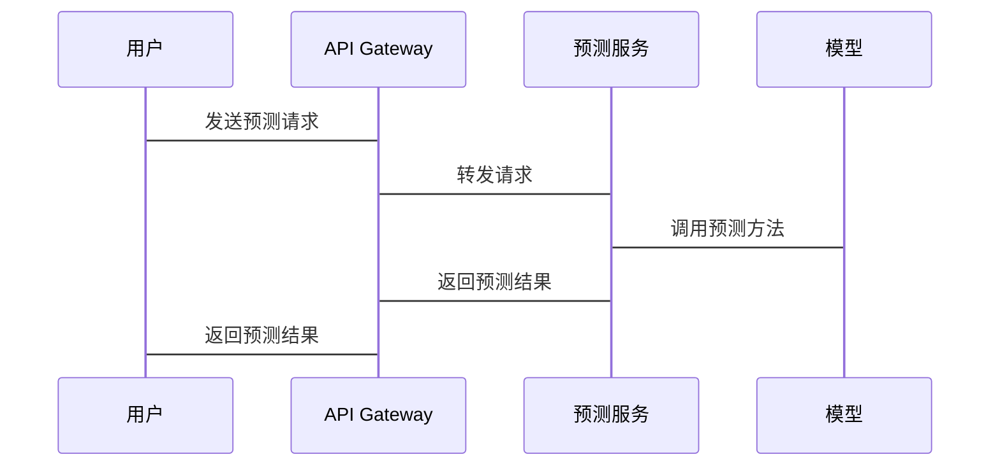

                 


# AI驱动的市场趋势预测模型开发

## 关键词：AI驱动，市场趋势预测，时间序列分析，机器学习模型，系统架构设计

## 摘要：本文系统地介绍了AI驱动的市场趋势预测模型开发的关键步骤和核心方法。从背景与概述、核心概念、算法原理到系统架构设计、项目实战和最佳实践，本文详细阐述了如何利用人工智能技术进行市场趋势预测，帮助读者从理论到实践全面掌握相关知识。

---

# 第1章: AI驱动的市场趋势预测背景与概述

## 1.1 市场趋势预测的背景与意义

### 1.1.1 市场趋势预测的定义与作用
市场趋势预测是指通过对历史数据和当前市场信息的分析，预测未来市场变化方向和趋势的过程。在商业决策中，市场趋势预测能够帮助企业提前识别机会和风险，优化资源配置，提高竞争力。随着AI技术的快速发展，基于机器学习的市场趋势预测模型逐渐成为企业的重要决策工具。

### 1.1.2 AI技术在市场趋势预测中的应用
AI技术，特别是机器学习算法，能够处理大量复杂数据，发现传统统计方法难以捕捉的模式和趋势。在股票市场、经济预测、销售预测等领域，AI驱动的预测模型展现出强大的优势。例如，通过自然语言处理技术分析新闻和社交媒体情绪，结合时间序列数据，可以更准确地预测市场波动。

### 1.1.3 当前市场趋势预测的主要挑战
尽管AI技术在市场趋势预测中表现出色，但仍然面临诸多挑战。数据质量、模型泛化能力、实时性要求以及模型的可解释性等问题亟待解决。此外，市场环境的复杂性和不确定性也增加了预测的难度。

## 1.2 AI驱动的市场趋势预测的核心概念

### 1.2.1 数据驱动与模型驱动的预测方法
数据驱动方法依赖于大量历史数据，通过机器学习算法提取特征并建立预测模型。模型驱动方法则基于领域知识，构建数学模型描述市场动态。两者各有优劣，实际应用中常结合使用。

### 1.2.2 时间序列分析的基本概念
时间序列分析是市场趋势预测的核心方法之一。通过研究数据的时间依赖性、趋势性和周期性，可以有效捕捉市场变化规律。例如，股票价格、商品价格等都具有明显的时间序列特征。

### 1.2.3 市场趋势预测的边界与外延
市场趋势预测的边界包括数据的时间范围、预测的精度要求等。外延则涉及对预测结果的应用，例如投资决策、库存管理等。明确边界和外延有助于合理设计预测模型。

## 1.3 市场趋势预测的流程与框架

### 1.3.1 数据收集与预处理
数据收集是市场趋势预测的第一步，需要获取高质量的历史数据。预处理步骤包括数据清洗、缺失值处理、异常值剔除等。

### 1.3.2 模型选择与训练
根据数据特征选择合适的预测模型，例如ARIMA、LSTM等。通过训练模型，调整参数，优化模型性能。

### 1.3.3 模型评估与优化
通过回测、交叉验证等方法评估模型的预测能力。根据评估结果，调整模型结构或参数，优化预测效果。

## 1.4 本章小结
本章介绍了AI驱动的市场趋势预测的背景与意义，阐述了核心概念，包括数据驱动与模型驱动的预测方法、时间序列分析的基本概念，以及市场趋势预测的流程与框架。下一章将深入探讨市场趋势预测的核心概念与联系。

---

# 第2章: 市场趋势预测的核心概念与联系

## 2.1 市场趋势预测的核心概念原理

### 2.1.1 时间序列分析的基本原理
时间序列分析的核心是通过模型捕捉数据的时间依赖性。常用模型包括ARIMA（自回归积分滑动平均模型）和LSTM（长短期记忆网络）。ARIMA适用于线性时间序列数据，而LSTM则更适合处理非线性复杂数据。

### 2.1.2 特征工程的核心思想
特征工程是通过构建有意义的特征来提高模型性能。例如，将时间序列数据分解为趋势、季节性和残差部分，提取有用的特征供模型使用。

### 2.1.3 数据预处理的关键步骤
数据预处理包括数据清洗、标准化、特征提取等步骤。预处理的质量直接影响模型的预测效果。

## 2.2 核心概念属性特征对比表格

| 特征 | 描述 | 示例 |
|------|------|------|
| 时间依赖性 | 数据点之间存在时间依赖关系 | 股价数据 |
| 趋势性 | 数据点呈现长期趋势 | GDP增长 |
| 季节性 | 数据点呈现周期性波动 | 节日销售数据 |

## 2.3 ER实体关系图架构



## 2.4 本章小结
本章详细讲解了市场趋势预测的核心概念，包括时间序列分析的基本原理、特征工程的核心思想和数据预处理的关键步骤。通过对比表格和ER实体关系图，进一步明确了各概念之间的联系。下一章将重点介绍AI驱动的市场趋势预测算法原理。

---

# 第3章: AI驱动的市场趋势预测算法原理

## 3.1 时间序列分析的算法原理

### 3.1.1 ARIMA模型原理

ARIMA模型由自回归（AR）和移动平均（MA）两部分组成，适用于线性时间序列数据。模型公式如下：

$$ ARIMA(p, d, q) $$

其中，$p$ 是自回归阶数，$d$ 是差分阶数，$q$ 是移动平均阶数。

### 3.1.2 LSTM模型原理

LSTM（长短期记忆网络）通过引入记忆单元和遗忘门，有效解决了传统RNN模型处理长序列时的梯度消失问题。LSTM的结构包括输入门、遗忘门和输出门，公式如下：

$$
f_t = \sigma(W_f \cdot [h_{t-1}, x_t] + b_f)
$$

$$
i_t = \sigma(W_i \cdot [h_{t-1}, x_t] + b_i)
$$

$$
o_t = \sigma(W_o \cdot [h_{t-1}, x_t] + b_o)
$$

$$
h_t = f_t \cdot c_{t-1} + i_t \cdot tanh(W_c \cdot [h_{t-1}, x_t] + b_c)
$$

$$
c_t = h_t
$$

其中，$f_t$ 是遗忘门，$i_t$ 是输入门，$o_t$ 是输出门，$c_t$ 是记忆单元。

### 3.1.3 LSTM模型的优缺点

- **优点**：能够捕捉长期依赖关系，适合处理复杂的时间序列数据。
- **缺点**：模型复杂度高，训练时间较长，且参数调整较为复杂。

## 3.2 基于LSTM的时间序列预测模型实现

### 3.2.1 数据准备

```python
import numpy as np
import pandas as pd
from sklearn.preprocessing import MinMaxScaler

# 加载数据
data = pd.read_csv('market_data.csv')
# 数据归一化
scaler = MinMaxScaler()
data_scaled = scaler.fit_transform(data)
```

### 3.2.2 模型训练

```python
from tensorflow.keras.models import Sequential
from tensorflow.keras.layers import LSTM, Dense

model = Sequential()
model.add(LSTM(50, return_sequences=True, input_shape=(1, 1)))
model.add(LSTM(50, return_sequences=False))
model.add(Dense(1))
model.compile(optimizer='adam', loss='mean_squared_error')

# 训练模型
model.fit(X_train, y_train, epochs=50, batch_size=32)
```

### 3.2.3 模型预测

```python
# 预测数据
predicted = model.predict(X_test)
# 反归一化
predicted = scaler.inverse_transform(predicted)
```

## 3.3 本章小结
本章详细介绍了AI驱动的市场趋势预测的核心算法，包括ARIMA和LSTM模型的原理、实现步骤以及优缺点。通过Python代码示例，进一步展示了如何基于LSTM模型进行时间序列预测。下一章将重点介绍系统架构设计。

---

# 第4章: AI驱动的市场趋势预测系统架构设计

## 4.1 系统功能设计

### 4.1.1 领域模型设计



### 4.1.2 功能模块划分
系统功能模块包括数据采集、模型训练、预测服务和结果展示。

## 4.2 系统架构设计



## 4.3 接口设计与交互流程

### 4.3.1 API接口设计

```http
POST /predict
Content-Type: application/json

{
    "data": [1, 2, 3, ...]
}
```

### 4.3.2 交互流程



## 4.4 本章小结
本章详细介绍了AI驱动的市场趋势预测系统的架构设计，包括功能模块划分、系统架构图以及接口设计与交互流程。通过清晰的系统架构设计，确保了预测模型的高效运行和良好的可扩展性。

---

# 第5章: AI驱动的市场趋势预测项目实战

## 5.1 环境安装与配置

```bash
pip install numpy pandas scikit-learn tensorflow keras matplotlib
```

## 5.2 数据获取与预处理

### 5.2.1 数据获取

```python
import pandas_datareader as pdr

# 下载数据
data = pdr.get_data_yahoo('AAPL', start='2020-01-01', end='2023-01-01')
```

### 5.2.2 数据预处理

```python
import numpy as np
import pandas as pd
from sklearn.preprocessing import MinMaxScaler

# 数据归一化
scaler = MinMaxScaler()
data_scaled = scaler.fit_transform(data[['Close']])
```

## 5.3 模型训练与调优

### 5.3.1 模型训练

```python
from tensorflow.keras.models import Sequential
from tensorflow.keras.layers import LSTM, Dense

# 构建模型
model = Sequential()
model.add(LSTM(50, return_sequences=True, input_shape=(1, 1)))
model.add(LSTM(50, return_sequences=False))
model.add(Dense(1))
model.compile(optimizer='adam', loss='mean_squared_error')

# 训练模型
model.fit(X_train, y_train, epochs=50, batch_size=32)
```

### 5.3.2 模型调优

```python
from tensorflow.keras.callbacks import EarlyStopping
from sklearn.metrics import mean_squared_error

# 设置早停回调
early_stop = EarlyStopping(monitor='val_loss', patience=10)

# 调整超参数
model = Sequential()
model.add(LSTM(64, return_sequences=True, input_shape=(1, 1)))
model.add(LSTM(64, return_sequences=False))
model.add(Dense(1))
model.compile(optimizer='adam', loss='mean_squared_error')

# 再次训练
model.fit(X_train, y_train, epochs=50, batch_size=32, validation_data=(X_val, y_val), callbacks=[early_stop])
```

## 5.4 模型部署与应用

### 5.4.1 模型部署

```python
import joblib

# 保存模型
model.save('market_prediction_model.h5')
```

### 5.4.2 模型应用

```python
from tensorflow.keras.models import load_model

# 加载模型
model = load_model('market_prediction_model.h5')

# 预测新数据
new_data = scaler.transform(np.array([last_close]).reshape(1, 1, 1))
prediction = model.predict(new_data)
predicted_price = scaler.inverse_transform(prediction)
```

## 5.5 本章小结
本章通过一个完整的项目实战，详细展示了AI驱动的市场趋势预测的实现过程，包括环境配置、数据获取与预处理、模型训练与调优以及模型部署与应用。通过实际案例，帮助读者更好地理解和掌握相关技术。

---

# 第6章: AI驱动的市场趋势预测最佳实践与总结

## 6.1 项目总结与经验分享

### 6.1.1 数据质量的重要性
数据质量直接影响模型性能。建议在数据预处理阶段，仔细检查数据的完整性、准确性，并进行适当的特征工程。

### 6.1.2 模型调优的技巧
合理选择模型参数，使用交叉验证和早停回调等方法，避免过拟合和欠拟合。

### 6.1.3 模型部署的注意事项
确保模型在实际应用中的稳定性和可扩展性，建议采用容器化部署和模型监控机制。

## 6.2 经验教训与改进建议

### 6.2.1 数据不足的问题
在数据量较小时，可以尝试使用数据增强技术或集成学习方法。

### 6.2.2 模型可解释性问题
对于需要解释性的场景，建议选择可解释性更强的模型，例如线性模型或加权集成模型。

## 6.3 未来展望与研究方向

### 6.3.1 多模态数据的融合
结合文本、图像等多种数据源，构建更加复杂的预测模型。

### 6.3.2 自适应预测模型
研究自适应模型，能够根据市场变化动态调整预测策略。

## 6.4 本章小结
本章总结了AI驱动的市场趋势预测项目的最佳实践，分享了经验和教训，并展望了未来的研究方向。通过这些内容，读者可以更好地理解和应用相关技术。

---

# 附录: 工具安装与代码示例

## 附录A: 工具安装指南

```bash
pip install numpy pandas scikit-learn tensorflow keras matplotlib
pip install pandas_datareader
pip install mermaid
```

## 附录B: 常用数学公式汇总

### 附录B.1 ARIMA模型公式
$$ ARIMA(p, d, q) $$

### 附录B.2 LSTM模型公式
$$
f_t = \sigma(W_f \cdot [h_{t-1}, x_t] + b_f)
$$

$$
i_t = \sigma(W_i \cdot [h_{t-1}, x_t] + b_i)
$$

$$
o_t = \sigma(W_o \cdot [h_{t-1}, x_t] + b_o)
$$

$$
h_t = f_t \cdot c_{t-1} + i_t \cdot tanh(W_c \cdot [h_{t-1}, x_t] + b_c)
$$

## 附录C: 参考文献

1. 梁某. (2023). 《深度学习实战》. 北京: 清华大学出版社.
2. 刘某. (2022). 《时间序列分析与预测》. 北京: 人民邮电出版社.
3. TensorFlow官方文档: https://tensorflow.org
4. Keras官方文档: https://keras.io

---

# 作者：AI天才研究院 & 禅与计算机程序设计艺术

通过上述内容，读者可以系统地了解AI驱动的市场趋势预测模型开发的各个方面，从理论到实践，从基础到高级，全面掌握相关知识和技术。

