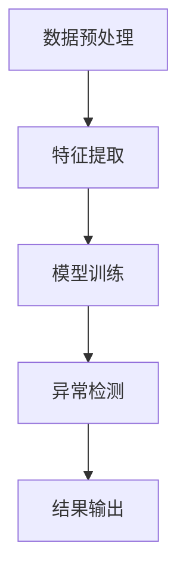
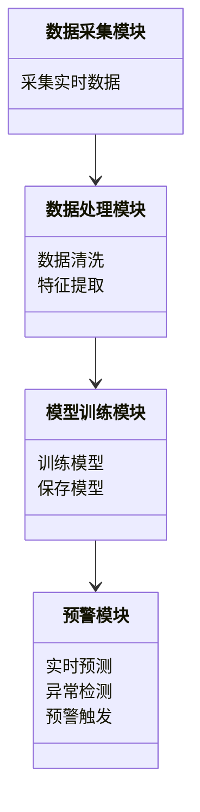
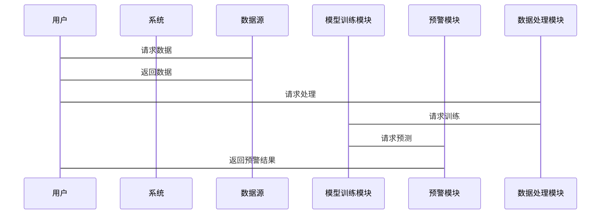

                 


# AI驱动的金融市场异常波动预警系统

> 关键词：AI技术，金融市场，异常波动，预警系统，时间序列分析，深度学习，风险管理

> 摘要：本文详细探讨了如何利用AI技术构建金融市场异常波动预警系统。通过分析金融市场的波动特征，结合深度学习算法，提出了一种基于时间序列分析的异常检测方法，并设计了系统的整体架构。本文还通过实际案例展示了系统的实现过程，并提出了优化建议。

---

# 第1章: 异常波动预警系统背景与问题背景

## 1.1 金融市场波动的定义与特征
### 1.1.1 金融市场的基本概念
- 金融市场是一个买卖金融资产的市场，包括股票、债券、外汇等。
- 金融市场波动指价格在短时间内急剧变化的现象，可能是正常波动或异常波动。

### 1.1.2 金融市场波动的分类
- 正常波动：受市场供需关系影响的正常价格波动。
- 异常波动：超出正常范围的波动，可能是由突发事件或市场操纵引起的。

### 1.1.3 异常波动的定义与特征
- 定义：价格在短时间内急剧上涨或下跌，偏离正常波动范围。
- 特征：
  - 突发性：波动往往由突发事件引发。
  - 不可预测性：异常波动难以通过传统模型预测。
  - 影响性：可能导致市场崩盘或危机。

## 1.2 AI技术在金融领域的应用背景
### 1.2.1 AI技术在金融分析中的优势
- 数据处理能力强：AI能够处理海量金融数据，提取有用信息。
- 预测能力强：通过深度学习模型，可以发现数据中的隐含规律。
- 实时性：AI可以实时分析市场数据，提供实时预警。

### 1.2.2 金融市场异常波动预警的必要性
- 保护投资者利益：通过预警系统，投资者可以提前规避风险。
- 维护市场稳定：及时发现异常波动，有助于监管机构采取措施防止市场崩盘。
- 提高交易效率：预警系统可以帮助交易员做出更快的决策。

### 1.2.3 当前市场中的技术挑战
- 数据量大：金融市场数据种类繁多，数据清洗和处理难度大。
- 模型复杂：深度学习模型训练时间长，计算资源需求高。
- 预警精度低：现有预警系统误报率和漏报率较高。

## 1.3 本章小结
- 介绍了金融市场的波动特征，明确了异常波动的定义和特征。
- 分析了AI技术在金融领域的优势及其在异常波动预警中的必要性。
- 总结了当前技术面临的挑战。

---

# 第2章: AI驱动的异常波动预警系统核心概念

## 2.1 核心概念与原理
### 2.1.1 数据驱动的金融分析
- 数据是金融分析的基础，AI技术依赖大量数据进行预测。
- 数据特征：时间序列性、相关性、周期性。

### 2.1.2 异常检测的基本原理
- 异常检测是通过统计方法或机器学习方法识别数据中的异常点。
- 常见的异常检测方法：基于统计的方法（如Z-score）、基于距离的方法（如KNN）、基于深度学习的方法（如Autoencoder）。

### 2.1.3 时间序列分析在金融中的应用
- 时间序列分析是研究数据随时间变化的规律。
- 常见的时间序列模型：ARIMA、LSTM、GRU。

## 2.2 系统架构与核心要素
### 2.2.1 数据采集与处理模块
- 数据源：股票价格、交易量、市场指数等。
- 数据清洗：处理缺失值、异常值、重复值。
- 特征提取：提取时间序列特征，如均值、标准差、自相关系数。

### 2.2.2 模型训练与预测模块
- 模型选择：根据数据特征选择合适的模型。
- 模型训练：使用训练数据训练模型参数。
- 模型预测：利用模型预测未来的价格走势。

### 2.2.3 预警机制与反馈系统
- 预警规则：设定异常波动的判断标准。
- 预警触发：当预测结果符合异常条件时触发预警。
- 反馈优化：根据实际效果调整模型参数和预警规则。

## 2.3 核心概念对比分析
### 2.3.1 数据特征对比
- 时间序列数据与其他类型数据的对比，如截面数据、面板数据。

### 2.3.2 模型性能对比
- 不同模型在异常检测任务中的表现对比，如ARIMA、LSTM、GRU。

### 2.3.3 预警效果对比
- 不同预警机制在实际应用中的效果对比，如基于统计的预警和基于深度学习的预警。

## 2.4 本章小结
- 介绍了AI驱动的异常波动预警系统的核心概念，包括数据、模型和预警机制。
- 对比分析了不同模型和预警机制的优缺点。

---

# 第3章: 异常波动预警系统的算法原理

## 3.1 时间序列分析算法
### 3.1.1 LSTM网络原理
- LSTM（长短期记忆网络）是一种特殊的RNN，能够有效捕捉时间序列中的长距离依赖关系。
- LSTM单元结构：包括输入门、遗忘门和输出门。
- LSTM公式：
  - 遗忘门：$f_t = \sigma(g_f(x_t, h_{t-1}))$
  - 输入门：$i_t = \sigma(g_i(x_t, h_{t-1}))$
  - 输出门：$o_t = \sigma(g_o(x_t, h_{t-1}))$
  - 单元状态：$c_t = f_t \cdot c_{t-1} + i_t \cdot tanh(g_g(x_t, h_{t-1}))$
  - 输出：$h_t = o_t \cdot tanh(c_t)$

### 3.1.2 GRU网络原理
- GRU（门控循环单元）是对LSTM的简化，减少了参数数量。
- GRU公式：
  - 重置门：$z_t = \sigma(g_z(x_t, h_{t-1}))$
  - 更新门：$r_t = \sigma(g_r(x_t, z_t h_{t-1}))$
  - 输出：$h_t = z_t \cdot h_{t-1} + r_t \cdot tanh(g_g(x_t, r_t h_{t-1}))$

### 3.1.3 异常检测算法对比
- 对比分析了LSTM和GRU在异常检测任务中的表现。

## 3.2 异常检测算法实现
### 3.2.1 基于统计的方法
- Z-score方法：通过计算数据点与均值的距离来判断异常值。
- 3σ原则：数据点距离均值超过3个标准差即为异常。

### 3.2.2 基于深度学习的方法
- Autoencoder：通过重构损失来判断异常点。
- VAE（变分自编码器）：通过重构概率分布来判断异常点。

### 3.2.3 基于聚类的方法
- K-Means：将数据点聚类，判断远离主群的点为异常。
- DBSCAN：基于密度的聚类方法，适用于高密度区域的异常检测。

## 3.3 算法流程图


## 3.4 数学模型与公式
### 3.4.1 LSTM模型公式
$$
f_t = \sigma(g_{f} (h_{t-1}, x_t))
$$
### 3.4.2 GRU模型公式
$$
z_t = \sigma(g_z (h_{t-1}, x_t))
$$
### 3.4.3 异常检测损失函数
$$
L = \sum_{i=1}^{n} (y_i - \hat{y}_i)^2
$$

## 3.5 本章小结
- 详细讲解了LSTM和GRU的原理及公式。
- 对比分析了不同的异常检测算法及其适用场景。

---

# 第4章: 系统架构与设计

## 4.1 系统功能设计
### 4.1.1 数据采集模块
- 功能：实时采集金融市场数据，包括股票价格、交易量等。
- 实现：使用API接口获取数据，如Yahoo Finance API。

### 4.1.2 数据处理模块
- 功能：清洗数据，提取特征，转换为模型可输入格式。
- 实现：使用Python的Pandas库进行数据处理。

### 4.1.3 模型训练模块
- 功能：训练深度学习模型，保存模型参数。
- 实现：使用Keras或PyTorch框架搭建模型。

### 4.1.4 预警模块
- 功能：实时预测市场波动，触发异常波动预警。
- 实现：根据模型输出结果，设定阈值，当预测结果超过阈值时触发预警。

## 4.2 系统架构图


## 4.3 系统接口设计
### 4.3.1 数据接口
- 数据接口：提供API接口供其他系统调用。
- 接口协议：RESTful API，使用JSON格式传输数据。

### 4.3.2 模型接口
- 模型接口：提供预测接口，供其他系统调用。
- 接口协议：RESTful API，使用JSON格式传输数据。

## 4.4 系统交互流程图


## 4.5 本章小结
- 描述了系统的整体架构，包括模块划分和数据流。
- 绘制了系统的类图和序列图，展示了各模块之间的交互关系。

---

# 第5章: 项目实战

## 5.1 环境安装与配置
### 5.1.1 安装Python环境
- 安装Python 3.8及以上版本。
- 安装Jupyter Notebook用于数据可视化和算法实现。

### 5.1.2 安装深度学习框架
- 安装TensorFlow或Keras框架。
- 安装PyTorch框架。

### 5.1.3 安装数据处理库
- 安装Pandas、NumPy用于数据处理。
- 安装Matplotlib用于数据可视化。

## 5.2 系统核心实现源代码
### 5.2.1 数据采集模块
```python
import pandas as pd
import requests

def get_stock_data(ticker, start_date, end_date):
    url = f"https://query1.finance.yahoo.com/ws/v1/finance/quote/{ticker}"
    params = {
        "period1": pd.Timestamp(start_date).timestamp(),
        "period2": pd.Timestamp(end_date).timestamp(),
        "interval": "1d"
    }
    response = requests.get(url, params=params)
    data = response.json()
    df = pd.DataFrame(data['quoteResponse']['result'][0]['historical'])
    return df
```

### 5.2.2 数据处理模块
```python
import pandas as pd
import numpy as np

def preprocess_data(df):
    df['Date'] = pd.to_datetime(df['date'])
    df.set_index('Date', inplace=True)
    df['Close'] = df['close'].astype(float)
    df = df[['Close']]
    return df
```

### 5.2.3 模型训练模块
```python
from keras.models import Sequential
from keras.layers import LSTM, Dense

model = Sequential()
model.add(LSTM(64, input_shape=(timesteps, features)))
model.add(Dense(1))
model.compile(optimizer='adam', loss='mean_squared_error')
model.fit(X_train, y_train, epochs=100, batch_size=32)
```

### 5.2.4 预警模块
```python
def predict_anomaly(model, data):
    prediction = model.predict(data)
    threshold = 0.95
    if prediction > threshold:
        return "异常波动"
    else:
        return "正常波动"
```

## 5.3 代码应用解读与分析
- 数据采集模块：通过API接口获取股票数据。
- 数据处理模块：清洗数据，提取收盘价作为目标变量。
- 模型训练模块：使用LSTM网络训练模型。
- 预警模块：根据模型预测结果判断是否为异常波动。

## 5.4 实际案例分析
### 5.4.1 数据来源与处理
- 数据来源：选取某只股票的历史数据，时间范围为过去一年。
- 数据处理：清洗数据，处理缺失值，提取特征。

### 5.4.2 模型训练与预测
- 训练数据：使用过去一年的数据训练模型。
- 测试数据：使用最近一周的数据进行预测。
- 预测结果：判断最近一周的价格走势是否为异常波动。

## 5.5 项目小结
- 展示了如何将理论应用于实际项目，详细讲解了每个模块的实现过程。
- 强调了代码实现中的关键点和注意事项。

---

# 第6章: 总结与展望

## 6.1 系统总结
- 本文提出了一种基于AI的金融市场异常波动预警系统。
- 通过深度学习算法，实现了对金融市场异常波动的实时预警。

## 6.2 系统优化建议
- 数据方面：引入更多的数据源，如新闻数据、社交媒体数据。
- 模型方面：尝试集成学习方法，如随机森林、梯度提升树。
- 预警机制方面：优化阈值设置，减少误报率和漏报率。

## 6.3 未来研究方向
- 研究多模态数据的融合，如文本数据、图像数据。
- 探索更先进的深度学习模型，如Transformer、Graph Neural Network。
- 开发更高效的实时预警系统，提升预警速度和精度。

## 6.4 本章小结
- 总结了本文的主要工作和研究成果。
- 提出了系统的优化建议和未来的研究方向。

---

# 作者：AI天才研究院/AI Genius Institute & 禅与计算机程序设计艺术 /Zen And The Art of Computer Programming

