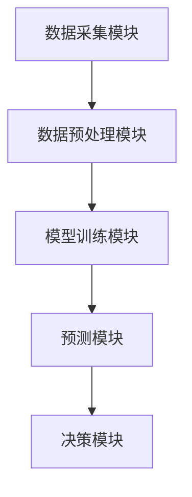
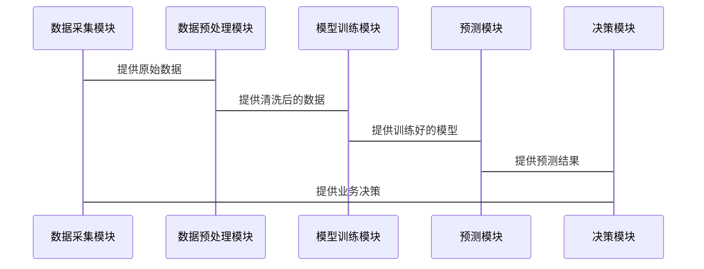

                 


# 企业AI Agent的时间序列分析在需求预测中的高级应用

---

## 关键词：AI Agent，时间序列分析，需求预测，企业级系统，深度学习

---

## 摘要

企业需求预测是商业决策中的核心问题之一，而时间序列分析是解决这一问题的关键技术。随着人工智能（AI）技术的快速发展，AI Agent（智能代理）逐渐成为企业需求预测的重要工具。本文将深入探讨AI Agent在时间序列分析中的高级应用，从算法原理到系统架构，从项目实战到优化策略，为企业需求预测提供全面的技术指导。本文不仅分析了时间序列分析的核心原理，还结合AI Agent的特点，详细阐述了其在企业需求预测中的优势和实现方法。

---

# 第1章：时间序列分析的背景与应用

## 1.1 时间序列分析的概念与特点

### 1.1.1 时间序列的定义与基本特征

时间序列是指按照时间顺序排列的数据序列，通常用于描述某一变量在时间上的变化规律。时间序列分析的核心目标是通过历史数据预测未来的趋势。

**时间序列的基本特征包括：**

- **趋势（Trend）**：长期数据的变化方向。
- **季节性（Seasonality）**：周期性波动。
- **周期性（Cyclicality）**：不同于季节性的长周期波动。
- **随机性（Randomness）**：不可预测的噪声。

### 1.1.2 时间序列分析的分类与应用场景

时间序列分析可以分为以下几类：

- **基于统计的方法**：如ARIMA、SARIMA。
- **基于机器学习的方法**：如LSTM、GRU。
- **基于AI Agent的方法**：结合强化学习的动态预测。

应用场景包括：

- **销售预测**：帮助企业优化库存和生产计划。
- **金融预测**：股票价格、汇率预测。
- **能源需求预测**：优化电力和天然气的分配。

### 1.1.3 企业需求预测中的时间序列分析

企业需求预测的关键在于捕捉市场波动和客户行为的变化。时间序列分析通过历史数据，帮助企业预测未来的需求，从而优化供应链管理和资源配置。

---

## 1.2 企业需求预测的挑战与解决方案

### 1.2.1 需求预测的核心问题

- 数据的不完全性：市场需求受多种因素影响，如市场波动、政策变化等。
- 数据的噪声：历史数据中可能存在随机干扰。
- 数据的动态性：市场需求可能因外部环境变化而快速波动。

### 1.2.2 时间序列分析在需求预测中的优势

- **数据驱动**：基于历史数据进行预测，避免主观判断。
- **动态适应性**：能够捕捉数据的动态变化，实时调整预测模型。
- **高精度**：通过复杂算法优化预测结果，提高准确性。

### 1.2.3 AI Agent在需求预测中的引入

AI Agent是一种智能代理系统，能够根据环境信息自主决策并执行任务。在需求预测中，AI Agent可以实时监控市场动态，调整预测模型，从而提高预测的准确性和响应速度。

---

## 1.3 AI Agent的基本概念与技术架构

### 1.3.1 AI Agent的定义与分类

AI Agent是一种能够感知环境、自主决策并执行任务的智能系统。根据应用场景的不同，AI Agent可以分为：

- **简单反射式Agent**：基于当前输入做出反应。
- **基于模型的反射式Agent**：利用内部模型进行推理和决策。
- **目标驱动式Agent**：基于明确的目标进行行动。

### 1.3.2 AI Agent在时间序列分析中的作用

AI Agent可以作为时间序列分析的核心模块，负责数据的采集、处理、建模和预测。其主要作用包括：

- **数据采集**：实时获取市场数据。
- **模型优化**：根据数据变化调整预测模型。
- **决策执行**：根据预测结果做出业务决策。

### 1.3.3 AI Agent与传统时间序列分析的对比

| 对比维度         | AI Agent时间序列分析 | 传统时间序列分析 |
|------------------|----------------------|------------------|
| 数据处理能力     | 强大的实时处理能力    | 依赖历史数据      |
| 模型适应性       | 能够动态调整模型      | 模型固定          |
| 决策能力         | 具备自主决策能力      | 需人工干预          |

---

## 1.4 时间序列分析在企业需求预测中的应用案例

以某电商平台为例，通过时间序列分析预测未来的需求量，帮助企业优化库存管理和采购计划。AI Agent实时监控销售数据，动态调整预测模型，从而实现高精度的需求预测。

---

# 第2章：时间序列分析的核心原理

## 2.1 时间序列分析的基本方法

### 2.1.1 线性回归与时间序列预测

线性回归是一种简单的时间序列预测方法，适用于数据呈现线性趋势的情况。

**数学公式：**

$$ y_t = a + bx_t + \epsilon $$

其中，$y_t$ 是预测值，$x_t$ 是自变量，$a$ 和 $b$ 是回归系数，$\epsilon$ 是误差项。

### 2.1.2 移动平均法与指数平滑法

移动平均法通过计算一定时间窗口内的平均值来预测未来值，适用于数据平稳的情况。

**数学公式：**

$$ \hat{y}_{t+1} = \frac{y_t + y_{t-1} + \cdots + y_{t-n+1}}{n} $$

指数平滑法则通过赋予近期数据更高的权重来预测未来值。

**数学公式：**

$$ \hat{y}_{t+1} = \alpha y_t + (1-\alpha)\hat{y}_t $$

其中，$\alpha$ 是平滑因子，$0 < \alpha < 1$。

### 2.1.3 季节性与周期性分析

季节性分析通过识别数据中的周期性模式，预测未来值。周期性分析则通过傅里叶变换等方法提取数据中的周期成分。

---

## 2.2 时间序列的分解与特征提取

### 2.2.1 时间序列的分解方法

时间序列可以分解为趋势、季节性、周期性和噪声四个部分。

**分解公式：**

$$ y_t = T_t + S_t + C_t + R_t $$

其中，$T_t$ 是趋势成分，$S_t$ 是季节性成分，$C_t$ 是周期性成分，$R_t$ 是随机噪声。

### 2.2.2 时间序列的特征工程

特征工程是时间序列分析中的关键步骤，主要包括：

- **滞后特征**：使用过去若干期的值作为特征。
- **移动平均特征**：使用移动平均值作为特征。
- **差分特征**：通过差分消除趋势和季节性。

### 2.2.3 时间序列的可视化与诊断

通过可视化工具（如折线图、箱线图等）对时间序列数据进行诊断，识别数据中的趋势、季节性和异常值。

---

## 2.3 时间序列分析的数学模型

### 2.3.1 自回归模型（AR）

自回归模型通过当前值与过去若干期的值之间的关系进行预测。

**数学公式：**

$$ y_t = c + \phi_1 y_{t-1} + \phi_2 y_{t-2} + \cdots + \phi_p y_{t-p} + \epsilon_t $$

### 2.3.2 移动平均模型（MA）

移动平均模型通过当前值与过去若干期的误差之间的关系进行预测。

**数学公式：**

$$ y_t = c + \theta_1 \epsilon_{t-1} + \theta_2 \epsilon_{t-2} + \cdots + \theta_q \epsilon_{t-q} + \epsilon_t $$

### 2.3.3 ARIMA模型的原理与公式

ARIMA模型结合了AR和MA模型的优势，适用于非平稳时间序列数据。

**数学公式：**

$$ \Phi(B) \cdot (1 - B)^d y_t = \Theta(B) \cdot \epsilon_t $$

其中，$B$ 是延迟算子，$d$ 是差分阶数，$\Phi(B)$ 和 $\Theta(B)$ 分别是AR和MA多项式。

---

## 2.4 基于深度学习的时间序列分析

### 2.4.1 LSTM网络的原理与优势

长短时记忆网络（LSTM）是一种特殊的RNN，能够有效捕捉时间序列中的长程依赖关系。

**LSTM结构：**

- **输入门（Input Gate）**：控制输入信息的保留程度。
- **遗忘门（Forget Gate）**：决定遗忘哪些信息。
- **输出门（Output Gate）**：决定输出信息。

### 2.4.2 GRU网络的原理与特点

门控循环单元网络（GRU）是对LSTM的简化版本，通过两个门控机制（更新门和重置门）实现信息的更新和保留。

---

## 2.5 时间序列分析的算法选择与优化

### 2.5.1 不同算法的优缺点对比

| 算法         | 优点                           | 缺点                           |
|--------------|-------------------------------|-------------------------------|
| ARIMA        | 适用于线性数据，模型简单       | 无法捕捉非线性关系             |
| LSTM         | 能捕捉长程依赖关系，适合复杂数据 | 计算复杂度高                   |
| GRU          | 计算效率高，适合实时预测       | 捕捉长程依赖的能力稍逊于LSTM   |

### 2.5.2 算法选择的依据与策略

- 数据特性：线性数据选择ARIMA，非线性数据选择LSTM或GRU。
- 计算资源：计算能力有限时选择GRU。
- 预测精度：对精度要求极高时选择LSTM。

### 2.5.3 算法调优与性能评估

- **超参数调优**：通过网格搜索或随机搜索优化模型参数。
- **性能评估**：使用均方误差（MSE）、平均绝对误差（MAE）等指标评估模型性能。

---

# 第3章：AI Agent的时间序列分析算法

## 3.1 基于机器学习的时间序列分析

### 3.1.1 神经网络在时间序列分析中的应用

神经网络通过多层感知机（MLP）或卷积神经网络（CNN）对时间序列数据进行特征提取和分类。

### 3.1.2 LSTM网络的原理与优势

LSTM通过遗忘门和输入门机制，有效捕捉时间序列的长程依赖关系。

### 3.1.3 GRU网络的原理与特点

GRU通过两个门控机制（更新门和重置门）实现信息的更新和保留，计算效率高于LSTM。

---

## 3.2 基于深度学习的时间序列预测

### 3.2.1 深度学习在时间序列分析中的优势

- **非线性捕捉**：深度学习模型能够捕捉复杂的时间序列模式。
- **自动特征提取**：模型能够自动提取有用的特征，减少特征工程的工作量。

### 3.2.2 LSTM模型的数学公式与实现

**LSTM单元公式：**

- 遗忘门：$$ f_t = \sigma(w_f \cdot [h_{t-1}, x_t] + b_f) $$
- 输入门：$$ i_t = \sigma(w_i \cdot [h_{t-1}, x_t] + b_i) $$
- 输出门：$$ o_t = \sigma(w_o \cdot [h_{t-1}, x_t] + b_o) $$
- 忘记门：$$ \tilde{c}_t = \tanh(w_c \cdot [h_{t-1}, x_t] + b_c) $$
- 细胞状态：$$ c_t = f_t \cdot c_{t-1} + i_t \cdot \tilde{c}_t $$
- 隐藏状态：$$ h_t = o_t \cdot \tanh(c_t) $$

### 3.2.3 GRU模型的数学公式与实现

**GRU单元公式：**

- 重置门：$$ z_t = \sigma(w_z \cdot [h_{t-1}, x_t] + b_z) $$
- 更新门：$$ r_t = \sigma(w_r \cdot [h_{t-1}, x_t] + b_r) $$
- 隐藏状态：$$ h_t = z_t \cdot h_{t-1} + (1 - z_t) \cdot \tanh(w_h \cdot [h_{t-1}, x_t] \cdot r_t + b_h) $$

---

## 3.3 AI Agent的时间序列分析算法选择

### 3.3.1 不同算法的优缺点对比

| 算法         | 优点                           | 缺点                           |
|--------------|-------------------------------|-------------------------------|
| LSTM         | 能捕捉长程依赖关系，适合复杂数据 | 计算复杂度高                   |
| GRU          | 计算效率高，适合实时预测       | 捕捉长程依赖的能力稍逊于LSTM   |

### 3.3.2 算法选择的依据与策略

- 数据特性：线性数据选择ARIMA，非线性数据选择LSTM或GRU。
- 计算资源：计算能力有限时选择GRU。
- 预测精度：对精度要求极高时选择LSTM。

### 3.3.3 算法调优与性能评估

- **超参数调优**：通过网格搜索或随机搜索优化模型参数。
- **性能评估**：使用均方误差（MSE）、平均绝对误差（MAE）等指标评估模型性能。

---

# 第4章：企业级AI Agent系统架构设计

## 4.1 系统功能设计

### 4.1.1 系统功能模块

- **数据采集模块**：实时采集市场数据。
- **数据预处理模块**：对数据进行清洗和平滑处理。
- **模型训练模块**：基于历史数据训练预测模型。
- **预测模块**：根据实时数据生成预测结果。
- **决策模块**：根据预测结果制定业务决策。

### 4.1.2 系统功能流程

1. 数据采集模块实时采集市场数据。
2. 数据预处理模块对数据进行清洗和平滑处理。
3. 模型训练模块基于预处理后的数据训练预测模型。
4. 预测模块根据实时数据生成预测结果。
5. 决策模块根据预测结果制定业务决策。

### 4.1.3 系统功能设计的数学模型

- **数据预处理**：使用移动平均法对数据进行平滑处理。
- **模型训练**：基于LSTM或GRU模型训练时间序列预测模型。
- **预测结果生成**：根据训练好的模型生成未来需求预测。

---

## 4.2 系统架构设计

### 4.2.1 系统架构图



### 4.2.2 系统功能模块的交互流程

1. 数据采集模块采集市场数据。
2. 数据预处理模块对数据进行清洗和平滑处理。
3. 模型训练模块基于预处理后的数据训练预测模型。
4. 预测模块根据实时数据生成预测结果。
5. 决策模块根据预测结果制定业务决策。

---

## 4.3 系统接口设计

### 4.3.1 系统接口定义

- **数据接口**：提供数据采集和数据预处理功能。
- **模型接口**：提供模型训练和预测功能。
- **决策接口**：提供业务决策支持功能。

### 4.3.2 系统接口的交互流程

1. 数据采集模块通过API接口实时采集市场数据。
2. 数据预处理模块通过API接口对数据进行清洗和平滑处理。
3. 模型训练模块通过API接口训练预测模型。
4. 预测模块通过API接口生成预测结果。
5. 决策模块通过API接口制定业务决策。

---

## 4.4 系统交互流程设计

### 4.4.1 系统交互流程图



---

## 4.5 系统架构设计的数学模型

### 4.5.1 系统架构图


### 4.5.2 系统功能模块的交互流程

1. 数据采集模块实时采集市场数据。
2. 数据预处理模块对数据进行清洗和平滑处理。
3. 模型训练模块基于预处理后的数据训练预测模型。
4. 预测模块根据实时数据生成预测结果。
5. 决策模块根据预测结果制定业务决策。

---

# 第5章：企业AI Agent时间序列分析的项目实战

## 5.1 项目环境安装与配置

### 5.1.1 环境安装

- **Python**：安装Python 3.8及以上版本。
- **深度学习框架**：安装TensorFlow或Keras。
- **时间序列分析库**：安装pandas、numpy、scikit-learn。
- **AI Agent框架**：安装强化学习库（如OpenAI Gym）。

### 5.1.2 项目配置

- **虚拟环境配置**：使用虚拟环境管理项目依赖。
- **数据集准备**：收集和整理时间序列数据集。

---

## 5.2 项目核心实现

### 5.2.1 数据采集模块的实现

```python
import pandas as pd
import requests

def fetch_data(api_url, start_date, end_date):
    params = {
        'start_date': start_date,
        'end_date': end_date
    }
    response = requests.get(api_url, params=params)
    data = response.json()
    df = pd.DataFrame(data['data'])
    return df
```

### 5.2.2 数据预处理模块的实现

```python
def preprocess_data(df):
    # 删除缺失值
    df = df.dropna()
    # 填补缺失值
    df['value'].fillna(df['value'].mean(), inplace=True)
    return df
```

### 5.2.3 模型训练模块的实现

```python
import tensorflow as tf
from tensorflow.keras.layers import LSTM, Dense

model = tf.keras.Sequential([
    LSTM(64, input_shape=(timesteps, features)),
    Dense(1)
])
model.compile(optimizer='adam', loss='mse')
model.fit(X_train, y_train, epochs=100, batch_size=32)
```

### 5.2.4 预测模块的实现

```python
import numpy as np

def predict_future(model, X_test):
    predictions = model.predict(X_test)
    return predictions.reshape(-1)
```

### 5.2.5 决策模块的实现

```python
def make_decision(predictions, threshold=0.5):
    decisions = []
    for pred in predictions:
        if pred > threshold:
            decisions.append('Increase')
        else:
            decisions.append('Maintain')
    return decisions
```

---

## 5.3 项目实战案例分析

### 5.3.1 项目背景

以某电商平台为例，预测未来的需求量，帮助企业优化库存管理和采购计划。

### 5.3.2 数据集描述

数据集包含过去三年的销售数据，包括日期、销售额、促销活动等特征。

### 5.3.3 项目实现步骤

1. 数据采集：通过API接口获取销售数据。
2. 数据预处理：清洗数据，处理缺失值和异常值。
3. 模型训练：使用LSTM模型训练时间序列预测模型。
4. 预测：根据实时数据生成未来需求预测。
5. 决策：根据预测结果制定业务决策。

### 5.3.4 项目实现结果

通过LSTM模型实现高精度的需求预测，帮助企业优化库存管理和采购计划，降低运营成本。

---

## 5.4 项目优化与拓展

### 5.4.1 模型优化

- **超参数调优**：通过网格搜索优化LSTM模型的超参数。
- **模型集成**：使用模型集成方法（如投票法、加权平均）提高预测精度。

### 5.4.2 系统优化

- **实时预测**：通过分布式计算框架（如Spark）实现实时预测。
- **动态调整**：根据市场变化动态调整预测模型。

### 5.4.3 拓展应用

- **多维预测**：结合多维特征（如天气、节假日）进行需求预测。
- **因果分析**：通过因果分析识别影响需求的关键因素。

---

# 第6章：企业AI Agent时间序列分析的高级应用

## 6.1 时间序列分析的高级算法

### 6.1.1 基于注意力机制的时间序列分析

注意力机制通过自注意力网络捕捉时间序列中的全局依赖关系。

### 6.1.2 基于图神经网络的时间序列分析

图神经网络通过图结构捕捉时间序列中的空间依赖关系。

### 6.1.3 基于强化学习的时间序列分析

强化学习通过试错机制优化预测模型。

---

## 6.2 AI Agent的高级功能

### 6.2.1 自适应预测

AI Agent能够根据市场变化动态调整预测模型，实现自适应预测。

### 6.2.2 多目标优化

AI Agent可以根据多个目标函数（如成本、利润）优化预测结果。

### 6.2.3 自动决策

AI Agent能够根据预测结果自动制定业务决策，减少人工干预。

---

## 6.3 高级应用案例分析

### 6.3.1 高级应用背景

以某制造业企业为例，通过AI Agent的时间序列分析实现生产计划的智能优化。

### 6.3.2 高级应用实现

- **数据采集**：实时采集生产数据和市场数据。
- **模型训练**：使用注意力机制的时间序列模型训练预测模型。
- **预测结果生成**：根据实时数据生成未来生产计划。
- **决策优化**：根据预测结果优化生产计划。

### 6.3.3 高级应用效果

通过AI Agent的时间序列分析实现生产计划的智能优化，提高生产效率，降低生产成本。

---

# 第7章：企业AI Agent时间序列分析的案例分析与总结

## 7.1 案例分析

### 7.1.1 案例背景

以某电商平台为例，预测未来的需求量，帮助企业优化库存管理和采购计划。

### 7.1.2 案例分析

- **数据采集**：通过API接口获取销售数据。
- **数据预处理**：清洗数据，处理缺失值和异常值。
- **模型训练**：使用LSTM模型训练时间序列预测模型。
- **预测**：根据实时数据生成未来需求预测。
- **决策**：根据预测结果制定业务决策。

### 7.1.3 案例总结

通过LSTM模型实现高精度的需求预测，帮助企业优化库存管理和采购计划，降低运营成本。

---

## 7.2 总结与展望

### 7.2.1 总结

本文深入探讨了企业AI Agent的时间序列分析在需求预测中的高级应用，从算法原理到系统架构，从项目实战到优化策略，为企业需求预测提供了全面的技术指导。

### 7.2.2 展望

未来，随着AI技术的不断发展，AI Agent的时间序列分析将在企业需求预测中发挥更大的作用。通过结合强化学习、图神经网络等新技术，进一步提高预测精度和决策能力。

---

## 作者：AI天才研究院/AI Genius Institute & 禅与计算机程序设计艺术 /Zen And The Art of Computer Programming

---

**总结：** 本文从时间序列分析的基本原理到AI Agent的高级应用，为企业需求预测提供了全面的技术指导。通过详细的案例分析和系统设计，帮助企业优化库存管理和采购计划，降低运营成本，提高市场竞争力。

