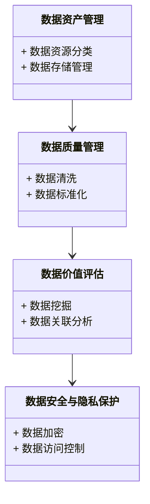

                 


# 如何评估企业的数据变现能力

> 关键词：数据变现能力评估, 数据资产, 数据价值, 数据安全, 数据质量, 数据变现模型

> 摘要：  
> 随着数字化转型的深入推进，数据已成为企业的重要资产，数据变现能力成为衡量企业竞争力的关键指标。本文将从数据变现能力的背景、核心概念、评估模型、算法原理、系统架构、项目实战到最佳实践等方面，全面解析如何科学评估企业的数据变现能力，为企业制定数据驱动的战略提供理论和实践指导。

---

## 第1章: 数据变现能力评估的背景与问题描述

### 1.1 数据驱动经济的时代背景

#### 1.1.1 数字化转型与数据价值的崛起
在数字化转型的浪潮中，数据已成为企业最重要的生产要素。企业通过数据的采集、分析和利用，能够挖掘新的商业模式和竞争优势。数据的实时性和准确性决定了其价值，数据驱动的决策正在改变企业的运营方式。

#### 1.1.2 数据作为企业核心资产的重要性
数据是企业的核心资产之一，数据的存储、处理和分析能力直接关系到企业的竞争力。数据资产化是企业数字化转型的关键步骤，数据的价值需要通过科学的方法进行评估和变现。

#### 1.1.3 数据变现对企业竞争力的影响
数据变现能力直接影响企业的收入和利润。通过有效的数据利用，企业可以优化业务流程、提升客户体验、创造新的收入来源。数据变现能力已经成为企业核心竞争力的重要组成部分。

### 1.2 数据变现能力的定义与外延

#### 1.2.1 数据变现能力的定义
数据变现能力是指企业将数据转化为经济价值的能力，包括数据的采集、处理、分析、应用和收益实现等多个环节。

#### 1.2.2 数据变现能力的核心要素
- 数据资产：企业的数据资源。
- 数据质量：数据的准确性、完整性、及时性。
- 数据价值：数据的商业价值。
- 数据安全：数据的保护和隐私合规。

#### 1.2.3 数据变现能力的边界与外延
数据变现能力的评估不仅涉及数据本身，还与企业的业务模式、技术能力、组织结构和市场环境密切相关。

### 1.3 数据变现能力评估的必要性

#### 1.3.1 企业数据资产的价值挖掘需求
企业需要通过数据变现能力评估，明确数据的商业价值，制定数据驱动的战略。

#### 1.3.2 数据变现能力对企业战略的影响
数据变现能力评估帮助企业识别数据优势，优化资源配置，提升数据驱动的决策能力。

#### 1.3.3 数据变现能力评估的行业应用价值
不同行业的企业在数据变现能力上存在差异，评估数据变现能力有助于行业间的对标和优化。

---

## 第2章: 数据变现能力评估的核心概念与联系

### 2.1 数据资产与数据价值的关系

#### 2.1.1 数据资产的定义与分类
- 数据资产是指企业拥有或控制的、能够为企业带来经济利益的数据资源。
- 数据资产可以分为结构化数据、非结构化数据和半结构化数据。

#### 2.1.2 数据价值的评估维度
- 数据的可用性：数据是否能够被有效利用。
- 数据的稀缺性：数据的独特性和市场价值。
- 数据的准确性：数据的可信度。

#### 2.1.3 数据资产与数据价值的关联
数据资产是数据价值的载体，数据价值是数据资产的变现目标。数据资产的质量和数量直接影响其价值。

### 2.2 数据安全与数据隐私的挑战

#### 2.2.1 数据安全对企业数据变现的影响
数据安全是数据变现的基础，数据泄露或滥用会严重损害企业的信誉和经济利益。

#### 2.2.2 数据隐私法规对数据变现的约束
随着《数据安全法》和《个人信息保护法》的实施，企业需要在数据利用和隐私保护之间找到平衡。

#### 2.2.3 数据安全与数据隐私的平衡策略
- 数据加密：保护数据的安全性。
- 数据匿名化：减少数据隐私风险。
- 数据访问控制：限制数据的使用权限。

### 2.3 数据质量与数据变现能力的关系

#### 2.3.1 数据质量的定义与评估指标
- 数据完整性：数据是否完整。
- 数据一致性：数据是否一致。
- 数据及时性：数据是否及时更新。

#### 2.3.2 数据质量对数据变现能力的影响
高质量的数据能够更好地支持业务决策和市场洞察，从而提升数据变现能力。

#### 2.3.3 提高数据质量的策略与方法
- 数据清洗：去除无效数据。
- 数据标准化：统一数据格式。
- 数据质量管理：建立数据质量监控机制。

---

## 第3章: 数据变现能力评估的核心模型与方法

### 3.1 数据变现能力评估模型的构建

#### 3.1.1 数据变现能力评估模型的构成要素
- 数据资产：企业的数据资源。
- 数据质量：数据的准确性和完整性。
- 数据价值：数据的商业价值。
- 数据安全：数据的保护和隐私合规。

#### 3.1.2 数据变现能力评估模型的设计思路
- 基于数据资产的分类，构建数据质量评估指标。
- 结合数据安全和隐私保护要求，设计数据价值评估模型。
- 综合数据质量、数据价值和数据安全评估结果，得出数据变现能力评分。

#### 3.1.3 数据变现能力评估模型的数学表达
数据变现能力评分公式：
$$
\text{数据变现能力评分} = \alpha \times \text{数据质量评分} + \beta \times \text{数据价值评分} + \gamma \times \text{数据安全评分}
$$
其中，$\alpha + \beta + \gamma = 1$，权重系数根据企业需求调整。

### 3.2 数据变现能力评估的算法原理

#### 3.2.1 数据质量评分算法
- 数据清洗算法：去除无效数据，提高数据的准确性和完整性。
- 数据标准化算法：统一数据格式，便于后续分析。

#### 3.2.2 数据价值评估算法
- 数据挖掘算法：利用机器学习技术提取数据中的有价值信息。
- 数据关联分析算法：识别数据之间的关联性，挖掘潜在价值。

#### 3.2.3 数据安全风险评估算法
- 数据加密算法：保护数据的安全性。
- 数据访问控制算法：限制数据的使用权限。

### 3.3 数据变现能力评估的流程与步骤

#### 3.3.1 数据采集与处理
- 数据采集：通过各种渠道获取数据。
- 数据清洗：去除无效数据，提高数据质量。

#### 3.3.2 数据质量评估
- 数据完整性检查：确保数据完整无缺失。
- 数据一致性检查：确保数据一致无矛盾。

#### 3.3.3 数据价值评估
- 数据挖掘：利用机器学习技术提取数据价值。
- 数据关联分析：识别数据之间的关联性。

#### 3.3.4 数据安全风险评估
- 数据加密：保护数据的安全性。
- 数据访问控制：限制数据的使用权限。

#### 3.3.5 综合评估与结果分析
- 综合评估：根据数据质量、数据价值和数据安全评分，得出数据变现能力评分。
- 结果分析：根据评分结果，制定数据优化策略。

---

## 第4章: 数据变现能力评估的系统分析与架构设计方案

### 4.1 问题场景介绍

#### 4.1.1 企业数据资源管理现状
- 数据分散：数据分布在不同的系统中，难以统一管理。
- 数据孤岛：数据无法共享和利用，造成资源浪费。

#### 4.1.2 数据变现能力评估的挑战
- 数据质量参差不齐：数据的准确性和完整性影响评估结果。
- 数据安全风险：数据泄露或滥用威胁企业的经济利益。

### 4.2 系统功能设计

#### 4.2.1 领域模型设计
- 数据资产管理：数据资源的分类、存储和管理。
- 数据质量管理：数据清洗、标准化和质量监控。
- 数据价值评估：数据挖掘、关联分析和价值评估。
- 数据安全与隐私保护：数据加密、访问控制和隐私合规。

#### 4.2.2 领域模型Mermaid类图


### 4.3 系统架构设计

#### 4.3.1 系统架构设计Mermaid架构图
```mermaid
architecturalDiagram
    客户端 --> 数据访问层
    数据访问层 --> 数据存储层
    数据处理层 --> 数据访问层
    数据分析层 --> 数据处理层
    数据安全层 --> 数据分析层
    数据存储层 --> 数据访问层
```

#### 4.3.2 系统接口设计
- 数据接口：数据的输入和输出接口。
- API接口：与其他系统交互的接口。

#### 4.3.3 系统交互设计
- 数据采集：通过数据接口获取数据。
- 数据处理：对数据进行清洗和标准化。
- 数据分析：利用数据分析算法提取数据价值。
- 数据安全：确保数据的安全性和隐私合规。

---

## 第5章: 数据变现能力评估的项目实战

### 5.1 环境安装与配置

#### 5.1.1 系统环境
- 操作系统：Linux/Windows
- 数据库：MySQL/PostgreSQL
- 开发工具：Python/Java/Go

#### 5.1.2 工具安装
- 数据处理工具：Python的pandas库
- 数据分析工具：Python的scikit-learn库
- 数据可视化工具：Matplotlib/Seaborn

### 5.2 核心代码实现

#### 5.2.1 数据清洗代码实现
```python
import pandas as pd

# 读取数据
data = pd.read_csv('input.csv')

# 删除缺失值
data.dropna(inplace=True)

# 去重
data.drop_duplicates(inplace=True)

# 保存清洗后的数据
data.to_csv('cleaned.csv', index=False)
```

#### 5.2.2 数据价值评估代码实现
```python
from sklearn.tree import DecisionTreeClassifier
from sklearn.metrics import accuracy_score

# 数据分割
X = data.drop('label', axis=1)
y = data['label']

# 模型训练
model = DecisionTreeClassifier()
model.fit(X, y)

# 模型预测
y_pred = model.predict(X)

# 模型评估
print(accuracy_score(y, y_pred))
```

### 5.3 代码应用解读与分析

#### 5.3.1 数据清洗代码解读
- 使用pandas库读取数据文件。
- 删除缺失值和重复数据，确保数据质量。
- 保存清洗后的数据文件。

#### 5.3.2 数据价值评估代码解读
- 使用决策树算法对数据进行分类。
- 训练模型并进行预测。
- 评估模型的准确率，得出数据价值评分。

### 5.4 实际案例分析

#### 5.4.1 案例背景
某电商企业希望通过数据变现能力评估，优化其会员营销策略。

#### 5.4.2 数据分析结果
- 数据质量评分：90分
- 数据价值评分：85分
- 数据安全评分：95分
- 数据变现能力评分：88分

### 5.5 项目小结

#### 5.5.1 项目实施过程总结
- 数据清洗和标准化：确保数据质量。
- 数据挖掘和关联分析：提取数据价值。
- 数据安全和隐私保护：确保数据安全。

#### 5.5.2 项目实施效果分析
- 数据清洗后，数据准确率提高。
- 数据挖掘分析帮助优化会员营销策略。
- 数据安全措施有效保护了企业数据。

---

## 第6章: 数据变现能力评估的最佳实践、小结、注意事项和拓展阅读

### 6.1 最佳实践

#### 6.1.1 数据资产的分类与管理
- 建立数据资产清单，明确数据的来源、用途和价值。
- 数据资产分类：结构化数据、非结构化数据和半结构化数据。

#### 6.1.2 数据安全与隐私保护
- 数据加密：保护数据的安全性。
- 数据匿名化：减少数据隐私风险。
- 数据访问控制：限制数据的使用权限。

#### 6.1.3 数据价值的挖掘与应用
- 数据挖掘：利用机器学习技术提取数据价值。
- 数据关联分析：识别数据之间的关联性。
- 数据可视化：通过图表直观展示数据价值。

### 6.2 小结

#### 6.2.1 数据变现能力评估的核心要点
- 数据资产：企业的数据资源。
- 数据质量：数据的准确性和完整性。
- 数据价值：数据的商业价值。
- 数据安全：数据的保护和隐私合规。

#### 6.2.2 数据变现能力评估的实施步骤
1. 数据采集与处理。
2. 数据质量评估。
3. 数据价值评估。
4. 数据安全风险评估。
5. 综合评估与结果分析。

### 6.3 注意事项

#### 6.3.1 数据隐私与合规
- 遵守数据隐私相关法律法规。
- 建立数据隐私保护机制。

#### 6.3.2 数据安全风险
- 数据加密：保护数据的安全性。
- 数据访问控制：限制数据的使用权限。

#### 6.3.3 数据质量控制
- 数据清洗：去除无效数据。
- 数据标准化：统一数据格式。

### 6.4 拓展阅读

#### 6.4.1 数据变现能力评估的经典文献
- 《Data Analytics Made Accessible: A Tutorial》
- 《Data Science for Business: What You Need to Know About Data Mining and Data-analytic Thinking》

#### 6.4.2 数据安全与隐私保护的推荐书籍
- 《Data Security and Privacy: A Comprehensive Guide》
- 《Privacy and Data Security Law: A Practical Guide》

---

## 作者

作者：AI天才研究院/AI Genius Institute & 禅与计算机程序设计艺术 /Zen And The Art of Computer Programming

