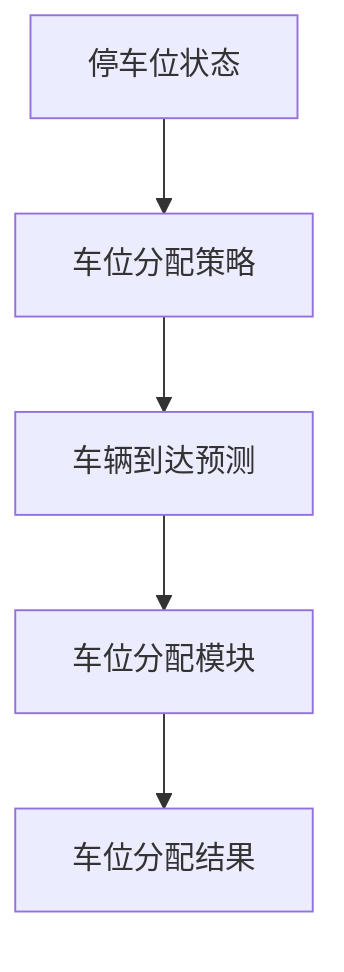
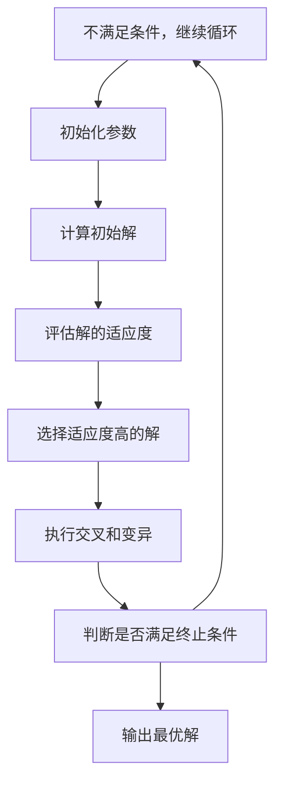
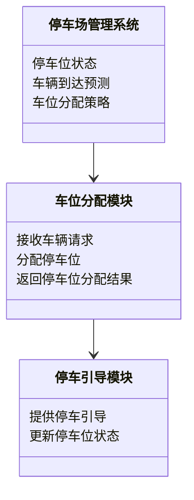
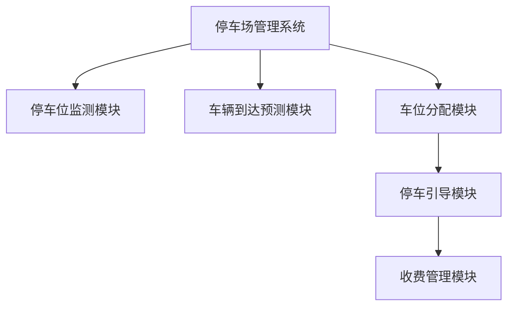
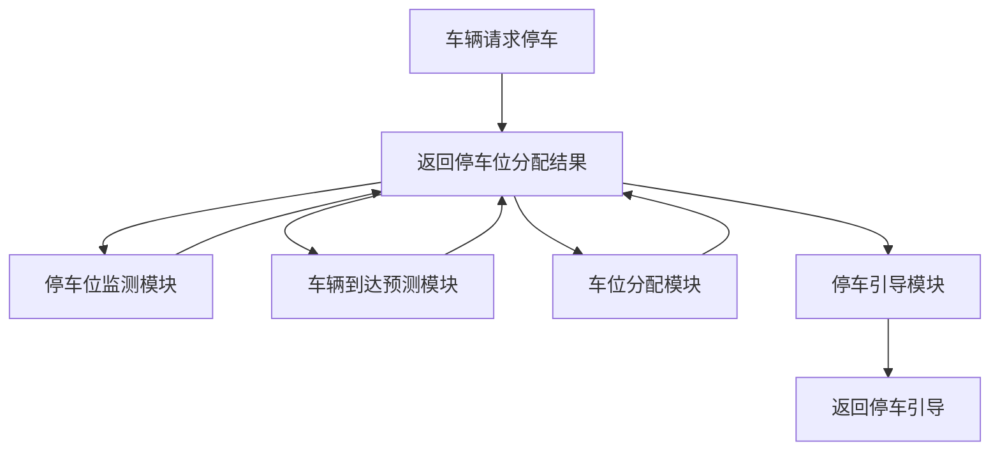

                 


# 智能停车系统：AI Agent的车位分配优化

## 关键词：智能停车系统，AI Agent，车位分配，优化算法，强化学习，遗传算法

## 摘要：  
智能停车系统是现代城市交通管理的重要组成部分，而车位分配优化是其核心问题之一。本文通过分析AI Agent在车位分配中的应用，探讨如何利用强化学习和遗传算法等技术实现车位分配的最优解。文章从问题背景、核心概念、算法原理、系统设计到项目实战，全面解析智能停车系统的实现过程，为读者提供理论与实践相结合的深度分析。

---

# 第1章: 智能停车系统背景与问题背景

## 1.1 智能停车系统概述
### 1.1.1 停车问题的背景与现状  
随着城市化进程的加快，停车位供需失衡问题日益严重。传统停车管理系统效率低下，难以满足现代城市的停车需求。智能停车系统通过引入AI技术，能够实现停车位的智能化分配与管理。

### 1.1.2 智能停车系统的定义与特点  
智能停车系统是一种基于人工智能技术的停车管理系统，其特点是实时感知停车位状态、优化车位分配策略、提高停车效率。其核心功能包括停车位实时监测、车位分配优化、停车引导、收费管理等。

### 1.1.3 智能停车系统的核心目标与价值  
智能停车系统的核心目标是最大化停车位利用率，减少车辆寻位时间，提升用户体验。其价值体现在提高停车效率、降低交通拥堵、节省能源消耗等方面。

## 1.2 车位分配优化问题的描述
### 1.2.1 车位分配问题的定义  
车位分配问题是将 arriving vehicles 分配到停车场中的停车位，使得停车场的利用率最大化，同时满足车辆的停车需求。

### 1.2.2 车位分配问题的复杂性与挑战  
车位分配问题涉及多个变量，如停车位数量、车辆到达时间、停车时长等。此外，停车场的动态变化和车辆需求的不确定性增加了问题的复杂性。

### 1.2.3 优化车位分配的必要性与意义  
优化车位分配能够提高停车场的使用效率，减少车辆的寻位时间，降低交通拥堵，提升整体停车体验。

## 1.3 AI Agent在车位分配中的作用
### 1.3.1 AI Agent的定义与特点  
AI Agent是一种能够感知环境、自主决策并执行任务的智能体。其特点包括自主性、反应性、目标导向性和学习能力。

### 1.3.2 AI Agent在智能停车系统中的应用场景  
AI Agent可以应用于停车位实时监测、车辆到达预测、车位分配优化、停车引导等多个场景。

### 1.3.3 AI Agent如何优化车位分配  
AI Agent通过实时感知停车位状态、预测车辆到达情况，动态调整车位分配策略，从而实现最优分配。

## 1.4 本章小结  
本章介绍了智能停车系统的背景、定义、特点及核心目标，分析了车位分配问题的复杂性与挑战，并探讨了AI Agent在车位分配中的作用。这些内容为后续章节的算法设计与系统实现奠定了基础。

---

# 第2章: 智能停车系统的核心概念与联系

## 2.1 AI Agent的核心原理
### 2.1.1 AI Agent的基本构成  
AI Agent由感知模块、推理模块、决策模块和执行模块组成。感知模块负责收集环境信息，推理模块负责分析信息，决策模块负责制定决策，执行模块负责执行决策。

### 2.1.2 AI Agent的决策机制  
AI Agent的决策机制包括基于规则的决策、基于知识的决策和基于学习的决策。其中，基于学习的决策是AI Agent的核心，通过强化学习等技术实现。

### 2.1.3 AI Agent的学习与优化能力  
AI Agent通过强化学习、遗传算法等技术实现自适应优化。强化学习通过奖励机制优化决策，遗传算法通过模拟自然选择优化解。

## 2.2 智能停车系统的概念结构
### 2.2.1 系统组成与核心要素  
智能停车系统由感知层、决策层和执行层组成。感知层负责收集停车位状态，决策层负责优化车位分配，执行层负责分配停车位。

### 2.2.2 系统功能模块划分  
智能停车系统的功能模块包括停车位监测模块、车辆到达预测模块、车位分配模块、停车引导模块和收费管理模块。

### 2.2.3 系统的边界与外延  
系统的边界包括停车场入口、出口和停车位区域。外延包括与交通管理系统、车辆导航系统的接口。

## 2.3 核心概念的属性特征对比
### 2.3.1 AI Agent与传统算法的对比  
AI Agent具有自主性和适应性，而传统算法依赖于固定的规则和参数。AI Agent能够动态调整策略，而传统算法需要人工干预。

### 2.3.2 智能停车系统与其他停车管理系统的对比  
智能停车系统通过AI技术实现动态优化，而传统停车管理系统依赖于静态规则。智能停车系统能够实时调整车位分配策略，而传统系统难以适应动态变化。

## 2.4 ER实体关系图


## 2.5 本章小结  
本章从AI Agent的核心原理出发，分析了智能停车系统的概念结构，探讨了其与其他技术的对比，并通过ER实体关系图展示了系统的组成关系。这些内容为后续章节的算法设计与系统实现提供了理论基础。

---

# 第3章: AI Agent车位分配算法原理

## 3.1 强化学习算法原理
### 3.1.1 强化学习的基本概念  
强化学习是一种通过试错方式学习策略的技术。学习过程包括状态、动作和奖励三个核心要素。

### 3.1.2 强化学习的核心要素：状态、动作、奖励  
- **状态**：停车位当前的使用情况。
- **动作**：将车辆分配到某个停车位。
- **奖励**：停车位分配的效率和用户体验。

### 3.1.3 强化学习在车位分配中的应用  
强化学习通过不断试错优化车位分配策略，提高停车位利用率和用户体验。

## 3.2 遗传算法原理
### 3.2.1 遗传算法的基本流程  
遗传算法包括编码、选择、交叉和变异四个步骤。编码将问题转化为可计算的形式，选择保留适应度高的解，交叉和变异生成新的解。

### 3.2.2 遗传算法在车位分配中的应用  
遗传算法通过模拟自然选择优化车位分配策略，提高停车位利用率。

### 3.2.3 遗传算法的优缺点  
- **优点**：能够全局优化。
- **缺点**：计算复杂度高，收敛速度慢。

## 3.3 算法选择与优化策略
### 3.3.1 算法选择的依据  
算法选择应考虑问题的复杂性、计算资源和时间约束。

### 3.3.2 算法优化的关键点  
- 优化算法的收敛速度。
- 提高算法的适应性。

### 3.3.3 组合算法的应用  
将强化学习和遗传算法结合，利用强化学习快速优化，遗传算法全局优化。

## 3.4 算法流程图


## 3.5 数学模型与公式
### 3.5.1 强化学习的数学模型  
强化学习的Q-learning算法如下：
$$ Q(s, a) = Q(s, a) + \alpha [r + \gamma \max Q(s', a') - Q(s, a)] $$

### 3.5.2 遗传算法的适应度函数  
适应度函数表示解的优劣：
$$ f(x) = \frac{\text{已分配停车位数}}{\text{总停车位数}} \times 100 $$

## 3.6 本章小结  
本章详细介绍了强化学习和遗传算法的基本原理及其在车位分配中的应用，分析了算法的优缺点，并提出了组合算法的应用策略。这些内容为后续章节的系统实现提供了算法基础。

---

# 第4章: 智能停车系统分析与架构设计

## 4.1 系统需求分析
### 4.1.1 功能需求  
停车位实时监测、车辆到达预测、车位分配优化、停车引导、收费管理。

### 4.1.2 性能需求  
高实时性、高准确性、高可靠性。

### 4.1.3 接口需求  
与停车场管理系统、车辆导航系统等接口的对接。

## 4.2 系统功能设计
### 4.2.1 领域模型类图


### 4.2.2 系统架构图


### 4.2.3 系统接口设计  
系统接口包括停车位状态接口、车辆到达预测接口、车位分配接口和停车引导接口。

### 4.2.4 系统交互序列图  


## 4.3 本章小结  
本章通过系统需求分析、功能设计和架构设计，详细阐述了智能停车系统的实现方案。系统架构图和交互序列图展示了系统的组成和工作流程。

---

# 第5章: 项目实战：智能停车系统实现

## 5.1 环境安装与配置
### 5.1.1 系统环境  
操作系统：Linux，Python 3.8以上，Jupyter Notebook。

### 5.1.2 工具安装  
安装Python库：numpy、pandas、scikit-learn、matplotlib。

## 5.2 系统核心实现
### 5.2.1 强化学习算法实现  
实现Q-learning算法，用于车位分配策略优化。

### 5.2.2 遗传算法实现  
实现遗传算法，用于全局优化车位分配。

### 5.2.3 系统核心代码  
```python
import numpy as np
import random

class QLearning:
    def __init__(self, states, actions, learning_rate=0.1, gamma=0.9):
        self.states = states
        self.actions = actions
        self.learning_rate = learning_rate
        self.gamma = gamma
        self.q_table = {s: {a: 0 for a in actions} for s in states}

    def choose_action(self, state, epsilon=0.1):
        if random.random() < epsilon:
            return random.choice(self.actions)
        else:
            return max(self.q_table[state], key=lambda k: self.q_table[state][k])

    def update_q_table(self, state, action, reward, next_state):
        self.q_table[state][action] = self.q_table[state][action] + self.learning_rate * (reward + self.gamma * max(self.q_table[next_state].values()) - self.q_table[state][action])

class GeneticAlgorithm:
    def __init__(self, population_size, fitness_function):
        self.population_size = population_size
        self.fitness_function = fitness_function
        self.population = []

    def initialize_population(self):
        for _ in range(self.population_size):
            self.population.append(random.choice([0, 1]))

    def calculate_fitness(self):
        for individual in self.population:
            self.fitness_function(individual)

    def select_parents(self):
        # 简单选择法
        self.population = sorted(self.population, reverse=True)

    def crossover(self):
        # 单点交叉
        for i in range(0, len(self.population), 2):
            parent1 = self.population[i]
            parent2 = self.population[i+1]
            crossover_point = random.randint(0, len(parent1))
            child1 = parent1[:crossover_point] + parent2[crossover_point:]
            child2 = parent2[:crossover_point] + parent1[crossover_point:]
            self.population[i] = child1
            self.population[i+1] = child2

    def mutate(self, mutation_rate=0.1):
        for i in range(len(self.population)):
            if random.random() < mutation_rate:
                self.population[i] = 1 - self.population[i]

    def evolve(self):
        self.select_parents()
        self.crossover()
        self.mutate()
```

### 5.2.4 算法实现解读  
强化学习算法通过不断试错优化车位分配策略，遗传算法通过模拟自然选择实现全局优化。两种算法结合能够实现高效的车位分配。

## 5.3 实际案例分析  
以一个小型停车场为例，分析系统如何通过AI Agent实现车位分配优化。

## 5.4 本章小结  
本章通过项目实战，详细讲解了智能停车系统的实现过程。从环境配置到算法实现，再到系统集成，为读者提供了完整的实现方案。

---

# 第6章: 总结与展望

## 6.1 核心知识点回顾  
本文从AI Agent的核心原理出发，分析了智能停车系统的实现过程，详细介绍了强化学习和遗传算法的应用。

## 6.2 最佳实践 tips  
- 系统设计时要考虑实时性和可靠性。
- 算法实现时要注意参数调优。

## 6.3 未来研究方向  
- 更高效的算法研究。
- 多停车场协同优化。
- 用户体验的进一步提升。

## 6.4 本章小结  
本文总结了智能停车系统的实现过程，并展望了未来的研究方向。AI Agent技术在车位分配中的应用前景广阔。

---

# 作者：AI天才研究院/AI Genius Institute & 禅与计算机程序设计艺术 /Zen And The Art of Computer Programming

