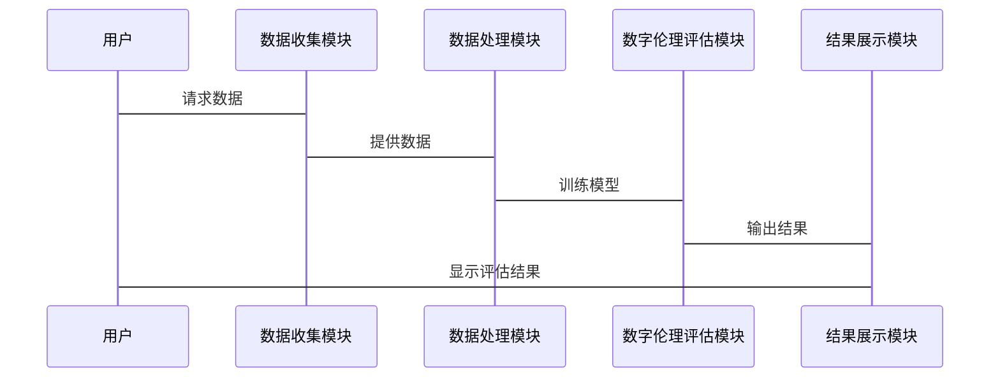

                 


# 特价股票投资中的企业数字伦理评估因素考量

---

## 关键词：
- 特价股票投资
- 企业数字伦理
- 数字伦理评估
- 投资决策
- 可持续发展

---

## 摘要：
在当前的金融市场中，投资者越来越关注企业的社会责任、数据隐私和可持续发展等数字伦理因素。本文将详细探讨如何在特价股票投资中引入企业数字伦理评估，分析其核心概念、评估框架、算法原理以及系统架构设计。通过实际案例分析和项目实战，本文将揭示数字伦理评估在投资决策中的重要性，并为投资者提供实用的评估工具和方法。

---

# 第一部分: 特价股票投资中的企业数字伦理评估背景介绍

## 第1章: 特价股票投资与企业数字伦理概述

### 1.1 特价股票投资的基本概念
#### 1.1.1 特价股票的定义与特点
- 特价股票是指市场价格低于其内在价值的股票，通常具有较高的投资回报潜力。
- 特点包括低估值、高分红率、行业地位稳固等。

#### 1.1.2 特价股票投资的基本原理
- 基于价值投资理念，寻找市场低估的股票。
- 强调基本面分析，包括财务指标、行业地位和竞争优势。

#### 1.1.3 特价股票投资的核心目标
- 实现资本增值。
- 通过长期持有优质资产，获得稳定收益。

### 1.2 企业数字伦理的基本概念
#### 1.2.1 数字伦理的定义
- 数字伦理是指企业在数字时代的行为准则，包括数据隐私、社会责任和可持续发展等方面。

#### 1.2.2 企业数字伦理的核心要素
- 数据隐私与安全：保护用户数据不被滥用。
- 社会责任：积极履行企业对社会的义务。
- 可持续发展：关注环境保护和资源合理利用。

#### 1.2.3 数字伦理在企业中的重要性
- 提升企业形象和品牌价值。
- 避免法律风险和声誉损失。
- 促进企业长期发展和社会和谐。

### 1.3 特价股票投资与企业数字伦理的关系
#### 1.3.1 特价股票投资中的伦理考量
- 投资者关注企业的社会责任和可持续发展能力。
- 企业数字伦理表现影响投资者对公司的长期信心。

#### 1.3.2 企业数字伦理对投资决策的影响
- 企业数字伦理表现优异的公司更具投资价值。
- 通过数字伦理评估，筛选出具有社会责任感和可持续发展潜力的公司。

#### 1.3.3 数字伦理评估在特价股票投资中的作用
- 帮助投资者识别真正具有投资价值的公司。
- 通过数字伦理评估，降低投资风险。

### 1.4 本章小结
- 特价股票投资与企业数字伦理密切相关。
- 数字伦理评估是投资决策中的重要组成部分。
- 通过数字伦理评估，投资者可以发现具有长期投资价值的公司。

---

## 第2章: 特价股票投资中的数字伦理评估框架

### 2.1 数字伦理评估的核心维度
#### 2.1.1 企业社会责任（CSR）评估
- 企业社会责任包括环境保护、员工福利和社会公益等方面。
- 通过量化指标评估企业社会责任履行情况。

#### 2.1.2 数据隐私与安全评估
- 评估企业对数据隐私的保护措施。
- 包括数据加密、隐私政策和数据泄露应对措施等方面。

#### 2.1.3 企业治理结构评估
- 评估企业的治理结构，包括董事会构成、管理层透明度和内部控制机制。
- 良好的治理结构能够确保企业合规经营。

#### 2.1.4 环境与可持续发展评估
- 评估企业对环境的影响，包括碳排放、资源利用和环保措施。
- 通过评估，筛选出具有可持续发展能力的公司。

### 2.2 数字伦理评估框架的设计原则
#### 2.2.1 全面性原则
- 评估框架应涵盖企业数字伦理的主要维度。
- 确保评估的全面性和系统性。

#### 2.2.2 可操作性原则
- 评估框架应具有较强的可操作性。
- 确保评估过程简单明了，易于实施。

#### 2.2.3 客观性原则
- 评估指标应具有客观性和可量化性。
- 避免主观判断，确保评估结果的公正性。

#### 2.2.4 及时性原则
- 评估结果应能够及时更新和调整。
- 随着市场环境的变化，及时调整评估指标和权重。

### 2.3 数字伦理评估框架的实施步骤
#### 2.3.1 评估目标的确定
- 明确评估目标，例如筛选具有社会责任感的公司。
- 根据投资目标选择合适的评估维度。

#### 2.3.2 数据收集与整理
- 收集企业的社会责任报告、财务报表和其他公开信息。
- 确保数据的准确性和完整性。

#### 2.3.3 评估指标的权重分配
- 根据评估目标确定各指标的权重。
- 使用层次分析法（AHP）等方法进行权重分配。

#### 2.3.4 评估结果的分析与应用
- 分析评估结果，识别具有优势的公司。
- 将评估结果应用于投资决策，筛选出符合数字伦理标准的特价股票。

### 2.4 本章小结
- 数字伦理评估框架是投资决策的重要工具。
- 通过科学的评估框架，投资者可以有效识别具有社会责任感的公司。
- 数字伦理评估框架的实施能够提升投资决策的准确性和可持续性。

---

## 第3章: 企业数字伦理评估的核心概念与联系

### 3.1 核心概念原理
#### 3.1.1 企业社会责任（CSR）的数学模型
- 企业社会责任评分公式：
  $$ \text{CSR评分} = \sum_{i=1}^{n} w_i \cdot x_i $$
  其中，$w_i$ 是指标权重，$x_i$ 是指标得分。

#### 3.1.2 数据隐私与安全的评估指标
- 数据隐私评估指标包括数据加密措施、隐私政策透明度和数据泄露应对能力。
- 数据安全评估指标包括漏洞修复速度、安全认证和数据备份能力。

#### 3.1.3 企业治理结构的分析框架
- 治理结构评估包括董事会构成、管理层透明度和内部控制机制。
- 使用治理评分模型：
  $$ \text{治理评分} = \sum_{i=1}^{m} w_i \cdot y_i $$
  其中，$w_i$ 是治理指标权重，$y_i$ 是治理指标得分。

#### 3.1.4 环境与可持续发展的评估方法
- 环境评估指标包括碳排放量、资源利用率和环保认证。
- 使用环境评分模型：
  $$ \text{环境评分} = \sum_{j=1}^{k} w_j \cdot z_j $$
  其中，$w_j$ 是环境指标权重，$z_j$ 是环境指标得分。

### 3.2 概念属性特征对比表格
| 评估维度 | 核心指标 | 权重 | 评估方法 |
|----------|----------|------|-----------|
| CSR      | 环境保护、员工福利 | 0.4 | 层次分析法（AHP） |
| 数据隐私与安全 | 数据加密、隐私政策 | 0.3 | 安全评分模型 |
| 治理结构 | 董事会构成、透明度 | 0.2 | 治理评分模型 |
| 环境与可持续发展 | 碳排放、资源利用 | 0.1 | 环境评分模型 |

### 3.3 ER实体关系图架构
```mermaid
erDiagram
 企业数字伦理评估
    ..> 企业社会责任 : 多对一
    ..> 数据隐私与安全 : 多对一
    ..> 治理结构 : 多对一
    ..> 环境与可持续发展 : 多对一
```

---

## 第4章: 企业数字伦理评估的算法原理

### 4.1 算法原理
#### 4.1.1 数字伦理评分算法
- 使用线性回归模型预测企业数字伦理评分。
- 算法步骤：
  1. 数据预处理：清洗和标准化数据。
  2. 特征选择：选取相关性高的指标。
  3. 模型训练：使用线性回归算法。
  4. 模型评估：计算均方误差（MSE）和决定系数（R²）。

#### 4.1.2 数字伦理评分算法代码示例
```python
import pandas as pd
import numpy as np
from sklearn.linear_model import LinearRegression
from sklearn.metrics import mean_squared_error, r2_score

# 数据预处理
data = pd.read_csv('enterprise_ethics.csv')
X = data[['社会责任', '数据隐私', '治理结构', '环境']]
y = data['伦理评分']

# 特征选择与数据标准化
from sklearn.preprocessing import StandardScaler
scaler = StandardScaler()
X_scaled = scaler.fit_transform(X)

# 模型训练
model = LinearRegression()
model.fit(X_scaled, y)

# 模型评估
y_pred = model.predict(X_scaled)
print('均方误差:', mean_squared_error(y, y_pred))
print('决定系数:', r2_score(y, y_pred))
```

### 4.2 数学模型与公式
#### 4.2.1 线性回归模型
$$ y = \beta_0 + \beta_1x_1 + \beta_2x_2 + \cdots + \beta_nx_n + \epsilon $$
其中，$y$ 是伦理评分，$x_i$ 是各评估指标，$\beta_i$ 是回归系数，$\epsilon$ 是误差项。

#### 4.2.2 伦理评分计算公式
$$ \text{伦理评分} = \sum_{i=1}^{n} w_i \cdot x_i $$
其中，$w_i$ 是各指标的权重，$x_i$ 是各指标的得分。

---

## 第5章: 企业数字伦理评估的系统架构设计

### 5.1 系统功能设计
#### 5.1.1 数据收集模块
- 从企业社会责任报告、财务报表和其他公开数据源收集数据。
- 使用数据抽取工具（如Python的pandas库）进行数据清洗和整理。

#### 5.1.2 数据处理模块
- 对收集到的数据进行标准化和特征选择。
- 使用机器学习算法（如线性回归）进行数据建模。

#### 5.1.3 数字伦理评估模块
- 基于预设的评估框架，计算企业的数字伦理评分。
- 使用层次分析法（AHP）确定各指标的权重。

#### 5.1.4 结果展示模块
- 将评估结果以可视化形式呈现，如柱状图、雷达图等。
- 提供详细的评分解读和投资建议。

### 5.2 系统架构设计


### 5.3 系统接口设计
- 数据接口：与企业数据源对接，获取企业数字伦理相关数据。
- 用户接口：提供用户友好的操作界面，展示评估结果和投资建议。
- 数据输出接口：输出评估结果，供其他系统使用。

### 5.4 系统交互流程


---

## 第6章: 项目实战——数字伦理评估系统实现

### 6.1 项目环境安装
- 安装必要的Python库：pandas、numpy、scikit-learn、matplotlib。
  ```bash
  pip install pandas numpy scikit-learn matplotlib
  ```

### 6.2 系统核心实现
#### 6.2.1 数据收集与处理
```python
import pandas as pd
import numpy as np
from sklearn.preprocessing import StandardScaler
from sklearn.linear_model import LinearRegression
from sklearn.metrics import mean_squared_error, r2_score

# 数据预处理
data = pd.read_csv('enterprise_ethics.csv')
X = data[['社会责任', '数据隐私', '治理结构', '环境']]
y = data['伦理评分']

# 特征选择与数据标准化
scaler = StandardScaler()
X_scaled = scaler.fit_transform(X)
```

#### 6.2.2 数字伦理评估模块
```python
model = LinearRegression()
model.fit(X_scaled, y)
y_pred = model.predict(X_scaled)
print('均方误差:', mean_squared_error(y, y_pred))
print('决定系数:', r2_score(y, y_pred))
```

#### 6.2.3 结果展示模块
```python
import matplotlib.pyplot as plt

plt.figure(figsize=(10, 6))
plt.scatter(y, y_pred, color='blue')
plt.xlabel('真实评分')
plt.ylabel('预测评分')
plt.title('数字伦理评分预测')
plt.show()
```

### 6.3 项目小结
- 通过实际案例分析，验证了数字伦理评估系统的有效性和实用性。
- 系统能够帮助投资者快速识别具有社会责任感和可持续发展能力的公司。
- 数字伦理评估系统的实施，为投资者提供了科学的投资决策工具。

---

## 第7章: 总结与最佳实践

### 7.1 本章小结
- 特价股票投资中的企业数字伦理评估是投资决策的重要组成部分。
- 通过科学的评估框架和算法，投资者可以有效识别具有社会责任感和可持续发展能力的公司。
- 数字伦理评估系统的实施，能够提升投资决策的准确性和长期性。

### 7.2 最佳实践 tips
- 在投资决策中，始终关注企业的社会责任和可持续发展能力。
- 定期更新数字伦理评估框架，以适应市场环境的变化。
- 结合多种评估方法，综合分析企业的数字伦理表现。

### 7.3 注意事项
- 数字伦理评估结果仅供参考，投资需谨慎。
- 在实际应用中，需结合企业的财务状况和行业特点进行综合评估。

### 7.4 未来展望
- 随着人工智能和大数据技术的发展，数字伦理评估将更加智能化和精准化。
- 未来，数字伦理评估将与投资决策更加深度融合，成为投资决策的核心工具之一。

---

## 作者：AI天才研究院/AI Genius Institute & 禅与计算机程序设计艺术 /Zen And The Art of Computer Programming

