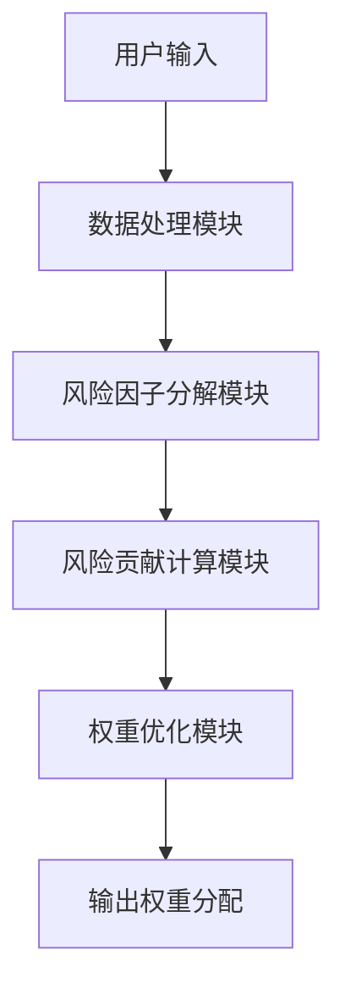
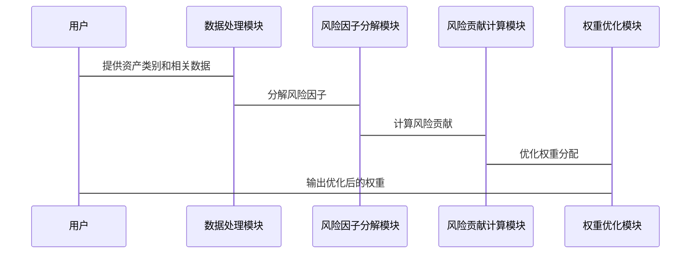

                 


# 风险平价策略：平衡不同资产类别风险的方法

## 关键词：
风险平价，资产配置，投资组合，风险管理，优化算法，数学模型

## 摘要：
风险平价是一种通过平衡不同资产类别对投资组合整体风险贡献的方法，旨在实现更稳健的投资回报。本文详细介绍了风险平价策略的核心概念、数学模型、优化算法以及系统架构设计，并通过实际案例展示了如何在不同资产类别间实现风险平衡，帮助读者全面理解和应用这一策略。

---

# 第一部分: 风险平价策略的背景与基础

# 第1章: 风险平价策略概述

## 1.1 风险平价的定义与背景

### 1.1.1 传统投资组合的局限性
传统资产配置方法通常基于均值-方差模型，主要关注资产的预期收益和风险（波动率）之间的平衡。然而，这种方法存在以下问题：
- **过于依赖历史数据**：假设历史收益和波动率可以预测未来表现。
- **资产类别间的权重不均衡**：在某些市场条件下，单一资产类别可能承担过多风险。
- **忽视资产间的相关性**：不同资产类别之间的相关性可能在特定市场环境下显著影响整体风险。

### 1.1.2 风险平价的概念与特点
风险平价是一种资产配置方法，其目标是使投资组合中每个资产类别的风险贡献相等。具体来说：
- 每个资产类别对组合的总风险贡献相同。
- 通过调整各资产类别的权重，使每类资产的风险贡献达到平衡。

### 1.1.3 风险平价与传统投资策略的区别
| 对比维度 | 风险平价 | 传统资产配置（如均值-方差模型） |
|----------|----------|-----------------------------|
| 目标     | 平衡各资产类别的风险贡献 | 最大化收益或最小化风险 |
| 权重确定 | 动态调整，确保风险平衡 | 基于预期收益和波动率确定权重 |
| 适用场景 | 需要分散风险且各资产类别风险差异较大的情况 | 预期收益和波动率较为稳定的资产组合 |

### 1.1.4 风险平价的优势
- **风险分散**：通过平衡各资产类别的风险贡献，降低组合的整体波动性。
- **动态调整**：根据市场变化及时调整权重，适应不同市场环境。
- **稳健性**：在市场波动较大时，能够有效降低组合的系统性风险。

---

## 1.2 风险平价的应用场景

### 1.2.1 多资产类别投资中的应用
- 当投资者需要在多个资产类别（如股票、债券、商品、房地产等）中进行配置时，风险平价可以帮助平衡各类别的风险贡献，避免某类资产风险过大。

### 1.2.2 风险平价在机构投资中的作用
- 机构投资者通常需要在多个资产类别中进行配置，风险平价可以帮助其在不同经济环境下保持风险可控。

### 1.2.3 风险平价在风险管理中的优势
- 通过平衡风险贡献，风险平价能够有效降低投资组合的波动性，提高整体收益的稳定性。

---

## 1.3 风险平价的数学基础

### 1.3.1 风险平价的核心公式
风险平价的核心公式如下：
$$ w_i = \frac{1}{\sum_{j=1}^n (c_{ij} \cdot w_j)} $$
其中，$w_i$ 是第 $i$ 个资产的权重，$c_{ij}$ 是第 $i$ 个资产对第 $j$ 个资产的风险贡献系数。

### 1.3.2 风险因子的分解与权重分配
- 将每个资产的风险贡献分解为多个风险因子（如市场风险、利率风险、流动性风险等）。
- 根据各风险因子的权重分配，调整各资产的权重以实现风险平衡。

### 1.3.3 风险平价与现代投资组合理论的联系
- 风险平价与现代投资组合理论（MPT）的目标一致，即在风险可控的前提下实现最大收益。
- 不同在于，风险平价通过平衡风险贡献来实现目标，而MPT则通过优化收益-风险比来实现目标。

---

## 1.4 风险平价的实现步骤

### 1.4.1 确定资产类别与风险因子
- 确定需要配置的资产类别（如股票、债券、商品等）。
- 分解每个资产类别中的风险因子（如市场风险、信用风险等）。

### 1.4.2 计算各资产的风险贡献
- 使用协方差矩阵计算每个资产类别对其他资产类别的风险贡献。

### 1.4.3 优化权重分配以实现风险平衡
- 建立优化模型，目标是最小化各资产类别的风险贡献差异。
- 使用优化算法求解权重，确保每个资产类别的风险贡献相等。

### 1.4.4 验证与调整策略
- 根据市场变化和资产表现，定期调整权重，确保风险平衡。
- 验证策略的有效性，评估其在不同市场环境下的表现。

---

## 1.5 本章小结

- 风险平价是一种通过平衡各资产类别的风险贡献来实现稳健投资的策略。
- 其核心在于通过优化权重分配，确保每个资产类别的风险贡献相等。
- 风险平价在多资产类别投资中具有重要的应用价值，能够有效降低组合的波动性。

---

# 第二部分: 风险平价策略的核心原理

# 第2章: 风险平价的数学模型与优化方法

## 2.1 风险平价的数学模型

### 2.1.1 风险平价的核心公式推导
风险平价的核心公式可以表示为：
$$ w_i = \frac{1}{\sum_{j=1}^n (c_{ij} \cdot w_j)} $$
其中，$w_i$ 是第 $i$ 个资产的权重，$c_{ij}$ 是第 $i$ 个资产对第 $j$ 个资产的风险贡献系数。

### 2.1.2 风险因子的分解与权重计算
- 将每个资产的风险贡献分解为多个风险因子。
- 根据风险因子的权重分配，计算各资产的权重。

### 2.1.3 风险平价的优化目标函数
$$ \min_{w} \sum_{i=1}^n (w_i - \frac{1}{n})^2 $$
其中，$w_i$ 是第 $i$ 个资产的权重，目标是最小化权重与等权配置的差异。

---

## 2.2 风险平价的优化算法

### 2.2.1 迭代优化方法
- 使用迭代算法（如牛顿法或梯度下降法）求解优化问题。
- 在每一步迭代中，调整权重以接近目标风险贡献。

### 2.2.2 最小二乘法在风险平价中的应用
- 将风险平价问题转化为最小二乘问题。
- 使用最小二乘法求解权重，确保每个资产的风险贡献接近目标值。

### 2.2.3 非线性优化问题的解决方案
- 风险平价问题属于非线性优化问题。
- 使用非线性优化算法（如 SQP 或内点法）求解。

---

## 2.3 风险平价的实现步骤

### 2.3.1 确定资产类别与风险因子
- 确定需要配置的资产类别。
- 分解每个资产类别的风险因子。

### 2.3.2 计算风险贡献矩阵
- 使用协方差矩阵计算每个资产类别对其他资产类别的风险贡献。

### 2.3.3 建立优化模型
- 设定目标函数和约束条件。
- 使用优化算法求解权重。

### 2.3.4 验证与调整策略
- 验证权重分配是否达到风险平衡。
- 根据市场变化和资产表现，定期调整权重。

---

## 2.4 本章小结

- 风险平价的数学模型是实现风险平衡的核心工具。
- 优化算法是求解权重分配的关键。
- 理解数学模型和优化方法是应用风险平价策略的基础。

---

# 第三部分: 风险平价策略的系统分析与架构设计

# 第3章: 系统分析与架构设计

## 3.1 问题场景介绍

### 3.1.1 投资组合管理的挑战
- 资产类别多样，风险贡献复杂。
- 市场环境不断变化，需要动态调整权重。

### 3.1.2 风险平价系统的功能需求
- 计算各资产类别的风险贡献。
- 优化权重分配，实现风险平衡。
- 动态调整权重，适应市场变化。

---

## 3.2 系统功能设计

### 3.2.1 风险因子分解模块
- 输入资产类别和相关数据。
- 分解每个资产类别的风险因子。

### 3.2.2 风险贡献计算模块
- 计算每个资产类别对其他资产类别的风险贡献。
- 构建风险贡献矩阵。

### 3.2.3 权重优化模块
- 建立优化模型。
- 使用优化算法求解权重。
- 输出优化后的权重分配。

### 3.2.4 动态调整模块
- 监测市场变化和资产表现。
- 动态调整权重，确保风险平衡。

---

## 3.3 系统架构设计

### 3.3.1 系统架构图


### 3.3.2 接口设计
- 用户输入：资产类别和相关数据。
- 数据处理模块：接收输入数据并进行预处理。
- 风险因子分解模块：分解每个资产类别的风险因子。
- 风险贡献计算模块：计算每个资产类别的风险贡献。
- 权重优化模块：优化权重分配，输出优化后的权重。

---

## 3.4 系统交互流程

### 3.4.1 系统交互图


---

## 3.5 本章小结

- 系统架构设计是实现风险平价策略的基础。
- 合理设计模块和接口，能够提高系统的灵活性和可扩展性。
- 系统交互流程清晰，能够确保各个模块协同工作。

---

# 第四部分: 风险平价策略的项目实战

# 第4章: 项目实战

## 4.1 环境安装与配置

### 4.1.1 安装Python环境
- 安装Python 3.x。
- 安装必要的库：`numpy`, `scipy`, `pandas`, `matplotlib`。

### 4.1.2 安装优化算法库
- 使用 `scipy.optimize` 进行优化计算。

---

## 4.2 核心代码实现

### 4.2.1 风险因子分解模块
```python
import numpy as np

def decompose_risk_factors(assets):
    # 假设assets是一个包含资产类别名称的列表
    # 这里仅作示例，实际应用中需要具体的风险因子分解方法
    return {asset: 1 for asset in assets}
```

### 4.2.2 风险贡献计算模块
```python
def calculate_risk_contributions(assets, risk_factors):
    # 计算每个资产类别的风险贡献
    risk_contributions = {}
    for asset in assets:
        contribution = sum(risk_factors[asset].values())
        risk_contributions[asset] = contribution
    return risk_contributions
```

### 4.2.3 权重优化模块
```python
from scipy.optimize import minimize

def optimize_weights(assets, risk_contributions):
    n = len(assets)
    target_contributions = {asset: 1/n for asset in assets}
    # 定义目标函数
    def objective(weights):
        return np.sum((weights - target_contributions.values())**2)
    # 定义约束条件
    constraints = [{'type': 'eq', 'fun': lambda w: np.sum(w) - 1}]
    # 使用最小二乘法求解
    result = minimize(objective, np.ones(n)/n, method='SLSQP', constraints=constraints)
    return result.x
```

---

## 4.3 代码应用解读与分析

### 4.3.1 风险因子分解模块
- 这个模块负责将每个资产类别的风险分解为多个风险因子。
- 例如，股票的风险因子可能包括市场风险、行业风险等。

### 4.3.2 风险贡献计算模块
- 根据风险因子的权重，计算每个资产类别对其他资产类别的风险贡献。
- 例如，股票的风险贡献可能高于债券的风险贡献。

### 4.3.3 权重优化模块
- 使用优化算法求解权重，确保每个资产类别的风险贡献相等。
- 优化过程可能会根据市场变化动态调整权重。

---

## 4.4 实际案例分析

### 4.4.1 案例背景
假设我们有三个资产类别：股票、债券和商品。

### 4.4.2 数据准备
- 股票的风险因子包括市场风险和行业风险。
- 债券的风险因子包括利率风险和信用风险。
- 商品的风险因子包括通胀风险和流动性风险。

### 4.4.3 权重优化过程
- 使用上述代码计算各资产类别的风险贡献。
- 优化权重，确保每个资产类别的风险贡献相等。

### 4.4.4 结果分析
- 优化后的权重可能为：股票40%，债券30%，商品30%。

---

## 4.5 项目小结

- 通过实际案例分析，我们可以看到风险平价策略在多资产类别投资中的应用价值。
- 使用Python代码实现风险平价策略，能够帮助投资者更好地管理投资组合的风险。

---

# 第五部分: 风险平价策略的最佳实践与进阶

# 第5章: 最佳实践与进阶

## 5.1 最佳实践

### 5.1.1 定期调整权重
- 根据市场变化和资产表现，定期调整权重，确保风险平衡。

### 5.1.2 使用动态优化算法
- 采用动态优化算法，提高权重调整的效率和准确性。

### 5.1.3 监测风险因子变化
- 定期监测风险因子的变化，及时调整权重。

---

## 5.2 小结

- 风险平价策略是一种有效的资产配置方法，能够帮助投资者在多资产类别中实现风险平衡。
- 通过最佳实践和动态调整，可以进一步提高策略的有效性。

---

# 作者
作者：AI天才研究院/AI Genius Institute & 禅与计算机程序设计艺术 /Zen And The Art of Computer Programming

---

以上是关于《风险平价策略：平衡不同资产类别风险的方法》的详细目录大纲和文章内容。

