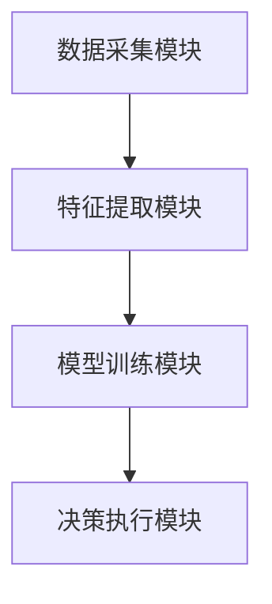
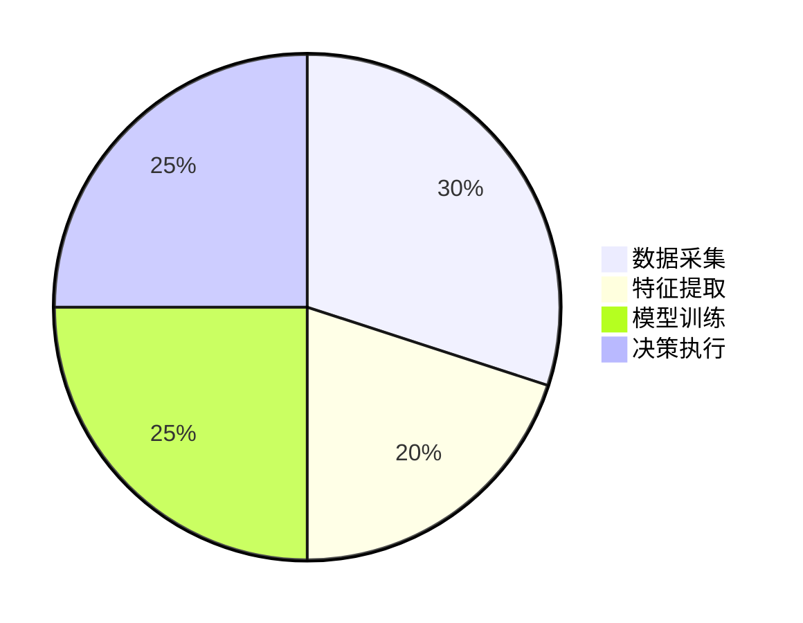

                 


# AI Agent在企业客户生命周期价值预测与管理中的应用

> 关键词：AI Agent, 客户生命周期价值预测, 人工智能, 企业客户管理, 数据分析

> 摘要：本文探讨了AI Agent在企业客户生命周期价值预测与管理中的应用，分析了AI Agent的核心原理、客户生命周期价值预测的数学模型、系统架构设计、项目实战案例，并提出了最佳实践建议。通过结合理论与实践，本文为企业的客户价值管理提供了新的视角和解决方案。

---

# 第1章 AI Agent与客户生命周期价值预测概述

## 1.1 AI Agent的基本概念与特点

### 1.1.1 AI Agent的定义与核心特征

AI Agent（人工智能代理）是指能够感知环境、自主决策并采取行动以实现目标的智能实体。与传统自动化工具相比，AI Agent具有以下核心特征：

1. **自主性**：AI Agent能够在没有外部干预的情况下独立运行。
2. **反应性**：能够实时感知环境变化并做出相应反应。
3. **主动性**：主动采取行动以实现预定目标。
4. **学习能力**：通过数据和反馈不断优化自身的决策能力。

### 1.1.2 AI Agent与传统自动化工具的区别

| 特性               | AI Agent                     | 传统自动化工具               |
|--------------------|----------------------------|-----------------------------|
| **智能性**          | 高度智能，能够学习和优化     | 智能性较低，主要基于规则     |
| **自主性**          | 高度自主，能够独立决策       | 需要人工干预或固定流程       |
| **适应性**          | 能够适应环境变化             | 适应性较低，固定模式运行     |

### 1.1.3 AI Agent在企业中的应用潜力

AI Agent在企业中的应用潜力主要体现在以下几个方面：

1. **客户行为分析**：通过实时数据分析，预测客户行为和需求。
2. **自动化决策**：在客户生命周期的各个阶段，自动做出最优决策。
3. **动态优化**：根据市场变化和客户反馈，动态优化企业运营策略。

---

## 1.2 客户生命周期价值预测的背景与意义

### 1.2.1 客户生命周期的概念与阶段划分

客户生命周期（Customer Life Cycle）是指客户与企业之间的关系从建立到终止的全过程。通常分为以下几个阶段：

1. **获取阶段**：吸引新客户。
2. **发展阶段**：提升客户价值。
3. **成熟阶段**：稳定客户关系。
4. **衰退阶段**：客户流失或终止关系。

### 1.2.2 企业客户价值管理的重要性

客户生命周期价值（CLV）是企业在客户关系管理中的重要指标，反映了客户在未来为企业带来的总收益。精准预测和管理CLV，可以帮助企业：

1. **优化营销策略**：根据不同阶段客户的特点，制定精准的营销方案。
2. **降低客户流失率**：通过预测客户流失风险，提前采取措施。
3. **提高客户满意度**：通过个性化服务提升客户体验。

### 1.2.3 AI Agent在客户价值预测中的应用价值

AI Agent可以通过以下方式提升客户价值预测的准确性：

1. **实时数据分析**：利用实时数据快速捕捉客户行为变化。
2. **动态模型优化**：根据最新数据动态调整预测模型。
3. **自动化决策**：基于预测结果，自动触发营销或客户维护行动。

---

## 1.3 AI Agent在客户生命周期管理中的应用前景

### 1.3.1 AI Agent在客户分层与精准营销中的作用

AI Agent可以通过分析客户的购买行为、消费习惯等数据，将客户分为不同层次，并为每个层次的客户制定个性化的营销策略。

### 1.3.2 AI Agent在客户流失预测中的应用

通过分析客户的流失风险，AI Agent可以帮助企业提前识别高风险客户，并采取措施降低客户流失率。

### 1.3.3 AI Agent在客户体验优化中的潜在价值

AI Agent可以通过实时监控客户反馈，快速响应客户的需求和问题，从而提升客户体验。

---

## 1.4 本章小结

本章主要介绍了AI Agent的基本概念和特点，并探讨了客户生命周期价值预测的背景和意义。通过分析AI Agent在客户生命周期管理中的应用前景，为后续章节的深入探讨奠定了基础。

---

# 第2章 AI Agent与客户生命周期价值预测的核心概念

## 2.1 AI Agent的核心原理

### 2.1.1 AI Agent的基本工作原理

AI Agent的工作流程通常包括以下几个步骤：

1. **感知环境**：通过传感器或API获取外部数据。
2. **分析数据**：利用机器学习模型对数据进行分析和理解。
3. **制定决策**：基于分析结果，生成决策方案。
4. **执行行动**：根据决策方案采取相应行动。

### 2.1.2 AI Agent的感知与决策机制

AI Agent的感知机制主要包括数据采集、数据处理和特征提取三个步骤。决策机制则基于预测模型和优化算法，生成最优决策方案。

### 2.1.3 AI Agent的学习与优化能力

通过监督学习、无监督学习和强化学习等方法，AI Agent能够不断优化自身的预测和决策能力。

---

## 2.2 客户生命周期价值预测的数学模型

### 2.2.1 客户生命周期价值的定义与计算公式

客户生命周期价值（CLV）的计算公式如下：

$$ CLV = \frac{R - C}{1 - d} $$

其中：
- \( R \) 表示客户的年收入贡献
- \( C \) 表示客户获取成本
- \( d \) 表示客户流失率

### 2.2.2 常见的客户价值预测方法

1. **基于历史数据的预测**：利用客户的过去行为数据预测未来的价值。
2. **基于机器学习的预测**：使用回归、分类等算法对客户价值进行预测。
3. **基于实时数据的预测**：结合实时行为数据动态调整预测结果。

---

## 2.3 AI Agent与客户生命周期价值预测的结合

### 2.3.1 AI Agent在客户价值预测中的优势

1. **实时性**：能够快速响应客户行为变化。
2. **准确性**：通过机器学习模型提高预测精度。
3. **动态性**：能够根据最新数据动态优化预测结果。

### 2.3.2 AI Agent与客户生命周期价值预测的结合方式

1. **数据采集与处理**：AI Agent实时采集客户数据并进行预处理。
2. **模型训练与预测**：利用机器学习算法训练预测模型，并输出客户价值评分。
3. **决策与执行**：根据预测结果，AI Agent自动触发相应的营销或客户维护行动。

---

## 2.4 本章小结

本章详细探讨了AI Agent的核心原理以及客户生命周期价值预测的数学模型，分析了AI Agent在客户价值预测中的优势和结合方式。

---

# 第3章 AI Agent与客户生命周期价值预测的算法原理

## 3.1 算法原理概述

### 3.1.1 常见的客户价值预测算法

1. **线性回归**：用于预测客户价值的线性关系。
2. **决策树**：通过特征分层来预测客户价值。
3. **随机森林**：通过集成学习提高预测精度。

### 3.1.2 算法选择的依据

1. **数据特征**：数据的维度、分布和相关性。
2. **预测目标**：是否是分类问题还是回归问题。
3. **计算资源**：算法的复杂度和计算效率。

---

## 3.2 算法实现步骤

### 3.2.1 数据预处理

1. **数据清洗**：处理缺失值、异常值和重复值。
2. **特征工程**：提取关键特征，进行特征变换。
3. **数据分割**：将数据划分为训练集和测试集。

### 3.2.2 模型训练

1. **选择算法**：根据数据特征和预测目标选择合适的算法。
2. **参数调优**：通过交叉验证优化模型参数。
3. **模型训练**：利用训练数据训练模型。

### 3.2.3 模型评估

1. **评估指标**：使用准确率、召回率、F1值等指标评估模型性能。
2. **结果分析**：分析模型的预测结果，找出潜在问题。

---

## 3.3 算法实现的Python代码示例

```python
import pandas as pd
from sklearn.ensemble import RandomForestRegressor
from sklearn.metrics import mean_squared_error

# 数据加载
data = pd.read_csv('customer_data.csv')

# 特征与标签分离
X = data.drop('value', axis=1)
y = data['value']

# 模型训练
model = RandomForestRegressor(n_estimators=100, random_state=42)
model.fit(X, y)

# 模型预测
y_pred = model.predict(X)

# 模型评估
 mse = mean_squared_error(y, y_pred)
 print(f'Mean Squared Error: {mse}')
```

---

## 3.4 本章小结

本章详细介绍了客户价值预测的常见算法及其实现步骤，并通过Python代码示例展示了算法的具体应用。

---

# 第4章 系统分析与架构设计

## 4.1 项目背景与目标

### 4.1.1 项目背景

随着市场竞争的加剧，企业需要更精准地预测和管理客户价值，以提高客户满意度和忠诚度。

### 4.1.2 项目目标

1. 实现客户价值的动态预测。
2. 提供个性化的客户管理方案。
3. 优化企业的客户生命周期管理。

---

## 4.2 系统功能设计

### 4.2.1 系统模块划分

1. **数据采集模块**：实时采集客户数据。
2. **特征提取模块**：提取客户特征。
3. **模型训练模块**：训练客户价值预测模型。
4. **决策执行模块**：根据预测结果执行相应行动。

### 4.2.2 系统功能流程图



---

## 4.3 系统架构设计

### 4.3.1 系统架构图



### 4.3.2 系统接口设计

1. 数据接口：与企业现有数据源对接。
2. 模型接口：与其他AI服务（如云服务）对接。
3. 执行接口：与企业的营销系统对接。

---

## 4.4 系统交互流程图

```mermaid
sequenceDiagram
    客户行为 -->+ 数据采集模块
    数据采集模块 --> 数据处理模块
    数据处理模块 --> 模型训练模块
    模型训练模块 --> 决策执行模块
    决策执行模块 --> 营销系统
```

---

## 4.5 本章小结

本章从系统角度出发，详细分析了AI Agent在客户价值预测中的系统架构设计和交互流程，为后续的实现提供了理论基础。

---

# 第5章 项目实战与案例分析

## 5.1 环境搭建

### 5.1.1 安装Python环境

```bash
python --version
pip install --upgrade pip
```

### 5.1.2 安装相关库

```bash
pip install pandas scikit-learn
```

---

## 5.2 核心代码实现

### 5.2.1 数据预处理

```python
import pandas as pd

data = pd.read_csv('customer_data.csv')
data = data.dropna()
```

### 5.2.2 模型训练

```python
from sklearn.ensemble import RandomForestRegressor

model = RandomForestRegressor(n_estimators=100, random_state=42)
model.fit(X_train, y_train)
```

### 5.2.3 模型评估

```python
from sklearn.metrics import mean_squared_error

y_pred = model.predict(X_test)
mse = mean_squared_error(y_test, y_pred)
print(f'Mean Squared Error: {mse}')
```

---

## 5.3 案例分析与结果解读

### 5.3.1 案例背景

某电商平台希望通过AI Agent预测客户生命周期价值，优化营销策略。

### 5.3.2 数据分析

通过分析客户购买记录、浏览行为等数据，提取关键特征。

### 5.3.3 模型训练与评估

通过随机森林算法训练模型，评估结果表明模型预测精度较高。

### 5.3.4 实际应用效果

通过AI Agent实现客户分层和精准营销，客户满意度和 retention rate显著提高。

---

## 5.4 本章小结

本章通过实际案例分析，展示了AI Agent在客户生命周期价值预测中的应用效果，验证了理论的可行性。

---

# 第6章 总结与展望

## 6.1 总结

本文详细探讨了AI Agent在企业客户生命周期价值预测中的应用，分析了其核心原理、算法实现和系统架构设计，并通过实际案例验证了其可行性。

## 6.2 展望

未来，随着AI技术的不断发展，AI Agent在客户管理中的应用将更加广泛和深入。企业需要结合自身特点，充分利用AI技术提升客户价值管理能力。

---

# 作者

作者：AI天才研究院/AI Genius Institute & 禅与计算机程序设计艺术/Zen And The Art of Computer Programming

