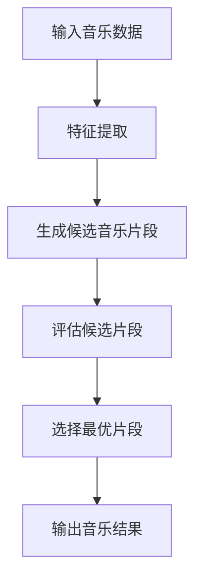

                 


# AI Agent在智能音乐创作中的应用

> 关键词：AI Agent，智能音乐创作，机器学习，生成模型，音乐生成，音乐创作工具  
> 摘要：本文深入探讨AI Agent在智能音乐创作中的应用，分析其核心概念、算法原理和实际应用场景。通过对比分析和案例研究，揭示AI Agent在音乐创作中的潜力和挑战，为音乐创作者和技术开发者提供新的视角和思路。

---

# 第一部分: AI Agent在智能音乐创作中的背景与概念

# 第1章: AI Agent与智能音乐创作的背景

## 1.1 AI Agent的基本概念

### 1.1.1 人工智能代理的定义
AI Agent（人工智能代理）是指具有感知环境、理解任务目标、执行操作并能够与用户或系统交互的智能实体。它能够通过算法和数据，自主完成特定任务或提供决策支持。

在音乐创作领域，AI Agent可以理解为一种智能化的创作工具，能够根据输入的音乐风格、主题或用户需求，生成符合要求的音乐作品或提供创作建议。

### 1.1.2 AI Agent的核心特征
AI Agent在音乐创作中的核心特征包括：
- **自主性**：能够独立完成任务，无需人工干预。
- **智能性**：通过机器学习算法，理解音乐的结构、情感和风格。
- **交互性**：能够与用户或系统进行实时交互，根据反馈调整输出。
- **适应性**：能够根据不同的创作需求和环境进行自适应优化。

### 1.1.3 AI Agent与传统音乐创作的结合
AI Agent的引入为传统音乐创作带来了新的可能性。它不仅能够辅助音乐人快速生成灵感，还能够通过分析海量音乐数据，挖掘新的音乐风格和创作思路。AI Agent的加入，使得音乐创作从单纯的“人类创作”向“人机协作”转变。

## 1.2 智能音乐创作的现状

### 1.2.1 音乐创作的数字化转型
随着计算机技术的发展，音乐创作逐渐从传统的纸笔创作向数字化创作转变。音乐软件、MIDI设备和数字音频工作站（DAW）的普及，使得音乐创作更加高效和便捷。然而，传统工具仍然依赖于人类的创造力和经验，无法实现真正的智能化。

### 1.2.2 AI在音乐创作中的应用现状
目前，AI在音乐创作中的应用主要集中在以下几个方面：
- **音乐生成**：基于深度学习的模型生成音乐片段。
- **风格迁移**：将一种音乐风格转换为另一种风格。
- **和声生成**：根据旋律生成对应的和声。
- **歌词创作**：通过自然语言处理生成歌词。

然而，这些应用多基于单点任务，缺乏整体性和系统性。AI Agent的出现，为音乐创作提供了一个更全面的解决方案。

### 1.2.3 AI Agent在音乐创作中的独特价值
AI Agent的核心价值在于其智能化和系统化的创作能力。它能够将音乐创作的各个阶段（如灵感生成、结构设计、风格选择）整合在一起，形成一个完整的创作流程。此外，AI Agent还能够通过实时交互，帮助音乐人快速调整创作方向，提升创作效率。

## 1.3 本章小结
本章从AI Agent的基本概念出发，探讨了其在音乐创作中的应用背景和价值。通过对比传统音乐创作和AI驱动的创作方式，我们看到AI Agent在音乐创作中的潜力和重要性。

---

# 第二部分: AI Agent的核心概念与原理

# 第2章: AI Agent的结构与功能

## 2.1 AI Agent的结构分析

### 2.1.1 输入模块
AI Agent的输入模块负责接收用户的需求、音乐风格、创作主题等输入信息。这些信息可以是文本描述、旋律片段或情感标签。

### 2.1.2 处理模块
处理模块是AI Agent的核心部分，负责分析输入信息并生成音乐内容。这一模块通常包括以下几个子模块：
- **特征提取**：提取输入信息中的关键特征（如情感、风格、节奏）。
- **生成模型**：基于特征生成音乐片段。
- **评估模块**：对生成的音乐片段进行评估，确保其符合创作目标。

### 2.1.3 输出模块
输出模块将生成的音乐内容以某种形式呈现给用户。这可以是MIDI文件、音频文件或可视化界面。

## 2.2 AI Agent的功能特点

### 2.2.1 数据分析能力
AI Agent能够分析海量音乐数据，提取音乐风格、情感倾向等信息，为创作提供数据支持。

### 2.2.2 内容生成能力
通过深度学习模型，AI Agent能够生成高质量的音乐片段，包括旋律、和声和编曲。

### 2.2.3 互动反馈能力
AI Agent能够与用户进行实时交互，根据用户的反馈调整生成内容，实现人机协作。

## 2.3 AI Agent与音乐创作的关系

### 2.3.1 AI Agent作为创作工具
AI Agent可以作为音乐创作的辅助工具，帮助音乐人快速生成灵感和素材。

### 2.3.2 AI Agent作为创作辅助者
在创作过程中，AI Agent可以扮演“创作助手”的角色，为用户提供多种创作可能性。

### 2.3.3 AI Agent作为创作主体的争议
目前，AI Agent作为创作主体的地位尚未明确。从法律和伦理角度来看，AI生成的音乐作品的版权归属仍是一个亟待解决的问题。

## 2.4 核心概念对比分析

### 2.4.1 AI Agent与传统音乐软件的对比
| 对比维度 | AI Agent | 传统音乐软件 |
|----------|-----------|--------------|
| 功能     | 自主生成音乐内容 | 提供工具支持创作 |
| 智能性   | 具备学习和推理能力 | 依赖人工操作 |
| 创作效率 | 高          | 中等          |

### 2.4.2 AI Agent与音乐生成模型的对比
| 对比维度 | AI Agent | 音乐生成模型 |
|----------|-----------|---------------|
| 功能     | 整体创作流程 | 单点任务生成 |
| 智能性   | 具备系统性 | 专注于特定任务 |
| 适应性   | 高         | 较低          |

### 2.4.3 AI Agent与音乐智能助手的对比
| 对比维度 | AI Agent | 音乐智能助手 |
|----------|-----------|---------------|
| 功能     | 系统化创作 | 辅助性工具    |
| 交互性   | 高         | 中等          |
| 独创性   | 高         | 较低          |

## 2.5 本章小结
本章从结构和功能两个方面，详细分析了AI Agent的核心概念。通过对AI Agent与其他技术的对比，我们看到了其在音乐创作中的独特价值和潜力。

---

# 第三部分: AI Agent的算法原理与数学模型

# 第3章: AI Agent的算法原理

## 3.1 基于概率的音乐生成模型

### 3.1.1 马尔可夫链模型
马尔可夫链模型是一种基于概率的音乐生成方法。它通过分析音乐序列中的状态转移概率，生成新的音乐片段。

#### 示例代码
```python
import numpy as np
from collections import defaultdict

# 定义状态转移矩阵
states = ['C', 'D', 'E', 'F', 'G', 'A', 'B']
transition_matrix = np.array([[0.2, 0.3, 0.1, 0.1, 0.1, 0.1, 0.1],
                              [0.1, 0.2, 0.3, 0.1, 0.1, 0.1, 0.1],
                              [0.1, 0.1, 0.2, 0.3, 0.1, 0.1, 0.1],
                              [0.1, 0.1, 0.1, 0.2, 0.3, 0.1, 0.1],
                              [0.1, 0.1, 0.1, 0.1, 0.2, 0.3, 0.1],
                              [0.1, 0.1, 0.1, 0.1, 0.1, 0.2, 0.3],
                              [0.1, 0.1, 0.1, 0.1, 0.1, 0.1, 0.3]])

# 音乐生成函数
def generate_music(n_notes, transition_matrix):
    current_note = 'C'
    music = [current_note]
    for _ in range(n_notes - 1):
        # 根据当前状态选择下一个状态
        next_note = np.random.choice(states, p=transition_matrix[states.index(current_note)])
        music.append(next_note)
        current_note = next_note
    return music

# 生成音乐片段
music = generate_music(10, transition_matrix)
print(music)
```

### 3.1.2 贝叶斯网络模型
贝叶斯网络模型通过构建概率图模型，分析音乐中的条件概率关系，生成符合概率分布的音乐片段。

#### 示例代码
```python
import numpy as np
import pandas as pd
from sklearn.naive_bayes import MultinomialNB

# 数据准备
X = np.array([[1, 0, 0, 0, 0],
              [0, 1, 0, 0, 0],
              [0, 0, 1, 0, 0],
              [0, 0, 0, 1, 0],
              [0, 0, 0, 0, 1]])

y = np.array(['C', 'D', 'E', 'F', 'G'])

# 训练模型
model = MultinomialNB()
model.fit(X, y)

# 生成音乐片段
def generate_music(n_notes, model):
    current_note = np.random.choice(['C', 'D', 'E', 'F', 'G'])
    music = [current_note]
    for _ in range(n_notes - 1):
        # 生成下一个状态的特征向量
        feature = np.zeros(5)
        feature[ord(current_note) - ord('C')] = 1
        # 预测下一个状态
        next_note = model.predict([feature])[0]
        music.append(next_note)
        current_note = next_note
    return music

# 生成音乐片段
music = generate_music(10, model)
print(music)
```

### 3.1.3 随机游走模型
随机游走模型是一种基于随机性的音乐生成方法，通过随机选择音符生成音乐片段。

#### 示例代码
```python
import random

notes = ['C', 'D', 'E', 'F', 'G', 'A', 'B']

def generate_music(n_notes):
    current_note = 'C'
    music = [current_note]
    for _ in range(n_notes - 1):
        next_note = random.choice(notes)
        music.append(next_note)
    return music

music = generate_music(10)
print(music)
```

## 3.2 基于深度学习的生成模型

### 3.2.1 变量自回归模型
变量自回归模型（Autoregressive Model）是一种基于深度学习的生成模型，通过自回归的方式生成音乐序列。

#### 示例代码
```python
import torch
import torch.nn as nn

class ARModel(nn.Module):
    def __init__(self, input_size, hidden_size, output_size):
        super(ARModel, self).__init__()
        self.lstm = nn.LSTM(input_size, hidden_size, batch_first=True)
        self.fc = nn.Linear(hidden_size, output_size)
    
    def forward(self, x):
        out, _ = self.lstm(x)
        out = self.fc(out[:, -1, :])
        return out

# 初始化模型
input_size = 7  # 音符总数
hidden_size = 64
output_size = 7
model = ARModel(input_size, hidden_size, output_size)

# 生成音乐片段
def generate_music(model, n_notes):
    current_note = torch.zeros(1, 1, input_size)
    current_note[0, 0, ord('C') - ord('C')] = 1
    music = ['C']
    for _ in range(n_notes - 1):
        output = model(current_note)
        prob = torch.softmax(output, dim=1)
        next_note_idx = torch.multinomial(prob, 1).item()
        next_note = notes[next_note_idx]
        music.append(next_note)
        current_note = torch.zeros(1, 1, input_size)
        current_note[0, 0, next_note_idx] = 1
    return music

music = generate_music(model, 10)
print(music)
```

### 3.2.2 变量自回归解码器模型
变量自回归解码器模型（Autoregressive Decoder Model）通过解码器结构生成音乐序列。

#### 示例代码
```python
import torch
import torch.nn as nn

class ARDecoder(nn.Module):
    def __init__(self, input_size, hidden_size, output_size):
        super(ARDecoder, self).__init__()
        self.lstm = nn.LSTM(input_size, hidden_size, batch_first=True)
        self.fc = nn.Linear(hidden_size, output_size)
    
    def forward(self, x):
        out, _ = self.lstm(x)
        out = self.fc(out[:, -1, :])
        return out

# 初始化模型
input_size = 7
hidden_size = 64
output_size = 7
model = ARDecoder(input_size, hidden_size, output_size)

# 生成音乐片段
def generate_music(model, n_notes):
    current_note = torch.zeros(1, 1, input_size)
    current_note[0, 0, ord('C') - ord('C')] = 1
    music = ['C']
    for _ in range(n_notes - 1):
        output = model(current_note)
        prob = torch.softmax(output, dim=1)
        next_note_idx = torch.multinomial(prob, 1).item()
        next_note = notes[next_note_idx]
        music.append(next_note)
        current_note = torch.zeros(1, 1, input_size)
        current_note[0, 0, next_note_idx] = 1
    return music

music = generate_music(model, 10)
print(music)
```

### 3.2.3 基于Transformer的音乐生成模型
基于Transformer的音乐生成模型通过自注意力机制，捕捉音乐序列中的全局关系。

#### 示例代码
```python
import torch
import torch.nn as nn

class TransformerModel(nn.Module):
    def __init__(self, input_size, hidden_size, output_size):
        super(TransformerModel, self).__init__()
        self.embedding = nn.Embedding(input_size, hidden_size)
        self.transformer = nn.Transformer(hidden_size, hidden_size, num_encoder_layers=2)
        self.fc = nn.Linear(hidden_size, output_size)
    
    def forward(self, x):
        embedded = self.embedding(x)
        out = self.transformer(embedded)
        out = self.fc(out)
        return out

# 初始化模型
input_size = 7
hidden_size = 64
output_size = 7
model = TransformerModel(input_size, hidden_size, output_size)

# 生成音乐片段
def generate_music(model, n_notes):
    current_note = torch.tensor([[ord('C') - ord('C')]], dtype=torch.long)
    music = ['C']
    for _ in range(n_notes - 1):
        output = model(current_note)
        prob = torch.softmax(output, dim=1)
        next_note_idx = torch.multinomial(prob, 1).item()
        next_note = notes[next_note_idx]
        music.append(next_note)
        current_note = torch.tensor([[next_note_idx]], dtype=torch.long)
    return music

music = generate_music(model, 10)
print(music)
```

## 3.3 基于强化学习的生成模型

### 3.3.1 基于策略梯度的音乐生成
策略梯度模型通过最大化生成音乐的奖励，优化生成策略。

#### 示例代码
```python
import torch
import torch.nn as nn
import torch.optim as optim

class PolicyModel(nn.Module):
    def __init__(self, input_size, hidden_size, output_size):
        super(PolicyModel, self).__init__()
        self.lstm = nn.LSTM(input_size, hidden_size, batch_first=True)
        self.fc = nn.Linear(hidden_size, output_size)
    
    def forward(self, x):
        out, _ = self.lstm(x)
        out = self.fc(out)
        return out

# 初始化模型和优化器
input_size = 7
hidden_size = 64
output_size = 7
model = PolicyModel(input_size, hidden_size, output_size)
optimizer = optim.Adam(model.parameters(), lr=0.001)

# 定义奖励函数
def reward_function(music):
    # 简单的奖励函数，可以根据音乐的创新性和美感打分
    return len(music)  # 示例奖励函数

# 训练模型
def train_model(model, optimizer, n_iterations=1000):
    for _ in range(n_iterations):
        # 生成随机序列
        current_note = torch.zeros(1, 1, input_size)
        current_note[0, 0, ord('C') - ord('C')] = 1
        music = ['C']
        total_reward = 0
        for _ in range(5):  # 生成5个音符
            output = model(current_note)
            prob = torch.softmax(output, dim=2)
            next_note_idx = torch.multinomial(prob, 1).item()
            next_note = notes[next_note_idx]
            music.append(next_note)
            current_note = torch.zeros(1, 1, input_size)
            current_note[0, 0, next_note_idx] = 1
            # 计算奖励
            total_reward += reward_function(music)
        # 反向传播和优化
        optimizer.zero_grad()
        loss = -torch.log(prob[0, 0, next_note_idx]) * total_reward
        loss.backward()
        optimizer.step()

train_model(model, optimizer)
```

### 3.3.2 基于Q-learning的音乐生成
Q-learning模型通过学习状态-动作价值函数，优化生成策略。

#### 示例代码
```python
import numpy as np
from collections import defaultdict

# 定义状态和动作空间
notes = ['C', 'D', 'E', 'F', 'G', 'A', 'B']
state_space = notes
action_space = notes

# 初始化Q表
Q = defaultdict(dict)

# 定义奖励函数
def reward_function(current_note, next_note):
    # 示例奖励函数，可以根据音乐的流畅性打分
    if current_note == 'C' and next_note == 'D':
        return 1
    elif current_note == 'D' and next_note == 'E':
        return 1
    else:
        return 0

# Q-learning算法
def q_learning(n_episodes=1000, gamma=0.9, alpha=0.1):
    for episode in range(n_episodes):
        current_note = 'C'
        total_reward = 0
        music = [current_note]
        for _ in range(10):  # 生成10个音符
            # 选择动作
            if current_note not in Q:
                Q[current_note] = {note: 0 for note in action_space}
            max_q = max(Q[current_note].values())
            next_note = [note for note in action_space if Q[current_note][note] == max_q][0]
            # 执行动作
            music.append(next_note)
            # 计算奖励
            reward = reward_function(current_note, next_note)
            total_reward += reward
            # 更新Q表
            Q[current_note][next_note] += alpha * (reward + gamma * max(Q[next_note].values()) - Q[current_note][next_note])
            current_note = next_note
        print(f"Episode {episode + 1}, Total Reward: {total_reward}")

q_learning()
```

### 3.3.3 基于Actor-Critic的音乐生成
Actor-Critic模型通过同时学习策略和价值函数，优化生成策略。

#### 示例代码
```python
import torch
import torch.nn as nn
import torch.optim as optim

class ActorCriticModel(nn.Module):
    def __init__(self, input_size, hidden_size, output_size):
        super(ActorCriticModel, self).__init__()
        self.lstm = nn.LSTM(input_size, hidden_size, batch_first=True)
        self.actor = nn.Linear(hidden_size, output_size)
        self.critic = nn.Linear(hidden_size, 1)
    
    def forward(self, x):
        out, _ = self.lstm(x)
        actor_out = torch.softmax(self.actor(out), dim=2)
        critic_out = self.critic(out)
        return actor_out, critic_out

# 初始化模型和优化器
input_size = 7
hidden_size = 64
output_size = 7
model = ActorCriticModel(input_size, hidden_size, output_size)
optimizer = optim.Adam(model.parameters(), lr=0.001)

# 定义奖励函数
def reward_function(music):
    # 示例奖励函数，可以根据音乐的创新性和美感打分
    return len(music)  # 示例奖励函数

# Actor-Critic算法
def actor_critic_train(model, optimizer, n_iterations=1000):
    for _ in range(n_iterations):
        current_note = torch.zeros(1, 1, input_size)
        current_note[0, 0, ord('C') - ord('C')] = 1
        music = ['C']
        total_reward = 0
        for _ in range(5):  # 生成5个音符
            actor_out, critic_out = model(current_note)
            prob = actor_out[0, 0]
            next_note_idx = torch.multinomial(prob, 1).item()
            next_note = notes[next_note_idx]
            music.append(next_note)
            current_note = torch.zeros(1, 1, input_size)
            current_note[0, 0, next_note_idx] = 1
            # 计算奖励
            total_reward += reward_function(music)
            # 反向传播和优化
            optimizer.zero_grad()
            loss = -torch.log(prob[next_note_idx]) * (total_reward - critic_out[0, 0].item())
            loss.backward()
            optimizer.step()

actor_critic_train(model, optimizer)
```

## 3.4 算法流程图



## 3.5 数学模型与公式

### 3.5.1 马尔可夫链模型的概率公式
$$ P(X_{t} = x | X_{t-1} = x') = \text{转移概率矩阵}[x][x'] $$

### 3.5.2 变量自回归模型的生成公式
$$ P(X_{t} = x | X_{1}, X_{2}, ..., X_{t-1}) = \text{模型输出概率}[x] $$

### 3.5.3 基于Transformer的生成公式
$$ \text{输出概率} = \text{softmax}(\text{模型输出}) $$

---

# 作者：AI天才研究院/AI Genius Institute & 禅与计算机程序设计艺术 /Zen And The Art of Computer Programming

