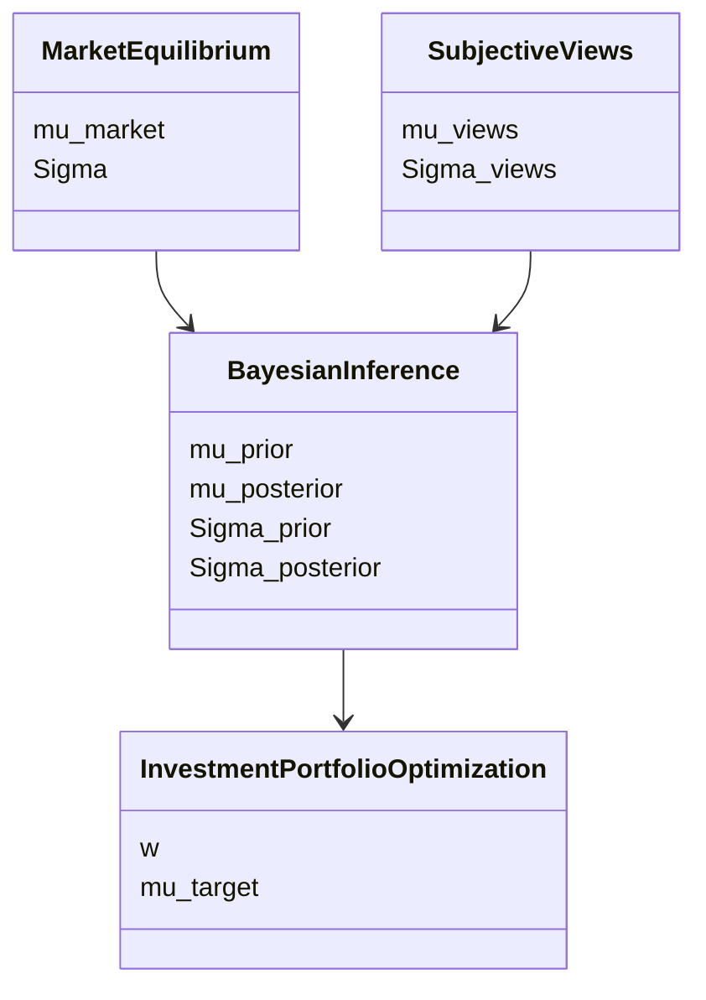
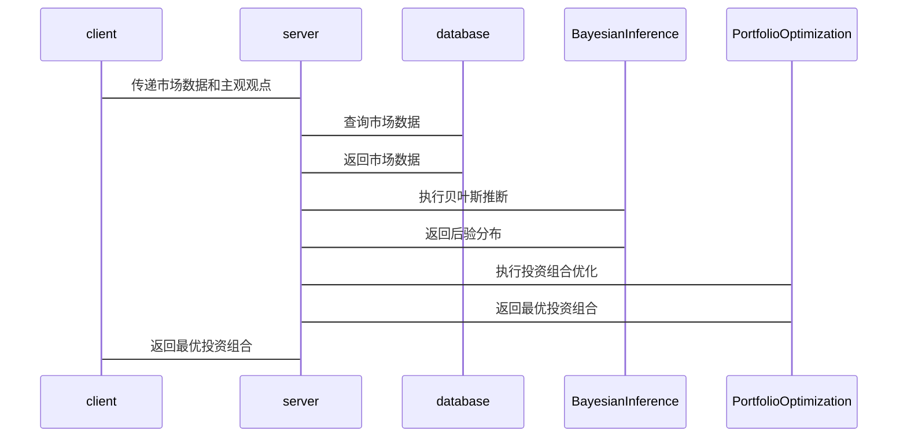

                 


# Black-Litterman模型：结合主观观点与市场均衡

> 关键词：Black-Litterman模型、资产配置、贝叶斯框架、市场均衡、主观观点、投资组合优化

> 摘要：Black-Litterman模型是一种结合主观观点与市场均衡的资产配置方法，由Fischer Black和Robert Litterman提出。该模型通过贝叶斯框架，将投资者的主观观点与市场均衡相结合，生成最优的投资组合。本文详细阐述了该模型的背景、核心概念、算法原理、数学模型、系统架构、项目实战和最佳实践。

---

# 第一部分: Black-Litterman模型概述

## 第1章: Black-Litterman模型的背景与意义

### 1.1 投资组合理论的发展历程

#### 1.1.1 从马科维茨均值-方差模型到Black-Litterman模型

现代投资组合理论（MPT）由Harry Markowitz于1952年提出，其核心是通过优化投资组合的均值和方差来实现风险调整后的收益最大化。然而，Markowitz模型在实际应用中面临两个主要问题：

1. 需要估计大量的输入参数（如资产的期望收益、方差和协方差矩阵）。
2. 对市场参与者的主观观点（如对某些资产的看好或看坏）缺乏直接的表达方式。

Black-Litterman模型正是针对这些问题提出的一种改进方法。它在Markowitz模型的基础上，引入了贝叶斯框架，将市场参与者的主观观点与市场均衡相结合，从而生成更加合理和实用的投资组合。

#### 1.1.2 Black-Litterman模型的提出背景

Black-Litterman模型于1992年首次提出，其灵感来源于Fischer Black对市场均衡的思考。Black认为，市场均衡反映了所有市场参与者的集体智慧，但个体投资者的主观观点也可能包含有价值的信息。因此，将这两种信息结合起来，可以得到更优的投资组合。

#### 1.1.3 Black-Litterman模型的核心思想

Black-Litterman模型的核心思想是将主观观点与市场均衡通过贝叶斯框架相结合。具体来说：

1. 市场均衡（Market Equilibrium）是所有投资者理性行为的结果，反映了市场对资产的定价。
2. 主观观点（Subjective Views）是投资者对某些资产的预期，可能是基于基本面分析或其他信息来源。
3. 通过贝叶斯推断，将主观观点与市场均衡相结合，生成一个混合观点（Hybrid Views），并在此基础上进行投资组合优化。

---

### 1.2 Black-Litterman模型的应用价值

#### 1.2.1 结合主观观点与市场均衡的优势

Black-Litterman模型的一个显著优势是它能够将主观观点与市场均衡相结合。通过这种方式，模型可以利用市场均衡的稳定性，同时吸收投资者的主观判断，从而生成更符合实际的投资组合。

#### 1.2.2 在资产配置中的实际应用

Black-Litterman模型广泛应用于机构投资者的资产配置，特别是在存在主观观点的情况下。例如：

- 基金经理基于对某些行业的看好，可以通过Black-Litterman模型调整其投资组合。
- 保险公司在进行资产配置时，可以结合其对市场的看法，生成最优的投资组合。

#### 1.2.3 Black-Litterman模型的创新性

Black-Litterman模型的创新性在于它将主观观点与市场均衡结合在一起，并通过贝叶斯框架实现了这种结合。这种方法既保留了市场均衡的稳定性，又吸收了主观观点的独特性。

---

## 第2章: Black-Litterman模型的核心概念

### 2.1 贝叶斯框架与市场均衡

#### 2.1.1 贝叶斯推断的基本原理

贝叶斯推断是一种统计推断方法，其核心是根据先验分布和观测数据，推导出后验分布。在Black-Litterman模型中，贝叶斯框架用于将市场均衡和主观观点结合起来。

#### 2.1.2 市场均衡的定义与特征

市场均衡是指市场中所有参与者通过理性交易达到的一种稳定状态。在市场均衡下，资产的定价反映了所有市场参与者的集体智慧。

#### 2.1.3 贝叶斯框架在市场均衡中的应用

在Black-Litterman模型中，市场均衡被视为一种先验分布，而主观观点被视为一种观测数据。通过贝叶斯推断，可以将两者结合起来，生成混合观点。

---

### 2.2 主观观点的整合

#### 2.2.1 主观观点的来源与形式

主观观点通常来源于投资者对某些资产的预期，例如对某只股票的预期收益或对某行业的看法。这些观点可以以多种形式表达，例如对资产的超额收益的点估计或区间估计。

#### 2.2.2 主观观点与市场均衡的关系

主观观点与市场均衡之间存在一种互补关系。市场均衡反映了市场的集体智慧，而主观观点则反映了个体投资者的独特判断。通过将两者结合，可以得到更优的投资组合。

#### 2.2.3 主观观点对投资组合的影响

主观观点可以通过调整投资组合的权重来影响投资组合的收益和风险。例如，如果投资者对某只股票有较高的预期收益，可以通过增加对该股票的配置来提高投资组合的收益。

---

### 2.3 Black-Litterman模型的参数设定

#### 2.3.1 风险溢价的估计

在Black-Litterman模型中，需要估计风险溢价。通常，风险溢价可以通过市场均衡模型（如CAPM）来估计。

#### 2.3.2 观点的权重分配

主观观点的权重分配是一个重要的问题。通常，可以通过投资者的自信程度来确定权重。例如，如果投资者非常自信，可以赋予较高的权重。

#### 2.3.3 模型的敏感性分析

Black-Litterman模型的敏感性分析是指在不同参数假设下，模型结果的变化情况。这可以帮助投资者了解模型的稳健性。

---

## 第3章: Black-Litterman模型的数学基础

### 3.1 贝叶斯推断的数学表达

#### 3.1.1 先验分布与后验分布

在贝叶斯框架中，先验分布是市场均衡的反映，而后验分布是结合了主观观点的分布。

$$
\text{后验分布} = \frac{\text{先验分布} \times \text{主观观点}}{\text{边际似然}}
$$

#### 3.1.2 贝叶斯定理的应用

贝叶斯定理在Black-Litterman模型中的应用可以表示为：

$$
P(A|B) = \frac{P(B|A) \times P(A)}{P(B)}
$$

其中，$A$表示市场均衡，$B$表示主观观点。

---

### 3.2 市场均衡的数学表达

#### 3.2.1 市场均衡的假设

在市场均衡下，资产的期望收益可以表示为：

$$
E(r_i) = \beta_i \times E(r_m) + \alpha_i
$$

其中，$\beta_i$是贝塔系数，$E(r_m)$是市场收益，$\alpha_i$是特异收益。

#### 3.2.2 市场均衡的优化问题

在市场均衡下，投资组合优化问题可以表示为：

$$
\min_{w} \frac{1}{2} w^T \Sigma w \quad \text{subject to} \quad w^T \mu = 1
$$

其中，$w$是投资组合权重，$\Sigma$是协方差矩阵，$\mu$是收益向量。

---

### 3.3 主观观点的数学表达

#### 3.3.1 主观观点的假设

在Black-Litterman模型中，主观观点可以表示为对资产超额收益的点估计或区间估计。

#### 3.3.2 主观观点的整合

通过贝叶斯框架，主观观点可以与市场均衡相结合，生成混合观点：

$$
E(r_i) = \lambda \times \text{主观观点} + (1 - \lambda) \times \text{市场均衡}
$$

其中，$\lambda$是主观观点的权重。

---

## 第4章: Black-Litterman模型的算法原理

### 4.1 均值-方差优化

#### 4.1.1 优化目标

均值-方差优化的目标是最小化投资组合的方差，同时满足收益约束。

$$
\min_{w} \frac{1}{2} w^T \Sigma w \quad \text{subject to} \quad w^T \mu = \gamma
$$

其中，$\gamma$是目标收益。

#### 4.1.2 求解方法

通过拉格朗日乘数法，可以求解上述优化问题。

---

### 4.2 贝叶斯推断的实现

#### 4.2.1 贝叶斯推断的步骤

1. 确定先验分布。
2. 确定主观观点。
3. 计算后验分布。
4. 生成混合观点。
5. 进行投资组合优化。

#### 4.2.2 代码实现

```python
import numpy as np
from scipy.stats import norm

def black_litterman_model(mu_market, Sigma, views, lambda_):
    # 先验分布
    mu_prior = mu_market
    Sigma_prior = Sigma
    
    # 主观观点
    mu_views = views
    Sigma_views = np.diag(np.ones(len(views)))
    
    # 后验分布
    Sigma_posterior = np.linalg.inv(np.linalg.inv(Sigma_prior) + lambda_ * np.linalg.inv(Sigma_views))
    mu_posterior = Sigma_posterior @ (np.linalg.inv(Sigma_prior) @ mu_prior + lambda_ * np.linalg.inv(Sigma_views) @ mu_views)
    
    return mu_posterior
```

---

## 第5章: Black-Litterman模型的系统架构设计

### 5.1 问题场景介绍

在实际投资中，投资者需要根据市场情况和主观观点进行资产配置。Black-Litterman模型可以帮助投资者将这两种信息结合起来，生成最优的投资组合。

### 5.2 系统功能设计

#### 5.2.1 领域模型（mermaid 类图）



#### 5.2.2 系统架构设计（mermaid 架构图）


#### 5.2.3 系统交互设计（mermaid 序列图）



---

## 第6章: Black-Litterman模型的项目实战

### 6.1 环境安装

#### 6.1.1 安装必要的库

```bash
pip install numpy scipy matplotlib
```

### 6.2 系统核心实现源代码

#### 6.2.1 贝叶斯推断的实现

```python
import numpy as np
from scipy.stats import norm

def black_litterman_model(mu_market, Sigma, views, lambda_):
    mu_prior = mu_market
    Sigma_prior = Sigma
    mu_views = views
    Sigma_views = np.diag(np.ones(len(views)))
    
    inv_Sigma_prior = np.linalg.inv(Sigma_prior)
    inv_Sigma_views = np.linalg.inv(Sigma_views)
    
    inv_total = inv_Sigma_prior + lambda_ * inv_Sigma_views
    Sigma_posterior = np.linalg.inv(inv_total)
    
    mu_posterior = Sigma_posterior @ (inv_Sigma_prior @ mu_prior + lambda_ * inv_Sigma_views @ mu_views)
    
    return mu_posterior
```

#### 6.2.2 投资组合优化的实现

```python
def portfolio_optimization(mu, Sigma, mu_target):
    n = len(mu)
    cov_matrix = Sigma
    mu_vec = mu
    
    # 构建拉格朗日函数
    def objective(w):
        return 0.5 * w.T @ cov_matrix @ w
    def constraint(w):
        return w.T @ mu_vec - mu_target
    
    # 求解优化问题
    from scipy.optimize import minimize
    result = minimize(objective, np.ones(n)/n, method='SLSQP', constraints={'type': 'eq', 'fun': constraint})
    return result.x
```

### 6.3 实际案例分析与解读

#### 6.3.1 数据准备

假设有3只股票，市场均衡下的收益向量为：

$$
\mu_{\text{market}} = \begin{pmatrix} 0.1 \\ 0.1 \\ 0.1 \end{pmatrix}
$$

协方差矩阵为：

$$
\Sigma = \begin{pmatrix} 0.02 & 0.01 & 0.01 \\ 0.01 & 0.03 & 0.01 \\ 0.01 & 0.01 & 0.03 \end{pmatrix}
$$

投资者的主观观点为：

$$
\mu_{\text{views}} = \begin{pmatrix} 0.15 \\ 0.1 \\ 0.1 \end{pmatrix}
$$

#### 6.3.2 贝叶斯推断

调用`black_litterman_model`函数：

```python
mu_market = [0.1, 0.1, 0.1]
Sigma = [[0.02, 0.01, 0.01], [0.01, 0.03, 0.01], [0.01, 0.01, 0.03]]
views = [0.15, 0.1, 0.1]
lambda_ = 1

mu_posterior = black_litterman_model(mu_market, Sigma, views, lambda_)
print(mu_posterior)
```

#### 6.3.3 投资组合优化

假设目标收益为0.12，调用`portfolio_optimization`函数：

```python
mu_target = 0.12
w = portfolio_optimization(mu_posterior, Sigma, mu_target)
print(w)
```

---

## 第7章: Black-Litterman模型的最佳实践

### 7.1 小结

Black-Litterman模型通过结合主观观点与市场均衡，提供了一种更灵活和实用的投资组合优化方法。其核心在于贝叶斯框架的应用，使得主观观点能够对市场均衡产生合理的影响。

### 7.2 注意事项

1. **参数敏感性**：模型的参数（如$\lambda$）对结果有较大影响，需要进行敏感性分析。
2. **数据质量**：主观观点的质量直接影响模型的效果，需要确保数据的准确性和可靠性。
3. **实际应用**：在实际应用中，需要考虑交易成本、税收等现实因素。

### 7.3 拓展阅读

1. Black, F., & Litterman, R. (1992). Global Portfolio Optimization. Financial Analysts Journal.
2. Chincarini, G., & Kim, D. (2004). Bayesian Portfolio Selection. Technical Report, Columbia University.

---

# 结语

Black-Litterman模型通过结合主观观点与市场均衡，为投资者提供了一种更灵活和实用的投资组合优化方法。本文详细阐述了该模型的背景、核心概念、算法原理、数学模型、系统架构、项目实战和最佳实践。通过实际案例分析，读者可以更好地理解模型的应用和实现。未来的研究可以进一步探讨模型在复杂市场环境下的应用，例如多资产类别、动态调整等。

作者：AI天才研究院/AI Genius Institute & 禅与计算机程序设计艺术/Zen And The Art of Computer Programming

