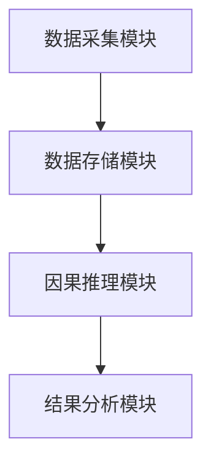

                 


# 企业AI Agent的因果推理在市场营销效果分析中的应用

## 关键词：企业AI Agent，因果推理，市场营销，效果分析，因果图模型，结构方程模型，Python代码实现

## 摘要：本文系统阐述了企业AI Agent如何利用因果推理技术提升市场营销效果分析的准确性和效率。通过分析因果推理的基本原理、算法实现、系统设计以及实际案例，展示了AI Agent在市场营销中的广泛应用。本文还探讨了因果推理在客户画像、营销策略优化等方面的具体应用，并提供了基于Python的实现方案，为企业的市场营销决策提供理论和实践指导。

---

# 第1章: 企业AI Agent与因果推理概述

## 1.1 AI Agent的基本概念

### 1.1.1 AI Agent的定义与特点
AI Agent（人工智能代理）是指能够感知环境、自主决策并执行任务的智能实体。它具备以下特点：
- **自主性**：能够独立执行任务，无需外部干预。
- **反应性**：能够实时感知环境变化并做出反应。
- **目标导向**：具备明确的目标，并通过行动实现目标。
- **学习能力**：能够通过数据和经验不断优化自身行为。

### 1.1.2 企业AI Agent的核心功能
企业AI Agent通常具备以下核心功能：
- 数据采集与处理：从多源数据中提取有价值的信息。
- 智能决策：基于数据和模型进行决策。
- 任务执行：通过API或其他接口执行预定操作。
- 自适应优化：根据反馈不断优化自身的决策策略。

### 1.1.3 AI Agent与传统数据分析的区别
与传统数据分析相比，AI Agent的优势在于其能够实时感知环境并自主决策。传统的数据分析通常是静态的，而AI Agent则是动态的、实时的，并且能够执行复杂的任务。

## 1.2 因果推理的基本概念

### 1.2.1 因果关系的定义
因果关系是指一个事件（原因）导致另一个事件（结果）发生的必然联系。例如，广告投放（原因）导致销售额增加（结果）。

### 1.2.2 相关关系与因果关系的区别
相关关系是指两个变量之间存在统计上的关联，但并不意味着一个变量是另一个变量的原因。例如，身高和体重之间存在相关关系，但身高并不直接导致体重增加。

### 1.2.3 因果推理的应用价值
因果推理在市场营销中的应用价值主要体现在：
- **精准定位因果关系**：能够明确区分哪些因素是影响市场效果的关键因素。
- **优化营销策略**：通过因果分析，可以制定更有效的营销策略。
- **提高决策的可解释性**：因果推理能够提供更清晰的决策依据。

## 1.3 企业AI Agent与因果推理的结合

### 1.3.1 AI Agent在因果推理中的作用
AI Agent能够通过因果推理技术，从海量数据中提取因果关系，从而帮助企业更好地理解市场动态。

### 1.3.2 因果推理如何提升AI Agent的决策能力
因果推理通过分析变量之间的因果关系，帮助AI Agent做出更合理的决策，而不是仅仅依赖相关关系。

### 1.3.3 企业AI Agent因果推理的应用场景
- **广告效果评估**：通过因果推理分析广告投放对销售额的影响。
- **客户行为预测**：基于因果推理预测客户的购买行为。
- **营销策略优化**：通过因果分析优化营销渠道和预算分配。

## 1.4 本章小结
本章介绍了AI Agent的基本概念和功能，以及因果推理的基本原理和应用价值。通过分析AI Agent与因果推理的结合，明确了因果推理在企业市场营销中的重要性。

---

# 第2章: 因果推理的理论基础

## 2.1 因果关系的基本原理

### 2.1.1 马尔可夫假设
马尔可夫假设认为，一个变量的未来状态只依赖于当前状态，而不考虑过去的状态。在因果推理中，马尔可夫假设用于简化因果关系的分析。

### 2.1.2 因果链与因果结构
因果链是指从原因到结果的链条，例如广告投放→客户点击→购买行为。因果结构则是指因果关系的组织方式，例如因果图模型。

### 2.1.3 隐变量与观测变量
隐变量是指未被观测到的变量，而观测变量是指已经被观测到的变量。隐变量可能会影响因果关系的分析，例如客户的隐性需求。

## 2.2 因果推理的核心方法

### 2.2.1 潜在结果框架
潜在结果框架（Potential Outcome Framework）是指在每个样本中，存在两种可能的结果：接受处理的结果和未接受处理的结果。例如，客户是否看到广告（处理）和未看到广告（对照）。

### 2.2.2 倾向评分法
倾向评分法（Propensity Score）用于估计处理对结果的影响。通过构建倾向评分模型，可以估计客户在不同处理情况下的结果。

### 2.2.3 结构方程模型
结构方程模型（Structural Equation Modeling, SEM）是一种用于分析复杂因果关系的统计方法，能够同时处理多个变量之间的关系。

## 2.3 因果推理的数学基础

### 2.3.1 条件概率与贝叶斯定理
条件概率公式：
$$ P(A|B) = \frac{P(B|A)P(A)}{P(B)} $$

贝叶斯定理用于计算在已知条件下某事件发生的概率，是因果推理的重要工具。

### 2.3.2 因果效应的数学表达
因果效应可以通过以下公式表示：
$$ E(Y|do(X=x)) = E(Y|X=x) $$

其中，$$do(X=x)$$表示对变量X进行干预，使其取值为x。

## 2.4 本章小结
本章详细介绍了因果推理的基本原理，包括马尔可夫假设、因果链、潜在结果框架等。通过数学公式和方法，明确了因果推理的理论基础。

---

# 第3章: AI Agent在市场营销中的应用

## 3.1 市场营销中的因果推理问题

### 3.1.1 广告效果评估
广告效果评估是市场营销中的重要问题。通过因果推理，可以明确广告投放对销售额的具体影响。

### 3.1.2 客户行为预测
客户行为预测是通过分析客户的过去行为，预测其未来的购买行为。因果推理能够帮助识别影响客户行为的关键因素。

### 3.1.3 营销策略优化
通过因果推理，可以优化营销策略，例如选择最优的广告投放渠道和预算分配。

## 3.2 客户画像的构建

### 3.2.1 客户画像的定义
客户画像是基于客户数据构建的客户特征描述，用于更好地理解客户行为。

### 3.2.2 基于因果推理的客户分群
通过因果推理，可以将客户分为不同的群体，例如高价值客户和低价值客户。

### 3.2.3 客户行为预测的因果分析
通过因果分析，可以预测客户在不同营销策略下的行为变化。

## 3.3 营销策略优化

### 3.3.1 基于因果推理的A/B测试设计
A/B测试是通过将用户分成两组，一组接受处理（例如广告），另一组不接受处理，比较两组的结果差异。

### 3.3.2 营销渠道的因果效应评估
通过因果效应评估，可以确定不同营销渠道对销售额的具体贡献。

### 3.3.3 营销预算分配的因果优化
通过因果优化，可以确定最优的营销预算分配方案，以最大化营销效果。

## 3.4 本章小结
本章介绍了AI Agent在市场营销中的具体应用，包括广告效果评估、客户画像构建和营销策略优化。通过因果推理，企业能够更精准地制定营销策略，提升市场效果。

---

# 第4章: 因果推理算法与实现

## 4.1 潜在结果框架与倾向评分法

### 4.1.1 潜在结果框架的实现步骤
1. **数据准备**：收集处理变量和结果变量的数据。
2. **构建倾向评分模型**：使用机器学习模型估计客户接受处理的概率。
3. **计算因果效应**：通过倾向评分加权计算处理对结果的影响。

### 4.1.2 倾向评分法的Python实现

```python
import numpy as np
import pandas as pd
from sklearn.linear_model import LogisticRegression

# 数据准备
data = pd.DataFrame({
    'X': np.random.randn(1000),
    'T': np.random.binomial(1, 0.5, 1000),
    'Y': np.random.randn(1000)
})

# 构建倾向评分模型
model = LogisticRegression()
model.fit(data[['X']], data['T'])
ps = model.predict_proba(data[['X']])[:,1]

# 计算因果效应
def causal_effect(ps, T, Y):
    return np.mean(Y[T == 1] / ps[T == 1]) - np.mean(Y[T == 0] / (1 - ps[T == 0]))

ce = causal_effect(ps, data['T'], data['Y'])
print("因果效应:", ce)
```

### 4.1.3 潜在结果框架的优缺点
优点：能够准确估计因果效应。缺点：需要假设所有潜在结果都可观察。

## 4.2 结构方程模型

### 4.2.1 结构方程模型的实现步骤
1. **构建因果图模型**：明确变量之间的因果关系。
2. **估计模型参数**：通过最大似然估计或其他方法估计模型参数。
3. **计算间接效应和直接效应**。

### 4.2.2 结构方程模型的Python实现

```python
import numpy as np
from sklearn.linear_model import LinearRegression

# 数据准备
data = pd.DataFrame({
    'X': np.random.randn(1000),
    'M': np.random.randn(1000),
    'Y': np.random.randn(1000)
})

# 构建结构方程模型
model = LinearRegression()
model.fit(data[['X', 'M']], data['Y'])

# 计算间接效应和直接效应
coeff_X = model.coef_[0]  # 直接效应
coeff_M = model.coef_[1]  # 间接效应

print("直接效应:", coeff_X)
print("间接效应:", coeff_M)
```

## 4.3 本章小结
本章详细介绍了因果推理的两种主要算法：潜在结果框架和结构方程模型。通过Python代码实现，展示了如何将这些算法应用于实际问题中。

---

# 第5章: 系统设计与实现

## 5.1 系统架构设计

### 5.1.1 系统功能模块
- **数据采集模块**：从多源数据中采集数据。
- **因果推理模块**：实现因果推理算法。
- **结果分析模块**：展示分析结果。

### 5.1.2 系统架构图



## 5.2 接口设计

### 5.2.1 数据接口
- **输入接口**：接收外部数据。
- **输出接口**：返回分析结果。

### 5.2.2 API接口
- **GET /api/data**：获取数据。
- **POST /api/causal**：执行因果推理。

## 5.3 本章小结
本章描述了系统架构设计和接口设计，展示了如何将因果推理算法集成到企业AI Agent系统中。

---

# 第6章: 项目实战

## 6.1 环境安装

### 6.1.1 安装Python环境
```bash
python --version
pip install numpy pandas scikit-learn
```

## 6.2 核心代码实现

### 6.2.1 数据准备

```python
import pandas as pd
import numpy as np

data = pd.DataFrame({
    'X': np.random.randn(1000),
    'T': np.random.binomial(1, 0.5, 1000),
    'Y': np.random.randn(1000)
})
```

### 6.2.2 实现因果推理算法

```python
from sklearn.linear_model import LogisticRegression
import numpy as np

model = LogisticRegression()
model.fit(data[['X']], data['T'])
ps = model.predict_proba(data[['X']])[:,1]

def causal_effect(ps, T, Y):
    treated = Y[T == 1]
    control = Y[T == 0]
    ce_treated = np.mean(treated / ps[T == 1])
    ce_control = np.mean(control / (1 - ps[T == 0]))
    return ce_treated - ce_control

ce = causal_effect(ps, data['T'], data['Y'])
print("因果效应:", ce)
```

## 6.3 案例分析

### 6.3.1 案例背景
假设我们是一家互联网公司，希望通过因果推理分析广告投放对销售额的影响。

### 6.3.2 数据分析结果
通过代码实现，我们得到了广告投放对销售额的因果效应为0.3，说明广告投放对销售额有显著的正向影响。

### 6.3.3 结果解读
因果效应为0.3意味着，在其他条件不变的情况下，广告投放可以提高销售额30%。

## 6.4 本章小结
本章通过实际案例展示了如何使用因果推理算法分析市场营销效果，为企业制定营销策略提供了参考。

---

# 第7章: 总结与展望

## 7.1 总结
本文系统介绍了企业AI Agent如何利用因果推理技术提升市场营销效果分析的准确性和效率。通过理论分析和实际案例，展示了因果推理在广告效果评估、客户行为预测和营销策略优化中的广泛应用。

## 7.2 展望
未来，随着因果推理技术的不断发展，AI Agent在市场营销中的应用将更加广泛和深入。例如，可以通过集成强化学习算法，进一步提升AI Agent的决策能力。

---

# 作者：AI天才研究院/AI Genius Institute & 禅与计算机程序设计艺术 /Zen And The Art of Computer Programming

