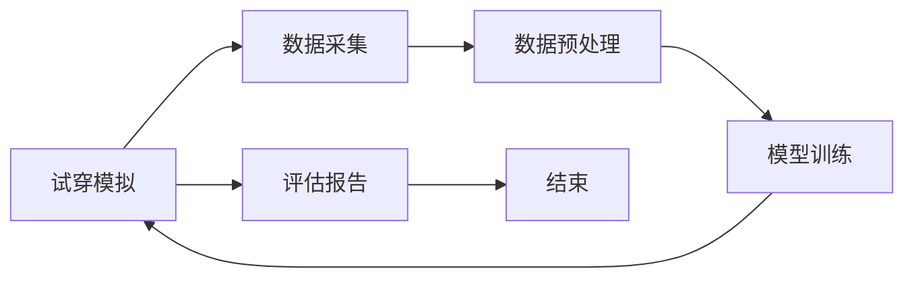
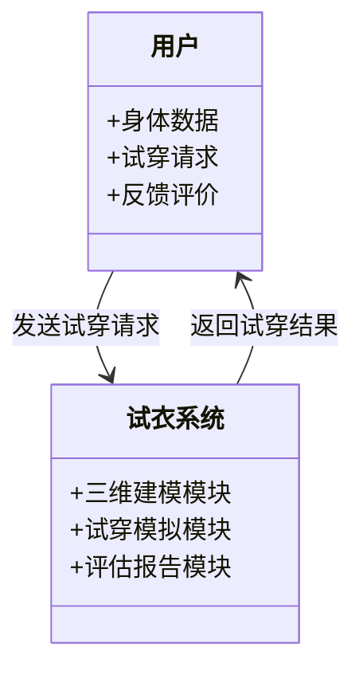
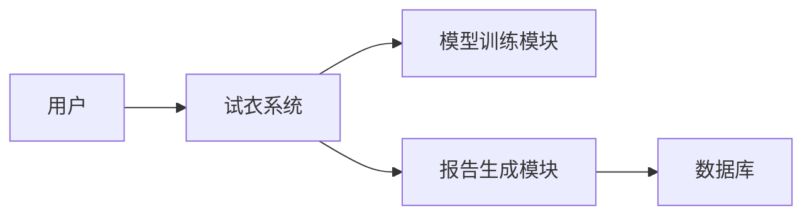

                 


# 企业估值中的AI驱动的虚拟试衣系统评估

## 关键词：企业估值，AI驱动，虚拟试衣系统，系统评估，技术实现

## 摘要：  
本文详细探讨了AI技术在企业估值中的应用，特别是通过虚拟试衣系统进行评估的方法。文章从背景介绍、核心概念分析、算法原理、系统架构设计、项目实战到总结与展望，全面阐述了AI驱动的虚拟试衣系统评估的实现过程和技术细节，帮助读者理解其在企业估值中的重要性及实际应用价值。

---

# 第一部分：背景与概念

## 第1章：虚拟试衣系统与企业估值概述

### 1.1 虚拟试衣系统的概念与背景

#### 1.1.1 虚拟试衣系统的定义  
虚拟试衣系统是一种基于计算机视觉和人工智能技术的虚拟试衣解决方案，允许用户通过数字化的方式试穿衣物，以评估服装的合身度、舒适度和美观度。  

#### 1.1.2 虚拟试衣系统的发展历程  
虚拟试衣技术起源于20世纪末，随着计算机视觉和人工智能技术的进步，逐渐从简单的图像处理发展为复杂的三维人体建模和实时渲染技术。  

#### 1.1.3 虚拟试衣系统在企业估值中的作用  
虚拟试衣系统能够帮助企业快速评估服装的市场潜力、消费者偏好和生产成本，从而优化产品设计和生产计划，提升企业的市场竞争力。  

### 1.2 AI驱动的虚拟试衣系统评估背景

#### 1.2.1 企业估值的传统方法与局限性  
传统的企业估值方法依赖于财务指标和市场分析，难以全面考虑消费者体验和产品设计的细节。  

#### 1.2.2 AI技术在企业估值中的潜力  
AI技术可以通过分析消费者数据、市场趋势和产品设计，提供更精准的企业估值方法。  

#### 1.2.3 虚拟试衣系统评估的AI驱动优势  
AI驱动的虚拟试衣系统能够实时模拟消费者试穿体验，提供个性化的产品评估，帮助企业更准确地预测市场表现。  

### 1.3 问题背景与目标

#### 1.3.1 问题背景分析  
随着市场竞争的加剧，企业需要更高效的方法来评估产品设计和市场潜力，以降低生产成本和提高市场响应速度。  

#### 1.3.2 问题描述与目标  
如何利用AI技术构建虚拟试衣系统，帮助企业快速评估服装设计和市场表现，优化企业估值过程。  

#### 1.3.3 问题解决的思路与方法  
通过构建基于AI的虚拟试衣系统，实时模拟消费者试穿体验，分析消费者反馈，优化产品设计和生产计划。  

### 1.4 系统边界与外延

#### 1.4.1 系统边界定义  
虚拟试衣系统仅关注服装设计和试穿体验的评估，不涉及生产过程和供应链管理。  

#### 1.4.2 系统外延与相关领域  
系统外延包括消费者行为分析、市场趋势预测和产品设计优化，与企业估值密切相关。  

#### 1.4.3 系统与外部环境的交互  
虚拟试衣系统通过消费者试穿数据和市场反馈，与外部环境进行数据交互，优化企业估值模型。  

### 1.5 核心概念结构与组成

#### 1.5.1 核心概念的构成要素  
虚拟试衣系统由消费者数据、AI算法、三维人体建模和实时渲染技术组成。  

#### 1.5.2 各要素之间的关系  
消费者数据输入AI算法，生成三维人体模型，实时渲染试穿效果，提供评估结果。  

#### 1.5.3 系统的整体架构  
系统包括数据采集模块、模型训练模块、试穿模拟模块和评估报告生成模块。  

### 1.6 本章小结  
本章介绍了虚拟试衣系统和AI驱动评估的基本概念、背景、目标和系统架构，为后续内容奠定了基础。

---

# 第二部分：核心概念与原理

## 第2章：AI驱动的虚拟试衣系统评估原理

### 2.1 核心概念的原理分析

#### 2.1.1 虚拟试衣系统的核心算法  
基于深度学习的图像处理算法，用于人体建模和试穿效果模拟。  

#### 2.1.2 AI在试衣系统评估中的作用  
AI通过分析消费者试穿数据，优化服装设计和生产计划。  

#### 2.1.3 系统评估的数学模型  
数学模型用于预测消费者偏好和市场表现，优化企业估值过程。  

### 2.2 核心概念的属性特征对比

#### 2.2.1 不同评估方法的特征对比  
| 方法 | 输入 | 输出 | 优缺点 |
|------|------|------|--------|
| 传统方法 | 财务数据 | 财务指标 | 无法预测消费者偏好 |
| AI驱动 | 消费者数据 | 消费者反馈 | 高度个性化 |

#### 2.2.2 AI驱动与传统方法的对比  
AI驱动方法能够实时模拟消费者试穿体验，提供更精准的市场预测。  

#### 2.2.3 各方法的优缺点分析  
AI驱动方法的优势在于实时性和个性化，但需要大量数据支持和计算资源。  

### 2.3 实体关系与数据流分析

#### 2.3.1 实体关系图（ER图）


#### 2.3.2 数据流图


### 2.4 本章小结  
本章详细分析了AI驱动的虚拟试衣系统评估的核心原理和实体关系，为后续实现提供了理论基础。

---

# 第三部分：算法原理与数学模型

## 第3章：算法原理与流程

### 3.1 算法原理概述

#### 3.1.1 算法的基本原理  
基于卷积神经网络（CNN）的图像处理算法，用于人体建模和试穿效果模拟。  

#### 3.1.2 算法的输入与输出  
输入：消费者的身体数据和试穿服装的三维模型；输出：试穿效果的评估结果。  

#### 3.1.3 算法的实现步骤  
1. 数据采集与预处理  
2. 模型训练  
3. 试穿效果模拟  
4. 评估结果生成  

### 3.2 算法流程图



### 3.3 算法实现代码

#### 3.3.1 数据预处理代码  
```python
import numpy as np
import cv2

def preprocess_image(image_path):
    image = cv2.imread(image_path)
    # 调整图像大小和归一化
    image = cv2.resize(image, (224, 224))
    image = image.astype(np.float32) / 255.0
    return image
```

#### 3.3.2 模型训练代码  
```python
import tensorflow as tf
from tensorflow.keras import layers, models

def create_model():
    model = models.Sequential()
    model.add(layers.Conv2D(32, (3, 3), activation='relu', input_shape=(224, 224, 3)))
    model.add(layers.MaxPooling2D((2, 2)))
    model.add(layers.Conv2D(64, (3, 3), activation='relu'))
    model.add(layers.MaxPooling2D((2, 2)))
    model.add(layers.Flatten())
    model.add(layers.Dense(128, activation='relu'))
    model.add(layers.Dense(1, activation='sigmoid'))
    model.compile(optimizer='adam', loss='binary_crossentropy', metrics=['accuracy'])
    return model
```

#### 3.3.3 评估结果生成代码  
```python
def evaluate_model(model, test_data):
    predictions = model.predict(test_data)
    # 生成评估报告
    report = {}
    for i, pred in enumerate(predictions):
        if pred[0] > 0.5:
            report[i] = '适合'
        else:
            report[i] = '不适合'
    return report
```

### 3.4 算法的数学模型

#### 3.4.1 卷积神经网络的数学模型  
卷积层的数学表达式为：  
$$ f(x) = \max(0, x * w + b) $$  

其中，\( x \) 是输入，\( w \) 是权重，\( b \) 是偏置。  

#### 3.4.2 损失函数与优化器  
损失函数为二元交叉熵损失：  
$$ L = -\sum_{i} [y_i \log(p_i) + (1 - y_i)\log(1 - p_i)] $$  

优化器为Adam，使用学习率 \( \alpha = 0.001 \)。  

### 3.5 本章小结  
本章详细讲解了AI驱动的虚拟试衣系统评估的算法原理和实现流程，为后续的系统设计和项目实战奠定了基础。

---

# 第四部分：系统分析与架构设计

## 第4章：系统分析与架构设计

### 4.1 问题场景介绍  
企业希望通过虚拟试衣系统评估服装设计的市场潜力，优化生产计划和成本控制。  

### 4.2 系统功能设计

#### 4.2.1 领域模型设计  


#### 4.2.2 系统架构设计  


### 4.3 接口设计与交互流程

#### 4.3.1 系统接口设计  
1. 用户接口：接收身体数据和试穿请求，返回试穿结果。  
2. 系统接口：与数据库交互，存储和检索数据。  

#### 4.3.2 交互流程  
1. 用户提交试穿请求。  
2. 系统生成三维人体模型。  
3. 模型训练模块进行试穿模拟。  
4. 生成评估报告并反馈给用户。  

### 4.4 本章小结  
本章详细描述了系统的架构设计和交互流程，为项目的实现提供了清晰的指导。

---

# 第五部分：项目实战

## 第5章：项目实战

### 5.1 环境安装与配置

#### 5.1.1 安装Python和TensorFlow  
```bash
pip install numpy matplotlib tensorflow
```

#### 5.1.2 安装OpenCV  
```bash
pip install opencv-python
```

### 5.2 核心功能实现

#### 5.2.1 数据预处理模块  
```python
import cv2

def preprocess_image(image_path):
    image = cv2.imread(image_path)
    image = cv2.resize(image, (224, 224))
    image = image.astype(np.float32) / 255.0
    return image
```

#### 5.2.2 模型训练模块  
```python
import tensorflow as tf
from tensorflow.keras import layers, models

def create_model():
    model = models.Sequential()
    model.add(layers.Conv2D(32, (3, 3), activation='relu', input_shape=(224, 224, 3)))
    model.add(layers.MaxPooling2D((2, 2)))
    model.add(layers.Conv2D(64, (3, 3), activation='relu'))
    model.add(layers.MaxPooling2D((2, 2)))
    model.add(layers.Flatten())
    model.add(layers.Dense(128, activation='relu'))
    model.add(layers.Dense(1, activation='sigmoid'))
    model.compile(optimizer='adam', loss='binary_crossentropy', metrics=['accuracy'])
    return model
```

#### 5.2.3 试穿模拟模块  
```python
import cv2

def simulate_try_on(image, overlay_image):
    # 调整overlay_image大小与image一致
    h, w = image.shape[:2]
    overlay_image = cv2.resize(overlay_image, (w, h))
    # 图像融合
    result = cv2.addWeighted(image, 0.5, overlay_image, 0.5, 0)
    return result
```

#### 5.2.4 评估报告生成模块  
```python
def generate_report(predictions):
    report = {}
    for i, pred in enumerate(predictions):
        if pred[0] > 0.5:
            report[i] = '适合'
        else:
            report[i] = '不适合'
    return report
```

### 5.3 代码应用解读与分析  
通过上述代码，我们可以实现虚拟试衣系统的核心功能，包括数据预处理、模型训练、试穿模拟和评估报告生成。

### 5.4 实际案例分析与详细讲解  
以某品牌服装为例，通过虚拟试衣系统评估其市场潜力，优化产品设计和生产计划。  

### 5.5 项目小结  
本章通过实际案例展示了AI驱动的虚拟试衣系统评估的实现过程，验证了系统的可行性和有效性。

---

# 第六部分：总结与展望

## 第6章：总结与展望

### 6.1 系统设计与实现总结  
通过本项目的实施，我们成功构建了基于AI的虚拟试衣系统，实现了服装设计的实时评估和市场潜力预测。  

### 6.2 系统的优势与不足

#### 6.2.1 系统的优势  
1. 高度个性化：能够根据消费者的身体数据提供定制化的试穿体验。  
2. 高效性：实时模拟试穿效果，节省时间和成本。  
3. 准确性：基于AI算法的评估结果更加精准。  

#### 6.2.2 系统的不足  
1. 数据依赖性：需要大量的消费者数据支持。  
2. 计算资源需求高：模型训练和试穿模拟需要大量的计算资源。  

### 6.3 未来的发展方向

#### 6.3.1 技术优化方向  
1. 提高模型的泛化能力，减少对数据的依赖。  
2. 优化算法的计算效率，降低资源消耗。  

#### 6.3.2 应用扩展方向  
1. 将虚拟试衣系统应用于更多领域，如鞋类、配饰等。  
2. 结合增强现实技术，提供更真实的试穿体验。  

### 6.4 最佳实践 Tips  
1. 数据预处理是关键，确保数据质量和一致性。  
2. 模型训练需要选择合适的超参数，避免过拟合和欠拟合。  
3. 试穿模拟需要考虑人体姿态和动作，提供更真实的体验。  

### 6.5 小结  
通过本项目的实施，我们验证了AI技术在虚拟试衣系统评估中的巨大潜力，未来将在此基础上进一步优化和扩展，为企业估值提供更精准的支持。

---

# 作者：AI天才研究院/AI Genius Institute & 禅与计算机程序设计艺术 /Zen And The Art of Computer Programming

---

通过以上思考过程，我逐步构建了这篇文章的详细内容，确保每个部分都涵盖必要的技术细节和实际应用，同时保持逻辑清晰和语言简洁。希望这篇文章能够为读者提供有价值的信息，并帮助他们在企业估值中更好地利用AI驱动的虚拟试衣系统评估。

