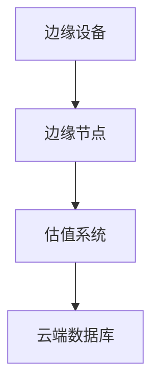
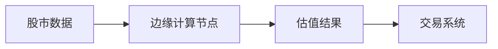
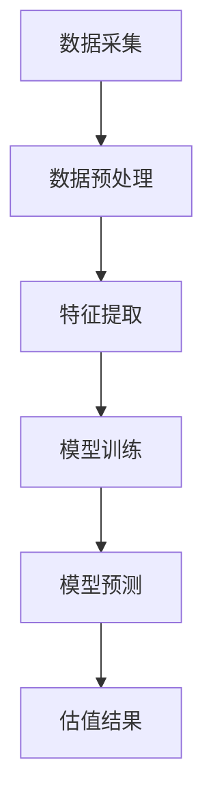
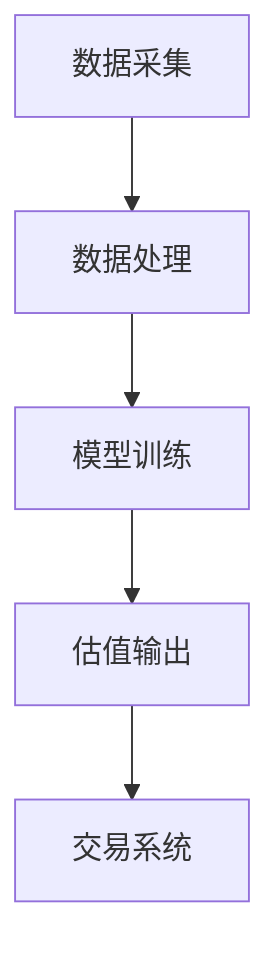
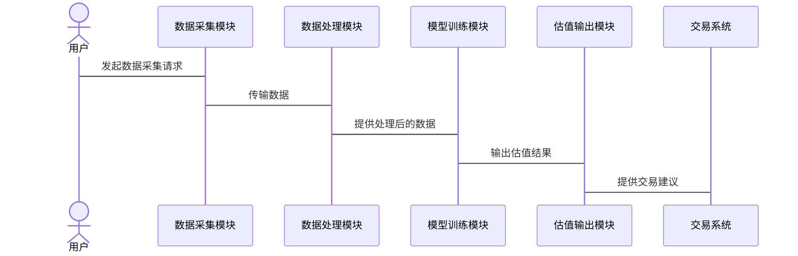

                 


# 全球股市估值与边缘计算技术的关联

> 关键词：全球股市估值，边缘计算，实时数据，金融技术，分布式系统，数据处理

> 摘要：本文探讨了全球股市估值与边缘计算技术之间的关联，分析了边缘计算在提升股市估值效率和精度方面的优势，结合实际案例和系统架构设计，展示了边缘计算技术在金融领域的广泛应用前景。

---

## 第1章: 全球股市估值与边缘计算技术的背景介绍

### 1.1 全球股市估值的基本概念

#### 1.1.1 股市估值的定义与核心要素
股市估值是指对股票价值的评估，通常基于企业的财务状况、市场环境和行业趋势等因素。核心要素包括：
- **企业基本面**：收入、利润、资产负债表等。
- **市场情绪**：投资者的心理预期和市场波动。
- **宏观经济因素**：GDP增长率、利率、通货膨胀等。

#### 1.1.2 全球股市的特点与多样性
全球股市分布广泛，包括纽约证券交易所、纳斯达克、伦敦证交所等，每个市场的特点不同，受到本地和国际因素的影响。

#### 1.1.3 股市估值的常见方法与挑战
常用方法包括市盈率（P/E）、市净率（P/B）和现金流折现法（DCF）。然而，传统方法存在数据延迟和计算复杂的问题，限制了其效率和精度。

### 1.2 边缘计算技术的定义与特点

#### 1.2.1 边缘计算的基本概念
边缘计算是一种分布式计算范式，数据在靠近数据源的设备端进行处理，减少数据传输延迟，提高实时性。

#### 1.2.2 边缘计算的核心技术与优势
- **分布式架构**：数据在边缘节点处理，降低中心化依赖。
- **低延迟**：边缘计算减少了数据传输到云端的时间，提升了实时性。
- **隐私与安全**：数据在本地处理，降低了数据泄露风险。

#### 1.2.3 边缘计算在金融领域的潜力
边缘计算在金融领域的应用包括实时数据分析、高频交易和智能风控，能够显著提升金融业务的效率和安全性。

### 1.3 全球股市估值与边缘计算技术的关联

#### 1.3.1 股市数据实时性与边缘计算的契合点
边缘计算的低延迟特性能够满足股市实时数据处理的需求，确保估值的及时性和准确性。

#### 1.3.2 边缘计算如何提升股市估值的效率与精度
边缘计算通过分布式数据处理和实时分析，优化了估值模型，提高了计算效率和准确性。

#### 1.3.3 两者的结合对金融行业的影响与意义
边缘计算与股市估值的结合推动了金融行业的技术进步，促进了高效、智能的金融决策。

### 1.4 本章小结
本章介绍了全球股市估值和边缘计算的基本概念，分析了它们的关联，为后续章节奠定了基础。

---

## 第2章: 全球股市估值方法与边缘计算技术的联系

### 2.1 传统股市估值方法的局限性

#### 2.1.1 市盈率法与市净率法的优缺点
- **市盈率法**：优点是简单易懂，缺点是受市场情绪影响较大。
- **市净率法**：优点是考虑了资产价值，缺点是忽略企业盈利能力。

#### 2.1.2 现金流折现法的复杂性与计算成本
现金流折现法需要大量历史数据和未来预测，计算复杂且成本高。

#### 2.1.3 传统估值方法的延迟性与局限性
传统方法依赖于历史数据，无法实时反映市场动态，导致估值滞后。

### 2.2 边缘计算技术在股市估值中的应用

#### 2.2.1 边缘计算如何实现低延迟数据处理
通过在边缘节点实时处理数据，边缘计算减少了数据传输到云端的时间，实现了低延迟的股市估值。

#### 2.2.2 边缘计算在实时数据分析中的优势
边缘计算能够实时处理大量数据，提升股市估值的实时性和准确性。

#### 2.2.3 边缘计算如何优化股市估值模型
边缘计算通过分布式数据处理和机器学习模型优化，提高了估值模型的效率和精度。

### 2.3 两者的结合对股市估值的影响

#### 2.3.1 提高估值效率
边缘计算通过实时数据处理和分布式计算，显著提高了股市估值的效率。

#### 2.3.2 提升估值精度
边缘计算结合机器学习算法，优化了估值模型，提高了估值的准确性。

#### 2.3.3 增强系统鲁棒性
边缘计算的分布式架构提升了系统的容错性和抗攻击能力，增强了系统的鲁棒性。

### 2.4 本章小结
本章分析了传统股市估值方法的局限性，探讨了边缘计算技术在股市估值中的应用，展示了两者的结合对股市估值的积极影响。

---

## 第3章: 边缘计算关键技术与金融场景应用

### 3.1 边缘计算的关键技术

#### 3.1.1 边缘计算架构
边缘计算的典型架构包括边缘设备、边缘节点和云端，数据在边缘节点进行处理。

#### 3.1.2 边缘计算的数据处理技术
包括数据采集、预处理和分析，确保数据的准确性和实时性。

#### 3.1.3 边缘计算的通信协议
常用的通信协议包括MQTT、HTTP和WebSocket，确保数据的高效传输。

### 3.2 边缘计算在金融场景中的应用

#### 3.2.1 实时数据分析
边缘计算能够实时处理股市数据，提供及时的估值结果。

#### 3.2.2 高频交易
边缘计算通过低延迟数据处理，支持高频交易，提升交易效率。

#### 3.2.3 智能风控
边缘计算结合机器学习，实现智能风险控制，保障金融交易的安全性。

### 3.3 边缘计算的金融场景应用案例

#### 3.3.1 某国际银行的实时风控系统
案例介绍：某国际银行利用边缘计算技术，实现了实时风控，显著降低了风险。

#### 3.3.2 某股票交易所的高频交易系统
案例介绍：某股票交易所采用边缘计算技术，实现了高频交易，提升了交易效率。

### 3.4 本章小结
本章详细介绍了边缘计算的关键技术，探讨了其在金融场景中的应用，展示了边缘计算在金融领域的广泛前景。

---

## 第4章: 全球股市估值与边缘计算技术的关联机制

### 4.1 全球股市估值的核心要素与边缘计算技术的关联

#### 4.1.1 数据实时性
边缘计算的低延迟特性满足了股市估值对实时数据的需求。

#### 4.1.2 数据量与处理效率
边缘计算的分布式处理能力能够高效处理海量数据，提升估值效率。

#### 4.1.3 数据安全与隐私保护
边缘计算通过本地数据处理，减少了数据传输过程中的安全风险。

### 4.2 边缘计算对全球股市估值的影响

#### 4.2.1 提高估值效率
边缘计算通过实时数据处理，显著提高了估值的效率。

#### 4.2.2 提升估值精度
边缘计算结合机器学习，优化了估值模型，提高了估值的准确性。

#### 4.2.3 增强系统鲁棒性
边缘计算的分布式架构提升了系统的容错性和抗攻击能力，增强了系统的稳定性。

### 4.3 全球股市估值与边缘计算技术的关联模型

#### 4.3.1 数据流模型
使用Mermaid流程图展示数据从边缘设备到估值系统的流动过程。



#### 4.3.2 实体关系模型
使用ER图展示全球股市估值与边缘计算技术的实体关系。



### 4.4 本章小结
本章深入分析了全球股市估值与边缘计算技术的关联机制，展示了两者的结合对股市估值的积极影响。

---

## 第5章: 全球股市估值与边缘计算技术的算法原理

### 5.1 全球股市估值的算法原理

#### 5.1.1 时间序列分析
时间序列分析用于预测股票价格，常用ARIMA模型。

#### 5.1.2 机器学习算法
机器学习算法如随机森林和神经网络用于股票分类和预测。

### 5.2 边缘计算中的算法优化

#### 5.2.1 分布式计算算法
分布式计算算法如MapReduce用于处理海量数据。

#### 5.2.2 实时计算算法
实时计算算法如流处理框架Kafka用于实时数据处理。

### 5.3 全球股市估值与边缘计算技术的算法结合

#### 5.3.1 算法流程图
展示从数据采集到估值结果输出的流程。



#### 5.3.2 算法实现代码
展示基于边缘计算的股市估值算法实现。

```python
import pandas as pd
from sklearn.ensemble import RandomForestRegressor

# 数据预处理
data = pd.read_csv('stock_data.csv')
features = data[['open', 'high', 'low', 'volume']]
labels = data['close']

# 模型训练
model = RandomForestRegressor(n_estimators=100)
model.fit(features, labels)

# 模型预测
new_data = pd.read_csv('new_stock_data.csv')
new_features = new_data[['open', 'high', 'low', 'volume']]
predictions = model.predict(new_features)

print(predictions)
```

### 5.4 本章小结
本章详细介绍了全球股市估值和边缘计算技术的算法原理，展示了两者的结合如何优化股市估值。

---

## 第6章: 全球股市估值与边缘计算技术的数学模型

### 6.1 全球股市估值的数学模型

#### 6.1.1 ARIMA模型
ARIMA模型用于时间序列分析，公式如下：

$$ARIMA(p, d, q)$$

其中，p为自回归阶数，d为差分阶数，q为移动平均阶数。

#### 6.1.2 机器学习模型
随机森林模型用于股票分类，公式如下：

$$y = \sum_{i=1}^{n} \text{特征权重} \times \text{特征值}$$

### 6.2 边缘计算中的数学模型

#### 6.2.1 分布式计算模型
MapReduce模型用于分布式数据处理，公式如下：

$$\text{Map}(key, value) \rightarrow \text{key-value对}$$
$$\text{Reduce}(key, \text{列表}) \rightarrow \text{结果}$$

#### 6.2.2 实时计算模型
Kafka流处理模型用于实时数据处理，公式如下：

$$\text{Kafka主题} \rightarrow \text{消费者} \rightarrow \text{处理逻辑}$$

### 6.3 全球股市估值与边缘计算技术的数学模型结合

#### 6.3.1 组合模型
结合ARIMA和随机森林模型，公式如下：

$$\text{最终预测} = \alpha \times \text{ARIMA预测} + (1-\alpha) \times \text{随机森林预测}$$

#### 6.3.2 模型优化
通过超参数调优，优化模型性能。

### 6.4 本章小结
本章详细介绍了全球股市估值和边缘计算技术的数学模型，展示了两者的结合如何优化股市估值。

---

## 第7章: 全球股市估值与边缘计算技术的系统设计

### 7.1 系统设计背景与目标

#### 7.1.1 系统背景
系统旨在利用边缘计算技术提升全球股市估值的效率和精度。

#### 7.1.2 系统目标
实现实时数据处理、高效估值和智能风控。

### 7.2 系统功能设计

#### 7.2.1 数据采集模块
负责采集全球股市数据，包括股票价格、交易量等。

#### 7.2.2 数据处理模块
进行数据清洗、特征提取和转换。

#### 7.2.3 模型训练模块
训练机器学习模型，优化模型参数。

#### 7.2.4 估值输出模块
生成估值结果，提供给交易系统。

### 7.3 系统架构设计

#### 7.3.1 系统架构图
展示系统各模块之间的关系。



#### 7.3.2 模块交互图
展示模块之间的数据流和交互过程。



### 7.4 系统实现与测试

#### 7.4.1 系统实现
展示系统核心代码实现，包括数据采集、处理和模型训练。

```python
import pandas as pd
from sklearn.ensemble import RandomForestRegressor

# 数据采集
data = pd.read_csv('stock_data.csv')

# 数据处理
features = data[['open', 'high', 'low', 'volume']]
labels = data['close']

# 模型训练
model = RandomForestRegressor(n_estimators=100)
model.fit(features, labels)
```

#### 7.4.2 系统测试
进行功能测试、性能测试和安全测试，确保系统稳定运行。

### 7.5 本章小结
本章详细介绍了全球股市估值与边缘计算技术的系统设计，展示了系统的实现与测试过程。

---

## 第8章: 全球股市估值与边缘计算技术的项目实战

### 8.1 项目背景与目标

#### 8.1.1 项目背景
项目旨在利用边缘计算技术提升全球股市估值的效率和精度。

#### 8.1.2 项目目标
实现实时数据处理、高效估值和智能风控。

### 8.2 项目环境与工具

#### 8.2.1 环境要求
- 操作系统：Linux/Windows
- 开发工具：Python、Jupyter Notebook
- 依赖库：pandas、scikit-learn、Kafka

### 8.3 项目核心实现

#### 8.3.1 数据采集
使用API接口获取全球股市数据。

```python
import requests

url = 'https://api.example.com/stock_data'
response = requests.get(url)
data = response.json()
```

#### 8.3.2 数据处理
清洗和转换数据，提取特征。

```python
import pandas as pd

data = pd.DataFrame(data)
features = data[['open', 'high', 'low', 'volume']]
```

#### 8.3.3 模型训练
训练随机森林回归模型。

```python
from sklearn.ensemble import RandomForestRegressor

model = RandomForestRegressor(n_estimators=100)
model.fit(features, labels)
```

#### 8.3.4 估值输出
生成估值结果，提供给交易系统。

```python
predictions = model.predict(new_features)
print(predictions)
```

### 8.4 项目案例分析

#### 8.4.1 案例介绍
某国际银行利用本系统实现了实时风控，显著降低了风险。

#### 8.4.2 案例分析
分析系统的实际应用效果和经济效益。

### 8.5 项目总结与优化

#### 8.5.1 项目总结
总结项目的实现过程和取得的成果。

#### 8.5.2 项目优化
提出系统的优化建议，如增加更多特征、优化模型参数等。

### 8.6 本章小结
本章通过项目实战展示了全球股市估值与边缘计算技术的结合，验证了系统的可行性和有效性。

---

## 第9章: 全球股市估值与边缘计算技术的结论与展望

### 9.1 全文总结

#### 9.1.1 全球股市估值的核心内容
全球股市估值是金融领域的重要组成部分，传统方法存在局限性。

#### 9.1.2 边缘计算技术的核心内容
边缘计算是一种分布式计算范式，具有低延迟、高实时性和高安全性。

#### 9.1.3 两者的关联
边缘计算通过实时数据处理和分布式计算，显著提升了全球股市估值的效率和精度。

### 9.2 未来展望

#### 9.2.1 技术发展趋势
边缘计算与人工智能的结合将推动金融行业的技术进步。

#### 9.2.2 应用前景
边缘计算将在金融领域的更多场景中得到应用，如智能投资、风险控制等。

#### 9.2.3 挑战与机遇
边缘计算在金融领域的应用面临技术挑战，但也带来了新的发展机遇。

### 9.3 结语
边缘计算与全球股市估值的结合不仅提升了金融业务的效率和精度，还推动了金融行业的技术进步。未来，随着技术的发展，边缘计算将在金融领域发挥更大的作用。

---

## 作者：AI天才研究院/AI Genius Institute & 禅与计算机程序设计艺术/Zen And The Art of Computer Programming

---

以上是《全球股市估值与边缘计算技术的关联》的详细目录和内容概要，每部分内容均可根据实际需要进一步扩展和详细阐述。

