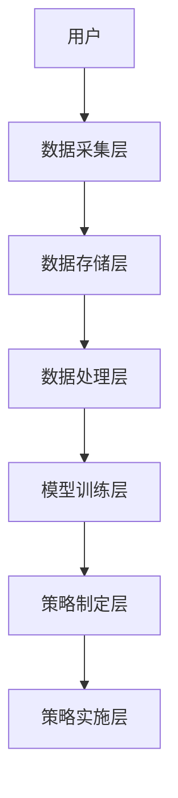

                 


# 《彼得·林奇如何分析公司的用户留存策略》

---

## 关键词：用户留存策略, 彼得·林奇, 用户生命周期, 数据分析, 产品设计, 企业增长

---

## 摘要：用户留存策略是企业增长的关键因素，彼得·林奇通过深入分析用户行为和数据，提出了一套独特的用户留存分析方法。本文详细介绍了彼得·林奇分析方法的核心思想、用户留存的核心概念、算法原理、系统架构设计、项目实战及最佳实践，帮助读者全面理解并掌握用户留存策略的制定和优化。

---

## 第1章: 用户留存策略的背景与基础

### 1.1 用户留存策略的定义与核心概念

用户留存是指用户在使用产品或服务后，持续使用该产品或服务的行为。用户留存策略是通过各种手段和方法，提高用户的留存率，从而实现企业长期增长的重要策略。

#### 1.1.1 用户留存的定义

用户留存通常以日留存、周留存、月留存等指标来衡量。例如，日留存率是指某一天使用过产品的用户在第二天再次使用产品的比例。用户留存率的计算公式为：

$$\text{留存率} = \frac{\text{次日或次周的用户数}}{\text{当日或上周的用户数}} \times 100\%$$

用户留存的核心在于理解用户的行为模式和需求，通过优化产品和服务，提升用户的使用频率和时长。

#### 1.1.2 用户留存的核心要素

用户留存的核心要素包括：

1. **用户行为分析**：通过数据分析，识别用户在产品中的行为特征，如活跃用户数、使用时长、访问频率等。
2. **用户生命周期模型**：将用户分为新用户、活跃用户、流失用户等阶段，针对性地制定留存策略。
3. **产品设计优化**：通过优化产品功能、界面和用户体验，提升用户满意度和留存率。

#### 1.1.3 用户留存与用户生命周期的关系

用户生命周期模型是理解用户留存的重要工具。以下是常见的用户生命周期阶段对比：

| 阶段         | 特征描述                                   | 留存策略建议                     |
|--------------|------------------------------------------|---------------------------------|
| 新用户       | 初次使用产品，行为尚不稳定               | 提供引导和教程，降低流失率       |
| 活跃用户     | 高频使用，表现出强烈的兴趣               | 提供个性化推荐和奖励机制         |
| 流失用户     | 停止使用产品或降低使用频率               | 分析流失原因，针对性地改进产品   |

通过分析用户在不同生命周期阶段的行为，可以制定更有针对性的留存策略。

### 1.2 用户留存策略的重要性

#### 1.2.1 用户留存对企业的价值

用户留存不仅是企业增长的关键驱动力，还能降低获取新用户的成本。例如，通过提高用户留存率，企业可以减少广告投放成本，同时增加用户的生命周期价值（Lifetime Value, LTV）。

#### 1.2.2 用户留存与企业长期发展的关系

用户留存率的高低直接影响企业的收入和利润。高留存率意味着用户更有可能成为长期客户，为企业创造持续的收入。

#### 1.2.3 彼得·林奇分析方法的独特性

彼得·林奇的分析方法强调数据驱动和用户行为分析，通过深入挖掘用户数据，识别潜在的留存机会。这种方法的核心在于将用户行为与产品设计紧密结合，从而制定出更有效的留存策略。

---

## 第2章: 彼得·林奇分析方法的核心思想

### 2.1 彼得·林奇分析方法概述

彼得·林奇的分析方法是一种基于数据驱动的用户留存策略制定方法。以下是该方法的核心思想：

#### 2.1.1 方法的核心理念

彼得·林奇分析方法的核心理念是：

1. **以数据为驱动**：通过收集和分析用户数据，识别用户行为模式和需求。
2. **以用户为中心**：从用户的角度出发，优化产品和服务，提升用户体验。
3. **以结果为导向**：通过实验和测试，验证策略的有效性，并不断优化。

#### 2.1.2 方法的主要步骤

1. **数据收集与分析**：通过用户行为数据分析，识别用户流失的关键节点。
2. **用户分群与画像**：根据用户行为和特征，将用户分为不同群体，制定针对性策略。
3. **策略制定与实施**：根据分析结果，制定并实施用户留存策略。
4. **效果评估与优化**：通过实验和数据分析，评估策略效果，并进行优化。

#### 2.1.3 方法的适用场景

彼得·林奇分析方法适用于各种类型的产品和服务，特别适合那些希望通过数据驱动方法提升用户留存率的企业。

### 2.2 彼得·林奇分析方法的关键要素

#### 2.2.1 用户行为分析

用户行为分析是彼得·林奇分析方法的基础。以下是常见的用户行为分析指标：

- **活跃用户数（DAU/MAU）**：衡量用户使用频率。
- **使用时长**：衡量用户使用深度。
- **转化率**：衡量用户从免费用户转化为付费用户的能力。

#### 2.2.2 用户留存模型

用户留存模型是彼得·林奇分析方法的核心工具之一。以下是常见的用户留存模型：

1. **Cox比例风险模型**：用于预测用户的留存概率，公式如下：

$$\text{风险比} = \frac{\text{事件发生的时间}}{\text{事件未发生的时间}}$$

2. **Kaplan-Meier估计法**：用于估计用户的生存概率，公式如下：

$$\hat{S}(t) = \prod_{i=1}^{k} \frac{n_i - c_i}{n_i}$$

其中，$n_i$表示第$i$个时间段的用户数，$c_i$表示第$i$个时间段内流失的用户数。

#### 2.2.3 数据驱动的决策

彼得·林奇分析方法强调通过数据驱动的决策来制定用户留存策略。以下是数据驱动决策的核心步骤：

1. **数据收集**：通过日志记录和用户调查收集用户行为和反馈数据。
2. **数据分析**：使用统计分析和机器学习算法，识别用户行为模式和趋势。
3. **策略制定**：根据数据分析结果，制定并实施用户留存策略。
4. **效果评估**：通过实验和数据分析，评估策略效果，并进行优化。

### 2.3 彼得·林奇分析方法的优缺点

#### 2.3.1 方法的优点

1. **数据驱动**：通过数据分析，识别用户行为模式和需求，制定更精准的留存策略。
2. **用户中心**：从用户的角度出发，优化产品和服务，提升用户体验。
3. **可量化**：通过数据量化策略效果，便于评估和优化。

#### 2.3.2 方法的局限性

1. **数据依赖**：需要大量高质量的数据支持，否则可能导致分析结果偏差。
2. **实施成本高**：需要投入大量资源，包括数据采集、分析和优化。
3. **复杂性高**：需要专业团队和技术支持，实施难度较大。

#### 2.3.3 方法的改进方向

1. **数据质量提升**：通过数据清洗和预处理，提高数据质量。
2. **工具优化**：开发自动化数据分析工具，提高分析效率。
3. **团队协作**：加强数据分析师、产品经理和技术团队的协作，共同制定和优化策略。

### 2.4 本章小结

彼得·林奇分析方法是一种基于数据驱动的用户留存策略制定方法，通过深入分析用户行为和数据，识别用户需求和行为模式，制定和优化用户留存策略。该方法的核心在于数据驱动、用户中心和结果导向，能够有效提升企业的用户留存率和长期发展能力。

---

## 第3章: 用户留存策略的核心概念与联系

### 3.1 用户留存的核心概念与属性特征

用户留存的核心概念包括用户生命周期模型和用户行为分析。以下是用户生命周期模型的对比：

| 阶段         | 特征描述                                   | 留存策略建议                     |
|--------------|------------------------------------------|---------------------------------|
| 新用户       | 初次使用产品，行为尚不稳定               | 提供引导和教程，降低流失率       |
| 活跃用户     | 高频使用，表现出强烈的兴趣               | 提供个性化推荐和奖励机制         |
| 流失用户     | 停止使用产品或降低使用频率               | 分析流失原因，针对性地改进产品   |

通过对比不同阶段的特征，可以制定更有针对性的留存策略。

### 3.2 用户留存的核心概念与联系

用户留存的核心概念包括用户生命周期模型和用户行为分析。以下是用户行为分析的对比：

| 行为类型     | 行为特征描述                               | 留存策略建议                     |
|--------------|------------------------------------------|---------------------------------|
| 活跃行为     | 用户高频使用产品，表现出强烈的兴趣       | 提供个性化推荐和奖励机制         |
| 低频行为     | 用户使用频率较低，可能处于流失风险阶段   | 分析低频原因，优化产品体验       |
| 流失行为     | 用户停止使用产品或大幅减少使用频率       | 针对流失原因，制定恢复策略       |

通过分析用户行为，可以识别潜在的流失风险，并制定相应的留存策略。

### 3.3 用户留存的核心概念与联系

用户留存的核心概念包括用户生命周期模型和用户行为分析。以下是用户生命周期模型的对比：

| 阶段         | 特征描述                                   | 留存策略建议                     |
|--------------|------------------------------------------|---------------------------------|
| 新用户       | 初次使用产品，行为尚不稳定               | 提供引导和教程，降低流失率       |
| 活跃用户     | 高频使用，表现出强烈的兴趣               | 提供个性化推荐和奖励机制         |
| 流失用户     | 停止使用产品或降低使用频率               | 分析流失原因，针对性地改进产品   |

通过对比不同阶段的特征，可以制定更有针对性的留存策略。

---

## 第4章: 用户留存策略的算法原理

### 4.1 留存模型的数学公式

#### 4.1.1 留存概率计算公式

用户留存概率可以通过Cox比例风险模型进行计算：

$$\text{风险比} = \frac{\text{事件发生的时间}}{\text{事件未发生的时间}}$$

#### 4.1.2 留存概率的计算步骤

1. 收集用户行为数据，包括用户ID、使用时间、使用频率等。
2. 对数据进行清洗和预处理，去除异常值。
3. 使用Cox比例风险模型，计算用户的留存概率。
4. 根据留存概率，制定相应的留存策略。

### 4.2 留存模型的实现步骤

#### 4.2.1 数据预处理

使用Python进行数据清洗和预处理：

```python
import pandas as pd
import numpy as np

# 读取数据
data = pd.read_csv('user_behavior.csv')

# 删除缺失值
data = data.dropna()

# 转换为日期格式
data['date'] = pd.to_datetime(data['date'])
```

#### 4.2.2 留存概率计算

使用Cox比例风险模型计算用户的留存概率：

```python
from lifelines import CoxPHFitter

# 定义模型
model = CoxPHFitter()

# 训练模型
model.fit(data, duration_col='duration', event_col='event')

# 预测留存概率
predicted_risk = model.predict_partial_hazard(data)
```

#### 4.2.3 策略制定

根据用户的留存概率，制定相应的留存策略，例如：

- 针对高风险用户，提供优惠券和个性化推荐。
- 针对低风险用户，提供会员服务和专属福利。

### 4.3 算法实现步骤

1. 数据收集与预处理：收集用户行为数据，清洗和预处理。
2. 模型训练：使用Cox比例风险模型训练用户留存概率。
3. 策略制定：根据模型预测结果，制定相应的留存策略。
4. 策略实施：通过实验和测试，验证策略效果，并进行优化。

---

## 第5章: 用户留存策略的系统分析与架构设计

### 5.1 系统功能设计

用户留存分析系统功能设计包括用户行为分析、留存概率计算和策略制定与实施。

#### 5.1.1 用户行为分析

用户行为分析功能包括：

- 数据可视化：通过图表展示用户行为数据。
- 数据挖掘：使用机器学习算法挖掘用户行为模式。

#### 5.1.2 留存概率计算

留存概率计算功能包括：

- 数据建模：使用Cox比例风险模型进行用户留存概率计算。
- 模型评估：通过实验和测试，评估模型的准确性和稳定性。

#### 5.1.3 策略制定与实施

策略制定与实施功能包括：

- 策略制定：根据模型预测结果，制定相应的留存策略。
- 策略实施：通过A/B测试验证策略效果，并进行优化。

### 5.2 系统架构设计

#### 5.2.1 系统架构图

用户留存分析系统的架构设计如下：



#### 5.2.2 系统功能模块

用户留存分析系统的功能模块包括：

1. 数据采集层：负责采集用户行为数据。
2. 数据存储层：负责存储用户行为数据。
3. 数据处理层：负责数据清洗和预处理。
4. 模型训练层：负责模型训练和预测。
5. 策略制定层：负责策略制定和优化。
6. 策略实施层：负责策略实施和效果评估。

---

## 第6章: 用户留存策略的项目实战

### 6.1 项目背景与目标

#### 6.1.1 项目背景

假设我们正在开发一个电商APP，希望通过提高用户留存率，增加用户的生命周期价值。

#### 6.1.2 项目目标

1. 提高用户日留存率和月留存率。
2. 降低用户流失率，增加用户粘性。

### 6.2 项目环境与工具安装

#### 6.2.1 环境安装

以下是项目所需的环境和工具：

- 操作系统：Windows 10 或 macOS 10.15+
- Python版本：Python 3.8+
- 数据处理工具：Pandas、NumPy
- 数据分析工具：Matplotlib、Seaborn
- 机器学习库：scikit-learn、XGBoost
- 数据可视化工具：Tableau、Power BI

### 6.3 项目核心实现

#### 6.3.1 数据采集与预处理

以下是数据采集与预处理的Python代码：

```python
import pandas as pd
import numpy as np

# 读取数据
data = pd.read_csv('user_behavior.csv')

# 删除缺失值
data = data.dropna()

# 转换为日期格式
data['date'] = pd.to_datetime(data['date'])

# 数据分组
data_grouped = data.groupby('user_id').agg({
    'date': 'max',
    'event': 'sum'
})
```

#### 6.3.2 留存概率计算

以下是使用Cox比例风险模型进行用户留存概率计算的Python代码：

```python
from lifelines import CoxPHFitter

# 定义模型
model = CoxPHFitter()

# 训练模型
model.fit(data_grouped, duration_col='duration', event_col='event')

# 预测留存概率
predicted_risk = model.predict_partial_hazard(data_grouped)
```

#### 6.3.3 策略制定与实施

根据模型预测结果，制定相应的留存策略，例如：

- 针对高风险用户，提供优惠券和个性化推荐。
- 针对低风险用户，提供会员服务和专属福利。

### 6.4 项目小结

通过项目实战，我们能够深入理解彼得·林奇分析方法的应用，掌握用户留存策略的制定和优化方法，从而在实际工作中提升用户的留存率和企业的长期发展能力。

---

## 第7章: 用户留存策略的最佳实践

### 7.1 最佳实践 Tips

1. **数据驱动**：通过数据分析，识别用户行为模式和需求。
2. **用户中心**：从用户的角度出发，优化产品和服务，提升用户体验。
3. **结果导向**：通过实验和测试，验证策略效果，并不断优化。

### 7.2 小结

彼得·林奇分析方法是一种基于数据驱动的用户留存策略制定方法，通过深入分析用户行为和数据，识别用户需求和行为模式，制定和优化用户留存策略。该方法的核心在于数据驱动、用户中心和结果导向，能够有效提升企业的用户留存率和长期发展能力。

### 7.3 注意事项

1. **数据质量**：确保数据的准确性和完整性。
2. **团队协作**：加强数据分析师、产品经理和技术团队的协作，共同制定和优化策略。
3. **持续优化**：通过实验和测试，不断优化策略，提升用户留存率。

### 7.4 拓展阅读

1. 《数据分析实战》：深入讲解数据分析的方法和技巧。
2. 《机器学习实战》：介绍机器学习算法的实现和应用。
3. 《用户增长黑客》：分享用户增长策略和实战经验。

---

## 作者：AI天才研究院/AI Genius Institute & 禅与计算机程序设计艺术/Zen And The Art of Computer Programming

---

以上是《彼得·林奇如何分析公司的用户留存策略》的完整目录大纲和文章内容。

