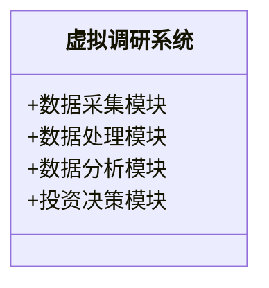
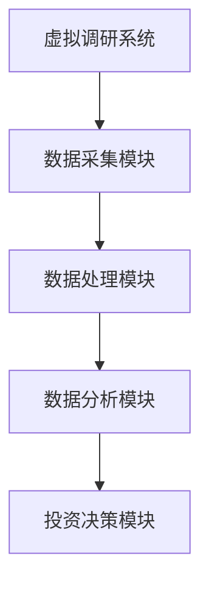
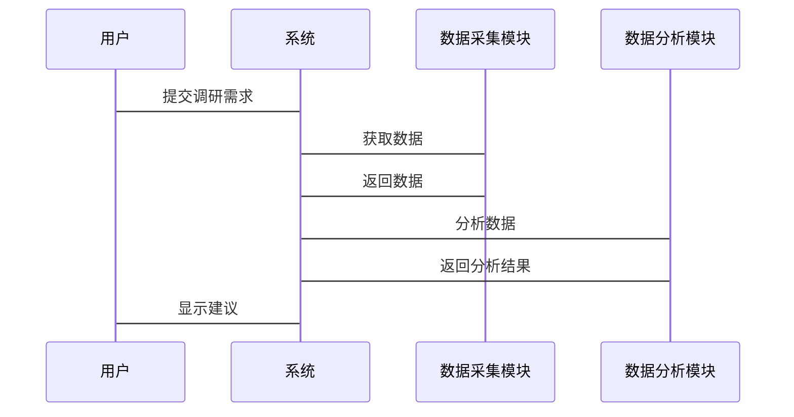

                 


# 彼得林奇的"实地调研"在虚拟经济时代的演变

> 关键词：彼得林奇，实地调研，虚拟经济，投资分析，NLP，数据分析，系统架构

> 摘要：本文探讨了彼得林奇传统的实地调研方法在虚拟经济时代的演变，分析了虚拟调研的核心概念、算法原理、数学模型以及系统架构，并通过案例分析展示了其在投资分析中的应用。

---

## 第1章：彼得林奇"实地调研"的背景与核心概念

### 1.1 彼得林奇"实地调研"的背景介绍

#### 1.1.1 投资界的实地调研传统
- 传统实地调研的核心理念是通过面对面的交流和实地考察，获取企业的真实运营状况。
- 彼得林奇以其耐心和细致著称，通过深入调研企业，挖掘出具有长期投资价值的股票。

#### 1.1.2 彼得林奇投资方法的核心理念
- 以企业基本面分析为基础，注重企业的财务状况、管理团队和市场地位。
- 强调长期投资，避免短期市场波动的干扰。

#### 1.1.3 从传统调研到虚拟调研的演变
- 随着互联网和大数据技术的发展，传统的面对面调研逐渐被虚拟调研所补充甚至替代。
- 虚拟调研通过线上数据采集和分析，快速获取企业的相关信息，提高了调研的效率和广度。

### 1.2 虚拟经济时代的定义与特点

#### 1.2.1 虚拟经济的基本概念
- 虚拟经济是指以数字化、网络化为基础，通过虚拟货币、区块链等技术实现的经济活动。
- 虚拟经济与实体经济相互融合，形成了混合经济模式。

#### 1.2.2 虚拟经济与实体经济的区别
| 特性      | 虚拟经济                     | 实体经济                     |
|-----------|------------------------------|------------------------------|
| 资产形式  | 数字化资产、虚拟货币         | 实物资产、传统货币           |
| 交易方式  | 线上交易、智能合约           | 线下交易、传统合约           |
| 透明度    | 高度透明，数据可追踪         | 透明度较低，依赖信任机制     |

#### 1.2.3 虚拟经济时代投资调研的挑战
- 数据量庞大，信息真伪难辨。
- 线上调研需要依赖技术手段进行数据分析和验证。

### 1.3 彼得林奇实地调研在虚拟经济中的外延

#### 1.3.1 从线下调研到线上调研的转变
- 线下调研依赖于实地考察和面对面交流，而线上调研则通过数据分析和网络爬虫实现。
- 虚拟调研可以快速覆盖更多企业，扩大调研范围。

#### 1.3.2 虚拟调研的核心要素与关键指标
- 数据来源：社交媒体、企业官网、财务报表等。
- 数据分析：利用NLP和大数据技术提取关键信息。
- 风险评估：通过数学模型评估企业的信用风险和市场风险。

#### 1.3.3 虚拟调研与传统调研的对比分析
- 虚拟调研效率高，但缺乏深度；传统调研深度强，但效率低。
- 结合两者的优势，可以实现更全面的调研。

---

## 第2章：彼得林奇"实地调研"的核心概念与联系

### 2.1 虚拟经济时代实地调研的核心概念

#### 2.1.1 虚拟调研的定义与范围
- 虚拟调研是指通过线上数据采集和分析，评估企业或项目的投资价值。
- 其范围涵盖企业基本面分析、市场趋势预测、风险评估等多个方面。

#### 2.1.2 虚拟调研的核心要素分析
- 数据采集：包括社交媒体数据、新闻报道、企业财报等。
- 数据处理：通过NLP技术清洗和结构化数据。
- 数据分析：利用统计学方法和机器学习模型进行预测和评估。

#### 2.1.3 虚拟调研与传统调研的联系与区别
- 虚拟调研可以看作是传统调研的延伸和补充，两者相辅相成。

### 2.2 核心概念的属性特征对比

#### 2.2.1 传统调研与虚拟调研的属性对比
| 特性      | 传统调研                     | 虚拟调研                     |
|-----------|------------------------------|------------------------------|
| 调研方式  | 线下实地考察                 | 线上数据采集和分析           |
| 数据来源  | 企业访谈、实地考察           | 社交媒体、企业官网、新闻等   |
| 信息深度  | 高度个性化，信息全面         | 数据量大，信息可能存在偏差   |
| 调研效率  | 低效，耗时                   | 高效，快速                   |

#### 2.2.2 案例分析：虚拟调研在投资中的应用
- 某互联网公司通过虚拟调研快速评估多个创业公司的市场潜力和财务状况，缩短了投资决策时间。

### 2.3 虚拟调研的核心要素与关键指标

#### 2.3.1 数据采集与处理
- 使用网络爬虫技术从企业官网、社交媒体等渠道获取数据。
- 通过NLP技术提取关键信息，如公司新闻、财务报告中的关键词。

#### 2.3.2 数据分析与建模
- 利用机器学习模型预测企业的未来表现。
- 通过统计分析评估企业的风险水平。

#### 2.3.3 风险评估与投资决策
- 结合虚拟调研结果和传统调研方法，制定综合的投资策略。

---

## 第3章：虚拟经济时代实地调研的算法原理

### 3.1 虚拟调研的算法框架

#### 3.1.1 数据采集与处理流程
- 数据清洗：去除噪声数据，确保数据质量。
- 数据结构化：将非结构化数据转换为结构化数据，便于后续分析。

#### 3.1.2 数据分析与建模方法
- 使用回归分析预测企业的未来收益。
- 基于聚类分析对同行业企业进行分类，找出具有投资潜力的公司。

#### 3.1.3 算法优化与调优策略
- 通过交叉验证优化模型参数。
- 使用分布式计算提高处理效率。

### 3.2 基于NLP的文本分析算法

#### 3.2.1 自然语言处理的基本原理
- 分词：将文本分割成词语。
- 词性标注：标注词语的词性。
- 句法分析：分析句子的语法结构。

#### 3.2.2 文本情感分析的实现流程
1. 数据预处理：清洗文本数据，去除停用词。
2. 特征提取：提取文本中的情感关键词。
3. 模型训练：使用机器学习算法训练情感分类模型。
4. 情感预测：对目标文本进行情感分类。

#### 3.2.3 基于深度学习的文本挖掘算法
- 使用LSTM网络进行文本序列建模。
- 通过注意力机制提高模型对关键信息的关注度。

### 3.3 算法实现的Python代码示例

#### 3.3.1 数据清洗与预处理代码
```python
import pandas as pd
from sklearn.preprocessing import StandardScaler

# 加载数据
data = pd.read_csv('raw_data.csv')

# 数据清洗
data.dropna(inplace=True)
data = data[~data['text'].str.contains(r'\bstopword\b', case=False)]
```

#### 3.3.2 情感分析模型训练代码
```python
from sklearn.feature_extraction.text import TfidfVectorizer
from sklearn.svm import SVC

# 特征提取
vectorizer = TfidfVectorizer()
X = vectorizer.fit_transform(data['text'])

# 模型训练
model = SVC()
model.fit(X, data['label'])
```

#### 3.3.3 文本分类算法实现代码
```python
import numpy as np
from sklearn.metrics import accuracy_score

# 预测标签
y_pred = model.predict(X)

# 计算准确率
accuracy = accuracy_score(data['label'], y_pred)
print(f'Accuracy: {accuracy}')
```

---

## 第4章：虚拟经济时代实地调研的数学模型与公式

### 4.1 数据分析模型

#### 4.1.1 数据清洗与标准化公式
- 标准化公式：  
$$ X_{\text{标准化}} = \frac{X - \mu}{\sigma} $$  
其中，$\mu$ 是均值，$\sigma$ 是标准差。

#### 4.1.2 数据聚类分析的数学模型
- K-means算法的目标函数：  
$$ \min_{K} \sum_{i=1}^{K} \sum_{j=1}^{n} (x_j - c_i)^2 $$  
其中，$c_i$ 是第 $i$ 个聚类中心，$x_j$ 是数据点。

#### 4.1.3 数据回归分析的公式推导
- 线性回归模型：  
$$ y = \beta_0 + \beta_1 x + \epsilon $$  
其中，$\beta_0$ 是截距，$\beta_1$ 是回归系数，$\epsilon$ 是误差项。

### 4.2 情感分析模型

#### 4.2.1 词袋模型与词嵌入公式
- 词袋模型：  
$$ \text{词袋向量} = (w_1, w_2, \dots, w_n) $$  
其中，$w_i$ 表示第 $i$ 个词的出现次数。

#### 4.2.2 LSTM网络的数学表达
- LSTM单元的遗忘门：  
$$ f_t = \sigma(W_f a_{t-1} + U_f x_t) $$  
其中，$a_{t-1}$ 是前一时刻的隐藏状态，$x_t$ 是当前输入，$W_f$ 和 $U_f$ 是参数矩阵，$\sigma$ 是sigmoid函数。

#### 4.2.3 情感分类的损失函数与优化
- 交叉熵损失函数：  
$$ \mathcal{L} = -\sum_{i=1}^{N} y_i \log(p_i) + (1 - y_i) \log(1 - p_i) $$  
其中，$y_i$ 是真实标签，$p_i$ 是模型预测概率。

---

## 第5章：虚拟经济时代实地调研的系统架构设计

### 5.1 系统功能设计

#### 5.1.1 领域模型设计
- 使用Mermaid绘制领域模型类图：


#### 5.1.2 系统架构设计
- 使用Mermaid绘制系统架构图：


### 5.2 系统接口设计

#### 5.2.1 数据接口
- 数据采集模块通过API接口获取企业数据。
- 数据处理模块通过队列与数据采集模块通信。

#### 5.2.2 用户接口
- 提供Web界面供用户输入调研需求。
- 显示分析结果和投资建议。

### 5.3 系统交互设计

#### 5.3.1 交互流程
- 用户输入调研需求。
- 系统调用数据采集模块获取数据。
- 数据处理模块清洗数据。
- 数据分析模块生成报告。
- 投资决策模块提供建议。

#### 5.3.2 交互图


---

## 第6章：虚拟经济时代实地调研的项目实战

### 6.1 环境安装

#### 6.1.1 安装Python环境
- 使用Anaconda安装Python 3.8及以上版本。

#### 6.1.2 安装依赖库
```bash
pip install numpy pandas scikit-learn nltk
```

### 6.2 核心代码实现

#### 6.2.1 数据采集模块
```python
import requests
from bs4 import BeautifulSoup

def fetch_data(url):
    response = requests.get(url)
    soup = BeautifulSoup(response.text, 'html.parser')
    return soup.text
```

#### 6.2.2 数据分析模块
```python
from sklearn.ensemble import RandomForestClassifier

def train_model(X, y):
    model = RandomForestClassifier()
    model.fit(X, y)
    return model
```

#### 6.2.3 投资决策模块
```python
def make_decision(model, X_test):
    predictions = model.predict(X_test)
    return predictions
```

### 6.3 案例分析

#### 6.3.1 数据来源与预处理
- 数据来源：某互联网公司的真实财务数据和社交媒体评论。
- 数据预处理：清洗和结构化数据，去除缺失值。

#### 6.3.2 模型训练与评估
- 训练模型：使用随机森林算法进行分类。
- 评估指标：准确率、召回率、F1分数。

#### 6.3.3 投资决策与结果展示
- 根据模型预测结果，生成投资建议报告。
- 使用可视化工具展示分析结果。

---

## 第7章：总结与展望

### 7.1 总结

- 彼得林奇的实地调研方法在虚拟经济时代得到了新的发展，虚拟调研通过技术手段提高了效率和广度。
- 虚拟调研与传统调研相结合，能够更全面地评估企业的投资价值。

### 7.2 最佳实践 tips

- 在进行虚拟调研时，应结合多种数据源进行交叉验证。
- 使用先进的NLP技术和机器学习算法提高分析精度。
- 定期更新数据源和模型，以适应市场的变化。

### 7.3 小结

- 本文探讨了虚拟经济时代实地调研的演变，分析了其在投资分析中的应用。
- 通过案例分析展示了虚拟调研的实际操作流程。

### 7.4 注意事项

- 数据隐私和安全问题需引起高度重视。
- 虚拟调研结果仅供参考，投资决策需谨慎。

### 7.5 拓展阅读

- 推荐阅读《彼得林奇选股术》了解传统调研方法。
- 关注大数据技术在金融领域的最新应用。

---

## 作者：AI天才研究院/AI Genius Institute & 禅与计算机程序设计艺术 /Zen And The Art of Computer Programming

---

本文通过详细的理论分析和实践案例，探讨了彼得林奇"实地调研"在虚拟经济时代的演变，为投资者提供了新的思路和方法。希望本文能为读者在虚拟经济时代的投资分析中提供有价值的参考。

