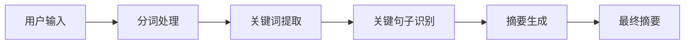
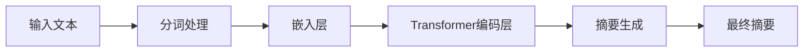
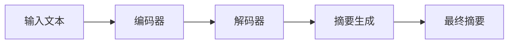
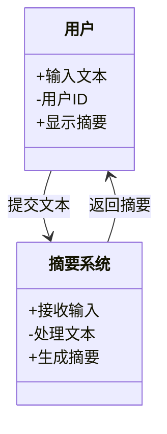
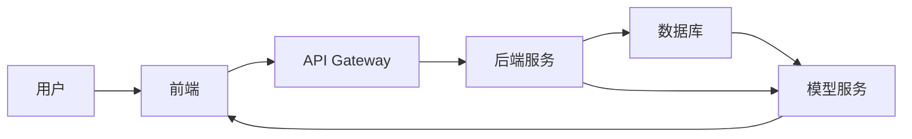

                 


# 文章标题：文本摘要：让AI Agent提炼关键信息

## 关键词：文本摘要、AI Agent、自然语言处理、信息抽取、关键信息提取

## 摘要：  
本文深入探讨了如何利用AI技术从大量文本数据中提炼关键信息。通过介绍文本摘要的基本概念、核心原理和实际应用，结合算法实现和系统设计，详细讲解了如何构建高效的文本摘要系统。文章从理论到实践，系统性地分析了文本摘要在AI Agent中的重要性，为读者提供了全面的技术指导和实践方案。

---

# 第一部分: 文本摘要概述与背景

## 第1章: 文本摘要的基本概念

### 1.1 什么是文本摘要
#### 1.1.1 文本摘要的定义
文本摘要是指从大量文本数据中提取核心信息，生成简洁、准确的摘要。其目标是保留原文的主要内容和关键信息，同时去除冗余和无关信息。

#### 1.1.2 文本摘要的应用场景
- **新闻阅读：** 快速获取新闻的核心内容。
- **学术研究：** 提炼论文的核心观点。
- **商业分析：** 从报告中提取关键数据。
- **AI Agent：** 帮助智能助手快速理解文本内容。

#### 1.1.3 文本摘要的核心目标
- **简洁性：** 摘要长度远小于原文。
- **准确性：** 摘要内容必须忠实于原文。
- **可读性：** 摘要必须通顺易懂。

### 1.2 文本摘要的重要性
#### 1.2.1 在信息过载时代的必要性
- 当前信息量爆炸式增长，用户需要快速获取关键信息。
- 通过摘要，用户可以在短时间内理解文本内容。

#### 1.2.2 在AI Agent中的作用
- 帮助AI Agent快速理解文本内容。
- 为后续的决策提供关键信息支持。

#### 1.2.3 在企业级应用中的价值
- 提高工作效率。
- 降低信息处理成本。
- 增强数据利用效率。

### 1.3 文本摘要的发展历程
#### 1.3.1 传统文本摘要方法
- 基于统计的关键词提取方法。
- 基于规则的句子选择方法。

#### 1.3.2 基于AI的文本摘要技术
- 基于深度学习的抽取式摘要。
- 基于生成模型的生成式摘要。

#### 1.3.3 当前技术发展现状
- 技术逐渐成熟，应用范围不断扩大。
- 多模态摘要技术开始兴起。

### 1.4 本章小结
本章详细介绍了文本摘要的基本概念、应用场景和重要性，为后续章节的深入分析奠定了基础。

---

# 第二部分: 文本摘要的核心概念与联系

## 第2章: 文本摘要的核心原理

### 2.1 文本摘要的分类
#### 2.1.1 抽取式摘要
- **定义：** 从原文中直接抽取关键句子或词语。
- **特点：** 实现简单，效率高。
- **优缺点：** 摘要依赖于原文结构，生成结果可能缺乏连贯性。

#### 2.1.2 生成式摘要
- **定义：** 基于模型生成新的文本内容。
- **特点：** 摘要内容更具灵活性。
- **优缺点：** 需要复杂的模型训练，生成结果可能不够准确。

#### 2.1.3 混合式摘要
- **定义：** 结合抽取和生成两种方法。
- **特点：** 摘要质量更高，但实现复杂。

### 2.2 文本摘要的关键技术
#### 2.2.1 文本理解与分析
- **分词：** 对文本进行分词处理。
- **句法分析：** 分析句子的语法结构。

#### 2.2.2 关键信息提取
- **关键词提取：** 识别文本中的重要词汇。
- **关键句子识别：** 确定文本中的核心句子。

#### 2.2.3 摘要生成策略
- **基于概率的策略：** 使用概率模型生成摘要。
- **基于规则的策略：** 根据预设规则生成摘要。

### 2.3 文本摘要的核心要素
#### 2.3.1 文本特征提取
- **文本长度：** 摘要长度控制。
- **文本主题：** 摘要主题聚焦。

#### 2.3.2 摘要长度控制
- **长度限制：** 根据需求设定摘要长度。
- **重要性排序：** 根据关键词的重要性排序。

#### 2.3.3 语义保持与优化
- **语义相似度计算：** 确保摘要与原文语义一致。
- **语言流畅性优化：** 提升摘要的可读性。

### 2.4 本章小结
本章详细分析了文本摘要的核心概念和技术，为后续章节的算法实现提供了理论基础。

### 2.5 核心概念对比表
| 技术特点 | 抽取式摘要 | 生成式摘要 |
|----------|------------|------------|
| 方法     | 基于关键词抽取 | 基于模型生成 |
| 优势     | 高效准确 | 创意性强 |
| 缺点     | 依赖原文结构 | 需要大量数据训练 |

### 2.6 实体关系图


---

# 第三部分: 文本摘要的算法原理

## 第3章: 基于深度学习的文本摘要算法

### 3.1 基于BERT的文本摘要
#### 3.1.1 BERT模型简介
- **全称：** Bidirectional Encoder Representations from Transformers。
- **特点：** 预训练语言模型，适用于多种NLP任务。

#### 3.1.2 BERT模型的工作流程


#### 3.1.3 BERT模型的数学公式
- **输入表示：**
  $$ \text{Input} = [ \text{CLS}, x_1, x_2, ..., x_n, \text{SEP} ] $$
- **编码层：**
  $$ \text{Output} = \text{Transformer}(\text{Input}) $$
- **摘要生成：**
  $$ \text{Summary} = \text{生成模型}(\text{Output}) $$

### 3.2 基于Seq2Seq的文本摘要
#### 3.2.1 Seq2Seq模型简介
- **编码器-解码器结构：** 将文本编码为向量，再解码为摘要。

#### 3.2.2 Seq2Seq模型的工作流程


#### 3.2.3 Seq2Seq模型的数学公式
- **编码器输出：**
  $$ h_i = \text{Encoder}(x_i) $$
- **解码器输出：**
  $$ y_i = \text{Decoder}(h_i, y_{i-1}) $$

### 3.3 代码实现
```python
import tensorflow as tf
from tensorflow.keras.layers import Dense, LSTM

# 定义编码器
def encoder(input_shape):
    input_layer = Input(shape=input_shape)
    lstm_layer = LSTM(128)(input_layer)
    return Model(input_layer, lstm_layer)

# 定义解码器
def decoder(input_shape):
    input_layer = Input(shape=input_shape)
    lstm_layer = LSTM(128)(input_layer)
    dense_layer = Dense(10, activation='softmax')(lstm_layer)
    return Model(input_layer, dense_layer)

# 构建Seq2Seq模型
encoder_model = encoder((max_length, vocabulary_size))
decoder_model = decoder((128,))

# 编译模型
encoder_model.compile(optimizer='adam', loss='categorical_crossentropy')
decoder_model.compile(optimizer='adam', loss='categorical_crossentropy')

# 训练模型
encoder_model.fit(x_train, y_train, epochs=10, batch_size=32)
decoder_model.fit(x_test, y_test, epochs=10, batch_size=32)
```

### 3.4 本章小结
本章详细讲解了基于深度学习的文本摘要算法，重点介绍了BERT和Seq2Seq模型的实现原理和代码实现。

---

# 第四部分: 文本摘要的系统分析与架构设计

## 第4章: 文本摘要系统的架构设计

### 4.1 问题场景介绍
- **场景描述：** 从大量新闻文章中提取关键摘要。
- **目标：** 提供快速、准确的摘要服务。

### 4.2 系统功能设计
#### 4.2.1 领域模型


#### 4.2.2 系统架构


### 4.3 接口设计
- **输入接口：** 提供文本输入接口。
- **输出接口：** 提供摘要输出接口。

### 4.4 交互流程
```mermaid
sequenceDiagram
    用户 ->+> 前端: 提交文本
    前端 ->+> API Gateway: 请求处理
    API Gateway ->+> 后端服务: 调用摘要生成
    后端服务 ->+> 数据库: 获取模型
    后端服务 ->+> 用户: 返回摘要
```

### 4.5 本章小结
本章详细描述了文本摘要系统的架构设计和交互流程，为后续的项目实现提供了明确的方向。

---

# 第五部分: 文本摘要的项目实战

## 第5章: 文本摘要项目的实现

### 5.1 环境搭建
- **安装Python和相关库：**
  ```bash
  pip install numpy tensorflow keras
  ```

### 5.2 核心代码实现
#### 5.2.1 文本预处理
```python
import numpy as np
from tensorflow.keras.preprocessing.text import Tokenizer

# 初始化分词器
tokenizer = Tokenizer(num_words=10000)
tokenizer.fit_on_texts(texts)
```

#### 5.2.2 模型训练
```python
from tensorflow.keras.models import Model
from tensorflow.keras.layers import Input, LSTM, Dense

# 定义编码器
encoder_input = Input(shape=(max_length,))
encoder_lstm = LSTM(128)(encoder_input)
encoder_model = Model(encoder_input, encoder_lstm)

# 定义解码器
decoder_input = Input(shape=(128,))
decoder_lstm = LSTM(128)(decoder_input)
decoder_dense = Dense(vocabulary_size, activation='softmax')(decoder_lstm)
decoder_model = Model(decoder_input, decoder_dense)

# 编译模型
encoder_model.compile(optimizer='adam', loss='categorical_crossentropy')
decoder_model.compile(optimizer='adam', loss='categorical_crossentropy')

# 训练模型
encoder_model.fit(x_train, y_train, epochs=10, batch_size=32)
decoder_model.fit(x_test, y_test, epochs=10, batch_size=32)
```

#### 5.2.3 摘要生成
```python
def generate_summary(text):
    encoded = encoder_model.predict(np.array([text]))
    decoded = decoder_model.predict(encoded)
    return decoded
```

### 5.3 案例分析
#### 5.3.1 实际案例
- **输入文本：** 一篇新闻文章。
- **输出摘要：** 生成的摘要内容。

#### 5.3.2 案例解读
- **输入处理：** 文本预处理和分词。
- **模型应用：** 模型生成摘要。
- **结果分析：** 摘要的准确性和可读性分析。

### 5.4 本章小结
本章通过实际案例详细讲解了文本摘要项目的实现过程，从环境搭建到代码实现，再到案例分析，为读者提供了完整的实践指导。

---

# 第六部分: 文本摘要的最佳实践

## 第6章: 最佳实践与小结

### 6.1 小结
- **核心内容回顾：** 文本摘要的基本概念、算法原理和系统设计。
- **关键技术总结：** 抽取式和生成式摘要的优缺点。

### 6.2 注意事项
- **数据质量：** 数据预处理的重要性。
- **模型选择：** 根据需求选择合适的模型。
- **性能优化：** 模型训练和优化技巧。

### 6.3 拓展阅读
- **相关技术：** 多模态摘要、实时摘要。
- **未来趋势：** AI驱动的智能摘要系统。

### 6.4 本章小结
本章总结了文本摘要的最佳实践，为读者提供了实际应用中的注意事项和未来发展方向。

---

# 作者：AI天才研究院/AI Genius Institute & 禅与计算机程序设计艺术 /Zen And The Art of Computer Programming

---

**摘要**：通过本文的系统性分析和实践，读者可以全面理解文本摘要的核心原理和实现方法，掌握如何利用AI技术构建高效的文本摘要系统。

