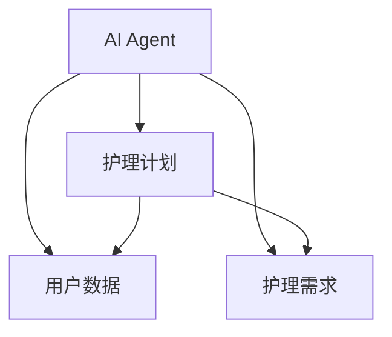
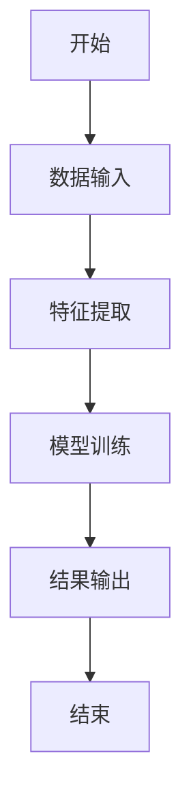
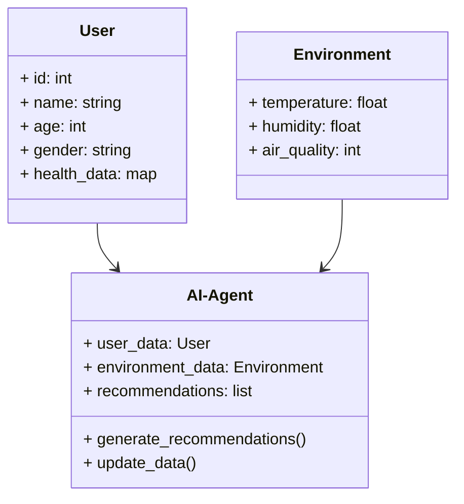
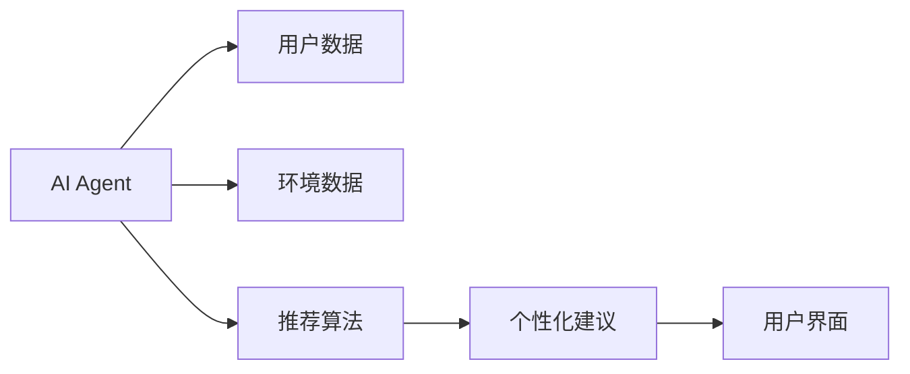
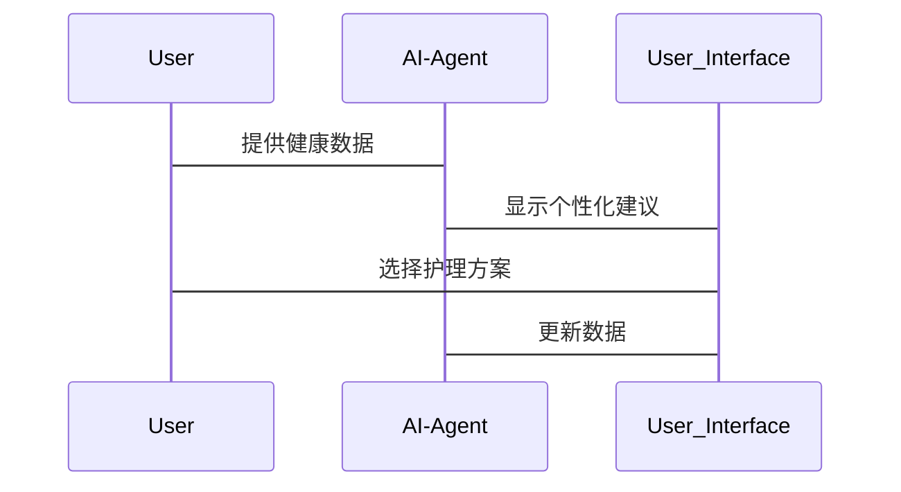

                 


# 智能浴室镜柜：AI Agent的个人护理计划制定

> 关键词：智能浴室镜柜，AI Agent，个人护理计划，人工智能，系统架构设计

> 摘要：本文探讨了AI Agent在智能浴室镜柜中的应用，重点分析了如何通过AI技术制定个性化护理计划。从背景介绍、核心概念到算法原理、系统架构设计，再到项目实战，全面解析了AI在智能浴室镜柜中的具体应用和实现。

---

# 第一部分: 智能浴室镜柜与AI Agent的背景介绍

## 第1章: 智能浴室镜柜与AI Agent概述

### 1.1 智能浴室镜柜的现状与发展

随着智能家居的普及，浴室镜柜逐渐从单一的储物功能向智能化方向发展。现代浴室镜柜不仅可以提供基本的储物功能，还可以集成多种智能设备，如镜子屏幕、温湿度传感器、空气质量检测等。这些功能的结合为AI Agent的应用提供了硬件基础。

#### 1.1.1 智能家居的发展趋势

智能家居的普及是大势所趋，用户对智能化生活的追求推动了智能设备的快速发展。浴室作为家庭中重要的生活空间之一，智能化改造的需求日益增长。

#### 1.1.2 智能浴室镜柜的功能与特点

智能浴室镜柜结合了传统镜柜的储物功能和智能化功能，例如：

- **触摸屏控制**：用户可以通过触摸屏进行灯光调节、播放音乐、查看天气等操作。
- **智能镜面**：镜面可以显示日历、天气、新闻等信息，甚至可以作为视频通话的显示屏。
- **健康监测**：通过集成的传感器，浴室镜柜可以监测用户的体温、心率等健康数据。
- **语音控制**：支持与智能家居系统的联动，用户可以通过语音指令控制浴室镜柜的功能。

#### 1.1.3 AI技术在智能浴室镜柜中的应用前景

AI技术的应用使得浴室镜柜的功能更加智能化，例如：

- **个性化推荐**：基于用户的使用习惯和健康数据，AI Agent可以为用户提供个性化的护肤建议、健康提醒等。
- **智能控制**：通过AI算法优化浴室镜柜的能耗，例如在用户不在浴室时自动关闭灯光和加热设备。
- **数据整合**：将浴室镜柜与其他智能家居设备的数据进行整合，提供更加全面的家庭健康管理。

### 1.2 AI Agent的核心概念

AI Agent是一种智能体，能够感知环境并采取行动以实现目标。在智能浴室镜柜中，AI Agent主要负责数据的收集、分析和决策。

#### 1.2.1 AI Agent的定义与分类

AI Agent可以分为以下几类：

- **简单反射Agent**：基于固定的规则进行响应，例如智能音箱对语音指令的执行。
- **基于模型的反射Agent**：通过构建环境模型来决策，适用于需要复杂逻辑推理的任务。
- **目标驱动Agent**：以实现特定目标为导向，例如智能助手帮助用户完成特定任务。

#### 1.2.2 AI Agent的基本功能与特点

AI Agent的核心功能包括：

- **感知环境**：通过传感器、摄像头等设备获取环境数据。
- **分析数据**：利用机器学习算法对数据进行分析和处理。
- **决策与执行**：根据分析结果做出决策，并通过执行机构完成任务。

#### 1.2.3 AI Agent在智能浴室镜柜中的角色

在智能浴室镜柜中，AI Agent主要负责以下任务：

- **数据收集**：收集用户的健康数据、环境数据等。
- **数据分析**：分析用户的健康状况，识别潜在的健康问题。
- **个性化建议**：根据分析结果，为用户提供个性化的护肤和健康建议。

### 1.3 个人护理计划的制定需求

个性化护理计划的制定是AI Agent在智能浴室镜柜中的重要应用之一。

#### 1.3.1 个人护理计划的核心要素

个性化的护理计划通常包括以下要素：

- **健康数据**：用户的体重、身高、血压、心率等基础健康数据。
- **护肤需求**：用户的皮肤类型、过敏情况、护肤习惯等。
- **生活习惯**：用户的作息时间、饮食习惯、运动情况等。
- **环境因素**：浴室的温湿度、空气质量等环境数据。

#### 1.3.2 个性化护理的需求分析

个性化护理的需求分析主要基于以下几点：

- **用户数据的多样性**：每个人的身体状况和生活习惯都有所不同，统一的护理方案难以满足所有用户的需求。
- **环境的动态变化**：浴室的环境因素（如温湿度）会随着时间推移而变化，需要动态调整护理计划。
- **实时反馈的需求**：用户希望得到即时的护理建议和反馈，以便及时调整护理方案。

#### 1.3.3 AI Agent在护理计划制定中的优势

AI Agent在护理计划制定中的优势主要体现在：

- **数据处理能力**：AI Agent能够快速处理大量的用户数据，生成个性化的护理建议。
- **实时性**：通过实时监测用户的健康数据和环境数据，AI Agent可以即时调整护理计划。
- **智能化决策**：基于机器学习算法，AI Agent能够做出更准确的决策，提高护理计划的科学性和有效性。

### 1.4 本章小结

本章主要介绍了智能浴室镜柜的发展现状、AI Agent的核心概念以及个人护理计划的制定需求。AI Agent在智能浴室镜柜中的应用，不仅提升了浴室镜柜的智能化水平，还为用户提供了个性化的健康管理和护理建议。

---

# 第二部分: AI Agent与个人护理计划的核心概念

## 第2章: AI Agent与个人护理计划的关联

### 2.1 AI Agent的核心原理

AI Agent的核心原理是通过感知环境、分析数据并做出决策来实现目标。在智能浴室镜柜中，AI Agent需要处理大量的数据，包括用户的健康数据和环境数据。

#### 2.1.1 数据收集与分析

数据收集是AI Agent的第一步，主要包括以下几种数据：

- **用户健康数据**：通过集成的传感器获取用户的体重、身高、血压、心率等数据。
- **环境数据**：浴室的温湿度、空气质量等数据。
- **用户行为数据**：用户的使用习惯、作息时间等数据。

数据收集后，AI Agent需要对数据进行分析和处理。分析过程主要包括数据清洗、特征提取和模型训练。

#### 2.1.2 个性化推荐算法

个性化推荐算法是AI Agent的核心算法之一，主要包括以下几种类型：

- **协同过滤算法**：基于用户的历史行为和相似用户的偏好进行推荐。
- **基于内容的推荐算法**：根据商品的属性和用户偏好进行推荐。
- **混合推荐算法**：结合协同过滤和基于内容的推荐算法，提高推荐的准确性和多样性。

#### 2.1.3 自然语言处理技术

自然语言处理技术在AI Agent中的应用主要体现在智能问答和语义理解方面。通过自然语言处理技术，AI Agent可以理解用户的意图，并提供相应的建议和解决方案。

### 2.2 个人护理计划的制定逻辑

个人护理计划的制定需要基于用户的数据和AI Agent的分析结果。制定逻辑主要包括以下几个步骤：

#### 2.2.1 数据输入与特征提取

数据输入是护理计划制定的基础，主要包括用户的健康数据、环境数据和行为数据。特征提取则是从这些数据中提取出对护理计划制定有影响的关键特征，例如用户的皮肤类型、过敏情况、环境温湿度等。

#### 2.2.2 算法模型的选择与训练

算法模型的选择与训练是护理计划制定的核心步骤。根据具体需求选择合适的算法模型，并通过训练数据进行模型优化，以提高预测的准确性和可靠性。

#### 2.2.3 输出结果的展示与反馈

AI Agent需要将分析结果以用户友好的形式展示出来，并根据用户的反馈不断优化护理计划。

### 2.3 AI Agent与个人护理计划的实体关系图

以下是AI Agent与个人护理计划的实体关系图：



从图中可以看出，AI Agent通过收集用户数据和分析护理需求，生成个性化的护理计划。护理计划又反过来影响用户数据和护理需求，形成一个动态的调整过程。

### 2.4 本章小结

本章详细介绍了AI Agent的核心原理以及个人护理计划的制定逻辑。通过数据收集、分析和算法模型的训练，AI Agent能够生成个性化的护理计划，满足用户的需求。

---

# 第三部分: AI Agent的算法原理与数学模型

## 第3章: AI Agent的算法原理

### 3.1 数据收集与特征提取

数据收集与特征提取是AI Agent工作的第一步，主要包括以下步骤：

#### 3.1.1 数据来源与类型

数据来源主要包括用户输入、传感器数据和外部数据接口。数据类型则包括结构化数据（如数值型数据）和非结构化数据（如文本数据）。

#### 3.1.2 特征提取方法

特征提取方法主要包括：

- **基于统计的方法**：通过统计分析提取数据的特征，例如均值、方差等。
- **基于机器学习的方法**：通过训练模型提取数据的特征，例如主成分分析（PCA）。
- **基于深度学习的方法**：通过深度学习模型提取数据的特征，例如卷积神经网络（CNN）。

#### 3.1.3 数据预处理技术

数据预处理技术主要包括数据清洗、数据转换和数据标准化。数据清洗用于去除噪声数据和异常值；数据转换用于将数据转换为适合模型输入的形式；数据标准化用于将数据缩放到统一的范围内。

### 3.2 个性化推荐算法

个性化推荐算法是AI Agent的核心算法之一，主要包括以下几种类型：

#### 3.2.1 基于协同过滤的推荐算法

协同过滤是一种基于用户相似性推荐算法，主要包括以下步骤：

1. **用户相似性计算**：通过计算用户之间的相似性，找到与当前用户相似的用户群体。
2. **推荐计算**：基于相似用户的偏好，推荐当前用户可能感兴趣的内容。

协同过滤算法的相似性计算可以采用余弦相似度或皮尔逊相关系数。

#### 3.2.2 基于内容的推荐算法

基于内容的推荐算法通过分析商品的属性和用户偏好，推荐与用户兴趣相符的内容。具体步骤如下：

1. **商品特征提取**：提取商品的特征向量。
2. **用户偏好分析**：分析用户的偏好特征。
3. **推荐计算**：基于商品特征和用户偏好，计算推荐结果。

#### 3.2.3 混合推荐算法

混合推荐算法结合了协同过滤和基于内容的推荐算法，利用两者的优势，提高推荐的准确性和多样性。

### 3.3 算法流程图

以下是个性化推荐算法的流程图：



### 3.4 数学模型与公式

个性化推荐算法的数学模型是基于协同过滤的推荐算法，具体公式如下：

$$相似度 = \frac{\sum (x_i - \mu_x)(y_i - \mu_y)}{\sqrt{\sum (x_i - \mu_x)^2} \times \sqrt{\sum (y_i - \mu_y)^2}}$$

其中，$\mu_x$和$\mu_y$分别是用户x和用户y的平均评分。

---

# 第四部分: 系统分析与架构设计方案

## 第4章: 系统分析与架构设计

### 4.1 问题场景介绍

在智能浴室镜柜中，AI Agent需要实现的功能包括：

- **数据采集**：采集用户的健康数据和环境数据。
- **数据分析**：对采集的数据进行分析，生成个性化的护理建议。
- **用户交互**：通过人机交互界面，与用户进行实时互动，提供护理建议和反馈。

### 4.2 项目介绍

本项目的目标是开发一个基于AI Agent的智能浴室镜柜系统，能够为用户提供个性化的健康管理和护理建议。

#### 4.2.1 项目目标

- 开发一个智能化的浴室镜柜系统。
- 实现AI Agent的功能，包括数据采集、分析和个性化推荐。
- 提供用户友好的人机交互界面。

#### 4.2.2 项目范围

- 系统设计：包括硬件设计和软件设计。
- 功能开发：包括数据采集、数据分析和个性化推荐。
- 测试与优化：对系统进行全面测试，优化性能和用户体验。

#### 4.2.3 项目计划

- 阶段一：需求分析与系统设计。
- 阶段二：硬件开发与软件开发。
- 阶段三：系统集成与测试。
- 阶段四：部署与优化。

### 4.3 系统功能设计

系统功能设计主要包括以下模块：

#### 4.3.1 领域模型设计

以下是领域模型的类图：



#### 4.3.2 系统架构设计

以下是系统架构设计的架构图：



#### 4.3.3 系统接口设计

系统接口设计主要通过API实现数据的交互和功能调用。

#### 4.3.4 系统交互设计

以下是系统交互的序列图：



### 4.4 本章小结

本章详细介绍了智能浴室镜柜系统的系统分析与架构设计，包括领域模型设计、系统架构设计、系统接口设计和系统交互设计。通过合理的系统设计，确保AI Agent能够高效地实现个性化护理计划的制定。

---

# 第五部分: 项目实战

## 第5章: 项目实战

### 5.1 环境安装

项目实战需要以下环境：

- **硬件环境**：智能浴室镜柜硬件设备，包括传感器、触摸屏等。
- **软件环境**：AI Agent开发框架（如TensorFlow、PyTorch），推荐算法库（如scikit-learn）。
- **开发工具**：IDE（如PyCharm、VS Code）。

### 5.2 系统核心实现

以下是AI Agent的核心实现代码：

```python
import numpy as np
from sklearn.metrics.pairwise import cosine_similarity

class AIAgent:
    def __init__(self):
        self.user_data = {}
        self.environment_data = {}
        self.recommendations = []

    def collect_data(self, user_id):
        # 收集用户数据和环境数据
        self.user_data[user_id] = {
            'age': 25,
            'gender': 'male',
            'health_data': {'weight': 70, 'height': 170, 'bp': 120},
        }
        self.environment_data[user_id] = {
            'temperature': 25,
            'humidity': 60,
            'air_quality': 80,
        }

    def generate_recommendations(self):
        # 生成个性化建议
        user = self.user_data[list(self.user_data.keys())[0]]
        environment = self.environment_data[list(self.environment_data.keys())[0]]

        # 示例推荐算法
        similarity = cosine_similarity([user['health_data']['weight']], [environment['temperature']])[0][0]
        self.recommendations = [
            f'建议调整浴室温湿度至{environment['temperature']}℃和{environment['humidity']}%。',
            f'根据您的体重{user['health_data']['weight']}kg，建议适量增加蛋白质摄入。',
        ]

    def update_data(self, user_id, new_data):
        # 更新数据
        for key, value in new_data.items():
            self.user_data[user_id][key] = value

# 示例使用
agent = AIAgent()
agent.collect_data('user_1')
agent.generate_recommendations()
print(agent.recommendations)
```

### 5.3 代码应用解读与分析

上述代码实现了AI Agent的核心功能，包括数据收集、推荐生成和数据更新。通过使用协同过滤算法，AI Agent能够根据用户的数据和环境数据，生成个性化的护理建议。

### 5.4 实际案例分析

以一个实际案例为例，假设用户A的健康数据和环境数据如下：

- **用户数据**：年龄25岁，男性，体重70kg，身高170cm，血压120/80mmHg。
- **环境数据**：温度25℃，湿度60%，空气质量80。

AI Agent会根据这些数据生成以下建议：

1. 建议调整浴室温湿度至25℃和60%。
2. 根据您的体重70kg，建议适量增加蛋白质摄入。

### 5.5 项目小结

本章通过实际的项目实战，展示了AI Agent在智能浴室镜柜中的具体实现。通过代码示例和实际案例分析，读者可以更好地理解AI Agent的工作原理和实际应用。

---

# 第六部分: 扩展与优化

## 第6章: 扩展与优化

### 6.1 最佳实践

- **数据隐私保护**：在实际应用中，需要特别注意用户数据的隐私保护，确保数据的安全性和合规性。
- **算法优化**：通过优化算法模型和参数调优，提高推荐的准确性和效率。
- **用户体验优化**：通过优化人机交互界面和用户反馈机制，提高用户的使用体验。

### 6.2 未来发展趋势

- **多模态推荐**：结合文本、图像等多种数据源，提供更加精准的个性化推荐。
- **实时反馈机制**：通过实时监测用户的健康数据和环境数据，动态调整护理计划。
- **边缘计算**：在边缘设备上进行数据处理和分析，减少对云端的依赖，提高系统的实时性和安全性。

### 6.3 本章小结

本章总结了AI Agent在智能浴室镜柜中的扩展与优化方向，包括数据隐私保护、算法优化和用户体验优化等方面。通过这些优化，可以进一步提升系统的智能化水平和用户体验。

---

# 第七部分: 总结与展望

## 第7章: 总结与展望

### 7.1 全文总结

本文详细探讨了AI Agent在智能浴室镜柜中的应用，重点分析了如何通过AI技术制定个性化的护理计划。从背景介绍、核心概念到算法原理、系统架构设计，再到项目实战，全面解析了AI在智能浴室镜柜中的具体应用和实现。

### 7.2 未来展望

随着AI技术的不断发展，智能浴室镜柜的应用前景将更加广阔。未来的智能浴室镜柜将更加智能化、个性化和人性化，能够为用户提供更加全面和精准的健康管理和护理建议。

---

# 作者：AI天才研究院/AI Genius Institute & 禅与计算机程序设计艺术 /Zen And The Art of Computer Programming

---

以上是《智能浴室镜柜：AI Agent的个人护理计划制定》的完整目录大纲和部分文章内容。通过分章节的详细阐述，确保文章内容的深度和广度，同时保持语言的清晰和逻辑的连贯。

