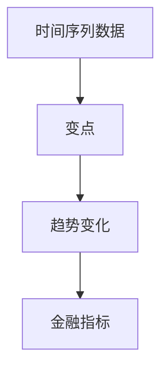
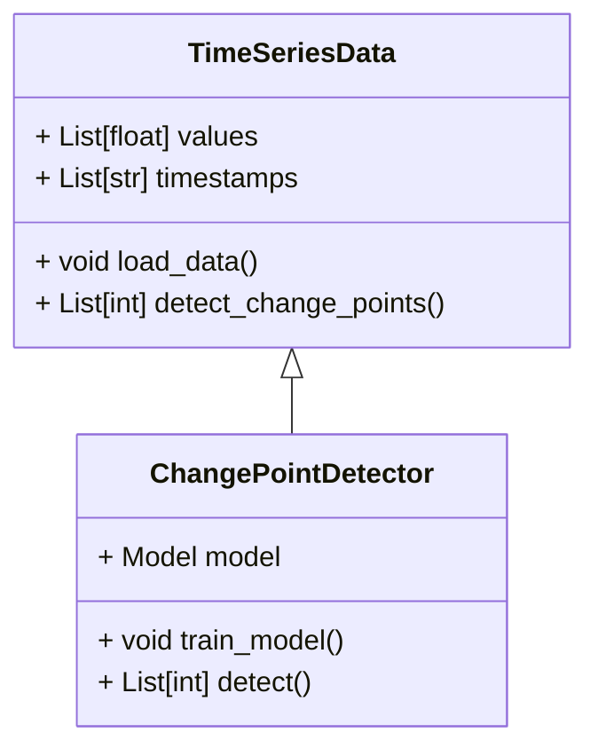
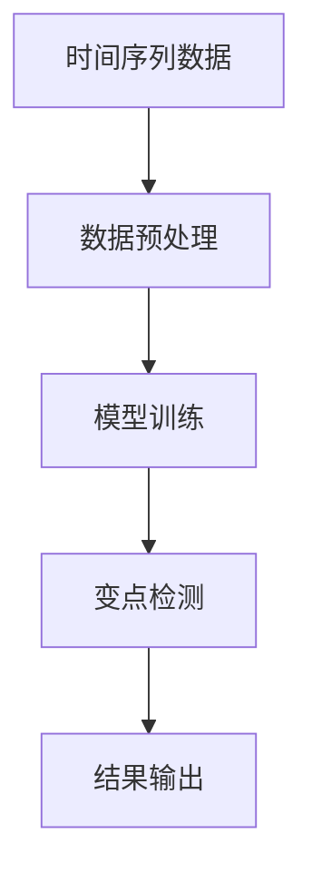
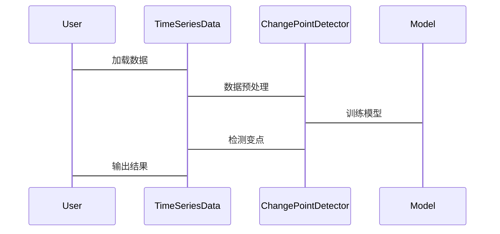

                 


# 金融时间序列趋势变点检测

> 关键词：时间序列分析，变点检测，金融数据分析，统计方法，机器学习，LSTM，时间序列神经网络

> 摘要：本文详细探讨了金融时间序列趋势变点检测的核心概念、算法原理、系统设计和实际应用。通过对比统计方法和机器学习方法，分析了各自的优势和局限性，并结合实际案例，展示了如何利用这些方法在金融数据中检测趋势变化点。文章还提供了详细的代码实现和系统架构设计，帮助读者更好地理解和应用这些技术。

---

# 第一部分: 问题背景与定义

## 第1章: 问题背景与定义

### 1.1 问题背景

#### 1.1.1 金融时间序列分析的重要性
金融市场的数据本质上是时间序列数据，例如股票价格、汇率、指数等。这些数据往往具有波动性、趋势性、周期性和随机性等特点。对这些数据进行分析，可以帮助投资者和交易员做出更明智的决策，例如预测市场趋势、识别风险点、优化投资组合等。

#### 1.1.2 趋势变点检测的定义与意义
趋势变点检测是指在时间序列数据中识别出趋势发生变化的点。例如，股票价格从长期上涨趋势突然转为下跌趋势，或者从下跌趋势转为上涨趋势。这种变点的检测对于金融市场的风险管理、交易策略制定和投资决策具有重要意义。

#### 1.1.3 金融数据分析中的挑战
金融数据具有高度的复杂性和不确定性，传统的统计方法和现代的机器学习方法都需要面对以下挑战：
1. **噪声干扰**：金融市场数据中存在大量的随机噪声，如何有效地提取信号是关键问题。
2. **非线性关系**：金融数据往往表现出非线性特征，传统的线性模型可能无法捕捉到这些复杂关系。
3. **异常值处理**：金融市场中的异常事件（如市场崩盘、突发事件）会对数据产生重大影响，如何处理这些异常值是一个重要问题。
4. **计算效率**：金融数据通常规模较大，实时分析的需求对算法的计算效率提出了更高的要求。

### 1.2 问题描述

#### 1.2.1 时间序列数据的特点
时间序列数据具有以下特点：
1. **有序性**：数据按时间顺序排列。
2. **连续性**：数据通常是在连续的时间点上采集的。
3. **趋势性**：数据可能表现出长期的上升或下降趋势。
4. **周期性**：数据可能具有一定的周期性，如日、周、月周期等。
5. **随机性**：数据中通常包含随机噪声。

#### 1.2.2 趋势变点的数学定义
趋势变点是指时间序列数据中趋势发生变化的点。数学上，可以定义为：
$$ \text{变点位置 } t^* = \argmax_{1 \leq t \leq n-1} | \mu(t+1) - \mu(t) | $$
其中，$\mu(t)$ 表示时间点 $t$ 的趋势值。

#### 1.2.3 金融场景中的变点类型
在金融场景中，变点类型可以分为以下几种：
1. **均值变点**：趋势的平均值发生变化。
2. **方差变点**：波动性的变化。
3. **趋势变点**：趋势的方向发生变化。
4. **拐点**：趋势的曲率发生变化。

### 1.3 问题解决方法

#### 1.3.1 统计方法与机器学习方法的对比
统计方法和机器学习方法在趋势变点检测中的对比：

| 方法类型 | 统计方法 | 机器学习方法 |
|----------|----------|--------------|
| 优点     | 简单高效 | 高精度       |
| 缺点     | 易受分布影响 | 计算复杂     |

#### 1.3.2 变点检测的关键步骤
变点检测的关键步骤包括：
1. **数据预处理**：去除噪声、处理缺失值。
2. **模型选择**：选择适合的统计模型或机器学习模型。
3. **变点检测**：基于模型计算变点位置。
4. **结果验证**：通过回测或其他方法验证检测结果的有效性。

#### 1.3.3 常用工具与框架
常用的工具和框架包括：
1. **统计工具**：Python的 `statsmodels` 库。
2. **机器学习框架**：TensorFlow、PyTorch。
3. **时间序列分析工具**：`prophet`、`arima`。

### 1.4 本章小结
本章介绍了金融时间序列趋势变点检测的重要性和基本概念，分析了金融数据分析中的主要挑战，并总结了变点检测的关键步骤和常用工具。

---

# 第二部分: 核心概念与联系

## 第2章: 变点检测的核心概念

### 2.1 变点检测的基本原理

#### 2.1.1 统计变点检测方法
统计变点检测方法基于统计学原理，例如卡方检验、似然比检验等。这些方法假设数据服从某种分布，通过比较不同时间段的统计量来判断是否存在变点。

#### 2.1.2 基于机器学习的变点检测
基于机器学习的变点检测方法包括无监督学习（如聚类）和深度学习（如LSTM）。这些方法能够捕捉数据中的非线性特征，但计算复杂度较高。

#### 2.1.3 混合方法的优缺点
混合方法结合了统计方法和机器学习方法的优势，但在实际应用中需要权衡计算效率和检测精度。

### 2.2 核心概念对比

#### 2.2.1 ER实体关系图
变点检测的实体关系图如下：



### 2.3 本章小结
本章详细介绍了变点检测的核心概念和基本原理，分析了统计方法和机器学习方法的优缺点，并通过实体关系图展示了变点检测在金融数据中的应用。

---

# 第三部分: 算法原理讲解

## 第3章: 统计变点检测算法

### 3.1 均值变点检测

#### 3.1.1 基于卡方检验的均值变点检测
卡方检验用于比较两个时间段内的均值差异是否显著。具体步骤如下：

1. 将数据分为两部分：前 $t$ 个数据点和后 $n-t$ 个数据点。
2. 计算两部分的均值和方差。
3. 计算卡方统计量：
   $$ \chi^2 = \frac{n}{2} \left( (\bar{x}_1 - \bar{x}_2)^2 / \sigma^2 \right) $$
4. 通过卡方分布表判断是否存在显著差异。

#### 3.1.2 似然比检验的数学模型
似然比检验用于比较两个假设下的似然函数比值。假设 $H_0$ 和 $H_1$ 分别表示无变点和有变点的情况。似然比为：
$$ L = \frac{p(x|\theta_1)}{p(x|\theta_0)} $$

#### 3.1.3 示例代码实现
以下是基于卡方检验的均值变点检测的Python代码示例：

```python
import numpy as np
from scipy import stats

def mean_shift_test(data):
    n = len(data)
    for i in range(1, n):
        t_stat, p_val = stats.ttest_ind(data[:i], data[i:])
        if p_val < 0.05:
            return i
    return None
```

---

## 第4章: 机器学习方法

### 4.1 基于LSTM的变点检测

#### 4.1.1 LSTM网络原理
长短时记忆网络（LSTM）是一种特殊的RNN，能够有效捕捉时间序列中的长期依赖关系。LSTM的核心组件包括输入门、遗忘门和输出门。

#### 4.1.2 变点检测的实现步骤
1. 将时间序列数据分成训练集和测试集。
2. 构建LSTM模型，训练模型预测未来值。
3. 计算预测值与实际值的残差。
4. 通过残差分析检测变点。

#### 4.1.3 示例代码实现
以下是基于LSTM的变点检测的Python代码示例：

```python
import numpy as np
from tensorflow.keras.models import Sequential
from tensorflow.keras.layers import LSTM, Dense

def lstm_anomaly_detection(data, window_size=30):
    model = Sequential()
    model.add(LSTM(64, return_sequences=True, input_shape=(window_size, 1)))
    model.add(LSTM(32, return_sequences=False))
    model.add(Dense(1))
    model.compile(optimizer='adam', loss='mean_squared_error')

    # 训练模型
    model.fit(data, data, epochs=5, batch_size=32)

    # 预测残差
    predictions = model.predict(data)
    residuals = np.abs(predictions - data)

    # 检测变点
    threshold = np.percentile(residuals, 95)
    change_points = []
    for i in range(len(residuals)):
        if residuals[i] > threshold:
            change_points.append(i)
    return change_points
```

---

## 第5章: 系统分析与架构设计

### 5.1 系统功能设计

#### 5.1.1 领域模型
以下是领域模型的类图：



### 5.2 系统架构设计

#### 5.2.1 系统架构图
以下是系统架构的流程图：



### 5.3 接口设计

#### 5.3.1 数据接口
1. 数据加载接口：`load_data()`
2. 数据预处理接口：`preprocess()`

#### 5.3.2 模型接口
1. 模型训练接口：`train_model()`
2. 变点检测接口：`detect_change_points()`

### 5.4 交互设计

#### 5.4.1 交互流程图
以下是交互流程的序列图：



---

## 第6章: 项目实战

### 6.1 环境安装

#### 6.1.1 安装Python和相关库
```bash
pip install numpy scipy statsmodels tensorflow keras
```

#### 6.1.2 安装时间序列分析工具
```bash
pip install statsmodels prophet
```

### 6.2 核心代码实现

#### 6.2.1 统计方法实现
以下是基于卡方检验的均值变点检测的Python代码：

```python
import numpy as np
from scipy import stats

def mean_shift_test(data):
    n = len(data)
    for i in range(1, n):
        t_stat, p_val = stats.ttest_ind(data[:i], data[i:])
        if p_val < 0.05:
            return i
    return None
```

#### 6.2.2 机器学习方法实现
以下是基于LSTM的变点检测的Python代码：

```python
import numpy as np
from tensorflow.keras.models import Sequential
from tensorflow.keras.layers import LSTM, Dense

def lstm_anomaly_detection(data, window_size=30):
    model = Sequential()
    model.add(LSTM(64, return_sequences=True, input_shape=(window_size, 1)))
    model.add(LSTM(32, return_sequences=False))
    model.add(Dense(1))
    model.compile(optimizer='adam', loss='mean_squared_error')

    model.fit(data, data, epochs=5, batch_size=32)

    predictions = model.predict(data)
    residuals = np.abs(predictions - data)

    threshold = np.percentile(residuals, 95)
    change_points = []
    for i in range(len(residuals)):
        if residuals[i] > threshold:
            change_points.append(i)
    return change_points
```

### 6.3 案例分析与结果解读

#### 6.3.1 数据来源与预处理
以某股票的历史收盘价数据为例，首先进行数据清洗和归一化处理。

#### 6.3.2 变点检测结果
通过上述算法检测到的变点位置及其趋势变化。

---

# 第七部分: 总结与展望

## 第7章: 总结与展望

### 7.1 本章总结
本文详细探讨了金融时间序列趋势变点检测的核心概念、算法原理、系统设计和实际应用。通过对比统计方法和机器学习方法，分析了各自的优势和局限性，并结合实际案例，展示了如何利用这些方法在金融数据中检测趋势变化点。

### 7.2 未来研究方向
1. **混合方法的优化**：探索统计方法和机器学习方法的结合，以提高检测精度和计算效率。
2. **在线变点检测**：研究如何实时检测变点，以应对金融市场的实时需求。
3. **深度学习模型的改进**：探索更先进的深度学习模型，如Transformer架构，在变点检测中的应用。

---

# 作者

作者：AI天才研究院/AI Genius Institute & 禅与计算机程序设计艺术 /Zen And The Art of Computer Programming

