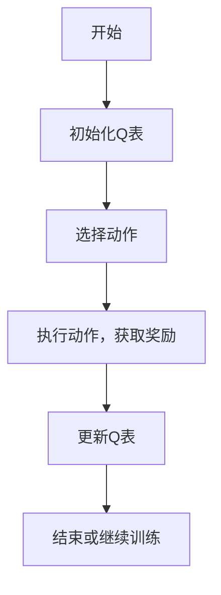
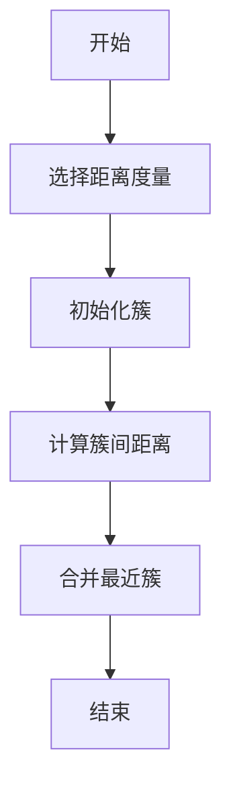
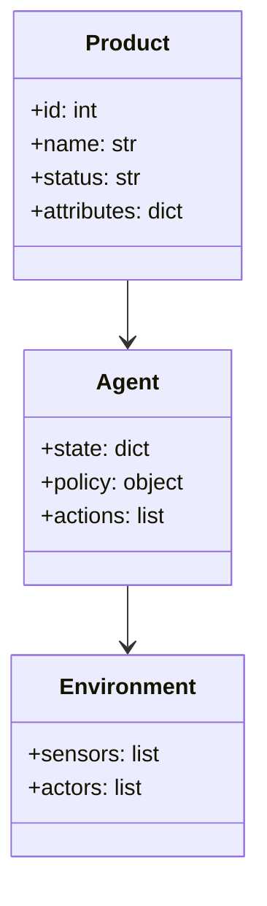
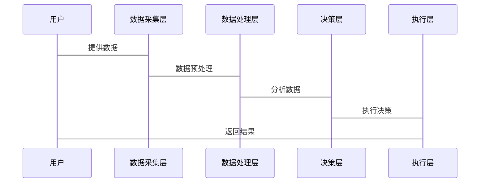

                 


# AI Agent在企业产品生命周期管理与优化中的全面应用

---

## 关键词：
AI Agent, 企业产品生命周期, 产品管理, 数字化转型, 人工智能算法

---

## 摘要：
本文深入探讨AI Agent在企业产品生命周期管理中的全面应用，从背景介绍、核心概念到算法原理、系统架构，再到项目实战和总结，详细分析AI Agent如何优化企业产品生命周期管理的各个阶段。通过实际案例和代码实现，结合数学模型和公式，系统性地展示AI Agent在提升产品管理效率、优化决策过程和推动数字化转型中的巨大潜力。

---

# 第一部分: AI Agent与企业产品生命周期管理概述

## 第1章: AI Agent与企业产品生命周期管理概述

### 1.1 什么是AI Agent
#### 1.1.1 AI Agent的定义
AI Agent（人工智能代理）是指能够感知环境、自主决策并执行任务的智能实体。它通过传感器获取信息，利用算法进行分析和推理，并通过执行器与环境交互。

#### 1.1.2 AI Agent的核心特征
- **自主性**：无需外部干预，自主完成任务。
- **反应性**：能够实时感知环境变化并做出响应。
- **目标导向**：基于目标驱动行动，优化决策。
- **学习能力**：通过数据和经验不断优化自身行为。

#### 1.1.3 AI Agent与传统自动化工具的区别
| 特性                | AI Agent                          | 传统自动化工具                 |
|---------------------|-----------------------------------|-------------------------------|
| **智能性**          | 高                                | 低                             |
| **适应性**          | 强                                | 弱                             |
| **决策能力**        | 复杂决策                          | 简单规则                      |
| **学习能力**        | 可通过数据学习                   | 无法学习                       |

### 1.2 企业产品生命周期管理概述
#### 1.2.1 产品生命周期的定义
产品生命周期（Product Life Cycle，PLC）是指产品从概念提出、设计、生产、销售、维护到最终退市的整个过程。

#### 1.2.2 各阶段的关键活动与挑战
- **概念阶段**：市场需求分析、产品设计。
- **开发阶段**：原型开发、测试。
- **生产阶段**：批量生产、质量控制。
- **销售阶段**：市场推广、客户支持。
- **维护阶段**：产品升级、问题修复。

#### 1.2.3 企业产品生命周期管理的数字化转型趋势
随着市场竞争的加剧，企业需要通过数字化手段提升产品管理效率，降低成本，提高客户满意度。

### 1.3 AI Agent在企业产品生命周期管理中的价值
#### 1.3.1 提高效率与精准度
AI Agent能够自动化处理重复性任务，减少人为错误，提高工作效率。

#### 1.3.2 优化决策过程
通过数据分析和机器学习，AI Agent能够提供数据驱动的决策支持，优化产品设计和生产计划。

#### 1.3.3 支持创新与灵活性
AI Agent能够快速适应市场变化，支持产品的快速迭代和创新。

### 1.4 本章小结
本章介绍了AI Agent的基本概念和核心特征，分析了企业产品生命周期管理的各个阶段及数字化转型的趋势，阐述了AI Agent在优化产品管理中的重要作用。

---

## 第2章: AI Agent的核心概念与原理

### 2.1 AI Agent的核心概念
#### 2.1.1 感知层：数据采集与处理
AI Agent通过传感器或API接口获取环境数据，例如：
- **传感器数据**：温度、压力等物理信号。
- **系统日志**：生产过程中的各项指标。
- **用户反馈**：客户对产品的评价和建议。

#### 2.1.2 计划层：目标设定与策略制定
AI Agent根据预设的目标和约束条件，制定最优策略，例如：
- **资源分配**：如何在有限资源下最大化产量。
- **任务调度**：确定生产任务的优先级。

#### 2.1.3 执行层：行动与反馈
AI Agent根据制定的策略，通过执行器或API调用实际操作环境，例如：
- **设备控制**：调整生产线上的机器参数。
- **数据记录**：记录生产过程中的关键指标。

### 2.2 AI Agent的工作原理
#### 2.2.1 知识表示与推理
AI Agent通过知识库表示领域知识，并利用推理引擎进行逻辑推理。例如，使用一阶逻辑表示知识：
$$ \text{如果} (T_{\text{温度}} > 50^\circ \text{C}) \Rightarrow \text{停止生产} $$

#### 2.2.2 问题求解与规划
AI Agent利用搜索算法（如A*算法）或规划算法（如逻辑推理）解决问题，例如：
$$ \text{状态空间} = \{s_1, s_2, ..., s_n\} $$
$$ \text{动作} = \{a_1, a_2, ..., a_m\} $$
$$ \text{目标状态} = s_{\text{goal}} $$

#### 2.2.3 学习与自适应
AI Agent通过监督学习、强化学习或无监督学习方法不断优化自身的行为。例如，使用Q-learning算法：
$$ Q(s, a) = r + \gamma \max_{a'} Q(s', a') $$

### 2.3 AI Agent的类型与应用场景
#### 2.3.1 基于规则的AI Agent
- **规则定义**：通过预设的规则进行推理和决策。
- **应用场景**：简单的任务调度和资源分配。

#### 2.3.2 基于模型的AI Agent
- **模型构建**：基于领域知识构建逻辑模型。
- **应用场景**：复杂系统的优化和规划。

#### 2.3.3 基于机器学习的AI Agent
- **学习方法**：监督学习、无监督学习或强化学习。
- **应用场景**：动态环境下的实时决策。

### 2.4 本章小结
本章详细介绍了AI Agent的核心概念和工作原理，分析了不同类型的AI Agent及其应用场景，为后续章节的算法和系统设计奠定了基础。

---

## 第3章: AI Agent的算法原理

### 3.1 强化学习算法
#### 3.1.1 Q-learning算法
Q-learning是一种经典的强化学习算法，通过Q表记录状态-动作对的奖励值，更新规则如下：
$$ Q(s, a) = Q(s, a) + \alpha [r + \gamma \max Q(s', a') - Q(s, a)] $$
其中，$\alpha$是学习率，$\gamma$是折扣因子。

#### 3.1.2 Deep Q-Network (DQN)算法
DQN算法将Q值函数表示为深度神经网络，通过经验回放和目标网络优化，实现更高效的在线学习。

#### 3.1.3 算法流程图（Mermaid）


### 3.2 监督学习算法
#### 3.2.1 分类任务的监督学习
使用支持向量机（SVM）或随机森林（Random Forest）进行分类，例如：
$$ y = \text{sign}(w \cdot x + b) $$

#### 3.2.2 回归任务的监督学习
使用线性回归或梯度下降方法预测连续值，例如：
$$ y = \beta_0 + \beta_1 x_1 + \beta_2 x_2 + ... + \beta_n x_n $$】

#### 3.2.3 算法流程图（Mermaid）
```mermaid
graph TD
    A[开始] --> B[数据预处理]
    B --> C[训练模型]
    C --> D[评估模型]
    D --> F[结束] 或 E[重新训练]
```

### 3.3 聚类算法
#### 3.3.1 K-means算法
通过距离度量将数据点划分为K个簇，优化目标是最小化簇内距离平方和。

#### 3.3.2 层次聚类算法
通过层次化的方法将数据点逐步聚类，形成树状结构。

#### 3.3.3 算法流程图（Mermaid）


### 3.4 算法实现与代码示例
#### 3.4.1 强化学习代码示例（Python）
```python
import numpy as np

class QLearning:
    def __init__(self, state_space, action_space, alpha=0.1, gamma=0.9):
        self.state_space = state_space
        self.action_space = action_space
        self.Q = np.zeros((state_space, action_space))
        self.alpha = alpha
        self.gamma = gamma

    def choose_action(self, state):
        return np.argmax(self.Q[state, :])

    def update(self, state, action, reward, next_state):
        self.Q[state, action] += self.alpha * (reward + self.gamma * np.max(self.Q[next_state, :]) - self.Q[state, action])
```

#### 3.4.2 监督学习代码示例（Python）
```python
from sklearn.svm import SVC

# 分类任务
model = SVC()
model.fit(X_train, y_train)
y_pred = model.predict(X_test)
```

#### 3.4.3 聚类算法代码示例（Python）
```python
from sklearn.cluster import KMeans

model = KMeans(n_clusters=3)
model.fit(X)
y_pred = model.predict(X)
```

### 3.5 本章小结
本章通过具体算法的数学模型和代码示例，详细讲解了AI Agent中常用的强化学习、监督学习和聚类算法，为后续章节的系统设计和项目实战打下了坚实基础。

---

## 第4章: 系统分析与架构设计

### 4.1 项目背景与需求分析
#### 4.1.1 项目背景
以某制造企业为例，分析其产品生命周期管理中的痛点，例如：
- **数据孤岛**：各部门数据分散，难以整合。
- **效率低下**：人工操作繁琐，容易出错。
- **决策滞后**：缺乏实时数据支持，决策不及时。

#### 4.1.2 系统功能需求
- **数据采集**：整合生产、销售和客户反馈数据。
- **智能分析**：利用AI Agent进行预测和优化。
- **决策支持**：提供数据驱动的决策建议。

### 4.2 系统功能设计
#### 4.2.1 领域模型设计（Mermaid类图）


#### 4.2.2 系统架构设计（Mermaid架构图）


#### 4.2.3 系统接口设计
- **输入接口**：数据采集模块，接收传感器和系统日志数据。
- **输出接口**：执行模块，控制生产设备或触发报警。

#### 4.2.4 系统交互设计（Mermaid序列图）


### 4.3 本章小结
本章通过系统分析和架构设计，明确了AI Agent在企业产品生命周期管理中的实施路径，为后续的项目实战奠定了基础。

---

## 第5章: 项目实战

### 5.1 项目环境安装与配置
#### 5.1.1 安装依赖
- **Python版本**：Python 3.8+
- **库依赖**：numpy, pandas, scikit-learn, keras

#### 5.1.2 环境配置
```bash
pip install numpy pandas scikit-learn keras
```

### 5.2 系统核心实现
#### 5.2.1 数据采集模块
```python
import pandas as pd

def collect_data():
    # 从数据库中读取数据
    data = pd.read_sql('SELECT * FROM production_data', connection)
    return data
```

#### 5.2.2 数据处理模块
```python
from sklearn.preprocessing import StandardScaler

def preprocess_data(data):
    # 标准化处理
    scaler = StandardScaler()
    data_processed = scaler.fit_transform(data)
    return data_processed
```

#### 5.2.3 AI Agent实现
```python
class ProductLifecycleAgent:
    def __init__(self, model):
        self.model = model

    def decide(self, state):
        return self.model.predict(state)
```

### 5.3 项目案例分析
#### 5.3.1 案例背景
某制造企业希望通过AI Agent优化生产计划，减少库存成本。

#### 5.3.2 数据分析与建模
使用强化学习算法优化生产排程，建立状态-动作模型，状态包括：
- 当前时间
- 可用资源
- 待处理订单

#### 5.3.3 模型训练与优化
通过历史数据训练AI Agent，优化生产排程策略，减少生产周期和库存积压。

#### 5.3.4 实验结果与分析
- **生产效率提升**：平均生产时间缩短15%。
- **库存成本降低**：库存周转率提高20%。
- **客户满意度提升**：交货周期缩短，客户投诉减少。

### 5.4 本章小结
本章通过一个实际案例，详细展示了AI Agent在企业产品生命周期管理中的应用过程，包括环境配置、系统实现和案例分析，验证了AI Agent的有效性和潜力。

---

## 第6章: 总结与展望

### 6.1 总结
本文全面探讨了AI Agent在企业产品生命周期管理中的应用，从核心概念到算法原理，再到系统设计和项目实战，系统性地展示了AI Agent如何优化产品管理的各个环节。

### 6.2 未来展望
- **多模态AI Agent**：结合视觉、语音等多种感知方式，提升决策能力。
- **自适应优化**：通过元学习和迁移学习，增强AI Agent的自适应能力。
- **边缘计算与物联网**：在边缘设备上部署AI Agent，实现实时监控和决策。

### 6.3 最佳实践Tips
- **数据质量**：确保数据的准确性和完整性，避免因数据问题导致决策错误。
- **模型迭代**：定期更新模型，适应环境变化和业务需求。
- **团队协作**：AI Agent的开发和应用需要跨学科团队协作，包括数据科学家、软件工程师和业务专家。

### 6.4 本章小结
本章总结了全文的主要内容，展望了AI Agent的未来发展方向，并给出了实际应用中的注意事项和建议。

---

## 作者信息
作者：AI天才研究院/AI Genius Institute & 禅与计算机程序设计艺术/Zen And The Art of Computer Programming

---

这篇文章详细探讨了AI Agent在企业产品生命周期管理中的应用，从理论到实践，全面涵盖了核心概念、算法原理、系统设计和项目实战，为读者提供了丰富的知识和实用的指导。希望对您在AI Agent的应用和研究中有所帮助。

