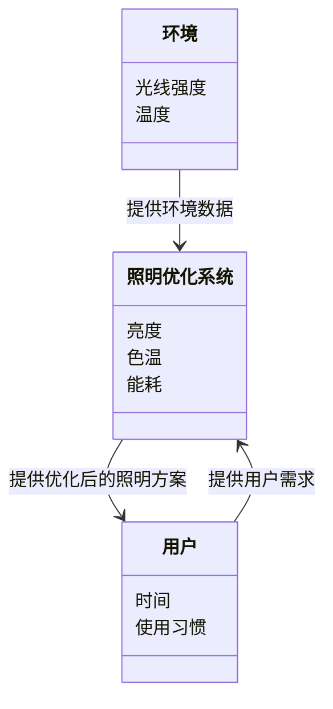
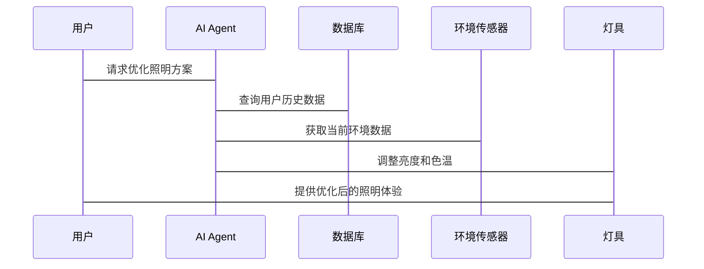

                 


# AI Agent在智能书桌灯中的照明优化

> 关键词：AI Agent, 智能书桌灯, 照明优化, 算法原理, 系统架构

> 摘要：本文探讨了AI Agent在智能书桌灯中的应用，详细分析了AI Agent的核心原理、优化算法、系统架构以及实际项目实现。通过理论与实践结合，展示了如何利用AI技术实现智能书桌灯的高效照明优化。

---

# 引言

在现代生活中，照明系统的智能化和个性化需求日益增长。智能书桌灯作为办公和学习场景中的重要工具，其照明质量直接影响用户的健康和效率。传统的书桌灯存在亮度固定、色温单一、无法根据环境和用户需求自动调整等问题。随着人工智能（AI）技术的快速发展，AI Agent（智能代理）逐渐被应用于智能书桌灯的照明优化中，以实现更智能、更个性化的照明体验。

本文将从AI Agent的基本概念、照明优化的背景与问题、算法原理、系统架构、项目实战等方面展开分析，详细阐述AI Agent在智能书桌灯中的应用及其带来的优化效果。

---

# 第一部分: AI Agent与智能书桌灯的核心概念

## 第1章: AI Agent的核心原理与功能

### 1.1 AI Agent的定义与特点

AI Agent是一种能够感知环境、自主决策并执行任务的智能系统。它通过传感器获取环境信息，结合预设的目标和规则，执行优化或决策操作。AI Agent的特点包括：

1. **自主性**：能够在没有人工干预的情况下独立运行。
2. **反应性**：能够实时感知环境变化并做出反应。
3. **学习性**：通过数据学习优化策略，提升性能。
4. **适应性**：能够根据环境变化调整自身行为。

### 1.2 AI Agent的核心功能

AI Agent在智能书桌灯中的核心功能包括：

1. **环境感知**：通过光线传感器、温度传感器等感知环境亮度、温度等参数。
2. **需求分析**：根据用户的行为模式和时间，预测用户的照明需求。
3. **优化决策**：基于感知数据和用户需求，优化照明参数（如亮度、色温）。
4. **个性化推荐**：根据用户习惯提供个性化照明方案。

### 1.3 AI Agent与智能书桌灯的结合

AI Agent通过与智能书桌灯的硬件和软件结合，实现照明系统的智能化控制。例如，AI Agent可以根据用户的工作习惯调整亮度，根据环境光线变化自动调节色温，从而提供更舒适的照明体验。

---

## 第2章: 智能书桌灯的核心概念与需求

### 2.1 智能书桌灯的基本组成

智能书桌灯通常包括以下组件：

1. **光源模块**：提供可调节的亮度和色温。
2. **传感器模块**：如光线传感器、人体传感器、温度传感器等。
3. **控制模块**：负责接收传感器数据并执行控制指令。
4. **通信模块**：通过Wi-Fi或蓝牙与用户设备（如手机、电脑）连接，接收用户指令或上传数据。

### 2.2 用户需求与痛点

用户在使用书桌灯时，通常面临以下痛点：

1. **亮度固定**：传统书桌灯的亮度无法根据环境或时间自动调整。
2. **色温单一**：缺乏多样化的色温选择，无法满足不同场景的需求。
3. **能耗高**：长时间使用高亮度灯光会浪费能源。
4. **缺乏个性化**：无法根据用户的习惯提供个性化的照明方案。

### 2.3 智能书桌灯的优化目标

智能书桌灯的优化目标包括：

1. **提高能源效率**：通过智能调节亮度和色温，降低能耗。
2. **提升用户体验**：根据用户习惯和环境变化，提供更舒适的照明体验。
3. **延长使用寿命**：通过优化控制策略，延长灯具的使用寿命。

---

## 第3章: AI Agent在智能书桌灯中的应用背景

### 3.1 照明优化的背景

随着人们对工作和学习效率的追求，照明优化成为提升用户体验的重要手段。智能书桌灯的照明优化不仅可以提高用户的工作效率，还能保护用户的视力健康。

### 3.2 问题描述

传统书桌灯的照明系统存在以下问题：

1. **亮度单一**：无法根据环境光线变化自动调整亮度。
2. **色温固定**：缺乏多样化的色温调节，无法满足不同场景需求。
3. **能耗高**：长时间使用高亮度灯光会浪费能源。
4. **缺乏智能化**：无法根据用户习惯和环境变化提供个性化的照明方案。

### 3.3 AI Agent的应用价值

AI Agent通过智能化的感知和决策能力，可以有效解决上述问题。例如，AI Agent可以根据环境光线变化自动调节亮度和色温，根据用户的使用习惯提供个性化的照明方案，从而实现高效节能和舒适的照明体验。

---

# 第二部分: AI Agent在智能书桌灯中的算法原理

## 第4章: 照明优化算法的基本原理

### 4.1 AI Agent的感知与决策机制

AI Agent通过以下步骤实现照明优化：

1. **环境感知**：通过光线传感器感知环境亮度。
2. **需求分析**：分析用户的使用习惯和当前时间，预测用户的照明需求。
3. **优化决策**：根据感知数据和需求分析，优化照明参数（如亮度、色温）。
4. **执行与反馈**：调整灯具的亮度和色温，并根据用户反馈进一步优化。

### 4.2 基于AI的优化算法

#### 4.2.1 遗传算法（Genetic Algorithm）

遗传算法是一种模拟生物进化过程的优化算法。在照明优化中，可以将亮度和色温作为优化目标，通过遗传算法找到最优解。

**步骤**：
1. **编码**：将亮度和色温参数编码为基因。
2. **选择**：选择适应度较高的基因进行繁殖。
3. **交叉**：将两个基因的特征进行交叉组合。
4. **变异**：随机改变基因的某些特征以引入多样性。
5. **迭代**：重复上述过程，直到找到最优解。

#### 4.2.2 模拟退火算法（Simulated Annealing）

模拟退火算法是一种全局优化算法，适用于复杂的照明优化问题。其核心思想是通过逐步降温，找到全局最优解。

**步骤**：
1. **初始化**：随机选择一个初始解。
2. **邻域搜索**：随机选择一个邻域解。
3. **接受概率**：如果邻域解的适应度优于当前解，则接受；否则，以一定的概率接受。
4. **降温**：逐渐降低温度，减少接受劣解的概率。
5. **终止条件**：当温度降到一定程度或达到迭代次数时，停止优化。

### 4.3 算法实现的数学模型

#### 4.3.1 遗传算法的数学模型

目标函数：
$$
f(x) = \text{亮度} + \text{色温} + \text{能耗}
$$

适应度函数：
$$
f(x) = \frac{1}{\text{能耗}} + \frac{1}{\text{亮度}}
$$

#### 4.3.2 模拟退火算法的数学模型

目标函数：
$$
f(x) = \text{亮度} \times \text{色温} \times \text{能耗}
$$

适应度函数：
$$
f(x) = \frac{1}{\text{能耗}} \times \frac{1}{\text{亮度}}
$$

---

## 第5章: 系统分析与架构设计

### 5.1 系统功能设计

#### 5.1.1 领域模型设计

以下是智能书桌灯的领域模型图（使用Mermaid）：



#### 5.1.2 系统架构设计

以下是系统架构图（使用Mermaid）：

```mermaid
client
    用户
server
    AI Agent
    照明优化系统
    数据库
    灯具
```

#### 5.1.3 接口设计

以下是接口设计的序列图（使用Mermaid）：



---

## 第6章: 项目实战与实现

### 6.1 环境安装与配置

#### 6.1.1 开发环境

- 操作系统：Windows/Mac/Linux
- 开发工具：Python（推荐）
- 依赖库：numpy, scikit-learn, matplotlib

#### 6.1.2 安装步骤

1. 安装Python。
2. 安装依赖库：
   ```bash
   pip install numpy scikit-learn matplotlib
   ```

---

### 6.2 系统核心实现

#### 6.2.1 AI Agent的实现

以下是AI Agent的代码实现：

```python
import numpy as np
from sklearn.model_selection import train_test_split
from sklearn.linear_model import LinearRegression

# 生成数据
X = np.random.rand(100, 2)  # 两个特征：环境亮度和用户需求
y = np.random.rand(100)     # 目标：优化后的亮度

# 划分训练集和测试集
X_train, X_test, y_train, y_test = train_test_split(X, y, test_size=0.2)

# 训练模型
model = LinearRegression()
model.fit(X_train, y_train)

# 预测
y_pred = model.predict(X_test)
```

#### 6.2.2 照明优化算法的实现

以下是基于遗传算法的照明优化代码：

```python
import random

# 初始化种群
def initialize_population(population_size, num_genes):
    return [random.random() * num_genes for _ in range(population_size)]

# 适应度函数
def fitness(individual):
    # 计算能耗、亮度、色温等指标
    return 1 / (1 + sum(individual))

# 选择函数
def selection(population, fitness_values, k):
    # 选择适应度较高的个体
    selected_indices = np.argsort(fitness_values)[-k:]
    return [population[i] for i in selected_indices]

# 交叉函数
def crossover(parent1, parent2):
    # 单点交叉
    point = len(parent1) // 2
    return parent1[:point] + parent2[point:], parent2[:point] + parent1[point:]

# 变异函数
def mutation(individual, mutation_rate):
    for i in range(len(individual)):
        if random.random() < mutation_rate:
            individual[i] = random.random()

# 遗传算法主函数
def genetic_algorithm(population_size, num_genes, generations, mutation_rate):
    population = initialize_population(population_size, num_genes)
    for _ in range(generations):
        fitness_values = [fitness(individual) for individual in population]
        selected = selection(population, fitness_values, population_size // 2)
        next_population = []
        for i in range(0, len(selected), 2):
            parent1 = selected[i]
            parent2 = selected[i+1]
            child1, child2 = crossover(parent1, parent2)
            mutation(child1, mutation_rate)
            mutation(child2, mutation_rate)
            next_population.extend([child1, child2])
        population = next_population
    return population

# 示例运行
best = genetic_algorithm(10, 2, 10, 0.1)
print("最优解：", best[0])
```

---

## 第7章: 总结与展望

### 7.1 本章小结

本文详细介绍了AI Agent在智能书桌灯中的应用，从核心概念到算法实现，再到系统架构设计，展示了如何利用AI技术实现智能书桌灯的高效照明优化。通过遗传算法和模拟退火算法的实现，本文提供了一种优化照明参数的方法，从而提升了用户的使用体验和能源效率。

### 7.2 未来展望

未来，随着AI技术的不断发展，智能书桌灯的照明优化将更加智能化和个性化。例如，结合计算机视觉技术，AI Agent可以实时分析用户的注意力和情绪，动态调整照明参数，提供更智能的照明体验。

---

# 作者

作者：AI天才研究院/AI Genius Institute & 禅与计算机程序设计艺术 /Zen And The Art of Computer Programming

