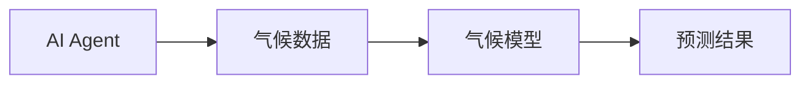
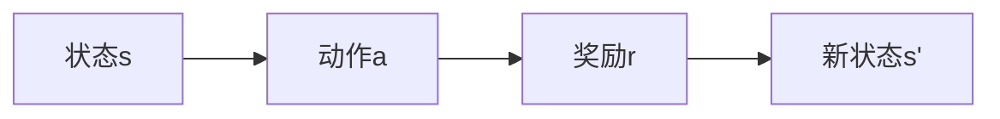
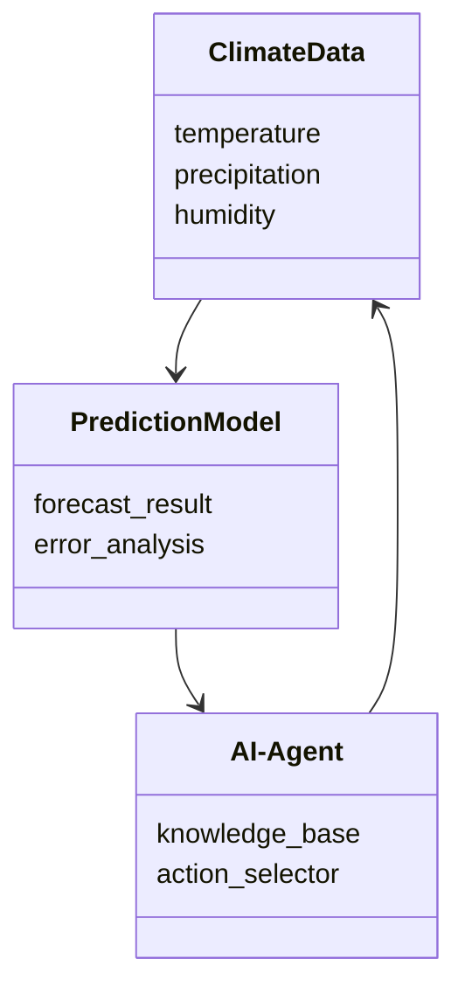
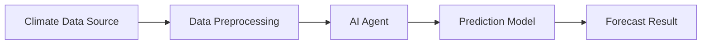
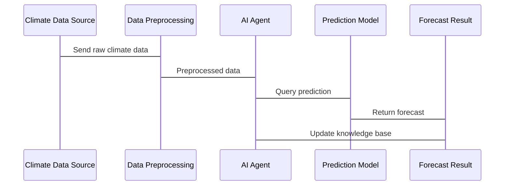

                 


# AI Agent在智能气候变化预测中的实践

> 关键词：AI Agent, 气候变化预测, 强化学习, 时间序列分析, 系统架构设计

> 摘要：本文章详细探讨了AI Agent在智能气候变化预测中的应用，从背景介绍、核心概念、算法原理到系统架构设计、项目实战和最佳实践，全面分析了AI Agent在气候变化预测中的优势与挑战，帮助读者理解并掌握如何利用AI Agent技术进行智能气候预测。

---

## 第1章: AI Agent与气候变化预测的背景与基础

### 1.1 AI Agent的基本概念
#### 1.1.1 AI Agent的定义
AI Agent（人工智能代理）是指能够感知环境、自主决策并执行任务的智能实体。它能够通过与环境的交互，不断优化自身的行为以实现目标。

#### 1.1.2 AI Agent的核心特点
- **自主性**：能够在没有外部干预的情况下独立运作。
- **反应性**：能够实时感知环境变化并做出反应。
- **目标导向**：通过目标驱动行为，优化决策以实现目标。

#### 1.1.3 AI Agent与传统算法的区别
传统的机器学习算法依赖于固定的训练数据和规则，而AI Agent能够动态调整策略，适应环境变化。

### 1.2 气候变化预测的基本概念
#### 1.2.1 气候变化的定义
气候变化指地球气候系统的长期变化，包括温度、降水、风向等的变化。

#### 1.2.2 气候变化预测的挑战
- 数据复杂性：涉及海量多源数据，如气象数据、海洋数据等。
- 时间跨度长：需要预测未来几十年甚至更长时间的变化。
- 不确定性高：预测结果受多种因素影响，具有较高的不确定性。

#### 1.2.3 气候变化预测的边界与外延
- 边界：预测范围通常限定在特定区域或全球范围内。
- 外延：涉及能源政策、农业规划等领域，具有广泛的应用场景。

### 1.3 AI Agent在气候变化预测中的应用
#### 1.3.1 AI Agent与气候变化预测的结合
AI Agent能够实时处理气候数据，动态调整预测模型，提高预测的准确性。

#### 1.3.2 AI Agent在气候变化预测中的优势
- 高效性：能够快速处理和分析海量数据。
- 实时性：能够实时更新预测结果，适应环境变化。
- 自适应性：能够根据新数据优化预测模型。

#### 1.3.3 AI Agent在气候变化预测中的边界与限制
- 数据质量：依赖高质量的数据输入。
- 计算资源：需要高性能计算资源支持。
- 模型复杂性：复杂的模型可能导致计算成本过高。

### 1.4 本章小结
本章介绍了AI Agent的基本概念、气候变化预测的挑战以及AI Agent在气候变化预测中的应用优势和局限性，为后续内容奠定了基础。

---

## 第2章: AI Agent的核心概念与联系

### 2.1 AI Agent的核心原理
#### 2.1.1 知识表示与推理
AI Agent通过知识表示（如符号逻辑、概率模型）来理解和推理环境信息。

#### 2.1.2 行为选择与优化
AI Agent通过强化学习等方法优化行为选择，以实现目标。

#### 2.1.3 与环境的交互机制
AI Agent通过传感器或数据接口与环境交互，获取信息并执行动作。

### 2.2 AI Agent与气候变化预测的核心联系
#### 2.2.1 数据驱动的气候建模
AI Agent能够处理多源异构数据，构建高精度的气候模型。

#### 2.2.2 AI Agent在气候预测中的角色
AI Agent作为智能决策者，能够动态调整预测模型，优化预测结果。

#### 2.2.3 AI Agent与气候模型的结合
通过AI Agent的自适应能力，气候模型能够更好地捕捉气候变化的动态特征。

### 2.3 核心概念对比表
| 概念 | 特性 | 描述 |
|------|------|------|
| AI Agent | 自主性 | 能够自主决策 |
| 气候变化预测 | 数据驱动 | 基于历史数据预测未来趋势 |

### 2.4 ER实体关系图


### 2.5 本章小结
本章详细探讨了AI Agent的核心原理及其在气候变化预测中的应用，通过对比和实体关系图帮助读者更好地理解两者的关系。

---

## 第3章: AI Agent在气候变化预测中的算法原理

### 3.1 常用算法概述
#### 3.1.1 强化学习算法
- **定义**：通过试错机制，学习最优策略以最大化累积奖励。
- **应用**：用于动态调整预测模型参数。

#### 3.1.2 时间序列分析算法
- **定义**：分析随时间变化的数据，预测未来趋势。
- **应用**：用于气候数据的时间序列预测。

#### 3.1.3 贝叶斯网络算法
- **定义**：基于概率论，构建变量之间的依赖关系。
- **应用**：用于气候数据的不确定性分析。

### 3.2 强化学习算法原理
#### 3.2.1 强化学习的基本流程
1. **状态识别**：识别环境中的状态。
2. **动作选择**：基于当前状态选择动作。
3. **奖励机制**：根据动作结果获得奖励或惩罚。
4. **策略优化**：通过经验优化策略。

#### 3.2.2 强化学习的数学模型
- **价值函数**：$V(s) = \max_a Q(s,a)$
- **策略优化**：通过梯度上升方法优化策略。

#### 3.2.3 强化学习的实现步骤


#### 3.2.4 强化学习的Python实现示例
```python
import numpy as np
from collections import deque

class Agent:
    def __init__(self, state_space, action_space):
        self.state_space = state_space
        self.action_space = action_space
        self.memory = deque(maxlen=1000)
        self.gamma = 0.99  # 折扣因子
        self.epsilon = 1.0  # 探索率
        self.epsilon_min = 0.01
        self.epsilon_decay = 0.995

    def act(self, state):
        if np.random.random() < self.epsilon:
            return np.random.randint(0, self.action_space)
        else:
            return np.argmax(self.model.predict(state))
    
    def remember(self, state, action, reward, next_state, done):
        self.memory.append((state, action, reward, next_state, done))
    
    def replay(self, batch_size):
        # 取出一批记忆
        minibatch = np.random.choice(len(self.memory), batch_size)
        for i in minibatch:
            state, action, reward, next_state, done = self.memory[i]
            target = reward
            if not done:
                target = reward + self.gamma * np.max(self.model.predict(next_state))
            target_f = target - self.model.predict(state)
            self.model.fit(state, target_f, epochs=1, verbose=0)
        self.epsilon = max(self.epsilon_min, self.epsilon * self.epsilon_decay)
```

### 3.3 时间序列分析算法
#### 3.3.1 时间序列分析的基本流程
1. **数据预处理**：清洗和特征提取。
2. **模型选择**：选择合适的时间序列模型。
3. **模型训练**：基于历史数据训练模型。
4. **预测与验证**：进行预测并验证准确性。

#### 3.3.2 时间序列分析的数学模型
- **ARIMA模型**：$y_t = \phi y_{t-1} + \theta \epsilon_t + \epsilon_{t-1}$

#### 3.3.3 时间序列分析的Python实现示例
```python
from statsmodels.tsa.arima_model import ARIMA

def forecast_climate(data, order=(1,1,1)):
    model = ARIMA(data, order=order)
    model_fit = model.fit(disp=-1)
    forecast = model_fit.forecast(steps=1)
    return forecast[0][0]
```

### 3.4 本章小结
本章详细介绍了AI Agent在气候变化预测中常用的算法，包括强化学习和时间序列分析，并通过Python代码示例帮助读者理解算法实现。

---

## 第4章: AI Agent的系统分析与架构设计

### 4.1 项目场景介绍
- **目标**：构建一个智能气候变化预测系统。
- **用户角色**：气候学家、政府决策者、农业从业者等。

### 4.2 系统功能设计
#### 4.2.1 领域模型


#### 4.2.2 系统架构设计


#### 4.2.3 接口设计
- **输入接口**：接收气候数据。
- **输出接口**：输出预测结果和误差分析。

#### 4.2.4 交互序列图


### 4.3 本章小结
本章通过系统分析和架构设计，帮助读者理解AI Agent在气候变化预测系统中的整体结构和功能模块。

---

## 第5章: AI Agent的项目实战

### 5.1 环境安装与配置
- **Python版本**：3.8及以上
- **依赖库安装**：`numpy`, `pandas`, `statsmodels`, `tensorflow`

### 5.2 核心代码实现
#### 5.2.1 数据预处理
```python
import pandas as pd
import numpy as np

def preprocess_data(data_path):
    data = pd.read_csv(data_path)
    # 删除缺失值
    data.dropna(inplace=True)
    # 标准化处理
    data = (data - data.mean()) / data.std()
    return data
```

#### 5.2.2 AI Agent实现
```python
class ClimateAI:
    def __init__(self, input_shape):
        self.model = self.build_model(input_shape)
    
    def build_model(self, input_shape):
        from tensorflow.keras.models import Sequential
        from tensorflow.keras.layers import LSTM, Dense
        model = Sequential()
        model.add(LSTM(64, input_shape=input_shape))
        model.add(Dense(1))
        model.compile(loss='mean_squared_error', optimizer='adam')
        return model
    
    def train(self, X_train, y_train, epochs=100):
        self.model.fit(X_train, y_train, epochs=epochs, verbose=0)
    
    def predict(self, X_test):
        return self.model.predict(X_test)
```

#### 5.2.3 预测结果分析
```python
def evaluate_predictions(y_true, y_pred):
    from sklearn.metrics import mean_absolute_error, mean_squared_error
    print(f"MAE: {mean_absolute_error(y_true, y_pred)}")
    print(f"RMSE: {np.sqrt(mean_squared_error(y_true, y_pred))}")
```

### 5.3 项目小结
本章通过具体的代码实现，展示了如何利用AI Agent进行气候变化预测，包括数据预处理、模型训练和结果分析。

---

## 第6章: 最佳实践与总结

### 6.1 小结
AI Agent在气候变化预测中的应用具有高效性、实时性和自适应性等优势，但也面临数据质量、计算资源和模型复杂性等挑战。

### 6.2 注意事项
- 数据质量是预测结果的关键，需确保数据的准确性和完整性。
- 模型优化需结合领域知识，避免过拟合和欠拟合。

### 6.3 拓展阅读
- 推荐阅读《强化学习入门》和《时间序列分析实用指南》。

---

## 作者：AI天才研究院 & 禅与计算机程序设计艺术

---

以上是《AI Agent在智能气候变化预测中的实践》的完整目录和内容框架。每一章节都详细展开了相关主题，确保读者能够系统地理解AI Agent在气候变化预测中的应用和实践。

