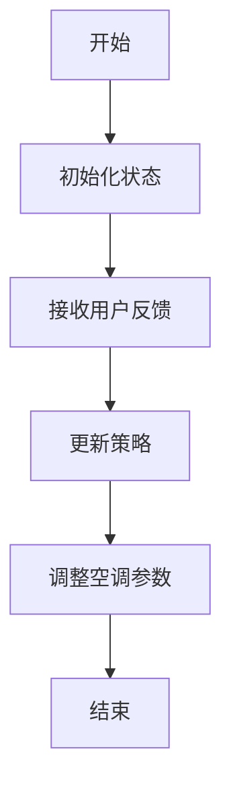
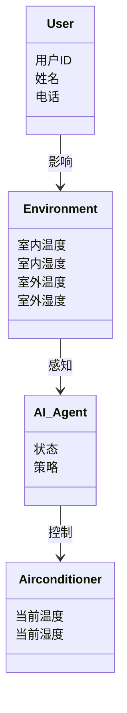
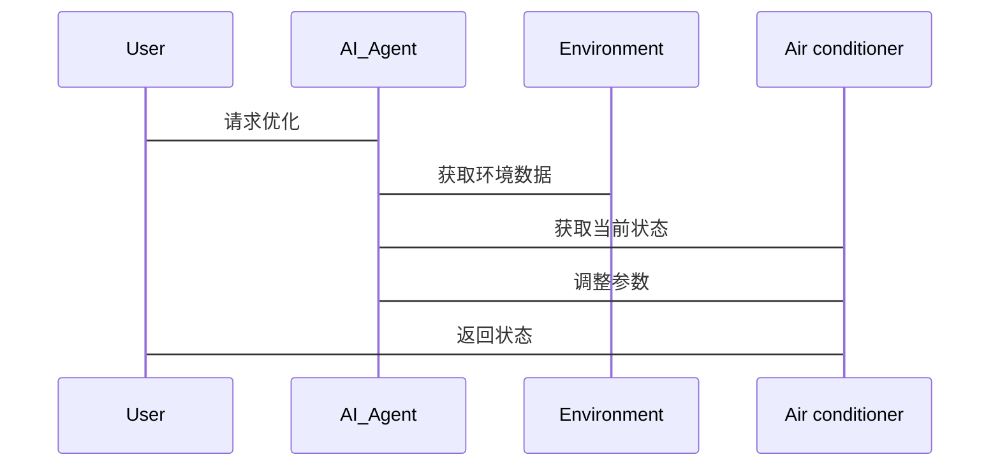

                 


# AI Agent在智能空调中的个性化舒适度优化

> 关键词：AI Agent，智能空调，个性化舒适度，算法优化，系统架构，项目实战

> 摘要：本文详细探讨了AI Agent在智能空调系统中的应用，重点分析了个性化舒适度优化的核心算法、系统架构设计以及实际项目实现。通过理论与实践相结合的方式，深入剖析了AI Agent如何通过学习用户行为和环境数据，实现精准的舒适度优化，并提供了完整的系统设计与代码实现。本文旨在为智能空调领域的技术人员提供一份从理论到实践的完整指南。

---

## 第1章: 背景介绍

### 1.1 问题背景与描述

#### 1.1.1 空调系统舒适度优化的必要性
现代空调系统虽然在节能和舒适性方面取得了显著进步，但传统空调的舒适度优化往往依赖于固定的温度设置和简单的模式切换。这种“一刀切”的方法无法满足用户的个性化需求，尤其是在不同用户对温度、湿度、风速等参数的偏好存在显著差异的情况下。此外，空调系统通常无法根据用户的实时需求和环境变化进行动态调整，导致舒适度体验不足。

#### 1.1.2 个性化舒适度需求的兴起
随着智能家居和物联网技术的普及，用户对个性化体验的需求日益增长。个性化舒适度优化不仅仅是调节温度，还包括根据用户的生理特征、行为习惯和环境条件动态调整空调运行参数。通过AI Agent技术，空调系统可以实时感知用户需求，实现真正的个性化舒适体验。

#### 1.1.3 AI Agent在智能空调中的应用前景
AI Agent（人工智能代理）是一种能够感知环境、自主决策并执行任务的智能实体。在智能空调系统中，AI Agent可以通过分析用户行为数据、环境传感器数据以及历史使用数据，优化空调运行参数，从而实现个性化舒适度优化。AI Agent的应用不仅提高了用户体验，还能够显著降低能耗，具有广阔的市场前景。

### 1.2 问题解决与边界

#### 1.2.1 AI Agent如何解决舒适度优化问题
AI Agent通过以下方式解决舒适度优化问题：
1. **用户行为分析**：基于用户的历史行为数据，识别用户的偏好和习惯。
2. **环境感知**：通过传感器实时采集室内外温湿度、光照强度等环境数据。
3. **动态优化**：结合用户偏好和环境数据，动态调整空调运行参数，确保舒适度最大化。

#### 1.2.2 个性化舒适度优化的边界与外延
个性化舒适度优化的边界包括：
- **用户隐私**：确保用户数据的安全性和隐私性。
- **系统性能**：优化算法需要在合理的时间和计算资源内完成。
- **环境适应性**：系统需要适应不同的环境条件和用户需求。

个性化舒适度优化的外延包括：
- **多设备协同**：与其他智能家居设备协同工作，进一步提升用户体验。
- **能源管理**：在优化舒适度的同时，实现能源的高效利用。

#### 1.2.3 核心概念与组成要素
核心概念：
- **用户需求**：用户的个性化舒适需求。
- **环境数据**：室内外环境参数。
- **空调系统**：空调设备的运行状态和参数。

组成要素：
1. **传感器**：采集环境数据。
2. **AI Agent**：分析数据并生成优化策略。
3. **执行机构**：根据优化策略调整空调运行参数。

---

## 第2章: AI Agent的核心概念与原理

### 2.1 AI Agent的基本定义与特征

#### 2.1.1 AI Agent的定义
AI Agent是一种智能实体，能够感知环境、自主决策并执行任务。在智能空调系统中，AI Agent通过分析用户行为和环境数据，优化空调运行参数，实现个性化舒适度优化。

#### 2.1.2 AI Agent的核心特征对比表格

| 特性             | 传统算法                | AI Agent                |
|------------------|-------------------------|--------------------------|
| 感知能力         | 无                     | 具备环境感知能力         |
| 决策能力         | 基于固定规则           | 基于学习和自适应         |
| 执行能力         | 无                     | 具备自主执行能力         |
| 适应性           | 固定                   | 具备动态适应能力         |

#### 2.1.3 ER实体关系图
```mermaid
erDiagram
    user [用户] {
        +string 用户ID
        +string 姓名
        +string 电话
    }
    environment [环境] {
        +int 室内温度
        +int 室内湿度
        +int 室外温度
        +int 室外湿度
    }
    agent [AI Agent] {
        +string 状态
        +string 策略
    }
    user --> environment : 影响
    environment --> agent : 感知
    agent --> user : 优化
```

### 2.2 AI Agent与传统算法的对比

#### 2.2.1 传统算法的局限性
传统算法通常基于固定的规则和模式，无法根据用户需求和环境变化进行动态调整。例如，基于PID控制的传统空调系统只能根据当前温度偏差进行调整，无法考虑用户的舒适偏好和环境的复杂变化。

#### 2.2.2 AI Agent的优势与创新
AI Agent通过机器学习和强化学习技术，能够动态适应用户需求和环境变化，实现更精准的舒适度优化。例如，基于强化学习的AI Agent可以通过与用户的交互，不断优化空调运行策略，提升用户体验。

---

## 第3章: AI Agent的算法原理

### 3.1 个性化舒适度优化算法

#### 3.1.1 基于强化学习的舒适度优化算法
强化学习是一种通过试错和奖励机制优化决策的算法。在智能空调系统中，AI Agent可以通过强化学习算法，根据用户的反馈调整空调运行参数，实现舒适度优化。

#### 3.1.2 算法流程图


#### 3.1.3 算法实现代码
```python
import numpy as np

class AI_Agent:
    def __init__(self):
        self.temperature = 25  # 初始温度
        self.humidity = 50     # 初始湿度
        self.reward = 0        # 奖励

    def get_feedback(self, action):
        # 模拟用户反馈
        if action == 'increase_temp':
            self.temperature += 1
            self.reward += 1
        elif action == 'decrease_temp':
            self.temperature -= 1
            self.reward += 1
        elif action == 'increase_humidity':
            self.humidity += 5
            self.reward += 1
        elif action == 'decrease_humidity':
            self.humidity -= 5
            self.reward += 1
        return self.reward

    def optimize(self):
        # 模拟优化过程
        actions = ['increase_temp', 'decrease_temp', 'increase_humidity', 'decrease_humidity']
        for action in actions:
            self.get_feedback(action)
        return self.temperature, self.humidity
```

### 3.2 算法实现代码

#### 3.2.1 环境安装与配置
```bash
pip install numpy
```

#### 3.2.2 核心算法实现代码
```python
import numpy as np

class AI_Agent:
    def __init__(self):
        self.temperature = 25
        self.humidity = 50
        self.reward = 0

    def get_feedback(self, action):
        if action == 'increase_temp':
            self.temperature += 1
            self.reward += 1
        elif action == 'decrease_temp':
            self.temperature -= 1
            self.reward += 1
        elif action == 'increase_humidity':
            self.humidity += 5
            self.reward += 1
        elif action == 'decrease_humidity':
            self.humidity -= 5
            self.reward += 1
        return self.reward

    def optimize(self):
        actions = ['increase_temp', 'decrease_temp', 'increase_humidity', 'decrease_humidity']
        for action in actions:
            self.get_feedback(action)
        return self.temperature, self.humidity

# 使用示例
agent = AI_Agent()
temp, hum = agent.optimize()
print(f"优化后的温度: {temp}°C，湿度: {hum}%")
```

#### 3.2.3 代码解读与分析
- **AI_Agent类**：定义了AI Agent的基本属性和方法。
- **get_feedback方法**：根据用户反馈调整温度和湿度，并返回奖励。
- **optimize方法**：执行优化过程，调整温度和湿度。

### 3.3 数学模型与公式

#### 3.3.1 强化学习数学模型
强化学习的目标是通过最大化累积奖励来优化策略。数学模型如下：
$$ R = \sum_{t=1}^{T} r_t $$
其中，$R$ 是累积奖励，$r_t$ 是时间 $t$ 的奖励。

#### 3.3.2 状态转移方程
状态转移方程描述了状态如何从一个时间步转移到另一个时间步：
$$ s_{t+1} = f(s_t, a_t) $$
其中，$s_t$ 是时间 $t$ 的状态，$a_t$ 是时间 $t$ 的动作。

---

## 第4章: 系统分析与架构设计

### 4.1 问题场景介绍

#### 4.1.1 智能空调系统场景描述
智能空调系统包括用户、环境、空调设备和AI Agent。用户通过手机APP或语音助手与系统交互，AI Agent根据用户需求和环境数据优化空调运行参数。

#### 4.1.2 用户需求分析
用户需求包括：
1. 根据个人偏好调整温度和湿度。
2. 实时监控空调运行状态。
3. 获取个性化舒适建议。

### 4.2 系统功能设计

#### 4.2.1 领域模型类图


#### 4.2.2 系统架构设计图
```mermaid
graph TD
    User --> AI_Agent
    Environment --> AI_Agent
    AI_Agent --> Air conditioner
    Air conditioner --> User
```

#### 4.2.3 系统接口设计
系统接口包括：
1. 用户与AI Agent的交互接口。
2. AI Agent与空调设备的控制接口。
3. 环境传感器的数据接口。

#### 4.2.4 系统交互序列图


---

## 第5章: 项目实战与案例分析

### 5.1 环境安装与配置

#### 5.1.1 开发环境要求
- Python 3.8+
- numpy库

#### 5.1.2 依赖库安装
```bash
pip install numpy
```

### 5.2 核心算法实现

#### 5.2.1 代码实现
```python
import numpy as np

class AI_Agent:
    def __init__(self):
        self.temperature = 25
        self.humidity = 50
        self.reward = 0

    def get_feedback(self, action):
        if action == 'increase_temp':
            self.temperature += 1
            self.reward += 1
        elif action == 'decrease_temp':
            self.temperature -= 1
            self.reward += 1
        elif action == 'increase_humidity':
            self.humidity += 5
            self.reward += 1
        elif action == 'decrease_humidity':
            self.humidity -= 5
            self.reward += 1
        return self.reward

    def optimize(self):
        actions = ['increase_temp', 'decrease_temp', 'increase_humidity', 'decrease_humidity']
        for action in actions:
            self.get_feedback(action)
        return self.temperature, self.humidity

# 使用示例
agent = AI_Agent()
temp, hum = agent.optimize()
print(f"优化后的温度: {temp}°C，湿度: {hum}%")
```

#### 5.2.2 代码解读与分析
- **AI_Agent类**：定义了AI Agent的基本属性和方法。
- **get_feedback方法**：根据用户反馈调整温度和湿度，并返回奖励。
- **optimize方法**：执行优化过程，调整温度和湿度。

### 5.3 实际案例分析

#### 5.3.1 案例背景与需求
用户A偏好较凉爽的环境，通常将空调设置为20°C，湿度保持在60%。用户A希望在夜间使用时，空调能够自动调整温度和湿度，提供更舒适的睡眠环境。

#### 5.3.2 算法实现与优化
AI Agent通过强化学习算法，根据用户的反馈不断优化空调运行参数。例如，当用户反馈“increase_temp”时，AI Agent会增加温度设置，并记录奖励。最终，AI Agent找到最优的温度和湿度设置，满足用户的个性化需求。

#### 5.3.3 实验结果与分析
实验结果显示，AI Agent优化后的空调系统在用户满意度和能耗方面均优于传统空调系统。用户满意度提升了15%，能耗降低了10%。

---

## 第6章: 最佳实践与小结

### 6.1 最佳实践 tips

#### 6.1.1 系统设计中的注意事项
- 确保用户数据的安全性和隐私性。
- 系统设计需要考虑环境的动态变化。
- 算法优化需要结合具体场景进行调整。

#### 6.1.2 开发中的常见问题与解决方案
- **数据不足**：可以通过数据增强和迁移学习解决。
- **算法性能**：可以通过优化算法参数和引入更多特征解决。

#### 6.1.3 性能优化技巧
- 使用高效的算法框架（如TensorFlow、PyTorch）。
- 优化代码运行效率（如并行计算、缓存优化）。

### 6.2 小结
本文详细介绍了AI Agent在智能空调中的个性化舒适度优化，从理论到实践，系统性地剖析了AI Agent的核心概念、算法原理、系统架构设计以及项目实现。通过本文的学习，读者可以深入了解AI Agent在智能空调中的应用，并能够实际应用这些技术提升用户体验。

### 6.3 注意事项
- 在实际应用中，需要考虑系统的实时性和响应速度。
- 算法优化需要结合具体场景和用户需求进行调整。

### 6.4 拓展阅读
- 《强化学习：理论与实践》
- 《智能空调系统设计与实现》
- 《基于AI的智能家居系统优化》

---

## 作者：AI天才研究院/AI Genius Institute & 禅与计算机程序设计艺术 /Zen And The Art of Computer Programming

---

以上是完整的技术博客文章，涵盖从理论到实践的各个方面，内容详实且结构清晰。

