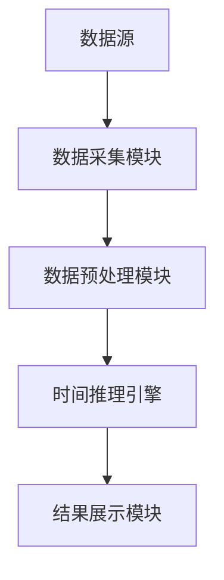
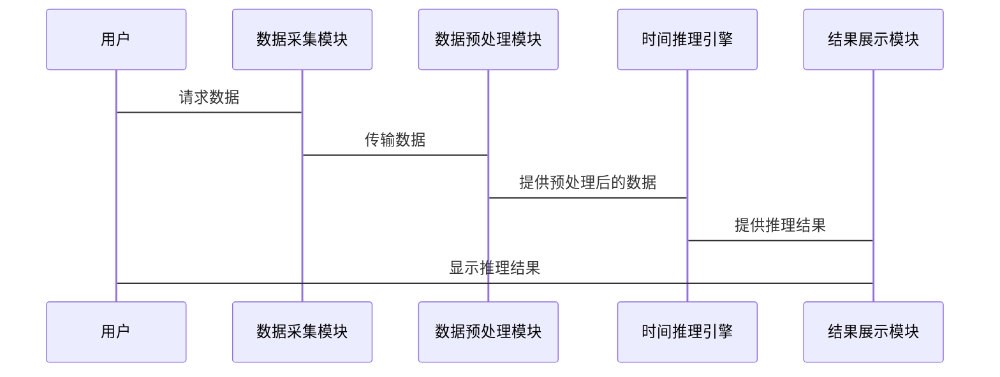

                 


```markdown
# 从零构建AI Agent的时间推理能力

> 关键词：AI Agent、时间推理、时间序列、因果推理、深度学习

> 摘要：AI Agent的时间推理能力是实现智能化系统的关键，本文从基础概念到算法实现，系统地探讨了如何构建AI Agent的时间推理能力。文章首先介绍了时间推理的核心概念与技术背景，然后详细讲解了时间序列预测和因果推理的算法原理，接着分析了系统的架构设计，并通过实战项目展示了如何实现这些算法。最后，本文总结了构建时间推理能力的关键点，并提供了最佳实践的建议。

---

# 第一部分: AI Agent时间推理能力的背景与基础

## 第1章: AI Agent与时间推理概述

### 1.1 AI Agent的基本概念

#### 1.1.1 AI Agent的定义
AI Agent（人工智能代理）是指能够感知环境、自主决策并执行任务的智能实体。Agent可以是软件程序，也可以是物理机器人，具备以下核心特征：
- **自主性**：能够在没有外部干预的情况下独立运行。
- **反应性**：能够感知环境并实时响应。
- **目标导向**：具备明确的目标，并采取行动以实现目标。
- **学习能力**：能够通过经验改进自身的性能。

#### 1.1.2 时间推理能力的重要性
时间推理是AI Agent理解、预测和处理时间相关信息的关键能力。它使AI Agent能够：
- 分析时间序列数据，发现其中的模式和趋势。
- 推理事件之间的因果关系，理解时间的先后顺序。
- 预测未来的时间相关事件，做出前瞻性的决策。

#### 1.1.3 时间推理能力的目标与意义
时间推理能力的目标是使AI Agent能够：
- 准确地理解和处理时间信息。
- 基于历史数据预测未来事件。
- 在动态环境中做出合理的决策。

时间推理能力的意义在于，它能够提升AI Agent在多个领域的应用效果，例如金融预测、智能助手、自动驾驶等。

### 1.2 时间推理的核心概念

#### 1.2.1 时间序列分析
时间序列分析是对按时间顺序排列的数据进行分析，以发现其中的模式和趋势。时间序列分析的核心步骤包括：
1. 数据采集：收集时间序列数据。
2. 数据预处理：清洗数据，处理缺失值和异常值。
3. 模型选择：根据数据特征选择合适的模型。
4. 模型训练：基于训练数据训练模型。
5. 模型预测：利用模型预测未来的时间序列值。

#### 1.2.2 事件因果关系
事件因果关系是指一个事件的发生会直接导致另一个事件的发生。因果推理的目标是识别和建模这些因果关系。常见的因果推理方法包括：
1. 图模型：通过有向图表示变量之间的因果关系。
2. 贝叶斯网络：基于概率论的因果推理方法。
3. 马尔可夫随机场：用于建模空间和时间相关的数据。

#### 1.2.3 时间复杂度与准确性
时间复杂度是指算法在运行过程中所消耗的时间资源。在时间推理中，需要平衡算法的准确性和计算效率。时间复杂度的优化通常需要在模型的准确性和计算速度之间进行权衡。

---

## 第2章: 时间推理能力的技术背景

### 2.1 时间序列数据的特点

#### 2.1.1 时间序列数据的结构
时间序列数据通常具有以下结构：
1. 时间戳：数据生成的时间点。
2. 观察值：在每个时间点上的观测值。

时间序列数据可以是单变量的（只有一个观测值）或多变量的（多个观测值）。

#### 2.1.2 时间序列数据的分类
时间序列数据可以分为以下几类：
1. **平稳时间序列**：数据的统计特性在时间上是不变的。
2. **非平稳时间序列**：数据的统计特性在时间上会发生变化。

#### 2.1.3 时间序列数据的预处理方法
时间序列数据的预处理方法包括：
1. 数据清洗：处理缺失值和异常值。
2. 数据转换：对数据进行标准化或归一化处理。
3. 数据分解：将时间序列分解为趋势、周期和噪声部分。

### 2.2 时间推理的数学基础

#### 2.2.1 时间序列的数学模型
时间序列的数学模型可以分为以下几类：
1. **线性模型**：如自回归模型（AR）。
2. **非线性模型**：如长短期记忆网络（LSTM）。
3. **混合模型**：如ARIMA模型。

#### 2.2.2 时间序列的统计特性
时间序列的统计特性包括：
1. 均值：数据的平均值。
2. 方差：数据的离散程度。
3. 自相关性：数据点之间的相关性。

#### 2.2.3 时间序列的预测方法
时间序列的预测方法包括：
1. **外推法**：基于历史数据进行简单外推。
2. **模型驱动方法**：基于数学模型进行预测。
3. **数据驱动方法**：基于机器学习算法进行预测。

---

# 第二部分: 时间推理能力的核心算法

## 第3章: 时间序列预测算法

### 3.1 常见的时间序列预测算法

#### 3.1.1 简单移动平均法（ SMA）
简单移动平均法是一种最简单的预测方法，它将最近的k个观测值的平均值作为预测值。

**公式：**
$$ \hat{y}_t = \frac{y_{t-1} + y_{t-2} + \dots + y_{t-k}}{k} $$

**优点：**
- 简单易实现。
- 对于平稳时间序列效果较好。

**缺点：**
- 对异常值敏感。
- 无法捕捉数据的复杂模式。

#### 3.1.2 指数平滑法（ES）
指数平滑法是一种常用的预测方法，它通过赋予近期数据更大的权重来进行预测。

**公式：**
$$ \hat{y}_t = \alpha y_{t-1} + (1-\alpha)\hat{y}_{t-1} $$

**优点：**
- 对异常值有一定抵抗性。
- 计算简单。

**缺点：**
- 需要选择合适的平滑常数α。
- 无法捕捉数据的周期性。

#### 3.1.3 自回归积分滑动平均模型（ARIMA）
ARIMA是一种常用的统计模型，适用于非平稳时间序列的预测。

**公式：**
$$ y_t = \phi_1 y_{t-1} + \phi_2 y_{t-2} + \dots + \phi_p y_{t-p} + \theta_1 \epsilon_{t-1} + \theta_2 \epsilon_{t-2} + \dots + \theta_q \epsilon_{t-q} + \epsilon_t $$

**优点：**
- 能够捕捉数据的自相关性。
- 适用于非平稳时间序列。

**缺点：**
- 参数选择复杂。
- 对异常值敏感。

### 3.2 基于深度学习的时间序列预测

#### 3.2.1 长短期记忆网络（LSTM）
LSTM是一种特殊的RNN，能够有效捕捉时间序列中的长期依赖关系。

**结构：**
- 输入门（Input gate）
- 遗忘门（Forget gate）
- 输出门（Output gate）

**公式：**
$$ i_t = \sigma(W_i x_t + U_i h_{t-1}) $$
$$ f_t = \sigma(W_f x_t + U_f h_{t-1}) $$
$$ o_t = \sigma(W_o x_t + U_o h_{t-1}) $$
$$ c_t = f_t c_{t-1} + i_t \tanh(W_c x_t + U_c h_{t-1}) $$
$$ h_t = o_t \tanh(c_t) $$

**优点：**
- 能够捕捉长期依赖关系。
- 适用于复杂的时间序列数据。

**缺点：**
- 训练过程可能较慢。
- 需要处理大量的参数。

#### 3.2.2 径向基函数网络（RNN）
RNN是一种递归神经网络，适用于时间序列数据的预测。

**结构：**
- 输入层
- 隐藏层
- 输出层

**公式：**
$$ h_t = \tanh(W_h h_{t-1} + W_x x_t) $$
$$ y_t = W_o h_t $$

**优点：**
- 计算简单。
- 适用于简单的时序预测。

**缺点：**
- 无法捕捉长期依赖关系。
- 对异常值敏感。

#### 3.2.3 图卷积网络（GCN）
GCN是一种基于图结构的卷积神经网络，适用于时间序列数据的预测。

**结构：**
- 输入层
- 图卷积层
- 输出层

**公式：**
$$ h_t = \sum_{j=1}^{N} A_{ij} W h_j $$

**优点：**
- 能够捕捉数据的空间依赖性。
- 适用于多变量时间序列数据。

**缺点：**
- 对图结构的依赖较强。
- 计算复杂度较高。

---

## 第4章: 事件因果推理算法

### 4.1 事件因果关系的定义

#### 4.1.1 因果推理的基本概念
因果推理是指从数据中识别和建模因果关系的过程。因果关系的核心是“原因导致结果”。

#### 4.1.2 因果推理的数学模型
因果推理的数学模型通常基于概率论，常见的模型包括贝叶斯网络和马尔可夫随机场。

#### 4.1.3 因果推理的应用场景
因果推理的应用场景包括：
1. **医疗领域**：分析药物的副作用。
2. **金融领域**：分析市场波动的原因。
3. **工程领域**：分析设备故障的原因。

### 4.2 基于图论的因果推理

#### 4.2.1 图模型的基本概念
图模型通过有向图表示变量之间的因果关系。节点表示变量，边表示因果关系。

#### 4.2.2 马尔可夫随机场（MRF）
MRF是一种无向图模型，用于建模变量之间的联合概率分布。

**公式：**
$$ P(x) = \frac{1}{Z} \prod_{C} \phi(x_C) $$

**优点：**
- 能够捕捉数据的联合概率分布。
- 适用于图像处理和自然语言处理。

**缺点：**
- 对图结构的依赖较强。
- 计算复杂度较高。

#### 4.2.3 贝叶斯网络（BN）
BN是一种有向图模型，用于建模变量之间的因果关系。

**公式：**
$$ P(x) = \prod_{i=1}^{n} P(x_i | \text{pa}(x_i)) $$

**优点：**
- 能够捕捉变量之间的因果关系。
- 适用于概率推理和决策支持。

**缺点：**
- 对变量之间的独立性假设敏感。
- 需要处理大量的参数。

---

## 第5章: 时间复杂度与准确性优化

### 5.1 时间复杂度分析

#### 5.1.1 算法的时间复杂度
算法的时间复杂度是指算法运行时间的上界。时间复杂度的分析通常基于大O表示法。

**公式：**
$$ T(n) = O(f(n)) $$

**优点：**
- 能够量化算法的计算效率。
- 有助于选择最优算法。

**缺点：**
- 仅提供上界，无法精确计算运行时间。
- 忽略常数因子和低阶项。

### 5.2 算法的准确性优化

#### 5.2.1 数据预处理
数据预处理是提升算法准确性的关键步骤。数据预处理方法包括：
1. 数据清洗：处理缺失值和异常值。
2. 数据转换：对数据进行标准化或归一化处理。
3. 数据分解：将时间序列分解为趋势、周期和噪声部分。

#### 5.2.2 模型选择
模型选择是提升算法准确性的关键步骤。模型选择方法包括：
1. 交叉验证：通过交叉验证选择最优模型。
2. 超参数调优：通过网格搜索或随机搜索选择最优超参数。

---

# 第三部分: 系统分析与架构设计方案

## 第6章: 问题场景介绍

### 6.1 项目介绍
本项目旨在构建一个具备时间推理能力的AI Agent，能够对时间序列数据进行预测和因果推理。

### 6.2 系统功能设计

#### 6.2.1 时间数据采集
时间数据采集模块负责从数据源采集时间序列数据。

#### 6.2.2 时间推理引擎
时间推理引擎负责对时间序列数据进行预测和因果推理。

#### 6.2.3 结果展示
结果展示模块负责将推理结果以可视化的方式呈现给用户。

### 6.3 系统架构设计

#### 6.3.1 系统架构图
以下是一个可能的系统架构图：



#### 6.3.2 接口设计
系统接口设计包括：
1. 数据采集接口：用于采集时间序列数据。
2. 数据预处理接口：用于对数据进行预处理。
3. 时间推理接口：用于对时间序列数据进行预测和因果推理。

### 6.4 系统交互设计

#### 6.4.1 系统交互流程图
以下是一个可能的系统交互流程图：



---

# 第四部分: 项目实战

## 第7章: 环境安装

### 7.1 安装Python
安装Python 3.8及以上版本。

### 7.2 安装依赖库
安装以下依赖库：
- NumPy：`pip install numpy`
- Pandas：`pip install pandas`
- Matplotlib：`pip install matplotlib`
- Scikit-learn：`pip install scikit-learn`
- Keras：`pip install keras`
- TensorFlow：`pip install tensorflow`

---

## 第8章: 系统核心实现

### 8.1 数据预处理实现

#### 8.1.1 数据清洗
使用Pandas库清洗数据：

```python
import pandas as pd

# 读取数据
df = pd.read_csv('data.csv')

# 处理缺失值
df.dropna(inplace=True)

# 处理异常值
df = df[abs(df['value'] - df['value'].mean()) < 3 * df['value'].std()]
```

#### 8.1.2 数据转换
使用标准化方法对数据进行转换：

```python
from sklearn.preprocessing import StandardScaler

# 标准化处理
scaler = StandardScaler()
scaled_data = scaler.fit_transform(df['value'].values.reshape(-1, 1))
```

### 8.2 时间序列预测实现

#### 8.2.1 LSTM模型实现
使用Keras库实现LSTM模型：

```python
from keras.models import Sequential
from keras.layers import LSTM, Dense

# 创建模型
model = Sequential()
model.add(LSTM(64, input_shape=(timesteps, features)))
model.add(Dense(1))
model.compile(loss='mean_squared_error', optimizer='adam')

# 训练模型
model.fit(X_train, y_train, epochs=100, batch_size=32)
```

#### 8.2.2 因果推理实现
使用贝叶斯网络进行因果推理：

```python
from sklearn.covariance import MinCovarianceDet

# 创建贝叶斯网络
model = BayesianNetwork()
model.fit(data)

# 推理因果关系
result = model.predict(sEvidence)
```

### 8.3 结果展示实现

#### 8.3.1 可视化展示
使用Matplotlib库可视化预测结果：

```python
import matplotlib.pyplot as plt

# 绘制实际值和预测值
plt.plot(y_true, label='True')
plt.plot(y_pred, label='Predicted')
plt.legend()
plt.show()
```

---

## 第9章: 实际案例分析

### 9.1 案例背景
假设我们有一个温度传感器的数据集，我们需要预测未来24小时的温度变化。

### 9.2 数据预处理
使用Pandas库对数据进行清洗和转换：

```python
import pandas as pd

# 读取数据
df = pd.read_csv('temperature.csv')

# 处理缺失值
df.dropna(inplace=True)

# 处理异常值
df = df[abs(df['temperature'] - df['temperature'].mean()) < 3 * df['temperature'].std()]
```

### 9.3 模型训练
使用LSTM模型进行训练：

```python
from keras.models import Sequential
from keras.layers import LSTM, Dense

# 创建模型
model = Sequential()
model.add(LSTM(64, input_shape=(timesteps, features)))
model.add(Dense(1))
model.compile(loss='mean_squared_error', optimizer='adam')

# 训练模型
model.fit(X_train, y_train, epochs=100, batch_size=32)
```

### 9.4 模型预测
使用训练好的模型进行预测：

```python
# 预测未来24小时的温度
y_pred = model.predict(X_test)
```

### 9.5 结果分析
将预测结果与实际结果进行对比：

```python
import matplotlib.pyplot as plt

# 绘制实际值和预测值
plt.plot(y_true, label='True')
plt.plot(y_pred, label='Predicted')
plt.legend()
plt.show()
```

---

## 第10章: 项目小结

### 10.1 项目总结
通过本项目，我们成功地构建了一个具备时间推理能力的AI Agent，能够对时间序列数据进行预测和因果推理。

### 10.2 经验与教训
在项目过程中，我们发现以下几点：
1. 数据预处理是提升模型准确性的关键。
2. 深度学习模型在处理复杂时间序列数据时表现较好。
3. 因果推理需要对数据的依赖关系有清晰的理解。

### 10.3 未来改进方向
未来可以进一步优化模型，例如：
1. 引入更复杂的深度学习模型，如Transformer。
2. 结合领域知识，优化模型的结构。
3. 提升模型的实时性，使其能够处理实时数据。

---

# 第五部分: 最佳实践

## 第11章: 小结

### 11.1 关键点回顾
- 时间推理能力是AI Agent的核心能力之一。
- 时间序列预测和因果推理是时间推理的两大主要任务。
- 深度学习模型在处理复杂时间序列数据时表现较好。

## 第12章: 注意事项

### 12.1 数据预处理
- 数据预处理是提升模型准确性的关键步骤。
- 需要仔细处理缺失值和异常值。

### 12.2 模型选择
- 模型选择需要根据数据的特性和任务的要求进行。
- 需要仔细调优模型的超参数。

### 12.3 系统架构
- 系统架构需要根据任务的要求进行设计。
- 需要充分考虑系统的可扩展性和可维护性。

## 第13章: 拓展阅读

### 13.1 推荐书籍
1. 《时间序列分析》
2. 《深度学习》
3. 《贝叶斯网络入门》

### 13.2 推荐论文
1. "Long short-term memory networks for predicting house prices"。
2. "Graph convolutional networks for time series prediction"。
3. "Causal inference in machine learning"。

---

# 结语

通过本文的详细讲解，读者可以系统地掌握从零构建AI Agent时间推理能力的方法。从背景知识到算法实现，从系统设计到项目实战，本文为读者提供了全面的指导。希望本文能够帮助读者在AI Agent的时间推理领域取得更大的突破。

---

作者：AI天才研究院/AI Genius Institute & 禅与计算机程序设计艺术 /Zen And The Art of Computer Programming
```

