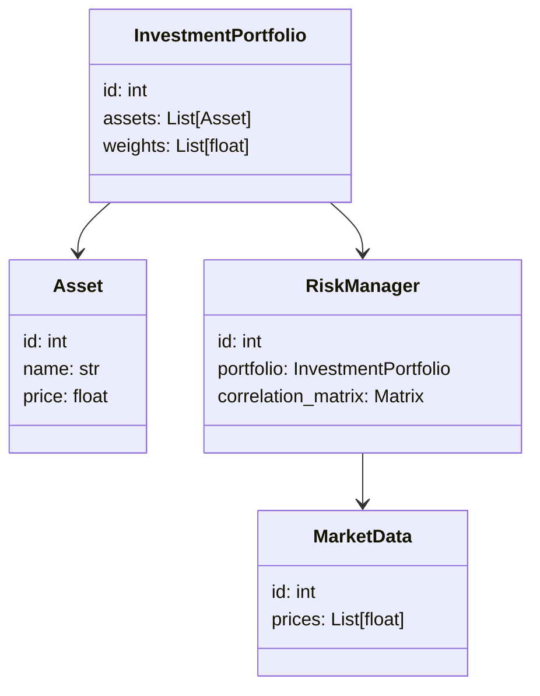
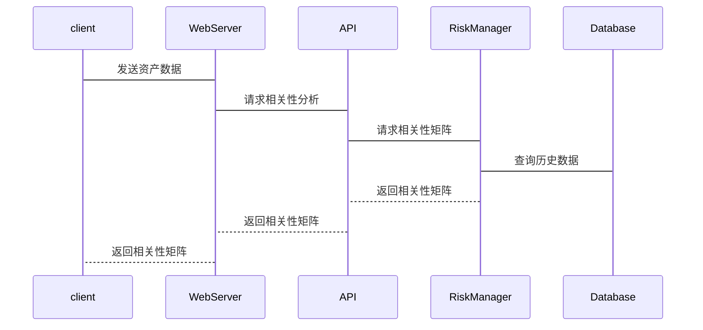

                 


# 多元化投资的极限：当相关性趋同时的策略

> **关键词**：多元化投资、相关性、投资组合、风险分散、资产配置、现代投资组合理论

> **摘要**：本文深入探讨了在相关性趋近于1时的多元化投资策略。从投资组合理论的基本概念出发，分析了相关性对投资组合风险的影响，详细讲解了相关性分析的数学模型和算法实现，并通过实际案例展示了如何在相关性趋近于1时优化投资组合。

---

## 第一部分: 多元化投资的背景与核心概念

### 第1章: 投资多元化与风险分散概述

#### 1.1 投资多元化的基本概念

##### 1.1.1 资产配置与投资组合理论
资产配置是将资金分配到不同的资产类别（如股票、债券、房地产等）中，以实现风险分散和收益最大化。投资组合理论指出，通过合理配置资产，可以降低投资组合的整体风险，尤其是系统性风险。

##### 1.1.2 多元化投资的核心目的
多元化投资的核心目的是通过投资不同相关性的资产，降低投资组合的波动性和风险。当资产之间相关性较低时，风险分散效果最佳。

##### 1.1.3 相关性与投资组合风险
相关性是衡量两种资产价格变动方向和程度的指标。当相关性趋近于1时，资产之间高度同步，风险分散效果减弱，投资组合的波动性增加。

#### 1.2 投资组合理论基础

##### 1.2.1 马科维茨投资组合理论
马科维茨提出的现代投资组合理论（MPT）是多元化投资的基础。该理论指出，通过优化资产配置，可以实现收益最大化的同时最小化风险。

##### 1.2.2 现代投资组合理论的核心假设
MPT假设投资者是理性的，市场是有效的，并且资产收益服从正态分布。这些假设在实际投资中需要进行调整。

##### 1.2.3 多元化投资在实际中的应用
在实际投资中，多元化投资广泛应用于养老基金、共同基金等机构投资者的资产配置中，帮助投资者在不同市场环境下分散风险。

#### 1.3 相关性与投资组合风险

##### 1.3.1 相关性对投资组合风险的影响
相关性是投资组合风险分析的重要因素。当相关性趋近于1时，资产之间高度同步，投资组合的风险接近于单一资产的风险。

##### 1.3.2 不同资产类别之间的相关性分析
股票、债券、黄金等不同资产类别之间的相关性不同。在市场波动加剧时，相关性可能上升，影响投资组合的风险分散效果。

##### 1.3.3 相关性趋近于1时的极端情况
当相关性趋近于1时，投资组合的风险分散效果接近于零，投资组合的收益波动性接近于单一资产的波动性。

### 第2章: 相关性与投资组合的极限情况

#### 2.1 相关性对投资组合的影响

##### 2.1.1 相关性与风险分散的关系
相关性与风险分散成反比关系。相关性越高，风险分散效果越差；相关性越低，风险分散效果越好。

##### 2.1.2 相关性趋近于1时的投资组合风险
当相关性趋近于1时，投资组合的风险接近于单一资产的风险，投资组合的收益波动性增加。

##### 2.1.3 相关性趋近于0时的投资组合优化
当相关性趋近于0时，投资组合的风险分散效果最佳，投资组合的收益波动性最小。

#### 2.2 相关性矩阵与投资组合优化

##### 2.2.1 相关性矩阵的构建与分析
相关性矩阵是分析资产之间相关性的工具。通过构建相关性矩阵，可以直观地观察资产之间的相关性关系。

##### 2.2.2 相关性矩阵对投资组合收益的影响
相关性矩阵可以帮助投资者优化资产配置，降低投资组合的风险。

##### 2.2.3 相关性矩阵在极端情况下的变化
在市场波动加剧时，相关性矩阵可能发生变化，需要及时调整投资策略。

#### 2.3 相关性趋近于1时的投资策略调整

##### 2.3.1 相关性趋近于1时的投资组合重构
当相关性趋近于1时，需要调整投资组合，降低对高度相关资产的配置，寻找相关性较低的资产进行配置。

##### 2.3.2 相关性趋近于1时的风险对冲策略
通过衍生品（如期货、期权）进行风险对冲，降低投资组合的整体风险。

##### 2.3.3 相关性趋近于1时的资产配置调整
在相关性趋近于1时，可以考虑增加现金资产的配置，降低投资组合的波动性。

---

## 第二部分: 相关性分析的算法与数学模型

### 第3章: 相关性分析的数学模型

#### 3.1 相关性的数学定义

##### 3.1.1 协方差的定义与计算
协方差是衡量两个资产价格变动方向和程度的指标。协方差为正，表示资产价格变动方向相同；协方差为负，表示资产价格变动方向相反。

协方差公式：
$$\text{Cov}(X, Y) = E[(X - E[X])(Y - E[Y])]$$

##### 3.1.2 相关系数的定义与计算
相关系数是标准化后的协方差，衡量两个资产价格变动的相关性程度。

相关系数公式：
$$\rho_{X,Y} = \frac{\text{Cov}(X, Y)}{\sigma_X \sigma_Y}$$

##### 3.1.3 相关系数的范围与意义
相关系数的取值范围是-1到1。当相关系数趋近于1时，资产之间高度正相关；当相关系数趋近于-1时，资产之间高度负相关。

#### 3.2 相关性分析的算法流程

##### 3.2.1 数据预处理步骤
- 数据清洗：处理缺失值、异常值。
- 数据标准化：对数据进行标准化处理，确保不同资产的数据具有可比性。

##### 3.2.2 计算协方差矩阵
协方差矩阵是衡量多个资产之间协方差关系的矩阵。

##### 3.2.3 计算相关系数矩阵
相关系数矩阵是衡量多个资产之间相关性的矩阵。

##### 3.2.4 可视化相关性矩阵
通过热图等可视化工具，直观展示相关系数矩阵。

#### 3.3 相关性分析的数学公式

协方差公式：
$$\text{Cov}(X, Y) = E[(X - E[X])(Y - E[Y])]$$

相关系数公式：
$$\rho_{X,Y} = \frac{\text{Cov}(X, Y)}{\sigma_X \sigma_Y}$$

---

### 第4章: 相关性分析的算法实现

#### 4.1 相关性分析的Python实现

##### 4.1.1 导入必要的库
```python
import numpy as np
import pandas as pd
import matplotlib.pyplot as plt
import seaborn as sns
```

##### 4.1.2 数据加载与预处理
```python
# 加载数据
data = pd.read_csv('investment.csv')

# 数据清洗
data.dropna()  # 删除缺失值

# 数据标准化
data = (data - data.mean()) / data.std()
```

##### 4.1.3 计算相关系数矩阵
```python
# 计算相关系数矩阵
correlation_matrix = data.corr()
```

##### 4.1.4 可视化相关性矩阵
```python
# 可视化相关性矩阵
plt.figure(figsize=(10, 8))
sns.heatmap(correlation_matrix, annot=True, cmap='coolwarm')
plt.title('Correlation Matrix Heatmap')
plt.show()
```

---

### 第5章: 系统分析与架构设计

#### 5.1 问题场景介绍

##### 5.1.1 投资组合管理系统
一个投资组合管理系统需要能够实时监控资产的相关性，动态调整投资组合，以应对市场波动。

#### 5.2 系统功能设计

##### 5.2.1 领域模型（Mermaid 类图）


#### 5.3 系统架构设计

##### 5.3.1 系统架构（Mermaid 架构图）
```mermaid
client
    client --> WebServer: HTTP 请求
    WebServer --> Database: 数据查询
    WebServer <---> API: 数据接口
    API --> RiskManager: 相关性分析
    RiskManager --> Database: 更新数据
```

#### 5.4 系统接口设计

##### 5.4.1 接口描述
- `/api/correlation`: 接收资产数据，返回相关性矩阵。
- `/api/portfolio`: 接收资产配置权重，返回优化后的投资组合。

#### 5.5 系统交互流程（Mermaid 序列图）



---

### 第6章: 项目实战

#### 6.1 环境安装

##### 6.1.1 安装Python环境
```bash
pip install numpy pandas seaborn matplotlib
```

#### 6.2 系统核心实现源代码

##### 6.2.1 相关性分析代码
```python
import numpy as np
import pandas as pd
import matplotlib.pyplot as plt
import seaborn as sns

# 加载数据
data = pd.read_csv('investment.csv')

# 数据清洗
data.dropna()

# 数据标准化
data = (data - data.mean()) / data.std()

# 计算相关系数矩阵
correlation_matrix = data.corr()

# 可视化相关性矩阵
plt.figure(figsize=(10, 8))
sns.heatmap(correlation_matrix, annot=True, cmap='coolwarm')
plt.title('Correlation Matrix Heatmap')
plt.show()
```

##### 6.2.2 投资组合优化代码
```python
import numpy as np
import pandas as pd
import matplotlib.pyplot as plt
import seaborn as sns
from sklearn.covariance import MinCovQDA

# 加载数据
data = pd.read_csv('investment.csv')

# 数据清洗
data.dropna()

# 数据标准化
data = (data - data.mean()) / data.std()

# 计算最优资产配置
model = MinCovQDA()
model.fit(data)
weights = model.weights_

# 可视化资产配置权重
plt.figure(figsize=(10, 8))
plt.bar(range(len(weights)), weights)
plt.title('Optimal Asset Allocation Weights')
plt.xticks(range(len(weights)), data.columns)
plt.show()
```

#### 6.3 代码应用解读与分析

##### 6.3.1 相关性分析代码解读
上述代码展示了如何加载数据、清洗数据、标准化数据，并计算相关系数矩阵。通过热图可视化相关系数矩阵，帮助投资者直观了解资产之间的相关性关系。

##### 6.3.2 投资组合优化代码解读
上述代码展示了如何使用最小协方差二次判别分析（MinCovQDA）模型优化资产配置。模型自动计算最优资产配置权重，帮助投资者降低投资组合的风险。

#### 6.4 实际案例分析和详细讲解剖析

##### 6.4.1 案例分析
假设我们有三个资产：股票、债券、黄金。在市场波动加剧时，股票和债券的相关性可能趋近于1，黄金的相关性较低。此时，可以通过增加黄金的配置，降低投资组合的风险。

##### 6.4.2 数据分析与优化策略
通过相关性分析，发现股票和债券的相关性较高，黄金的相关性较低。因此，优化后的投资组合可以增加黄金的配置比例，降低股票和债券的配置比例。

---

## 第三部分: 总结与展望

### 第7章: 总结与展望

#### 7.1 最佳实践 tips
- 定期监控资产的相关性，及时调整投资组合。
- 在相关性趋近于1时，寻找相关性较低的资产进行配置。
- 使用衍生品进行风险对冲。

#### 7.2 小结
本文深入探讨了在相关性趋近于1时的多元化投资策略。通过数学模型和算法实现，展示了如何优化投资组合，降低风险。

#### 7.3 注意事项
- 投资有风险，需谨慎操作。
- 数据分析结果仅供参考，实际投资需结合市场环境和投资者自身情况。

#### 7.4 未来研究方向
- 研究相关性在不同市场环境下的变化规律。
- 探索更多风险对冲工具的应用。
- 研究机器学习在投资组合优化中的应用。

---

## 作者信息

**作者**：AI天才研究院/AI Genius Institute & 禅与计算机程序设计艺术 /Zen And The Art of Computer Programming

---

以上是完整的技术博客文章内容，涵盖了从理论到实践的各个方面，确保读者能够全面理解相关性趋近于1时的多元化投资策略，并能够在实际操作中应用这些知识。

