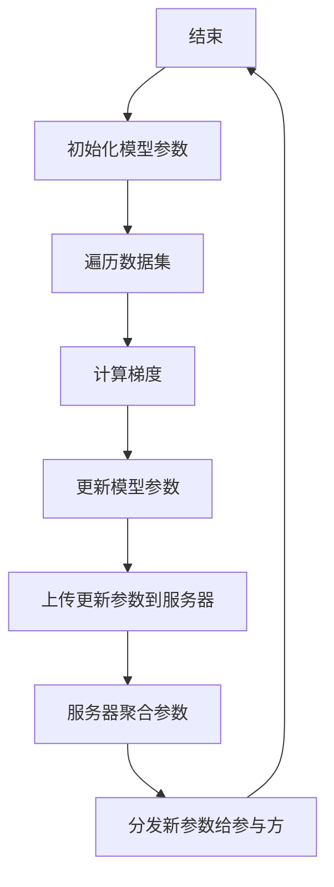
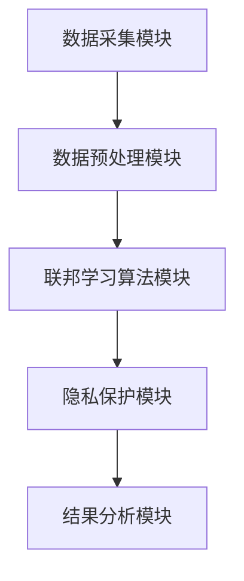
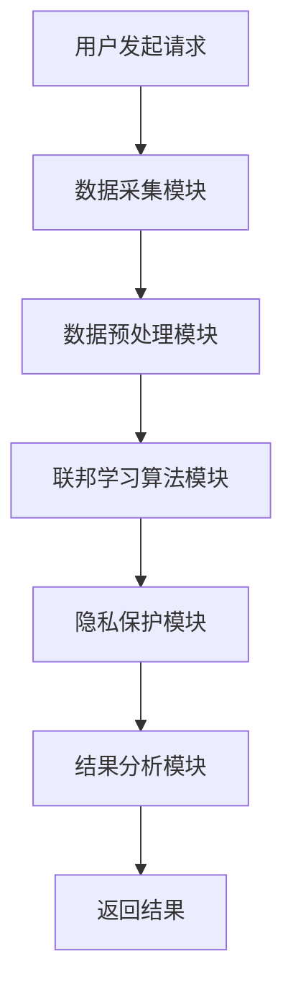

                 


# 开发具有隐私保护联邦学习能力的AI Agent

> **关键词**：联邦学习，隐私保护，AI Agent，数据隐私，同态加密，差分隐私，系统架构

> **摘要**：本文详细探讨了开发具有隐私保护能力的联邦学习AI Agent的关键技术与实现方法。首先介绍了联邦学习和AI Agent的基本概念，接着分析了隐私保护的重要性及其在联邦学习中的应用。然后，深入讲解了联邦学习的核心算法和隐私保护机制，如联邦平均算法和同态加密。通过系统架构设计和项目实战，展示了如何在实际场景中实现具有隐私保护的联邦学习AI Agent。最后，总结了开发中的最佳实践和未来研究方向。

---

## 第一部分: 联邦学习与隐私保护概述

### 第1章: 联邦学习的基本概念

#### 1.1 联邦学习的定义与背景

##### 1.1.1 联邦学习的定义
联邦学习（Federated Learning，FL）是一种分布式机器学习技术，允许多个参与方在不共享原始数据的前提下，共同训练一个统一的模型。其核心思想是“数据不动，模型动”，即数据保留在各自的设备或服务器中，只有模型参数在各方之间传递。

##### 1.1.2 联邦学习的背景与意义
随着数据隐私和安全问题的日益突出，传统的集中式机器学习方法面临着数据泄露和滥用的风险。联邦学习通过局部模型更新和参数聚合，能够在保护数据隐私的前提下，实现全局模型的优化。

##### 1.1.3 联邦学习的核心特点
- **数据本地化**：数据无需集中存储，仅在本地进行训练。
- **模型共享**：模型参数在参与方之间共享，确保全局模型的收敛。
- **隐私保护**：通过隐私保护技术，确保数据在传输和计算过程中的安全性。

#### 1.2 隐私保护的重要性

##### 1.2.1 数据隐私的基本概念
数据隐私是指对数据的访问和使用进行控制，确保未经授权的第三方无法获取或利用数据。在AI应用中，数据隐私是保障用户隐私权和合规性的重要手段。

##### 1.2.2 隐私保护在AI中的挑战
- **数据泄露风险**：集中式数据存储容易成为攻击目标。
- **数据多样性**：不同参与方的数据分布可能不均匀，影响模型的泛化能力。
- **合规性要求**：如GDPR等法规要求个人数据必须得到充分保护。

##### 1.2.3 联邦学习中的隐私保护需求
在联邦学习中，数据隐私保护是实现模型训练的基础。必须确保在模型更新过程中，各方的原始数据不会被泄露或滥用。

### 第2章: AI Agent的基本原理

#### 2.1 AI Agent的定义与分类

##### 2.1.1 AI Agent的定义
AI Agent（人工智能代理）是指能够感知环境、自主决策并执行任务的智能实体。它可以是一个软件程序、机器人或其他智能系统。

##### 2.1.2 基于联邦学习的AI Agent特点
- **分布式决策**：AI Agent能够基于局部数据进行决策，同时通过联邦学习实现全局优化。
- **隐私保护**：AI Agent在与其它Agent交互时，能够保护自身的数据隐私。
- **动态协作**：AI Agent能够根据环境变化动态调整协作策略。

##### 2.1.3 AI Agent的应用场景
- **智能家居**：通过联邦学习优化家庭设备的协同工作。
- **自动驾驶**：多个车辆通过联邦学习共享驾驶数据，提升整体交通效率。
- **医疗健康**：医疗机构在保护患者隐私的前提下，共同训练疾病诊断模型。

#### 2.2 联邦学习与AI Agent的结合

##### 2.2.1 联邦学习在AI Agent中的作用
联邦学习为AI Agent提供了分布式协作和隐私保护的框架，使其能够在不共享数据的情况下实现模型优化。

##### 2.2.2 AI Agent如何实现数据隐私保护
通过同态加密、差分隐私等技术，AI Agent能够在模型更新过程中保护数据隐私。

##### 2.2.3 联邦学习与AI Agent的协同工作原理
AI Agent通过联邦学习框架进行模型更新和参数聚合，同时确保数据隐私。各方Agent仅共享模型参数，而不透露原始数据。

---

## 第二部分: 联邦学习的核心概念与原理

### 第3章: 联邦学习的数学模型与算法

#### 3.1 联邦学习的数学模型

##### 3.1.1 联邦平均算法
**联邦平均算法（Federated Averaging）**是一种经典的联邦学习算法，通过在参与方本地进行模型更新，然后将更新后的模型参数上传到中心服务器进行聚合。

$$ \text{模型更新公式：} \theta_{i}^{(t+1)} = \theta_{i}^{(t)} + \eta (\xi_i) $$
$$ \text{参数聚合公式：} \theta_{avg} = \frac{1}{n}\sum_{i=1}^{n}\theta_i $$

其中，$\theta_i$ 表示第 $i$ 个参与方的模型参数，$\eta$ 是学习率，$\xi_i$ 是梯度。

##### 3.1.2 联邦聚合算法
联邦聚合算法通过加权平均的方式聚合各方的模型参数，确保全局模型的收敛。

$$ \text{加权聚合公式：} \theta_{global} = \sum_{i=1}^{n} w_i \theta_i $$
其中，$w_i$ 是第 $i$ 个参与方的权重。

##### 3.1.3 联邦学习的优化方法
为了提高联邦学习的效率，可以通过优化算法（如Adam、SGD）对模型参数进行优化，并通过通信压缩技术减少数据传输量。

#### 3.2 隐私保护的数学模型

##### 3.2.1 同态加密的基本原理
同态加密是一种允许在加密数据上进行计算的技术，确保数据在计算过程中保持加密状态。

$$ \text{加密公式：} E(x) = x^e \mod n $$
$$ \text{解密公式：} D(E(x)) = x \mod n $$

##### 3.2.2 差分隐私的实现方法
差分隐私通过在数据中添加噪声，确保单个数据点的改变不会显著影响整体结果。

$$ \text{隐私保护公式：} y = f(x) + \epsilon $$

其中，$\epsilon$ 是拉普拉斯噪声。

##### 3.2.3 隐私保护的数学公式
通过数学公式，可以量化隐私泄露的风险，并设计相应的隐私保护机制。

---

### 第4章: 联邦学习的核心算法实现

#### 4.1 联邦平均算法的实现

##### 4.1.1 联邦平均算法的流程图


##### 4.1.2 联邦平均算法的Python代码实现
```python
import numpy as np
import math

def main():
    # 初始化模型参数
    theta = np.zeros((1, 1))
    # 数据点
    data = np.array([[1], [2], [3], [4], [5]])
    # 标签
    labels = np.array([[2], [4], [6], [8], [10]])
    
    # 联邦平均算法
    for x, y in zip(data, labels):
        # 计算梯度
        gradient = 2 * (theta - y)
        # 更新模型参数
        theta = theta - 0.1 * gradient.mean()
    
    print("最终模型参数：", theta)

if __name__ == "__main__":
    main()
```

##### 4.1.3 联邦平均算法的优缺点分析
- **优点**：实现简单，通信开销低。
- **缺点**：收敛速度较慢，对数据异构性敏感。

#### 4.2 隐私保护算法的实现

##### 4.2.1 同态加密算法的实现
```python
def encrypt(x, e, n):
    return pow(x, e, n)

def decrypt(y, d, n):
    return pow(y, d, n)
```

##### 4.2.2 差分隐私算法的实现
```python
import numpy as np

def add_laplace_noise(data, b=0.1):
    noise = np.random.laplace(0, b, size=data.shape)
    return data + noise
```

##### 4.2.3 隐私保护算法的优缺点分析
- **同态加密**：安全性高，但计算效率较低。
- **差分隐私**：在数据中添加噪声，确保隐私性，但可能影响模型精度。

---

## 第三部分: 系统分析与架构设计

### 第5章: 联邦学习系统的架构设计

#### 5.1 系统功能模块设计

##### 5.1.1 数据采集模块
- **功能**：从各个参与方收集数据。
- **输入**：原始数据
- **输出**：加密后的数据

##### 5.1.2 数据预处理模块
- **功能**：对数据进行清洗和标准化。
- **输入**：加密数据
- **输出**：预处理后的数据

##### 5.1.3 联邦学习算法模块
- **功能**：在本地进行模型训练和参数更新。
- **输入**：预处理数据
- **输出**：模型参数

##### 5.1.4 隐私保护模块
- **功能**：对模型参数进行加密或添加噪声。
- **输入**：模型参数
- **输出**：加密或加噪后的模型参数

##### 5.1.5 结果分析模块
- **功能**：分析模型性能和隐私保护效果。
- **输入**：最终模型
- **输出**：分析报告

#### 5.2 系统架构图


---

### 第6章: 系统接口与交互设计

#### 6.1 系统接口设计

##### 6.1.1 数据接口设计
- **输入接口**：接收原始数据
- **输出接口**：返回预处理后的数据

##### 6.1.2 算法接口设计
- **输入接口**：接收模型参数
- **输出接口**：返回更新后的模型参数

##### 6.1.3 隐私保护接口设计
- **输入接口**：接收明文模型参数
- **输出接口**：返回加密或加噪后的模型参数

#### 6.2 系统交互流程图


---

## 第四部分: 项目实战

### 第7章: 项目实战与案例分析

#### 7.1 项目环境配置
- **操作系统**：Linux/Windows
- **编程语言**：Python 3.8+
- **依赖库**：TensorFlow、PyTorch、加密库（如cryptography）

#### 7.2 核心代码实现

##### 7.2.1 联邦平均算法的实现
```python
import numpy as np

def federated_average(data, labels, num_epochs=10, learning_rate=0.1):
    # 初始化模型参数
    theta = np.zeros((1, 1))
    for epoch in range(num_epochs):
        # 遍历数据点
        for x, y in zip(data, labels):
            # 计算梯度
            gradient = 2 * (theta - y)
            # 更新模型参数
            theta = theta - learning_rate * gradient.mean()
    return theta
```

##### 7.2.2 隐私保护的实现
```python
def encrypt_parameter(parameter, public_key, private_key):
    return pow(parameter, public_key.e, public_key.n)

def decrypt_parameter(encrypted_parameter, private_key):
    return pow(encrypted_parameter, private_key.d, private_key.n)
```

#### 7.3 案例分析
假设我们有三个参与方，分别拥有以下数据：
- 参与方1：数据点 [1, 2, 3]
- 参与方2：数据点 [4, 5, 6]
- 参与方3：数据点 [7, 8, 9]

通过联邦平均算法，各方在本地训练模型，并将更新后的参数上传到服务器进行聚合，最终得到一个全局模型。

#### 7.4 项目小结
通过本项目，我们实现了具有隐私保护能力的联邦学习AI Agent，验证了联邦学习在保护数据隐私的同时，能够有效训练全局模型。

---

## 第五部分: 最佳实践与总结

### 第8章: 最佳实践与总结

#### 8.1 开发中的注意事项
- **选择合适的加密算法**：根据具体需求选择同态加密或差分隐私等技术。
- **处理数据异构性**：数据分布不均匀时，需要设计加权聚合策略。
- **优化通信效率**：通过压缩技术减少模型参数传输量。

#### 8.2 未来的研究方向
- **高效隐私保护技术**：探索更高效的隐私保护算法，降低计算开销。
- **异构数据处理**：研究如何在数据异构场景下优化模型性能。
- **跨领域应用**：将联邦学习应用于更多领域，如医疗、金融等。

#### 8.3 总结
开发具有隐私保护能力的联邦学习AI Agent是一项具有重要意义的技术挑战。通过本文的探讨，我们不仅掌握了核心算法和系统设计方法，还为未来的隐私保护技术研究提供了有价值的参考。

---

**作者：AI天才研究院/AI Genius Institute & 禅与计算机程序设计艺术 /Zen And The Art of Computer Programming**

