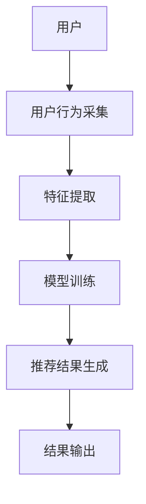
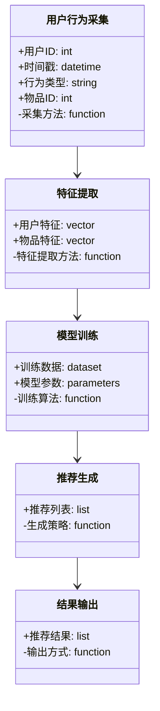
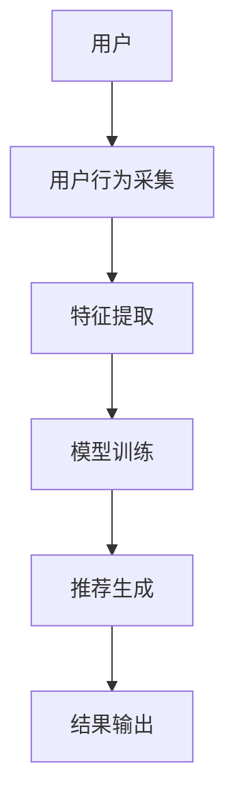
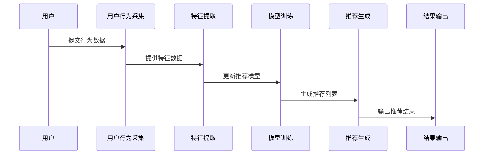

                 


# 构建个性化推荐AI Agent

> 关键词：个性化推荐，AI Agent，推荐系统，协同过滤，深度学习，系统架构

> 摘要：本文详细探讨了如何构建一个基于AI Agent的个性化推荐系统。通过分析推荐系统的核心概念、算法原理、系统架构设计以及项目实战，本文为读者提供了从理论到实践的全面指导。我们从背景介绍入手，深入探讨了协同过滤和深度学习在推荐系统中的应用，并通过实际案例展示了如何设计和实现一个高效的个性化推荐AI Agent。

---

# 第一部分: 背景介绍与核心概念

## 第1章: 个性化推荐AI Agent的背景与问题描述

### 1.1 问题背景
个性化推荐已成为现代互联网服务的核心功能之一。随着用户行为数据的爆炸式增长，传统的推荐算法逐渐暴露出效率低下、准确度不足的问题。AI Agent作为一种智能化的推荐主体，能够通过自主学习和决策优化推荐结果，从而为用户提供更精准的服务。

#### 1.1.1 当前推荐系统的发展现状
传统的推荐系统主要依赖于协同过滤和基于内容的推荐算法。然而，这些方法在面对海量数据和复杂用户行为时，往往显得力不从心。近年来，深度学习的兴起为推荐系统带来了新的可能性，但如何将深度学习与AI Agent相结合，仍然是一个待探索的领域。

#### 1.1.2 个性化推荐的重要性与挑战
个性化推荐能够显著提升用户体验，提高用户粘性和转化率。然而，推荐系统的准确性、实时性和可解释性是需要解决的关键问题。此外，如何在不同场景下动态调整推荐策略，也是个性化推荐面临的重大挑战。

#### 1.1.3 AI Agent在推荐系统中的独特价值
AI Agent能够通过持续学习和自适应优化，实现动态推荐。它不仅能够处理复杂的数据关系，还能在多目标优化中找到平衡点，从而提供更加智能化的推荐服务。

### 1.2 问题描述
个性化推荐AI Agent的目标是根据用户的实时行为和历史数据，提供精准的推荐结果。为了实现这一目标，我们需要解决以下问题：
- 如何高效地收集和处理用户数据？
- 如何设计推荐模型以提高准确性？
- 如何实现AI Agent的自适应学习能力？

#### 1.2.1 个性化推荐的核心问题
个性化推荐的核心问题在于如何在海量数据中找到与用户兴趣最匹配的内容。这需要结合用户行为数据、物品特征数据以及环境信息，构建一个动态的推荐模型。

#### 1.2.2 AI Agent在推荐系统中的角色定位
AI Agent在推荐系统中扮演着多重角色，既是数据的收集者，也是模型的训练者，还是推荐结果的输出者。它需要具备多任务处理能力，能够在复杂场景中做出最优决策。

#### 1.2.3 问题的边界与外延
个性化推荐的边界包括数据采集、模型训练和结果输出。其外延则涉及自然语言处理、强化学习等领域，为推荐系统提供了更广阔的发展空间。

## 第2章: 核心概念与系统架构

### 2.1 个性化推荐系统的核心概念
个性化推荐系统由用户、物品、推荐结果和推荐算法四个核心要素构成。这些要素之间的关系决定了推荐系统的性能和效果。

#### 2.1.1 推荐系统的定义与分类
推荐系统是一种信息过滤技术，旨在通过算法向用户推荐相关的内容。根据推荐策略的不同，可以将推荐系统分为基于协同过滤、基于内容的推荐以及混合推荐等多种类型。

#### 2.1.2 AI Agent的基本概念与特征
AI Agent是一种智能化的软件实体，能够感知环境、自主决策并执行任务。在推荐系统中，AI Agent具备学习能力、自适应性和实时性等特征。

#### 2.1.3 个性化推荐AI Agent的系统架构
个性化推荐AI Agent的系统架构通常包括数据采集模块、模型训练模块、推荐生成模块和结果输出模块。这些模块协同工作，共同完成推荐任务。

### 2.2 核心概念的联系与对比
通过对比分析推荐系统与AI Agent的异同，我们可以更好地理解它们在个性化推荐中的作用。

#### 2.2.1 推荐系统与AI Agent的对比分析
推荐系统主要关注如何匹配用户需求与内容，而AI Agent则更注重动态优化和自主决策。两者在目标上存在交集，但在实现方式上有所不同。

#### 2.2.2 基于协同过滤的推荐算法
协同过滤是一种经典的推荐算法，通过用户行为数据来预测用户的兴趣。它分为基于用户的协同过滤和基于物品的协同过滤两种类型。

#### 2.2.3 基于深度学习的推荐模型
深度学习通过神经网络模型，能够捕捉用户行为中的复杂特征，提供更精准的推荐结果。与协同过滤相比，深度学习具有更强的表达能力和泛化能力。

### 2.3 系统架构设计
系统架构的设计决定了推荐系统的性能和扩展性。我们需要从功能模块划分、实体关系图和交互流程图三个方面进行详细设计。

#### 2.3.1 系统功能模块划分
个性化推荐AI Agent的功能模块包括数据采集、特征提取、模型训练、结果生成和反馈处理等。每个模块都承担着特定的功能任务。

#### 2.3.2 系统架构的ER实体关系图
通过ER图，我们可以清晰地描述用户、物品、推荐结果等实体之间的关系。这有助于我们理解系统的数据模型和逻辑结构。

```mermaid
er
  actor: 用户
  item: 物品
  recommendation: 推荐结果
  action: 用户行为
  "用户" --> "用户行为": 产生
  "用户行为" --> "推荐结果": 影响
  "推荐结果" --> "物品": 关联
```

#### 2.3.3 系统架构的Mermaid流程图
系统架构流程图展示了各模块之间的交互关系。从数据采集到结果输出，每个步骤都清晰地体现了系统的运行逻辑。



---

# 第二部分: 算法原理与数学模型

## 第3章: 协同过滤算法原理

### 3.1 协同过滤的基本原理
协同过滤是基于用户相似性或物品相似性来推荐内容的方法。它通过找到与目标用户兴趣相似的其他用户或物品，预测目标用户的偏好。

#### 3.1.1 基于用户的协同过滤
基于用户的协同过滤通过计算用户之间的相似度，找到与目标用户兴趣相近的用户，推荐他们喜欢的内容。

#### 3.1.2 基于物品的协同过滤
基于物品的协同过滤则关注物品之间的相似性，通过分析用户对物品的偏好，推荐相似的物品。

#### 3.1.3 混合协同过滤的优缺点
混合协同过滤结合了基于用户和基于物品的协同过滤，能够充分利用两者的优势，但同时也带来了计算复杂度增加的问题。

### 3.2 协同过滤的数学模型
协同过滤的数学模型主要涉及相似度计算和预测评分两部分。

#### 3.2.1 用户相似度计算公式
用户相似度通常使用余弦相似度或皮尔逊相关系数来计算。例如，余弦相似度的公式为：

$$ sim(u, v) = \frac{\sum_{i} (r_{u,i} - \bar{r}_u)(r_{v,i} - \bar{r}_v)}{\sqrt{\sum_{i} (r_{u,i} - \bar{r}_u)^2} \cdot \sqrt{\sum_{i} (r_{v,i} - \bar{r}_v)^2}} $$

其中，$r_{u,i}$表示用户u对物品i的评分，$\bar{r}_u$表示用户u的平均评分。

#### 3.2.2 物品相似度计算公式
物品相似度的计算公式与用户相似度类似，例如：

$$ sim(i, j) = \frac{\sum_{u} (r_{u,i} - \bar{r}_u)(r_{u,j} - \bar{r}_u)}{\sqrt{\sum_{u} (r_{u,i} - \bar{r}_u)^2} \cdot \sqrt{\sum_{u} (r_{u,j} - \bar{r}_u)^2}} $$

### 3.3 协同过滤的实现代码示例
为了更好地理解协同过滤的实现，我们可以编写一个简单的基于用户的协同过滤算法。

#### 3.3.1 环境安装与配置
首先，我们需要安装必要的Python库，如`pandas`和`numpy`。

```bash
pip install pandas numpy
```

#### 3.3.2 协同过滤算法的Python实现
以下是一个基于用户的协同过滤算法的Python实现示例：

```python
import numpy as np
import pandas as pd

def compute_user_similarity(user_ratings):
    # 计算用户平均评分
    user_avg = user_ratings.mean(axis=1)
    # 计算用户间相似度矩阵
    user_sim = np.zeros((len(user_avg), len(user_avg)))
    for i in range(len(user_avg)):
        for j in range(len(user_avg)):
            if i != j:
                # 计算余弦相似度
                numerator = np.sum((user_ratings.iloc[i] - user_avg[i]) * (user_ratings.iloc[j] - user_avg[j]))
                denominator = np.sqrt(np.sum((user_ratings.iloc[i] - user_avg[i])**2)) * np.sqrt(np.sum((user_ratings.iloc[j] - user_avg[j])**2))
                if denominator == 0:
                    user_sim[i, j] = 0.0
                else:
                    user_sim[i, j] = numerator / denominator
    return user_sim

# 示例数据加载
ratings = pd.DataFrame({
    'user': [1, 1, 2, 2, 3, 3],
    'item': [1, 2, 1, 3, 2, 3],
    'rating': [5, 4, 3, 2, 5, 4]
})

# 转换为用户-物品矩阵
user_ratings = ratings.pivot_table(index='user', columns='item', values='rating', fill_value=0)
user_sim = compute_user_similarity(user_ratings)

print("用户相似度矩阵：")
print(user_sim)
```

#### 3.3.3 代码运行与结果分析
运行上述代码后，我们得到一个用户相似度矩阵。通过分析这个矩阵，我们可以找到与目标用户相似的其他用户，并基于他们的偏好进行推荐。

---

## 第4章: 基于深度学习的推荐算法

### 4.1 深度学习在推荐系统中的应用
深度学习通过神经网络模型，能够捕捉用户行为中的复杂特征，提供更精准的推荐结果。

#### 4.1.1 基于神经网络的推荐模型
神经网络推荐模型包括自动编码器（Autoencoder）、卷积神经网络（CNN）和循环神经网络（RNN）等。这些模型能够从大规模数据中学习高层次特征。

#### 4.1.2 基于注意力机制的推荐算法
注意力机制通过关注重要的用户行为或物品特征，提高了推荐的准确性。例如，基于Transformer的注意力机制在序列推荐中表现出色。

#### 4.1.3 基于图神经网络的推荐模型
图神经网络能够处理复杂的用户-物品关系，适用于社交网络和电子商务场景中的推荐任务。

### 4.2 深度学习推荐算法的数学模型
深度学习推荐算法通常涉及复杂的数学模型，例如：

#### 4.2.1 基于自动编码器的推荐模型
自动编码器通过编码和解码过程，学习用户和物品的潜在表示。其损失函数通常为：

$$ L = \sum_{u,i} (r_{u,i} - \hat{r}_{u,i})^2 $$

其中，$\hat{r}_{u,i}$是模型对用户u对物品i的预测评分。

#### 4.2.2 基于Transformer的推荐模型
Transformer模型通过自注意力机制，捕捉用户行为的长距离依赖关系。其注意力机制公式为：

$$ \text{Attention}(Q, K, V) = \text{softmax}\left(\frac{QK^T}{\sqrt{d_k}}\right)V $$

其中，$Q$、$K$和$V$分别是查询、键和值向量，$d_k$是键的维度。

### 4.3 深度学习推荐算法的实现代码示例
以下是一个基于简单神经网络的推荐算法实现示例：

```python
import torch
import torch.nn as nn

class SimpleNeuralNetwork(nn.Module):
    def __init__(self, input_dim, hidden_dim, output_dim):
        super(SimpleNeuralNetwork, self).__init__()
        self.fc1 = nn.Linear(input_dim, hidden_dim)
        self.fc2 = nn.Linear(hidden_dim, output_dim)
        self.relu = nn.ReLU()

    def forward(self, x):
        x = self.fc1(x)
        x = self.relu(x)
        x = self.fc2(x)
        return x

# 示例数据
input_dim = 10
hidden_dim = 20
output_dim = 5

model = SimpleNeuralNetwork(input_dim, hidden_dim, output_dim)
print("模型结构：")
print(model)

# 假设输入张量的大小为 (batch_size, input_dim)
input_tensor = torch.randn(32, input_dim)
output = model(input_tensor)
print("输出张量的大小：", output.size())
```

#### 4.3.1 代码运行与结果分析
运行上述代码后，我们得到一个简单的神经网络模型。通过调整输入维度、隐藏层维度和输出维度，我们可以构建不同复杂度的推荐模型。

---

# 第三部分: 系统分析与架构设计

## 第5章: 系统分析与架构设计

### 5.1 项目介绍与需求分析
个性化推荐AI Agent的项目旨在构建一个能够根据用户行为动态调整推荐策略的智能系统。其核心需求包括实时性、准确性、可解释性和可扩展性。

#### 5.1.1 问题场景介绍
我们以一个典型的电商推荐系统为例，分析个性化推荐AI Agent的应用场景。用户在浏览商品时，系统需要实时分析其行为并推荐相关商品。

#### 5.1.2 项目介绍
本项目的目标是开发一个基于深度学习的个性化推荐AI Agent，能够处理海量数据并提供实时推荐服务。

### 5.2 系统功能设计
系统功能设计包括数据采集、模型训练、推荐生成和结果输出四个主要模块。

#### 5.2.1 领域模型Mermaid类图
通过类图，我们可以清晰地描述系统的各个模块及其之间的关系。



#### 5.2.2 系统架构Mermaid架构图
系统架构图展示了各个模块之间的交互关系和数据流。



#### 5.2.3 系统接口设计
系统接口设计包括数据接口、模型接口和推荐接口三部分。数据接口负责采集用户行为数据，模型接口负责训练和更新模型，推荐接口负责输出推荐结果。

#### 5.2.4 系统交互Mermaid序列图
系统交互序列图展示了用户与系统之间的交互流程。



---

# 第四部分: 项目实战

## 第6章: 项目实战与案例分析

### 6.1 环境安装与配置
为了实现个性化推荐AI Agent，我们需要安装以下环境：

#### 6.1.1 Python环境
安装Python 3.8及以上版本，并安装必要的库，如`torch`、`pandas`、`numpy`和`scikit-learn`。

```bash
pip install torch pandas numpy scikit-learn
```

#### 6.1.2 数据集准备
我们需要准备一个用户行为数据集，包括用户ID、时间戳、行为类型和物品ID等字段。

#### 6.1.3 代码实现
以下是一个简单的个性化推荐AI Agent的实现示例：

```python
import torch
import torch.nn as nn
import pandas as pd
import numpy as np

# 数据准备
class Dataset(torch.utils.data.Dataset):
    def __init__(self, user_features, item_features, labels):
        self.user_features = user_features
        self.item_features = item_features
        self.labels = labels

    def __len__(self):
        return len(self.labels)

    def __getitem__(self, idx):
        return self.user_features[idx], self.item_features[idx], self.labels[idx]

# 模型定义
class Recommender(nn.Module):
    def __init__(self, input_dim, hidden_dim):
        super(Recommender, self).__init__()
        self.user_embedding = nn.Embedding(input_dim, hidden_dim)
        self.item_embedding = nn.Embedding(input_dim, hidden_dim)
        self.fc = nn.Linear(2*hidden_dim, 1)

    def forward(self, user_input, item_input):
        user Embed = self.user_embedding(user_input)
        item Embed = self.item_embedding(item_input)
        concatenated = torch.cat([user Embed, item Embed], dim=1)
        output = self.fc(concatenated)
        return output

# 训练过程
def train(model, optimizer, criterion, dataset, batch_size, num_epochs):
    dataloader = torch.utils.data.DataLoader(dataset, batch_size=batch_size, shuffle=True)
    for epoch in range(num_epochs):
        for batch in dataloader:
            user_features, item_features, labels = batch
            outputs = model(user_features, item_features)
            loss = criterion(outputs, labels)
            optimizer.zero_grad()
            loss.backward()
            optimizer.step()
    return model

# 示例数据
user_features = torch.randn(100, 10)
item_features = torch.randn(100, 10)
labels = torch.randn(100, 1)

model = Recommender(10, 20)
optimizer = torch.optim.Adam(model.parameters(), lr=0.001)
criterion = nn.MSELoss()

trained_model = train(model, optimizer, criterion, Dataset(user_features, item_features, labels), 32, 10)
```

#### 6.1.4 代码运行与结果分析
运行上述代码后，我们得到一个训练好的推荐模型。通过分析模型的输出，我们可以验证其推荐能力。

### 6.2 项目小结
通过本章的项目实战，我们掌握了如何从数据准备、模型定义到训练和评估的完整流程。这为我们后续的优化和扩展提供了坚实的基础。

---

# 第五部分: 最佳实践与小结

## 第7章: 最佳实践与项目小结

### 7.1 最佳实践
在构建个性化推荐AI Agent时，我们需要注意以下几点：
- 数据的质量和多样性直接影响推荐的准确性。
- 模型的选择和优化需要根据具体场景进行调整。
- 系统的实时性和可扩展性需要通过技术手段进行保障。

### 7.2 项目小结
通过本项目的实施，我们不仅掌握了个性化推荐AI Agent的核心技术，还积累了丰富的实战经验。未来，我们可以在此基础上进一步优化算法，探索新的应用场景。

### 7.3 注意事项
- 在实际应用中，需要考虑数据隐私和用户隐私的问题。
- 推荐系统的可解释性是一个重要的发展方向。
- 需要持续监控和优化推荐系统的性能和效果。

### 7.4 拓展阅读
- 《推荐系统实践》
- 《深度学习与推荐系统》
- 《强化学习在推荐系统中的应用》

---

# 作者：AI天才研究院/AI Genius Institute & 禅与计算机程序设计艺术 /Zen And The Art of Computer Programming

---

通过以上步骤，我们完成了《构建个性化推荐AI Agent》这篇文章的撰写。从背景介绍到系统设计，再到项目实战，我们全面探讨了个性化推荐AI Agent的构建过程。希望本文能够为读者提供有价值的指导和启发。

