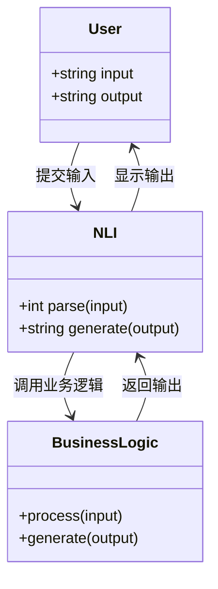
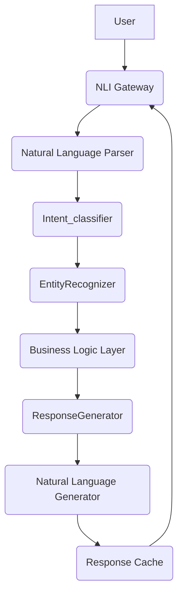
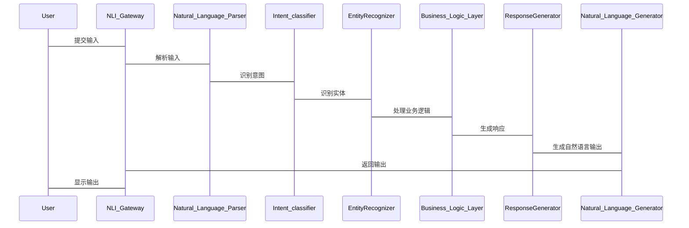

                 


# 构建企业级自然语言接口：复杂业务系统的智能交互层

## 关键词：自然语言接口，企业级应用，智能交互层，自然语言处理，系统架构设计

## 摘要：  
本文详细探讨了如何构建企业级自然语言接口，以实现复杂业务系统的智能交互层。文章从自然语言处理的基本概念出发，分析了其在企业应用中的背景与现状，探讨了核心算法原理与系统架构设计，通过实际案例展示了项目实战，并总结了最佳实践与注意事项。通过本文，读者将能够全面理解自然语言接口的技术要点，并掌握实际应用中的关键方法。

---

## 第一部分：自然语言接口与企业级应用概述

### 第1章：自然语言接口概述

#### 1.1 自然语言接口的基本概念

##### 1.1.1 自然语言处理的定义  
自然语言处理（NLP）是计算机科学中的一个分支，旨在让计算机能够理解和生成人类语言。它结合了语言学、机器学习和人工智能技术，致力于解决语言理解、翻译、文本生成等问题。

##### 1.1.2 自然语言接口的核心要素  
自然语言接口（NLI）是用户与计算机系统之间的语言交互界面，核心要素包括：
- **输入解析**：将自然语言文本转换为系统可理解的结构。
- **意图识别**：识别用户的意图和需求。
- **实体识别**：提取文本中的关键实体信息。
- **生成输出**：根据理解和需求生成自然语言的响应。

##### 1.1.3 企业级应用中的自然语言交互  
在企业级应用中，自然语言接口主要用于客户服务、业务流程自动化、内部协作等领域。通过NLI，用户可以以自然语言形式与系统交互，提升用户体验和效率。

#### 1.2 自然语言接口的背景与现状

##### 1.2.1 自然语言处理技术的发展历程  
从基于规则的系统到深度学习模型，自然语言处理技术经历了多个阶段的发展。近年来，大模型（如BERT、GPT）的出现，显著提升了NLI的准确性和智能性。

##### 1.2.2 企业级应用中的需求变化  
随着企业数字化转型的推进，对智能化交互的需求日益增长。传统的基于规则的系统逐渐被基于深度学习的模型取代，以应对更复杂和多样化的业务需求。

##### 1.2.3 当前技术的挑战与机遇  
当前，NLI技术在企业应用中的主要挑战包括数据稀疏性、多语言支持、模型可解释性等。同时，大模型的引入带来了更高的准确性和更强的上下文理解能力，为NLI的发展提供了新的机遇。

#### 1.3 自然语言接口的应用场景

##### 1.3.1 客户服务与支持  
通过NLI，企业可以实现智能客服，自动解析用户的问题并提供解决方案，显著提升客户满意度和服务效率。

##### 1.3.2 业务流程自动化  
NLI可以自动化处理业务流程中的自然语言指令，例如自动创建工单、审批流程等，减少人工干预，提高业务处理速度。

##### 1.3.3 内部协作与信息检索  
在企业内部，NLI可以辅助员工进行信息检索、任务分配等协作，提升内部沟通效率和信息利用率。

#### 1.4 本章小结  
本章介绍了自然语言接口的基本概念、背景与现状，以及在企业级应用中的主要场景。通过这些内容，读者可以理解NLI在企业中的重要性及其应用潜力。

---

## 第二部分：自然语言接口的核心技术与算法原理

### 第2章：自然语言处理的算法基础

#### 2.1 词嵌入与上下文表示

##### 2.1.1 词向量的基本概念  
词向量是将词语映射为向量表示的方法，常见的词向量模型包括Word2Vec、GloVe等。通过词向量，可以捕捉词语之间的语义关系。

##### 2.1.2 常见的词嵌入模型  
- **Word2Vec**：通过神经网络模型训练词向量，支持连续词袋模型（CBOW）和跳跃词模型（Skip-Gram）。
- **GloVe**：基于全局词向量的潜在语义结构，通过矩阵分解生成词向量。
- **FastText**：支持处理罕见词和长词的快速训练方法。

##### 2.1.3 上下文感知的表示方法  
上下文感知的表示方法（如BERT）能够捕捉到词在特定上下文中的语义信息，通过预训练模型生成动态词向量。

#### 2.2 语言模型与序列建模

##### 2.2.1 基于RNN的序列建模  
循环神经网络（RNN）通过处理序列数据，捕捉上下文信息。然而，RNN存在梯度消失和梯度爆炸的问题，限制了其在长序列中的表现。

##### 2.2.2 Transformer架构的原理  
Transformer架构通过自注意力机制和位置编码，实现高效的序列建模。其核心思想是通过全局注意力计算每个词对其他词的依赖关系。

##### 2.2.3 大模型在语言建模中的应用  
大模型（如GPT、BERT）通过海量数据的预训练，掌握了丰富的语言知识，能够生成高质量的文本和理解复杂语义。

#### 2.3 自然语言理解与生成的算法对比

##### 2.3.1 基于规则的NLU方法  
基于规则的方法通过预定义的语法规则和关键词匹配，实现自然语言理解。这种方法适用于特定场景，但灵活性较低。

##### 2.3.2 统计学习的NLU方法  
统计学习方法通过训练数据学习语言规律，常用技术包括马尔可夫链、隐马尔可夫模型（HMM）等。这种方法能够处理更复杂的语言现象，但需要大量标注数据。

##### 2.3.3 基于大模型的NLU与NLG对比  
大模型在NLU和NLG任务中表现优异，但其训练成本较高，需要大量的计算资源和数据支持。

#### 2.4 本章小结  
本章介绍了自然语言处理中的词嵌入、语言模型和算法原理，分析了不同方法的优缺点及其应用场景。

### 第3章：自然语言接口的算法实现

#### 3.1 基于规则的自然语言接口实现

##### 3.1.1 规则引擎的基本原理  
规则引擎通过预定义的规则和条件，对输入文本进行解析和处理。常见的规则引擎包括Drools、Activiti等。

##### 3.1.2 业务规则的定义与管理  
业务规则的定义包括规则的条件、动作和优先级。规则管理通常涉及规则的存储、版本控制和动态更新。

##### 3.1.3 规则驱动的交互流程  
基于规则的NLI通过解析用户的输入，匹配相应的规则，生成响应。这种方法适用于规则明确且变化较小的场景。

#### 3.2 基于模型的自然语言接口实现

##### 3.2.1 基于预训练模型的微调  
基于大模型的NLI实现通常需要对预训练模型进行微调，以适应特定领域的任务需求。

##### 3.2.2 模型压缩与轻量化技术  
为了降低计算成本和提升性能，可以通过模型剪枝、知识蒸馏等技术对大模型进行压缩，生成轻量化的模型。

##### 3.2.3 模型的可解释性与调试  
模型的可解释性是企业应用中重要的考量因素。通过可视化工具和调试方法，可以分析模型的决策过程，提升模型的透明度和可信度。

#### 3.3 混合驱动的自然语言接口实现

##### 3.3.1 规则与模型的协同工作  
混合驱动的NLI结合了规则和模型的优势，适用于规则和模型各有优劣的场景。例如，规则用于处理明确的业务逻辑，模型处理复杂的语义理解。

##### 3.3.2 混合驱动的交互流程  
在混合驱动的NLI中，系统首先通过规则进行初步解析，然后通过模型处理复杂的语义问题，确保交互的准确性和智能性。

#### 3.4 本章小结  
本章详细探讨了自然语言接口的实现方法，包括基于规则、基于模型以及混合驱动的实现方式，并分析了各自的优缺点和适用场景。

---

## 第三部分：自然语言接口的系统架构与设计

### 第4章：系统架构设计与实现

#### 4.1 问题场景介绍

##### 4.1.1 项目背景  
本项目旨在构建一个企业级自然语言接口，用于复杂业务系统的智能交互层。通过NLI技术，用户可以通过自然语言与系统交互，实现业务流程自动化和客户服务智能化。

##### 4.1.2 项目目标  
- 提供高效的自然语言解析能力。
- 实现意图识别和实体识别的准确性。
- 支持多种交互渠道（如文本、语音）。
- 提供高可用性和可扩展性的系统架构。

#### 4.2 系统功能设计

##### 4.2.1 领域模型设计  
领域模型是系统功能设计的核心，通过绘制领域模型图（Mermaid），可以清晰地展示系统的功能模块及其交互关系。



##### 4.2.2 系统架构设计  
系统架构设计需要考虑系统的可扩展性、可维护性和高可用性。通过绘制系统架构图（Mermaid），可以展示系统的各个模块及其交互关系。



##### 4.2.3 系统接口设计  
系统接口设计需要定义清晰的接口规范，包括输入输出格式、API调用方式等。通过使用Swagger等工具，可以方便地进行接口文档的编写和管理。

##### 4.2.4 系统交互流程  
系统交互流程描述了用户与系统之间的交互过程，包括输入解析、意图识别、实体识别、业务逻辑处理和生成输出等步骤。通过绘制交互流程图（Mermaid），可以直观地展示整个交互过程。



#### 4.3 本章小结  
本章通过系统架构设计与实现，展示了如何构建一个高效、可靠的自然语言接口系统。通过领域模型、系统架构图和交互流程图，详细描述了系统的各个模块及其交互关系。

---

## 第四部分：项目实战与案例分析

### 第5章：项目实战

#### 5.1 环境安装与配置

##### 5.1.1 开发环境的选择  
推荐使用Python 3.8及以上版本，安装必要的开发工具和依赖库。常用的开发工具包括PyCharm、VS Code等。

##### 5.1.2 依赖库的安装  
安装必要的Python库，如TensorFlow、Keras、Transformers、NLTK等。可以通过以下命令安装：
```bash
pip install tensorflow transformers nltk
```

#### 5.2 系统核心实现源代码

##### 5.2.1 自然语言解析器的实现  
以下是一个基于预训练模型的自然语言解析器的实现示例：

```python
from transformers import pipeline

# 加载预训练模型
nlp = pipeline("text-classification", model="bert-base-cased")

# 解析输入文本
def parse_input(text):
    result = nlp(text)
    return result

# 示例输入
input_text = "Please create a new customer support ticket for me."
print(parse_input(input_text))
```

##### 5.2.2 意图识别模型的实现  
意图识别模型可以通过监督学习方法训练，以下是一个基于Keras的简单实现示例：

```python
import tensorflow as tf
from tensorflow.keras import layers

# 数据预处理
def preprocess_data(data):
    # 假设data为包含输入文本和标签的列表
    # 返回处理后的特征和标签
    pass

# 构建模型
model = tf.keras.Sequential([
    layers.Embedding(input_dim= vocabulary_size, output_dim= embedding_dim),
    layers.LSTM(units=64),
    layers.Dense(units=1, activation='sigmoid')
])

# 编译模型
model.compile(optimizer='adam', loss='binary_crossentropy', metrics=['accuracy'])

# 训练模型
model.fit(preprocess_data(train_data), epochs=10, validation_data=preprocess_data(val_data))
```

#### 5.3 代码应用解读与分析

##### 5.3.1 自然语言解析器的代码解读  
上述代码使用了Hugging Face的Transformers库，加载了一个预训练的BERT模型，用于文本分类任务。解析器将输入文本传递给模型，生成分类结果。

##### 5.3.2 意图识别模型的代码解读  
意图识别模型基于Keras构建，采用了LSTM结构进行序列建模。模型经过预处理的数据进行训练，最终能够识别文本的意图类别。

#### 5.4 实际案例分析与详细讲解

##### 5.4.1 案例背景  
假设我们正在构建一个智能客服系统，用户可以通过自然语言与系统交互，提出问题并获得解决方案。

##### 5.4.2 系统输入与解析  
用户输入："我的订单号是多少？"

系统解析：
- 输入解析：提取订单号相关的关键词。
- 意图识别：识别用户的意图是查询订单信息。
- 实体识别：识别订单号相关的实体信息。

##### 5.4.3 业务逻辑处理  
系统调用订单查询接口，获取用户的订单信息，并生成相应的响应。

##### 5.4.4 系统输出  
系统返回："您的订单号为12345，订单状态为已完成。"

#### 5.5 本章小结  
本章通过实际案例展示了自然语言接口的实现过程，包括环境配置、核心代码实现和系统交互流程。通过案例分析，读者可以更好地理解NLI技术在实际应用中的具体实施方法。

---

## 第五部分：总结与展望

### 第6章：最佳实践与小结

#### 6.1 最佳实践

##### 6.1.1 数据质量的重要性  
高质量的数据是训练准确模型的基础。在企业级应用中，需要确保数据的多样性和代表性。

##### 6.1.2 模型的可解释性  
在企业应用中，模型的可解释性是重要的考量因素。需要通过可视化工具和调试方法，提升模型的透明度和可信度。

##### 6.1.3 系统的可扩展性与可维护性  
系统架构设计需要考虑可扩展性和可维护性，以便在未来的需求变化中能够灵活调整。

#### 6.2 小结  
本文详细探讨了企业级自然语言接口的构建过程，从核心概念到算法实现，再到系统架构设计和项目实战，为读者提供了全面的指导。

#### 6.3 注意事项

##### 6.3.1 数据隐私与安全  
在处理用户数据时，必须遵守相关法律法规，确保数据的隐私和安全。

##### 6.3.2 模型的持续优化  
模型的性能需要通过持续优化和更新来提升，以应对语言的变化和技术的进步。

##### 6.3.3 系统的稳定性与可靠性  
在企业级应用中，系统的稳定性和可靠性是至关重要的。需要通过充分的测试和监控，确保系统的正常运行。

#### 6.4 拓展阅读

##### 6.4.1 深度学习在自然语言处理中的应用  
阅读《Deep Learning for NLP》（《深度学习与自然语言处理》）以深入了解深度学习在NLP中的应用。

##### 6.4.2 大模型的优化与部署  
参考《Large Language Models：Optimization and Deployment》（《大语言模型：优化与部署》）了解大模型的优化技巧和部署方法。

##### 6.4.3 自然语言接口的未来趋势  
关注学术论文和行业报告，了解自然语言接口的最新研究和未来发展趋势。

---

## 作者：AI天才研究院/AI Genius Institute & 禅与计算机程序设计艺术/Zen And The Art of Computer Programming  

---

**总结**：本文详细探讨了企业级自然语言接口的构建过程，从技术原理到系统架构，再到项目实战，为读者提供了全面的指导。通过本文的学习，读者可以掌握构建自然语言接口的核心技术，并能够在实际项目中灵活应用这些知识。

