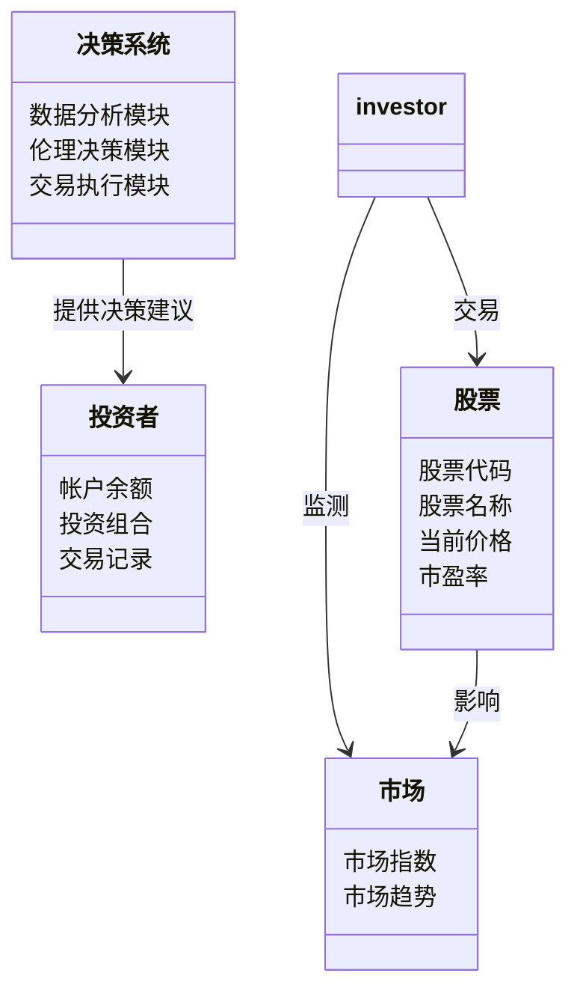
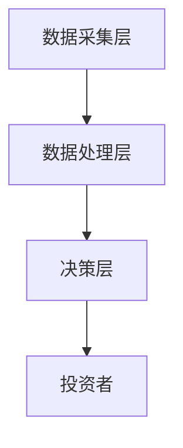
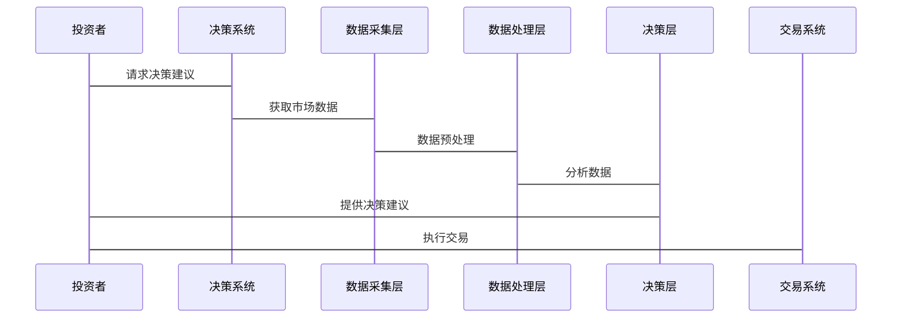

                 


# 特价股票与公司人工智能伦理决策能力的长期关系分析

> 关键词：特价股票，人工智能，伦理决策，长期关系，算法原理

> 摘要：本文深入探讨了特价股票与公司人工智能伦理决策能力之间的长期关系，分析了人工智能在金融决策中的伦理挑战，以及特价股票市场如何影响和依赖于这些伦理决策能力的发展。通过算法原理、数学模型和实际案例的分析，本文揭示了两者的互动机制及其对金融市场的深远影响。

---

# 第1章: 特价股票与人工智能伦理决策的背景与概念

## 1.1 特价股票的基本概念

### 1.1.1 特价股票的定义

特价股票指的是价格相对较低的股票，通常属于小盘股或中盘股，具有较高的成长潜力，但也伴随着较高的风险。这些股票在市场上的表现波动较大，投资者通常会关注其价格弹性、市盈率和市净率等指标。

### 1.1.2 特价股票的分类与特点

特价股票可以分为以下几类：
- **小盘股**：市值较低的公司股票，通常具有较高的增长潜力。
- **中盘股**：介于小盘股和大盘股之间的股票，风险和收益较为均衡。
- **价值股**：价格低于其内在价值的股票，通常被低估。

### 1.1.3 特价股票的市场背景与投资价值

特价股票市场的波动性较高，但潜在回报也较大。投资者通常会在市场低迷时寻找被低估的股票，而在市场繁荣时追逐高增长的股票。特价股票的投资价值在于其价格弹性，使得投资者能够在市场波动中获利。

---

## 1.2 人工智能伦理决策的基本概念

### 1.2.1 人工智能的定义与特点

人工智能（AI）是指模拟人类智能的系统，能够执行学习、推理、规划和决策等任务。AI的核心特点包括数据驱动、算法复杂性和自主性。

### 1.2.2 伦理决策的基本概念

伦理决策是指在决策过程中考虑道德和伦理因素，确保决策的公正性和社会接受度。在AI中，伦理决策涉及如何在算法中融入道德准则，确保决策符合社会规范。

### 1.2.3 人工智能在伦理决策中的应用

AI在伦理决策中的应用包括医疗诊断、自动驾驶和金融投资等领域。例如，在自动驾驶中，AI需要在紧急情况下做出符合伦理的决策，如优先保护乘客的生命安全。

---

## 1.3 特价股票与人工智能伦理决策的背景与重要性

### 1.3.1 特价股票市场的现状与挑战

当前，特价股票市场面临信息不对称、市场波动性和投资者情绪影响较大的问题。投资者需要借助技术手段，如AI，来提高决策的准确性和效率。

### 1.3.2 人工智能在金融领域的应用现状

AI在金融领域的应用日益广泛，包括股票预测、风险评估和交易策略优化。AI通过分析大量数据，帮助投资者发现市场趋势和潜在机会。

### 1.3.3 特价股票与人工智能伦理决策的长期关系的重要性

人工智能伦理决策能力的提升，将直接影响特价股票市场的投资决策和风险管理。通过伦理决策，AI可以帮助投资者避免短期逐利行为，促进市场的长期稳定发展。

---

# 第2章: 特价股票与人工智能伦理决策的核心概念

## 2.1 特价股票的核心属性与特征

### 2.1.1 特价股票的市场定位

特价股票通常定位为成长型股票，适合风险承受能力强的投资者。这些股票在市场中具有较高的波动性和不确定性。

### 2.1.2 特价股票的投资风险与收益

投资特价股票的风险主要来自于市场的不确定性和公司基本面的变化。然而，其潜在收益也较高，尤其是在市场回升时。

### 2.1.3 特价股票的市场波动性分析

特价股票的市场波动性较高，受投资者情绪和市场环境的影响较大。这种波动性为投资者提供了套利机会，但也增加了投资难度。

---

## 2.2 人工智能伦理决策的核心属性与特征

### 2.2.1 人工智能决策的算法基础

AI决策算法基于机器学习模型，如神经网络和随机森林，能够处理大量数据并提取有用信息。

### 2.2.2 伦理决策的规则与框架

伦理决策需要遵循明确的规则和框架，确保决策的公正性和透明性。例如，在股票交易中，AI需要避免操纵市场和内幕交易。

### 2.2.3 人工智能伦理决策的透明性与可解释性

AI决策的透明性和可解释性是伦理决策的关键。投资者需要了解AI的决策逻辑，以便信任和依赖其决策。

---

## 2.3 特价股票与人工智能伦理决策的核心概念对比

### 2.3.1 特价股票与人工智能伦理决策的属性对比

| 属性                | 特价股票                | 人工智能伦理决策            |
|---------------------|-------------------------|----------------------------|
| 核心目标            | 获取超额收益            | 确保决策的公正性            |
| 数据依赖性          | 市场价格和公司基本面     | 历史数据和伦理规则          |
| 决策复杂性          | 高                     | 高                         |
| 风险承受能力        | 高风险                 | 高风险                     |
| 时间跨度            | 短期与长期并重          | 长期稳定性优先             |

### 2.3.2 两者的核心概念联系

特价股票与人工智能伦理决策的联系主要体现在数据驱动的决策和风险管理上。AI通过分析历史数据，帮助投资者做出更符合伦理的决策，避免短期逐利行为。

### 2.3.3 两者的核心概念区别

特价股票关注的是价格波动和投资收益，而人工智能伦理决策关注的是决策的公正性和透明性。两者在目标和方法上存在差异，但可以通过AI技术实现互补。

---

## 2.4 本章小结

通过分析特价股票和人工智能伦理决策的核心概念，可以看出两者的联系和区别。AI伦理决策能力的提升将为特价股票市场的投资决策提供更强大的支持，同时，特价股票市场的波动性也为AI伦理决策的应用提供了丰富的数据和挑战。

---

# 第3章: 人工智能伦理决策能力的算法原理与数学模型

## 3.1 人工智能伦理决策算法的基本原理

### 3.1.1 伦理决策的基本流程

伦理决策的基本流程包括问题识别、数据收集、模型训练、决策制定和结果评估。

### 3.1.2 人工智能算法在伦理决策中的应用

AI算法在伦理决策中的应用包括自然语言处理、图像识别和机器学习等技术。这些技术帮助AI理解和处理复杂的伦理问题。

### 3.1.3 基于规则的伦理决策算法

基于规则的伦理决策算法通过预定义的规则进行决策，例如在股票交易中，AI可以根据市场规则和伦理准则自动做出买卖决策。

---

## 3.2 基于机器学习的伦理决策算法

### 3.2.1 机器学习

机器学习是一种通过数据训练模型的技术，能够帮助AI从历史数据中学习伦理决策的模式和规律。

### 3.2.2 伦理决策的机器学习模型

常用的伦理决策机器学习模型包括支持向量机（SVM）和随机森林（RF）。这些模型能够处理复杂的伦理问题，提供更准确的决策。

### 3.2.3 基于深度学习的伦理决策算法

深度学习是一种基于神经网络的机器学习技术，能够处理非结构化数据，如文本和图像，从而帮助AI做出更复杂的伦理决策。

---

## 3.3 人工智能伦理决策的数学模型

### 3.3.1 伦理决策的优化模型

伦理决策的优化模型通过数学优化技术，确保决策的最优性和公正性。例如，在股票交易中，AI可以通过优化模型选择最优的交易策略。

### 3.3.2 基于博弈论的伦理决策模型

博弈论模型通过模拟不同参与者的行为，帮助AI做出符合伦理的决策。例如，在股票市场中，AI可以通过博弈论模型预测市场的趋势和参与者的行为。

### 3.3.3 伦理决策的评价指标

伦理决策的评价指标包括准确率、召回率和F1分数等。这些指标帮助评估AI伦理决策的性能和效果。

---

## 3.4 本章小结

通过分析人工智能伦理决策的算法原理和数学模型，可以看出AI在伦理决策中的潜力和挑战。基于规则和机器学习的伦理决策算法为特价股票市场的投资决策提供了强大的技术支持，但同时也需要解决透明性和可解释性的问题。

---

# 第4章: 特价股票与人工智能伦理决策的系统设计

## 4.1 系统设计背景

### 4.1.1 问题场景介绍

在特价股票投资中，投资者需要做出复杂的决策，如买卖时机和投资组合优化。这些决策需要考虑市场趋势、公司基本面和投资者情绪等因素。

### 4.1.2 项目介绍

本项目旨在通过人工智能技术，帮助投资者在特价股票市场中做出更符合伦理的决策。

---

## 4.2 系统功能设计

### 4.2.1 领域模型设计

领域模型包括投资者、股票、市场和决策系统等实体。通过类图展示实体之间的关系。



### 4.2.2 系统架构设计

系统架构采用分层架构，包括数据采集层、数据处理层和决策层。



### 4.2.3 系统接口设计

系统接口包括数据接口、决策接口和交易接口。通过API实现不同模块之间的通信。

### 4.2.4 系统交互设计

系统交互流程包括数据采集、数据分析、伦理决策和交易执行四个步骤。



---

## 4.3 本章小结

通过系统设计，我们可以看到人工智能在特价股票投资中的潜力。基于分层架构和模块化设计的系统，能够帮助投资者做出更高效和符合伦理的决策。

---

# 第5章: 特价股票与人工智能伦理决策的项目实战

## 5.1 环境安装

### 5.1.1 Python环境的安装与配置

安装Python 3.8及以上版本，安装必要的库，如Pandas、NumPy和Scikit-learn。

### 5.1.2 开发工具的安装

安装Jupyter Notebook或PyCharm作为开发工具。

---

## 5.2 系统核心实现

### 5.2.1 数据采集模块

通过API获取股票数据，如使用Yahoo Finance API。

```python
import pandas as pd
import requests

def get_stock_data(symbol):
    url = f"https://query1.finance.yahoo.com/v8/finance/chart/{symbol}"
    response = requests.get(url)
    data = response.json()
    df = pd.DataFrame(data['chart']['result'][0]['prices'])
    return df
```

### 5.2.2 数据处理模块

对数据进行清洗和预处理，提取有用的特征，如移动平均线和相对强弱指数。

```python
import pandas as pd
import numpy as np

def preprocess_data(df):
    df['SMA_20'] = df['close'].rolling(20).mean()
    df['SMA_50'] = df['close'].rolling(50).mean()
    df['RSI'] = ta.RSI(df['close'], window=14)
    return df
```

### 5.2.3 伦理决策模块

基于机器学习模型，实现伦理决策，如避免市场操纵和内幕交易。

```python
from sklearn.ensemble import RandomForestClassifier

def ethical_decision_model(df):
    X = df.drop(['close', 'date'], axis=1)
    y = df['close']
    model = RandomForestClassifier()
    model.fit(X, y)
    return model
```

---

## 5.3 实际案例分析

### 5.3.1 案例介绍

以某只特价股票为例，分析AI伦理决策在投资决策中的应用。

### 5.3.2 代码实现与分析

通过训练模型，预测股票价格的变化趋势，帮助投资者做出买卖决策。

### 5.3.3 决策结果与反思

评估AI决策的效果和伦理合规性，总结经验教训。

---

## 5.4 本章小结

通过项目实战，我们可以看到人工智能在特价股票投资中的实际应用。基于机器学习的伦理决策模块能够帮助投资者做出更科学和符合伦理的决策。

---

# 第6章: 特价股票与人工智能伦理决策的最佳实践与总结

## 6.1 最佳实践

### 6.1.1 小结

总结全文内容，强调人工智能在特价股票投资中的重要性。

### 6.1.2 注意事项

在实际应用中，需要注意数据质量和模型的透明性，确保决策的公正性和可解释性。

### 6.1.3 未来展望

随着技术的发展，人工智能在金融领域的应用将更加广泛和深入，伦理决策能力也将不断提升。

---

# 作者：AI天才研究院/AI Genius Institute & 禅与计算机程序设计艺术 /Zen And The Art of Computer Programming

---

通过以上目录大纲，我们可以看到《特价股票与公司人工智能伦理决策能力的长期关系分析》这篇文章将从多个角度深入探讨特价股票与人工智能伦理决策的关系，涵盖背景、核心概念、算法原理、系统设计和项目实战等多个方面。

