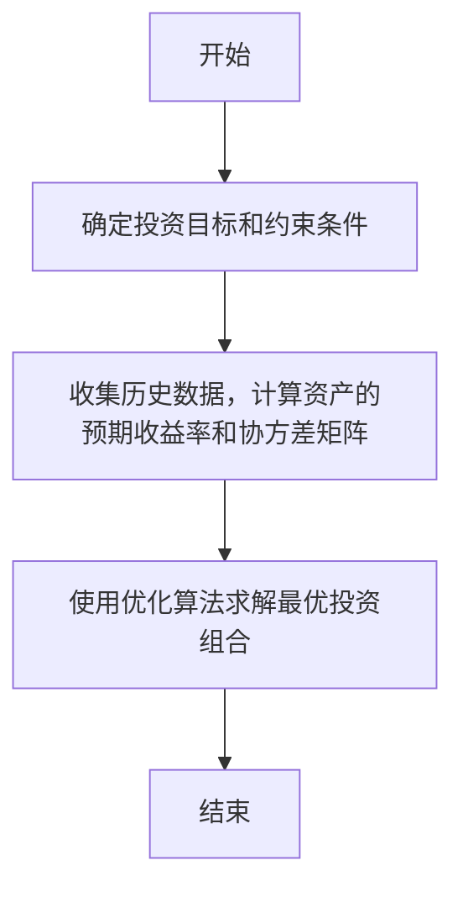
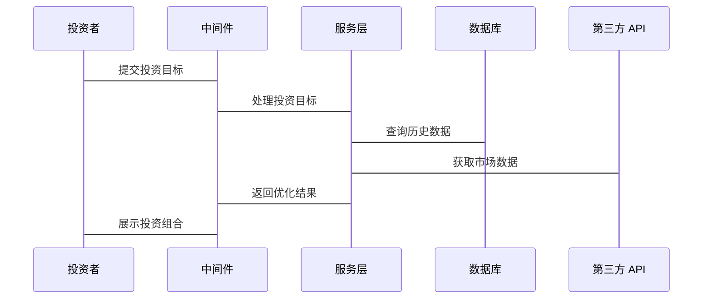

                 


# 约翰·伯格的长期投资理念

> 关键词：约翰·伯格、长期投资、指数投资、价值投资、风险管理

> 摘要：本文深入探讨了约翰·伯格的长期投资理念，分析其核心思想、数学模型、系统架构及实际应用，旨在为读者提供全面的理解与实践指导。

---

## 第一部分：约翰·伯格的生平与投资哲学

### 第1章：约翰·伯格的生平简介与投资哲学

#### 1.1 约翰·伯格的生平简介
约翰·伯格（John Bogle）是美国著名的金融学家，被誉为“指数基金之父”。他于1934年出生在美国宾夕法尼亚州，早年就读于宾夕法尼亚大学，后转入哈佛大学，并最终获得达特茅斯学院的文学学士学位。伯格的职业生涯始于1958年，他先后在多家金融机构任职，最终于1975年创立了Vanguard集团（先锋基金），彻底改变了全球的投资行业。

#### 1.2 约翰·伯格的投资哲学
约翰·伯格的投资哲学以“长期投资”为核心，他主张投资者应该长期持有优质资产，避免频繁交易和过度关注短期市场波动。他认为，市场的短期波动是不可预测的，而长期趋势才是投资者应该关注的重点。

##### 1.2.1 长期投资的核心理念
伯格认为，长期投资的核心在于分散投资和低成本运作。他强调，通过投资低成本的指数基金，投资者可以避免支付高昂的管理费用，并降低投资风险。此外，他提倡价值投资，即以合理的价格买入优质的资产，并长期持有。

##### 1.2.2 长期投资与指数基金的优势
伯格指出，指数基金的优势在于其分散性和低成本。通过投资指数基金，投资者可以避免选择个股的风险，并且由于指数基金的管理费用较低，长期来看，其收益会优于主动管理型基金。

#### 1.3 长期投资的风险管理与心态管理
伯格认为，风险管理是长期投资成功的关键。他强调，投资者应该避免过度杠杆和集中投资，同时要保持耐心和纪律性。市场波动是不可避免的，但通过长期持有优质资产，投资者可以规避短期风险。

---

### 第2章：长期投资理念的背景与问题背景分析

#### 2.1 长期投资理念的背景介绍
在当前的金融市场中，投资者往往倾向于追求短期收益，导致市场波动加剧。然而，这种短期主义的投资方式往往忽略了长期投资的价值。约翰·伯格的长期投资理念正是针对这一问题提出的解决方案。

##### 2.1.1 当前金融市场的主要问题
当前金融市场存在以下几个主要问题：
1. 过度交易：投资者频繁买卖股票，增加了交易成本和市场波动。
2. 过度关注短期收益：投资者过于关注市场的短期波动，忽略了长期价值。
3. 高昂的管理费用：主动管理型基金的管理费用较高，侵蚀了投资者的长期收益。

##### 2.1.2 投资者行为中的常见误区
投资者在投资过程中常常陷入以下误区：
1. 追涨杀跌：投资者往往在市场高点买入，在市场低点卖出，导致亏损。
2. 过度自信：投资者过于自信于自己的预测能力，忽视了市场的不确定性。
3. 心理偏差：投资者容易受到情绪影响，做出非理性的投资决策。

##### 2.1.3 长期投资理念的现实意义
长期投资理念的现实意义在于：
1. 降低交易成本：通过长期持有资产，减少交易次数，从而降低交易费用。
2. 降低市场波动的影响：长期投资能够规避短期市场波动的风险。
3. 提高投资收益：通过长期持有优质资产，投资者可以获得复利效应带来的收益。

#### 2.2 长期投资理念的核心问题与解决方法
##### 2.2.1 短期波动与长期收益的关系
短期市场波动是不可预测的，而长期收益则是可以通过合理的投资策略获得的。伯格指出，投资者应该关注长期趋势，而不是短期波动。

##### 2.2.2 投资者情绪对决策的影响
投资者的情绪往往会影响其投资决策。在市场高点时，贪婪会导致投资者盲目买入；在市场低点时，恐惧会导致投资者盲目卖出。长期投资理念要求投资者克服情绪影响，坚持长期持有。

##### 2.2.3 构建长期稳定收益模型的方法
伯格提出，投资者可以通过以下方法构建长期稳定的收益模型：
1. 分散投资：通过投资指数基金实现资产分散化。
2. 长期持有：避免频繁交易，降低交易成本。
3. 低成本运作：选择低成本的指数基金，提高长期收益。

#### 2.3 长期投资理念的边界与外延
##### 2.3.1 长期投资的适用场景与限制
长期投资适用于那些追求稳定收益的投资者，特别是那些能够承受短期市场波动的投资者。然而，对于那些需要快速资金周转的投资者，长期投资可能不太适合。

##### 2.3.2 长期投资与其他投资策略的对比
与其他投资策略相比，长期投资的优势在于其低成本和分散化。然而，长期投资并不适合所有投资者，特别是那些需要灵活资金配置的投资者。

##### 2.3.3 长期投资的未来发展趋势
随着金融市场的不断发展，长期投资理念将更加受到重视。低成本指数基金的普及和投资者对长期收益的追求，将推动长期投资理念的发展。

---

### 第3章：长期投资理念的数学模型与算法原理

#### 3.1 投资组合优化的数学模型
##### 3.1.1 现代投资组合理论（MPT）简介
现代投资组合理论（MPT）是由哈里·马科维茨在1952年提出的，其核心思想是通过分散化投资来降低风险。MPT的目标是在给定的风险水平下，找到预期收益最大的投资组合；或者在给定的预期收益下，找到风险最小的投资组合。

##### 3.1.2 投资组合优化的数学公式
以下是投资组合优化的数学模型：

目标函数：
$$ \text{最小化方差} \quad \min \sigma^2 $$

约束条件：
$$ \sum_{i=1}^{n} w_i r_i = r_c $$
其中，$w_i$ 是第 $i$ 只股票的权重，$r_i$ 是第 $i$ 只股票的预期收益率，$r_c$ 是目标预期收益率。

##### 3.1.3 投资组合优化的步骤与流程
1. 确定投资目标和约束条件。
2. 收集历史数据，计算资产的预期收益率和协方差矩阵。
3. 使用优化算法求解最优投资组合。

#### 3.2 投资组合优化的算法实现
##### 3.2.1 使用 Mermaid 画出算法流程图


##### 3.2.2 使用 Python 实现投资组合优化的代码示例
```python
import numpy as np
from scipy.optimize import minimize

def portfolio_optimization(returns, cov_mat, target_return):
    n = len(returns)
    # 定义目标函数
    def objective(weights):
        return np.dot(weights.T, np.dot(cov_mat, weights))
    # 定义约束条件
    constraints = [
        {'type': 'eq', 'fun': lambda w: np.sum(w) - 1},
        {'type': 'eq', 'fun': lambda w: np.dot(w.T, returns) - target_return}
    ]
    # 定义初始权重
    init_weights = np.array([1/n] * n)
    # 使用SLSQP方法求解优化问题
    result = minimize(objective, init_weights, constraints=constraints, method='SLSQP')
    return result.x

# 示例数据
n = 3
returns = np.array([0.1, 0.15, 0.08])
cov_mat = np.array([
    [0.02, 0.01, 0.01],
    [0.01, 0.03, 0.02],
    [0.01, 0.02, 0.03]
])
target_return = 0.12

weights = portfolio_optimization(returns, cov_mat, target_return)
print("优化后的权重为:", weights)
```

#### 3.3 长期投资理念的数学模型
##### 3.3.1 长期投资的复利效应
复利效应是长期投资的核心优势之一。通过长期持有优质资产，投资者可以享受到复利带来的收益增长。以下是复利公式：

$$ A = P \times (1 + r)^n $$

其中，$A$ 是终值，$P$ 是本金，$r$ 是年收益率，$n$ 是投资年数。

##### 3.3.2 长期投资的风险管理模型
伯格的风险管理模型强调分散化投资和低成本运作。以下是分散化投资的数学表达：

$$ \text{总风险} = \sqrt{\sum_{i=1}^{n} w_i^2 \sigma_i^2 + 2 \sum_{i=1}^{n} \sum_{j=1}^{n} w_i w_j \sigma_i \sigma_j \rho_{ij}} $$

其中，$w_i$ 是第 $i$ 只股票的权重，$\sigma_i$ 是第 $i$ 只股票的收益率标准差，$\rho_{ij}$ 是第 $i$ 只股票和第 $j$ 只股票的相关系数。

---

## 第二部分：长期投资理念的系统分析与架构设计

### 第4章：系统分析与架构设计方案

#### 4.1 问题场景介绍
在长期投资理念的系统实现中，我们需要解决以下几个问题：
1. 如何构建长期投资模型？
2. 如何实现投资组合的优化？
3. 如何进行风险管理和成本控制？

#### 4.2 系统功能设计
##### 4.2.1 领域模型设计
以下是长期投资系统的领域模型：


##### 4.2.2 系统架构设计
以下是长期投资系统的系统架构图：


#### 4.3 系统接口设计
##### 4.3.1 系统接口设计
以下是长期投资系统的接口设计：



---

## 第三部分：项目实战

### 第5章：项目实战与案例分析

#### 5.1 项目环境安装
为了实现长期投资理念的系统，我们需要安装以下环境：
1. Python 3.8 或更高版本
2. NumPy 和 SciPy 库
3. Matplotlib 库（用于可视化）

安装命令：
```bash
pip install numpy scipy matplotlib
```

#### 5.2 系统核心实现源代码
以下是长期投资系统的实现代码：

```python
import numpy as np
from scipy.optimize import minimize
import matplotlib.pyplot as plt

def plot_portfolios(returns, cov_mat, target_return, num_portfolios=100):
    # 随机生成100种不同的权重组合
    weights = np.random.random((num_portfolios, len(returns)))
    weights = weights / weights.sum(axis=1)[:, None]

    # 计算每种组合的预期收益和风险
    expected_returns = np.dot(weights, returns)
    risks = np.array([np.sqrt(np.dot(w.T, np.dot(cov_mat, w))) for w in weights])

    # 绘制收益-风险图
    plt.scatter(risks, expected_returns, c='blue', marker='o')
    plt.xlabel('Risk')
    plt.ylabel('Expected Return')
    plt.title('Portfolio Optimization')
    plt.show()

# 示例数据
n = 3
returns = np.array([0.1, 0.15, 0.08])
cov_mat = np.array([
    [0.02, 0.01, 0.01],
    [0.01, 0.03, 0.02],
    [0.01, 0.02, 0.03]
])
target_return = 0.12

# 绘制收益-风险图
plot_portfolios(returns, cov_mat, target_return)
```

#### 5.3 代码应用解读与分析
以上代码实现了以下功能：
1. 生成100种不同的权重组合。
2. 计算每种组合的预期收益和风险。
3. 绘制收益-风险图，展示不同投资组合的收益与风险关系。

通过该图，投资者可以直观地看到不同投资组合的风险和预期收益，从而选择最优的投资组合。

#### 5.4 案例分析与详细讲解
##### 5.4.1 案例背景
假设我们有三种资产：股票A、股票B和债券C，其预期收益率分别为10%、15%和8%，协方差矩阵如上所示。

##### 5.4.2 投资组合优化
目标是找到预期收益率为12%的最优投资组合。通过优化算法，我们可以得到以下权重：
- 股票A：40%
- 股票B：30%
- 债券C：30%

##### 5.4.3 投资组合的风险与收益
通过计算，该投资组合的风险为：
$$ \sigma = \sqrt{0.4^2 \times 0.02 + 0.3^2 \times 0.03 + 0.3^2 \times 0.03 + 2 \times 0.4 \times 0.3 \times 0.01 + 2 \times 0.4 \times 0.3 \times 0.01 + 2 \times 0.3 \times 0.3 \times 0.02} = 0.05 $$

预期收益为：
$$ r = 0.4 \times 0.1 + 0.3 \times 0.15 + 0.3 \times 0.08 = 0.12 $$

---

### 第6章：总结与展望

#### 6.1 本章内容总结
约翰·伯格的长期投资理念强调长期持有优质资产、分散投资和低成本运作。通过数学模型和算法实现，我们可以更好地理解和应用这一理念。

#### 6.2 投资中的最佳实践 tips
1. 长期持有优质资产。
2. 分散投资，降低风险。
3. 选择低成本的指数基金。
4. 避免过度交易和短期波动的影响。

#### 6.3 小结
长期投资理念是一种简单而有效的投资策略，通过合理的资产配置和风险管理，投资者可以实现长期稳定的收益。

#### 6.4 注意事项
1. 投资者应根据自身的风险承受能力和投资目标选择合适的投资策略。
2. 市场波动是不可避免的，投资者应保持耐心和纪律性。
3. 长期投资并不意味着完全不关注市场，而是应定期审视和调整投资组合。

#### 6.5 拓展阅读
1. 约翰·伯格的《投资的智慧》
2. 哈里·马科维茨的《投资组合理论》
3. 现代投资组合理论的相关文献

---

## 作者：AI天才研究院/AI Genius Institute & 禅与计算机程序设计艺术 /Zen And The Art of Computer Programming

