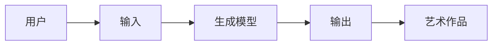
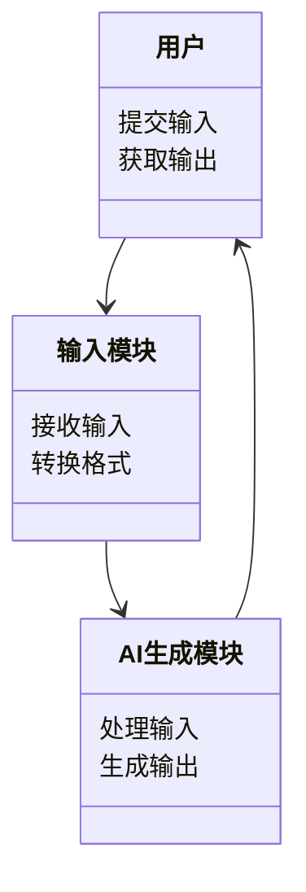
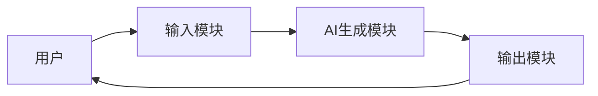
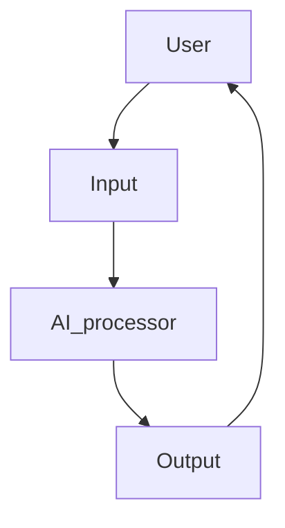

                 


# 视觉艺术领域的AI Agent创作工具

## 关键词：AI Agent, 视觉艺术, 创作工具, 多模态交互, 生成对抗网络, 变分自编码器

## 摘要：
本文深入探讨了AI Agent在视觉艺术创作中的应用，分析了其作为创作工具的核心概念、算法原理、系统设计及实际案例。通过结合生成对抗网络和变分自编码器等算法，本文展示了如何利用AI技术提升艺术创作的效率与创新性，同时保持艺术作品的独特性和人类情感的表达。

---

# 第一部分：背景介绍

## 第1章：背景介绍

### 1.1 问题背景与描述
#### 1.1.1 视觉艺术领域的创作挑战
在传统视觉艺术创作中，艺术家通常依赖手工绘制、设计和调整，过程繁琐且耗时。特别是在数字艺术领域，从构思到最终作品的实现需要经过多个复杂步骤，艺术家需要掌握多种工具和技术。此外，创作过程中可能出现创意枯竭、技术限制或资源不足等问题。

#### 1.1.2 AI技术在艺术创作中的潜力
AI技术，尤其是深度学习模型，能够通过大量数据学习艺术风格、创作规律和用户偏好。AI Agent可以通过生成图像、推荐设计元素或提供实时反馈，辅助艺术家完成创作任务，显著提高创作效率。此外，AI还能帮助艺术家探索新的创作方式，拓展艺术表现的可能性。

#### 1.1.3 当前创作工具的局限性
传统的视觉艺术创作工具（如Adobe Photoshop、Illustrator等）虽然功能强大，但操作复杂，学习成本较高。此外，这些工具通常只能执行单一任务，缺乏智能化的辅助功能，难以满足艺术家对创新性和效率的双重需求。

### 1.2 问题解决与边界
#### 1.2.1 AI Agent在视觉艺术创作中的解决方案
AI Agent作为创作工具，能够通过多模态交互（如文本、图像、语音等）理解用户需求，生成符合预期的艺术作品或设计元素。例如，用户可以通过输入关键词或选择特定风格，快速生成草图或完整作品。

#### 1.2.2 AI Agent创作工具的边界与外延
AI Agent创作工具的边界在于其生成能力的限制。虽然AI可以生成高质量的艺术作品，但其缺乏人类的情感和创造力。因此，AI Agent更适合辅助创作，而非完全替代人类艺术家。

#### 1.2.3 视觉艺术创作工具的核心要素组成
视觉艺术创作工具的核心要素包括：
1. 输入接口：用于接收用户的创意输入（如文本描述、图像草图）。
2. AI生成模块：负责根据输入生成艺术作品或设计元素。
3. 反馈与调整模块：提供实时反馈，允许用户对生成结果进行调整。
4. 输出接口：将最终作品导出为常用格式（如JPEG、PNG等）。

### 1.3 本章小结
本章通过分析视觉艺术创作中的挑战与传统工具的局限性，提出了AI Agent作为创作工具的解决方案。AI Agent通过多模态交互和智能化生成，能够显著提升创作效率，拓展艺术表现的可能性。

---

# 第二部分：核心概念与联系

## 第2章：AI Agent创作工具的核心概念

### 2.1 核心概念原理
#### 2.1.1 AI Agent的基本原理
AI Agent是一种智能体，能够通过感知环境、执行任务并根据反馈进行调整。在视觉艺术创作中，AI Agent通过学习大量艺术作品，生成符合用户需求的图像或设计元素。

#### 2.1.2 视觉艺术创作工具的AI实现机制
AI Agent的实现通常依赖于生成模型（如GAN、VAE）和多模态模型（如BERT、CLIP）。这些模型能够理解用户输入并生成相应的艺术作品。

#### 2.1.3 多模态交互的核心原理
多模态交互是指AI Agent能够同时处理多种输入形式（如文本、图像、语音）并生成相应的输出。这使得用户可以通过多种方式与AI Agent互动，提升创作体验。

### 2.2 核心概念属性特征对比
#### 2.2.1 AI Agent与传统创作工具的对比分析
| 特性                | AI Agent创作工具                | 传统创作工具                 |
|---------------------|--------------------------------|------------------------------|
| 学习能力            | 高                           | 低                           |
| 创作效率            | 高                           | 中                           |
| 智能化程度          | 高                           | 低                           |
| 使用成本            | 低                           | 高                           |

#### 2.2.2 不同视觉艺术领域的特征对比
| 领域                | 绘画                         | 插画                         | 3D建模                     |
|---------------------|------------------------------|------------------------------|------------------------------|
| 主要技术            | GAN, Style Transfer          | GAN, Image Editing           | GAN, 3D Generation          |
| 典型应用            | 绘画生成                     | 插画设计                     | 3D角色设计                 |

#### 2.2.3 AI Agent创作工具的核心属性特征
1. **智能化生成**：AI Agent能够根据用户输入生成高质量的艺术作品。
2. **多模态交互**：支持多种输入形式，提升用户体验。
3. **实时反馈**：提供实时的生成结果和调整建议。

### 2.3 ER实体关系图
#### 2.3.1 实体关系图的构建


#### 2.3.2 关系图的分析与解释
用户通过输入（如文本描述）与AI Agent互动，生成模型根据输入生成艺术作品。整个流程强调了AI Agent与用户之间的交互关系。

#### 2.3.3 实体关系图的优化建议
建议在关系图中增加反馈机制，使用户能够实时调整生成结果，提升创作体验。

---

# 第三部分：算法原理讲解

## 第3章：AI Agent创作工具的算法原理

### 3.1 算法原理概述
#### 3.1.1 基于生成对抗网络的图像生成
生成对抗网络（GAN）由生成器和判别器组成。生成器负责生成图像，判别器负责区分生成图像和真实图像。通过不断迭代，生成器能够生成逼真的艺术作品。

#### 3.1.2 基于变分自编码器的图像重建
变分自编码器（VAE）通过编码器将输入图像压缩为潜在空间的向量，解码器再将向量还原为图像。VAE常用于图像生成和修复。

#### 3.1.3 多模态交互的算法框架
多模态交互框架通常基于预训练的模型（如CLIP、BERT），能够同时处理多种输入形式并生成相应的输出。

### 3.2 算法流程图
#### 3.2.1 GAN算法流程图
```mermaid
graph TD
    GAN --> Generator
    Generator --> D1[生成图像]
    D1 --> Discriminator
    Discriminator --> D2[判别结果]
    GAN --> update Generator
    GAN --> update Discriminator
```

#### 3.2.2 多模态交互算法流程图
```mermaid
graph TD
    User --> Input
    Input --> Multi-modal Processor
    Multi-modal Processor --> Generator
    Generator --> Output
    Output --> User Feedback
    User Feedback --> Adjust Input
```

### 3.3 数学模型与公式
#### 3.3.1 GAN的数学模型
生成器的损失函数：
$$ \mathcal{L}_{\text{GAN}}^{G} = \log(1 - P_{\text{data}}(G(z))) $$
判别器的损失函数：
$$ \mathcal{L}_{\text{GAN}}^{D} = \log(P_{\text{data}}(x)) + \log(1 - P_{\text{data}}(G(z))) $$

#### 3.3.2 多模态交互模型的数学公式
联合概率分布：
$$ P(x, y) = P(x|y)P(y) $$

### 3.4 举例说明
以GAN为例，假设生成器生成一张风景画，判别器需要判断该画是否为真实作品。通过不断迭代，生成器能够生成越来越逼真的风景画。

---

# 第四部分：系统分析与架构设计方案

## 第4章：系统分析与架构设计

### 4.1 系统功能设计
#### 4.1.1 领域模型


### 4.2 系统架构设计
#### 4.2.1 系统架构图


### 4.3 系统接口设计
1. 输入接口：接收用户的创意输入（如文本、图像）。
2. 输出接口：将生成的艺术作品导出为常用格式。

### 4.4 系统交互设计
#### 4.4.1 交互流程图


---

# 第五部分：项目实战

## 第5章：项目实战

### 5.1 环境安装
1. 安装Python和必要的库（如TensorFlow、Keras、Pillow）。
2. 安装AI框架（如PyTorch、Keras-visualization）。

### 5.2 系统核心实现源代码
```python
import numpy as np
import tensorflow as tf
from tensorflow.keras import layers

# 定义生成器
def build_generator():
    model = tf.keras.Sequential([
        layers.Dense(256, activation='relu', input_shape=(100,)),
        layers.Conv2DTranspose(128, (3,3), activation='relu'),
        layers.Conv2DTranspose(64, (3,3), activation='relu'),
        layers.Conv2DTranspose(3, (3,3), activation='sigmoid'),
        layers.Reshape((28, 28, 3))
    ])
    return model

# 定义判别器
def build_discriminator():
    model = tf.keras.Sequential([
        layers.Conv2D(64, (3,3), activation='relu', input_shape=(28,28,3)),
        layers.Conv2D(128, (3,3), activation='relu'),
        layers.Flatten(),
        layers.Dense(256, activation='relu'),
        layers.Dense(1, activation='sigmoid')
    ])
    return model
```

### 5.3 代码应用解读与分析
上述代码定义了一个简单的GAN模型，生成器和判别器分别负责生成图像和判别图像。通过训练，生成器能够生成符合用户需求的艺术作品。

### 5.4 实际案例分析
以生成一张抽象画为例，用户输入关键词“抽象艺术”，AI Agent通过GAN生成一幅抽象画。

### 5.5 项目小结
本章通过实际案例展示了AI Agent创作工具的实现过程，包括环境搭建、代码编写和案例分析。

---

# 第六部分：总结与展望

## 第6章：总结与展望

### 6.1 本章总结
本文详细探讨了AI Agent在视觉艺术创作中的应用，分析了其核心概念、算法原理和系统设计。通过实际案例，展示了AI技术在提升创作效率和拓展艺术表现的可能性方面的巨大潜力。

### 6.2 未来展望
随着AI技术的不断发展，AI Agent创作工具将更加智能化和多样化。未来的研究方向包括：
1. 提升生成模型的创意性。
2. 支持更多视觉艺术领域的应用。
3. 引入更多模态的交互方式。

### 6.3 最佳实践 Tips
1. 在使用AI Agent创作工具时，建议先明确创作目标。
2. 定期更新AI模型，以获取更好的生成效果。
3. 结合人类创意与AI生成，打造更具独特性的艺术作品。

### 6.4 小结
AI Agent作为视觉艺术领域的创作工具，将为艺术家和设计师提供全新的创作方式，推动艺术与科技的深度融合。

---

# 作者：AI天才研究院/AI Genius Institute & 禅与计算机程序设计艺术 /Zen And The Art of Computer Programming

