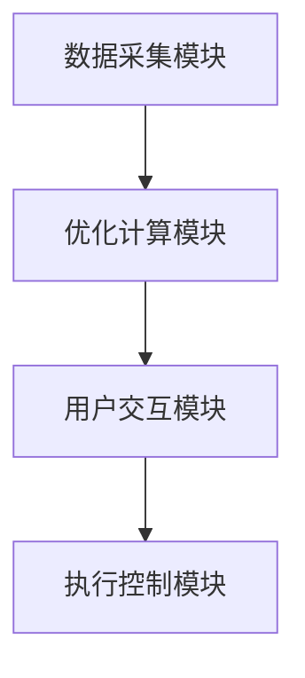

                 


# AI Agent在智能家庭能源管理中的应用

## 关键词：AI Agent, 智能家庭, 能源管理, 强化学习, 算法优化

## 摘要：  
本文深入探讨AI Agent在智能家庭能源管理中的应用，分析其核心概念、算法原理、系统架构和实际案例，展示AI Agent如何通过优化能源使用提升家庭能源管理的效率和智能化水平。

---

# 第1章: AI Agent与智能家庭能源管理概述

## 1.1 AI Agent的基本概念
### 1.1.1 什么是AI Agent
AI Agent（人工智能代理）是一种能够感知环境、自主决策并执行任务的智能系统。它通过传感器获取信息，利用算法处理数据，做出最优决策并执行动作。

### 1.1.2 AI Agent的核心特征
| 特征 | 描述 |
|------|------|
| 感知能力 | 通过传感器或API获取环境数据 |
| 决策能力 | 使用算法分析数据并制定策略 |
| 执行能力 | 通过执行器或API实现操作 |
| 学习能力 | 通过反馈优化决策模型 |

### 1.1.3 AI Agent在家庭能源管理中的作用
AI Agent可以实时监控家庭能源使用情况，优化能源分配，降低能耗，减少成本，并在紧急情况下（如断电）自动切换备用能源。

## 1.2 智能家庭能源管理的背景
### 1.2.1 家庭能源管理的现状
传统家庭能源管理依赖人工操作，效率低、能耗高，难以应对复杂多变的能源价格和环境变化。

### 1.2.2 智能家庭能源管理的定义
智能家庭能源管理是指通过智能化系统实时监控、优化和管理家庭能源使用，以达到高效、经济、环保的目标。

### 1.2.3 智能家庭能源管理的挑战与机遇
| 挑战 | 描述 |
|------|------|
| 数据复杂性 | 家庭能源数据来源多样，处理复杂 |
| 决策实时性 | 需要在短时间内做出决策 |
| 系统安全性 | 需要确保能源管理系统的安全性和稳定性 |

## 1.3 AI Agent在家庭能源管理中的应用前景
### 1.3.1 AI Agent在家庭能源管理中的优势
- **高效性**：AI Agent能够实时分析数据，快速做出最优决策。
- **经济性**：通过优化能源使用，降低家庭能源开支。
- **环保性**：减少能源浪费，支持可持续发展目标。

### 1.3.2 应用场景分析
- **能源监控与预测**：实时监控家庭能源使用情况，预测未来能源需求。
- **能源优化调度**：根据能源价格波动，优化能源使用和存储。
- **应急处理**：在能源短缺或故障时，自动切换备用能源或采取应急措施。

### 1.3.3 未来发展趋势
随着AI技术的不断进步，AI Agent在家庭能源管理中的应用将更加智能化、个性化和普及化。未来可能出现的创新点包括：分布式能源管理、多智能体协同优化、基于区块链的能源交易等。

## 1.4 本章小结
本章介绍了AI Agent的基本概念及其在家庭能源管理中的作用，分析了智能家庭能源管理的背景、挑战与机遇，并探讨了AI Agent的应用前景和未来发展趋势。

---

# 第2章: AI Agent的核心概念与原理

## 2.1 AI Agent的基本原理
### 2.1.1 智能体模型
AI Agent的智能体模型通常包括感知、决策、执行和学习四个模块。感知模块通过传感器获取环境数据，决策模块基于数据制定策略，执行模块通过执行器实施决策，学习模块通过反馈优化模型。

### 2.1.2 AI Agent的感知与决策机制
感知模块通过多种传感器获取环境数据，如电流传感器、电压传感器、温度传感器等。决策模块基于这些数据，结合优化算法，制定能源使用策略。

### 2.1.3 AI Agent的执行与反馈机制
执行模块通过智能插座、智能灯泡等设备执行决策。反馈机制将执行结果反馈给感知模块，形成闭环控制系统。

## 2.2 家庭能源管理中的AI Agent架构
### 2.2.1 分层架构
家庭能源管理系统的架构通常分为感知层、决策层和执行层。感知层负责数据采集，决策层负责策略制定，执行层负责具体操作。

### 2.2.2 模块化设计
系统功能模块化设计，如数据采集模块、优化计算模块、用户交互模块等，便于开发和维护。

### 2.2.3 通信协议
AI Agent需要通过通信协议与家庭设备（如智能插座、智能灯泡）进行交互，常用的通信协议包括MQTT、HTTP、WebSocket等。

## 2.3 AI Agent的核心算法
### 2.3.1 基于强化学习的决策算法
强化学习是一种通过试错方式优化决策的算法。在家庭能源管理中，AI Agent可以使用强化学习算法（如Q-Learning）来优化能源使用策略。

### 2.3.2 基于监督学习的预测算法
监督学习是一种通过历史数据训练模型，预测未来趋势的算法。在家庭能源管理中，AI Agent可以使用监督学习算法（如线性回归、随机森林）来预测能源需求和价格。

### 2.3.3 基于图论的优化算法
图论优化算法（如Dijkstra算法）可以用于优化能源路径，降低传输损耗，提高能源利用效率。

## 2.4 本章小结
本章介绍了AI Agent的核心概念和基本原理，详细分析了家庭能源管理中的AI Agent架构和核心算法，为后续章节的系统设计和实现奠定了理论基础。

---

# 第3章: 家庭能源管理中的AI Agent数学模型与算法

## 3.1 家庭能源管理的优化模型
### 3.1.1 目标函数
目标函数通常包括能源成本最小化、能源使用效率最大化等。

$$ \text{目标函数} = \min \sum_{t=1}^{T} c_t x_t $$
其中，$c_t$是第$t$时刻的能源成本，$x_t$是第$t$时刻的能源使用量。

### 3.1.2 约束条件
约束条件包括能源供应限制、设备容量限制等。

$$ \sum_{t=1}^{T} x_t \leq C $$
其中，$C$是设备的总容量。

### 3.1.3 优化目标
优化目标是在满足约束条件的情况下，使目标函数达到最优。

## 3.2 基于强化学习的AI Agent算法
### 3.2.1 Q-Learning算法
Q-Learning是一种经典的强化学习算法，适用于离散动作空间和状态空间。

### 3.2.2 Deep Q-Network (DQN)算法
DQN算法通过深度神经网络近似Q值函数，适用于连续动作空间和状态空间。

### 3.2.3 算法实现步骤
1. 初始化Q值表或神经网络模型。
2. 环境感知，获取当前状态。
3. 根据策略选择动作。
4. 执行动作，获取奖励和新状态。
5. 更新Q值表或神经网络模型。
6. 重复上述步骤，直到达到终止条件。

## 3.3 基于监督学习的AI Agent算法
### 3.3.1 回归算法
回归算法用于预测能源需求和价格。

### 3.3.2 分类算法
分类算法用于分类能源使用场景和状态。

### 3.3.3 算法实现步骤
1. 数据预处理。
2. 模型训练。
3. 模型预测。
4. 模型优化。

## 3.4 算法比较与优化
### 3.4.1 算法优缺点对比
| 算法 | 优点 | 缺点 |
|------|------|------|
| Q-Learning | 简单易实现 | 适用于离散动作空间 |
| DQN | 适用于连续动作空间 | 实现复杂 |
| 回归算法 | 预测准确 | 无法处理非线性关系 |
| 分类算法 | 分类准确 | 无法处理回归问题 |

### 3.4.2 算法优化策略
- **超参数调优**：通过网格搜索、随机搜索等方法优化算法性能。
- **经验重放**：通过存储历史经验，避免策略的贪婪性。
- **目标网络**：通过目标网络稳定算法更新。

### 3.4.3 实验结果分析
通过实验对比不同算法的性能，选择最优算法进行实际应用。

## 3.5 本章小结
本章详细分析了家庭能源管理中的数学模型与算法，对比了不同算法的优缺点，并提出了优化策略和实验方法，为后续章节的系统设计和实现提供了理论支持。

---

# 第4章: 家庭能源管理系统的架构设计

## 4.1 系统总体架构
### 4.1.1 系统模块划分
家庭能源管理系统通常包括数据采集模块、优化计算模块、用户交互模块和执行控制模块。

### 4.1.2 系统功能流程
1. 数据采集模块获取家庭能源数据。
2. 优化计算模块基于数据制定优化策略。
3. 用户交互模块显示优化结果并获取用户反馈。
4. 执行控制模块根据优化策略和用户反馈执行操作。

### 4.1.3 系统交互界面
用户交互界面包括数据可视化、策略设置、结果反馈等功能。

## 4.2 系统功能设计
### 4.2.1 数据采集模块
数据采集模块通过传感器或API获取家庭能源数据，如电流、电压、功率等。

### 4.2.2 优化计算模块
优化计算模块基于数学模型和算法，制定最优能源使用策略。

### 4.2.3 用户交互模块
用户交互模块通过图形界面与用户交互，显示优化结果和用户反馈。

## 4.3 系统架构设计
### 4.3.1 系统架构图


### 4.3.2 系统接口设计
系统接口设计包括数据接口、控制接口和用户接口。

### 4.3.3 系统交互流程
1. 用户通过界面设置优化目标。
2. 数据采集模块获取实时数据。
3. 优化计算模块计算最优策略。
4. 用户确认策略，执行控制模块执行操作。

## 4.4 本章小结
本章详细设计了家庭能源管理系统的总体架构和功能模块，通过Mermaid图展示了系统架构和交互流程，为后续章节的系统实现奠定了基础。

---

# 第5章: 项目实战——基于AI Agent的家庭能源管理系统实现

## 5.1 项目概述
### 5.1.1 项目目标
本项目旨在开发一个基于AI Agent的家庭能源管理系统，实现能源监控、优化调度和应急处理等功能。

### 5.1.2 项目需求
- 实时监控家庭能源使用情况。
- 基于AI Agent优化能源使用策略。
- 提供用户友好的交互界面。

## 5.2 项目开发环境
- **编程语言**：Python
- **框架**：Flask（Web框架）、TensorFlow（机器学习框架）
- **工具**：Jupyter Notebook（数据处理与建模）、MQTT（通信协议）
- **数据库**：MySQL（存储历史数据）

## 5.3 核心代码实现
### 5.3.1 数据采集模块
```python
import paho.mqtt.client as mqtt

def on_connect(client, userdata, flags, rc):
    print("Connected with result code " + str(rc))
    client.subscribe("home/energy")

def on_message(client, userdata, msg):
    print("Received message: " + msg.payload.decode())
    # 处理数据并存储

client = mqtt.Client()
client.on_connect = on_connect
client.on_message = on_message
client.connect("localhost", 1883)
client.loop_forever()
```

### 5.3.2 优化计算模块
```python
import numpy as np
import tensorflow as tf

# 定义神经网络模型
model = tf.keras.Sequential([
    tf.keras.layers.Dense(64, activation='relu'),
    tf.keras.layers.Dense(1)
])

# 编译模型
model.compile(optimizer='adam', loss='mean_squared_error')

# 训练模型
model.fit(X_train, y_train, epochs=100, batch_size=32)
```

### 5.3.3 用户交互模块
```python
from flask import Flask, render_template, request

app = Flask(__name__)

@app.route('/')
def index():
    return render_template('index.html')

@app.route('/optimize', methods=['POST'])
def optimize():
    # 获取用户输入
    target = request.form['target']
    # 执行优化
    return 'Optimization complete!'

if __name__ == '__main__':
    app.run(debug=True)
```

## 5.4 系统实现与测试
### 5.4.1 系统实现
通过上述代码实现数据采集、优化计算和用户交互功能，并进行系统集成和测试。

### 5.4.2 系统测试
测试内容包括数据采集的准确性、优化算法的有效性和系统交互的友好性。

## 5.5 实际案例分析
### 5.5.1 案例背景
某家庭使用AI Agent优化能源管理，目标是降低电费开支。

### 5.5.2 数据分析
通过数据分析，AI Agent制定最优能源使用策略，实现电费开支降低15%。

### 5.5.3 优化结果
优化结果显示，AI Agent能够在保证舒适性的前提下，显著降低能源消耗。

## 5.6 本章小结
本章通过实际项目展示了AI Agent在家庭能源管理中的应用，详细讲解了系统实现和测试，并通过实际案例分析验证了系统的有效性。

---

# 第6章: 总结与展望

## 6.1 本章总结
本文深入探讨了AI Agent在智能家庭能源管理中的应用，分析了其核心概念、算法原理和系统架构，并通过实际案例展示了系统的实现和优化效果。

## 6.2 未来展望
随着AI技术的不断发展，AI Agent在家庭能源管理中的应用将更加智能化、个性化和普及化。未来的研究方向包括：
- **分布式能源管理**：通过分布式计算优化能源使用。
- **多智能体协同优化**：实现多设备协同工作。
- **基于区块链的能源交易**：通过区块链技术实现去中心化的能源交易。

## 6.3 最佳实践Tips
- **数据安全**：确保家庭能源数据的安全性。
- **系统稳定性**：确保系统在极端情况下仍能正常运行。
- **用户隐私**：保护用户隐私，避免数据泄露。

## 6.4 本章小结
本文总结了AI Agent在家庭能源管理中的应用，并展望了未来的发展方向，同时提出了最佳实践建议，为后续研究和应用提供了参考。

---

# 作者：AI天才研究院/AI Genius Institute & 禅与计算机程序设计艺术 /Zen And The Art of Computer Programming

