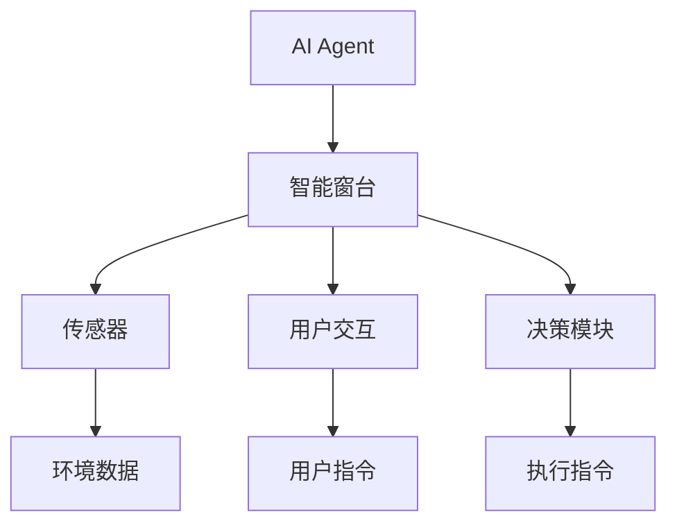
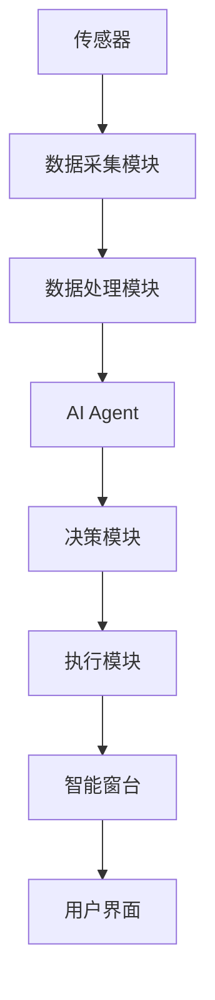
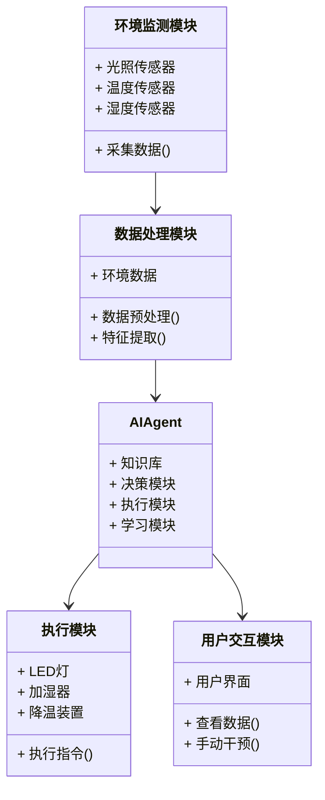
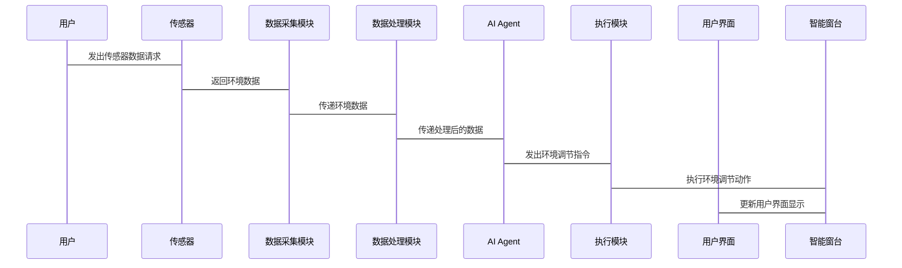

                 


# AI Agent在智能窗台中的室内植物智能照料

> 关键词：AI Agent，智能窗台，室内植物，物联网，算法原理，系统架构

> 摘要：本文探讨了AI Agent在智能窗台中的室内植物智能照料的应用，详细分析了AI Agent的核心概念、算法原理、系统架构，并通过实战案例展示了如何利用AI技术实现室内植物的智能化管理。文章从问题背景、技术原理到系统实现，层层深入，为读者提供了一套完整的解决方案。

---

# 第一部分: AI Agent在智能窗台中的室内植物智能照料概述

# 第1章: AI Agent与智能窗台的背景介绍

## 1.1 问题背景

### 1.1.1 室内植物照料的痛点

随着城市化进程的加快，越来越多的人生活在 apartments 或者寸土寸金的城市环境中。室内植物作为一种美化环境、改善空气质量的方式，越来越受到人们的青睐。然而，室内植物的照料却存在诸多痛点：

- **光照不足**：许多室内植物需要特定的光照条件，而城市中的自然光照往往不足。
- **浇水不当**：过多或过少的浇水都会导致植物生长不良甚至死亡。
- **环境变化**：室内的温度、湿度等环境因素容易受到外部条件的影响，难以精确控制。
- **用户疏忽**：人们常常因为忙碌或其他原因，忘记照料植物，导致植物枯萎。

### 1.1.2 智能窗台的概念与特点

智能窗台是一种结合了物联网（IoT）技术和智能控制的窗台系统，能够为室内植物提供一个智能化的生长环境。智能窗台的核心特点包括：

- **环境监测**：通过传感器实时监测光照、温度、湿度等环境数据。
- **智能控制**：根据监测数据，自动调节光照强度、温湿度等环境参数。
- **用户交互**：通过手机APP或其他交互界面，用户可以随时查看植物状态并进行手动干预。

### 1.1.3 AI Agent在植物照料中的应用价值

AI Agent（人工智能代理）是一种能够感知环境、自主决策并执行任务的智能体。在室内植物照料中，AI Agent可以通过以下方式提升植物的生长环境：

- **智能决策**：基于传感器数据和历史数据，AI Agent可以预测植物的需求并做出最优决策。
- **自主学习**：通过机器学习算法，AI Agent可以不断优化自己的决策模型，适应不同的植物种类和环境条件。
- **实时反馈**：AI Agent能够实时感知环境变化，并快速做出响应，确保植物始终处于最佳生长状态。

## 1.2 问题描述

### 1.2.1 室内植物照料的主要问题

室内植物的照料主要面临以下问题：

- **光照管理**：大多数室内植物需要特定的光照条件，但城市中的自然光照往往不足，且难以调节。
- **温湿度控制**：室内环境的温湿度容易受到外部因素的影响，难以精确控制。
- **用户参与度**：用户需要定期检查植物状态并进行手动干预，这对忙碌的用户来说往往难以坚持。

### 1.2.2 智能窗台系统的功能需求

智能窗台系统需要具备以下功能：

- **环境监测**：实时监测光照、温度、湿度等环境参数。
- **智能控制**：根据监测数据，自动调节光照强度、温湿度等环境参数。
- **用户交互**：通过APP或网页界面，用户可以查看植物状态并进行手动干预。
- **数据存储与分析**：存储历史数据，分析植物生长趋势，提供决策支持。

### 1.2.3 AI Agent在系统中的角色与目标

AI Agent在智能窗台系统中扮演着“智能大脑”的角色，其主要目标是：

- **感知环境**：通过传感器数据感知植物当前的生长环境。
- **决策优化**：基于感知数据和历史数据，优化植物的生长环境。
- **执行指令**：根据决策结果，控制智能窗台的执行机构（如LED灯、加湿器等）。
- **学习进化**：通过机器学习算法不断优化自身的决策模型，提高植物照料的智能化水平。

## 1.3 问题解决

### 1.3.1 AI Agent的核心功能

AI Agent在智能窗台系统中的核心功能包括：

- **状态识别**：识别植物的当前状态（健康、缺水、缺光等）。
- **环境感知**：感知环境中的光照、温度、湿度等参数。
- **决策推理**：基于感知数据和历史数据，推理出最优的环境调节方案。
- **执行反馈**：根据决策结果，执行环境调节动作，并实时反馈执行结果。

### 1.3.2 智能窗台系统的解决方案

智能窗台系统的解决方案包括以下几个方面：

- **硬件设计**：设计并实现智能窗台的硬件部分，包括传感器、执行机构（如LED灯、加湿器）等。
- **软件设计**：开发AI Agent的核心算法，实现环境监测、智能决策和执行控制。
- **用户界面**：设计友好的用户界面，方便用户查看植物状态并进行手动干预。

### 1.3.3 系统边界与外延

智能窗台系统的边界包括：

- **内部边界**：系统内部的数据流，包括传感器数据、用户指令等。
- **外部边界**：系统与外部环境的交互，包括用户、其他智能设备等。

系统的外延包括：

- **扩展功能**：如与其他智能家居设备的联动（如智能音箱、智能空调等）。
- **数据共享**：与其他系统共享植物生长数据，进行更广泛的分析和应用。

## 1.4 概念结构与核心要素

### 1.4.1 AI Agent的构成要素

AI Agent的构成要素包括：

- **感知模块**：负责感知环境数据。
- **决策模块**：负责基于感知数据进行决策。
- **执行模块**：负责根据决策结果执行动作。
- **学习模块**：负责优化决策模型。

### 1.4.2 智能窗台系统的功能模块

智能窗台系统的主要功能模块包括：

- **环境监测模块**：负责实时监测光照、温度、湿度等环境参数。
- **智能控制模块**：负责根据监测数据自动调节环境参数。
- **用户交互模块**：负责与用户进行信息交互。
- **数据存储与分析模块**：负责存储历史数据并进行分析。

### 1.4.3 核心概念的关联与对比

核心概念的关联与对比可以通过以下表格展示：

| **概念**       | **定义**                                                                 |
|----------------|--------------------------------------------------------------------------|
| AI Agent       | 具备感知、决策、执行能力的智能体                                         |
| 智能窗台       | 结合物联网技术的窗台系统，能够智能调节植物生长环境                     |
| 环境监测       | 通过传感器实时监测植物生长环境中的各项参数                           |
| 智能控制       | 根据监测数据，自动调节环境参数以优化植物生长条件                     |

## 1.5 本章小结

本章介绍了AI Agent在智能窗台中的室内植物智能照料的背景和应用价值，详细描述了室内植物照料的主要问题和智能窗台系统的功能需求。通过分析AI Agent的核心功能和系统边界，为后续章节的深入探讨奠定了基础。

---

# 第二部分: AI Agent的核心概念与原理

# 第2章: AI Agent的核心概念与联系

## 2.1 AI Agent的原理

### 2.1.1 AI Agent的基本定义

AI Agent（人工智能代理）是一种能够感知环境、自主决策并执行任务的智能体。AI Agent的核心原理包括以下几个方面：

- **感知环境**：通过传感器或其他信息源感知环境状态。
- **决策推理**：基于感知数据和知识库，推理出最优的行动方案。
- **执行动作**：根据决策结果，执行具体的动作以改变环境或完成任务。
- **学习进化**：通过机器学习算法不断优化自身的决策模型。

### 2.1.2 AI Agent的核心原理

AI Agent的核心原理可以用以下公式表示：

$$ \text{决策} = f(\text{感知数据}, \text{知识库}) $$

其中，感知数据包括传感器数据、用户指令等，知识库包括植物生长知识、环境调节策略等。AI Agent通过感知数据和知识库进行推理，生成最优的决策。

### 2.1.3 AI Agent与物联网的结合

AI Agent与物联网的结合是智能窗台系统的核心。物联网技术提供了环境监测和设备控制的物理基础，而AI Agent则提供了智能化的决策和执行能力。两者的结合使得智能窗台系统能够实现真正的智能化管理。

## 2.2 智能窗台系统的实体关系

### 2.2.1 实体关系图（Mermaid流程图）

以下是智能窗台系统的实体关系图：



从图中可以看出，AI Agent通过传感器获取环境数据，通过用户交互获取用户指令，并通过决策模块生成执行指令，最终通过智能窗台的执行机构改变环境参数。

## 2.3 系统架构图（Mermaid流程图）

以下是智能窗台系统的系统架构图：



从图中可以看出，系统的主要模块包括数据采集模块、数据处理模块、AI Agent、决策模块、执行模块和用户界面。

## 2.4 本章小结

本章详细介绍了AI Agent的核心概念和原理，并通过实体关系图和系统架构图展示了智能窗台系统的整体结构。通过这些图表，读者可以清晰地理解AI Agent在智能窗台系统中的作用和位置。

---

# 第三部分: AI Agent的算法原理

# 第3章: AI Agent的算法原理

## 3.1 状态识别算法

### 3.1.1 状态识别的定义

状态识别是指通过传感器数据确定植物的当前状态（如健康、缺水、缺光等）。

### 3.1.2 状态识别算法的实现

状态识别算法可以通过以下步骤实现：

1. **数据采集**：通过传感器采集光照、温度、湿度等环境数据。
2. **数据预处理**：对采集到的数据进行清洗和归一化处理。
3. **特征提取**：从数据中提取有助于状态识别的特征。
4. **模型训练**：使用机器学习算法（如决策树、随机森林等）训练状态识别模型。
5. **状态预测**：基于训练好的模型，预测植物的当前状态。

### 3.1.3 状态识别算法的数学模型

状态识别算法的数学模型可以用以下公式表示：

$$ y = f(x_1, x_2, ..., x_n) $$

其中，$y$ 是植物的状态，$x_1, x_2, ..., x_n$ 是环境数据。

## 3.2 环境感知算法

### 3.2.1 环境感知的定义

环境感知是指通过传感器数据感知植物生长环境中的各项参数。

### 3.2.2 环境感知算法的实现

环境感知算法可以通过以下步骤实现：

1. **数据采集**：通过传感器采集光照、温度、湿度等环境数据。
2. **数据预处理**：对采集到的数据进行清洗和归一化处理。
3. **特征提取**：从数据中提取有助于环境感知的特征。
4. **模型训练**：使用机器学习算法（如线性回归、支持向量机等）训练环境感知模型。
5. **环境预测**：基于训练好的模型，预测未来的环境参数。

### 3.2.3 环境感知算法的数学模型

环境感知算法的数学模型可以用以下公式表示：

$$ y = \beta_0 + \beta_1 x_1 + \beta_2 x_2 + ... + \beta_n x_n + \epsilon $$

其中，$y$ 是环境参数，$x_1, x_2, ..., x_n$ 是环境数据，$\beta_0, \beta_1, ..., \beta_n$ 是模型参数，$\epsilon$ 是误差项。

## 3.3 决策推理算法

### 3.3.1 决策推理的定义

决策推理是指基于感知数据和历史数据，推理出最优的环境调节方案。

### 3.3.2 决策推理算法的实现

决策推理算法可以通过以下步骤实现：

1. **数据采集**：通过传感器采集光照、温度、湿度等环境数据。
2. **数据预处理**：对采集到的数据进行清洗和归一化处理。
3. **特征提取**：从数据中提取有助于决策推理的特征。
4. **模型训练**：使用强化学习算法（如Q-learning、Deep Q-Network等）训练决策推理模型。
5. **决策生成**：基于训练好的模型，生成最优的环境调节方案。

### 3.3.3 决策推理算法的数学模型

决策推理算法的数学模型可以用以下公式表示：

$$ Q(s, a) = r + \gamma \max_{a'} Q(s', a') $$

其中，$Q(s, a)$ 是状态-动作对的价值，$s$ 是当前状态，$a$ 是当前动作，$r$ 是奖励，$\gamma$ 是折扣因子，$s'$ 是下一个状态，$a'$ 是下一个动作。

## 3.4 执行反馈算法

### 3.4.1 执行反馈的定义

执行反馈是指根据决策结果，执行环境调节动作，并实时反馈执行结果。

### 3.4.2 执行反馈算法的实现

执行反馈算法可以通过以下步骤实现：

1. **决策生成**：基于感知数据和历史数据，生成环境调节方案。
2. **动作执行**：通过智能窗台的执行机构执行环境调节动作。
3. **反馈采集**：采集执行结果并反馈给AI Agent。
4. **模型优化**：根据反馈结果优化决策模型。

### 3.4.3 执行反馈算法的数学模型

执行反馈算法的数学模型可以用以下公式表示：

$$ \theta_{t+1} = \theta_t + \alpha (r_t + \gamma \max_{a'} Q(s', a') - Q(s_t, a_t)) \cdot \nabla Q(s_t, a_t) $$

其中，$\theta_{t+1}$ 是优化后的模型参数，$\theta_t$ 是当前模型参数，$\alpha$ 是学习率，$r_t$ 是当前奖励，$\gamma$ 是折扣因子，$s_t$ 是当前状态，$a_t$ 是当前动作，$s'$ 是下一个状态，$a'$ 是下一个动作，$\nabla Q(s_t, a_t)$ 是Q值的梯度。

## 3.5 本章小结

本章详细介绍了AI Agent在智能窗台系统中的算法原理，包括状态识别算法、环境感知算法、决策推理算法和执行反馈算法。通过数学模型和具体实现步骤，展示了AI Agent如何通过算法实现对室内植物的智能化管理。

---

# 第四部分: 智能窗台系统的架构设计与实现

# 第4章: 智能窗台系统的架构设计

## 4.1 问题场景介绍

智能窗台系统的主要问题场景包括：

- **光照不足**：植物需要更多的光照。
- **温度过高或过低**：植物需要调节温度。
- **湿度不足**：植物需要增加湿度。
- **用户干预**：用户需要手动调节环境参数。

## 4.2 系统功能设计

智能窗台系统的功能设计包括以下几个方面：

- **环境监测**：实时监测光照、温度、湿度等环境参数。
- **智能控制**：根据监测数据自动调节环境参数。
- **用户交互**：通过APP或网页界面查看植物状态并进行手动干预。
- **数据存储与分析**：存储历史数据并进行分析，提供决策支持。

## 4.3 系统架构设计

### 4.3.1 领域模型（Mermaid类图）

以下是智能窗台系统的领域模型：



### 4.3.2 系统架构图（Mermaid流程图）

以下是智能窗台系统的系统架构图：


## 4.4 系统接口设计

### 4.4.1 系统接口描述

智能窗台系统的接口设计包括以下几个方面：

- **传感器接口**：与光照传感器、温度传感器、湿度传感器等硬件设备对接。
- **用户界面接口**：与手机APP或网页界面对接，提供数据查看和手动干预功能。
- **执行机构接口**：与LED灯、加湿器、降温装置等执行机构对接。

### 4.4.2 接口交互流程（Mermaid序列图）

以下是智能窗台系统的接口交互流程：



## 4.5 本章小结

本章详细介绍了智能窗台系统的架构设计，包括系统功能设计、系统架构图和系统接口设计。通过Mermaid图表展示了系统的整体结构和接口交互流程，为后续的系统实现奠定了基础。

---

# 第五部分: 项目实战

# 第5章: 项目实战

## 5.1 环境搭建

### 5.1.1 硬件设备

智能窗台系统的硬件设备包括：

- **光照传感器**：用于监测光照强度。
- **温度传感器**：用于监测环境温度。
- **湿度传感器**：用于监测环境湿度。
- **LED灯**：用于调节光照强度。
- **加湿器**：用于调节环境湿度。
- **降温装置**：用于调节环境温度。

### 5.1.2 软件工具

智能窗台系统的软件工具包括：

- **Python编程语言**：用于算法实现。
- **机器学习库（如Scikit-learn、TensorFlow）**：用于模型训练。
- **物联网开发框架（如Arduino、Raspberry Pi）**：用于硬件控制。
- **数据库（如MySQL、MongoDB）**：用于数据存储。

## 5.2 核心代码实现

### 5.2.1 状态识别算法实现

以下是状态识别算法的Python代码实现：

```python
import numpy as np
from sklearn.tree import DecisionTreeClassifier

# 数据预处理
def preprocess_data(data):
    # 数据清洗
    data = data.dropna()
    # 标准化处理
    from sklearn.preprocessing import StandardScaler
    scaler = StandardScaler()
    data = scaler.fit_transform(data)
    return data

# 特征提取
def extract_features(data):
    features = data[:, :-1]
    return features

# 模型训练
def train_model(features, labels):
    model = DecisionTreeClassifier()
    model.fit(features, labels)
    return model

# 状态识别
def identify_state(model, features):
    prediction = model.predict(features)
    return prediction
```

### 5.2.2 决策推理算法实现

以下是决策推理算法的Python代码实现：

```python
import numpy as np
from tensorflow.keras.models import Sequential
from tensorflow.keras.layers import Dense, LSTM

# 数据预处理
def preprocess_data(data):
    # 数据清洗
    data = data.dropna()
    # 标准化处理
    from sklearn.preprocessing import StandardScaler
    scaler = StandardScaler()
    data = scaler.fit_transform(data)
    return data

# 特征提取
def extract_features(data):
    features = data[:, :-1]
    return features

# 模型训练
def train_model(features, labels):
    model = Sequential()
    model.add(LSTM(64, input_shape=(timesteps, features)))
    model.add(Dense(1, activation='sigmoid'))
    model.compile(loss='binary_crossentropy', optimizer='adam', metrics=['accuracy'])
    model.fit(features, labels, epochs=10, batch_size=32)
    return model

# 决策推理
def make_prediction(model, features):
    prediction = model.predict(features)
    return prediction
```

### 5.2.3 执行反馈算法实现

以下是执行反馈算法的Python代码实现：

```python
import numpy as np
from sklearn.linear_model import LinearRegression

# 数据预处理
def preprocess_data(data):
    # 数据清洗
    data = data.dropna()
    # 标准化处理
    from sklearn.preprocessing import StandardScaler
    scaler = StandardScaler()
    data = scaler.fit_transform(data)
    return data

# 特征提取
def extract_features(data):
    features = data[:, :-1]
    return features

# 模型训练
def train_model(features, labels):
    model = LinearRegression()
    model.fit(features, labels)
    return model

# 执行反馈
def provide_feedback(model, features):
    prediction = model.predict(features)
    return prediction
```

## 5.3 代码功能解读与分析

### 5.3.1 状态识别算法代码解读

状态识别算法的代码实现包括以下几个步骤：

1. **数据预处理**：对采集到的数据进行清洗和标准化处理。
2. **特征提取**：从数据中提取有助于状态识别的特征。
3. **模型训练**：使用决策树算法训练状态识别模型。
4. **状态识别**：基于训练好的模型，预测植物的当前状态。

### 5.3.2 决策推理算法代码解读

决策推理算法的代码实现包括以下几个步骤：

1. **数据预处理**：对采集到的数据进行清洗和标准化处理。
2. **特征提取**：从数据中提取有助于决策推理的特征。
3. **模型训练**：使用长短期记忆网络（LSTM）算法训练决策推理模型。
4. **决策生成**：基于训练好的模型，生成最优的环境调节方案。

### 5.3.3 执行反馈算法代码解读

执行反馈算法的代码实现包括以下几个步骤：

1. **数据预处理**：对采集到的数据进行清洗和标准化处理。
2. **特征提取**：从数据中提取有助于执行反馈的特征。
3. **模型训练**：使用线性回归算法训练执行反馈模型。
4. **反馈生成**：基于训练好的模型，生成执行反馈。

## 5.4 实际案例分析与详细讲解

### 5.4.1 实际案例分析

假设我们有一个智能窗台系统，用于照料一株绿色植物。以下是系统的实际运行过程：

1. **数据采集**：传感器采集光照、温度、湿度等环境数据。
2. **数据处理**：对采集到的数据进行清洗和标准化处理。
3. **特征提取**：从数据中提取有助于状态识别的特征。
4. **状态识别**：基于决策树算法，识别植物的当前状态（如健康、缺水、缺光等）。
5. **决策推理**：基于LSTM算法，推理出最优的环境调节方案（如增加光照、降低温度等）。
6. **执行反馈**：通过执行机构（如LED灯、加湿器等）执行环境调节动作，并实时反馈执行结果。

### 5.4.2 详细讲解

通过以上步骤，AI Agent能够实现对室内植物的智能化管理。例如，当系统检测到植物缺光时，AI Agent会自动调节LED灯的光照强度，确保植物获得足够的光照。当系统检测到植物缺水时，AI Agent会自动启动加湿器，增加环境湿度。通过实时反馈和不断优化的决策模型，AI Agent能够不断提升植物照料的智能化水平。

## 5.5 本章小结

本章通过实际案例分析和详细讲解，展示了AI Agent在智能窗台系统中的具体实现。通过Python代码和机器学习算法，读者可以清晰地理解如何利用AI技术实现室内植物的智能化管理。

---

# 第六部分: 总结与展望

# 第6章: 总结与展望

## 6.1 本项目的核心成果

本项目的核心成果包括：

- **实现了一个基于AI Agent的智能窗台系统**，能够实现室内植物的智能化管理。
- **提出了一个完整的算法框架**，包括状态识别、环境感知、决策推理和执行反馈四个部分。
- **设计了一个高效的系统架构**，包括环境监测模块、数据处理模块、AI Agent模块和执行模块。

## 6.2 项目总结

通过本项目的实施，我们成功地将AI技术应用于室内植物的智能照料。AI Agent通过感知环境、自主决策和执行动作，实现了对植物生长环境的智能化管理。通过机器学习算法的不断优化，系统的智能化水平不断提高，为室内植物的健康成长提供了有力保障。

## 6.3 未来展望

未来，我们可以从以下几个方面进一步优化和扩展本项目：

1. **优化算法模型**：通过引入更先进的机器学习算法（如深度学习、强化学习等），进一步提高系统的智能化水平。
2. **扩展功能模块**：增加更多的功能模块，如植物品种识别、病虫害检测等。
3. **与其他系统联动**：与其他智能家居设备（如智能音箱、智能空调等）联动，实现更广泛的智能化应用。
4. **数据共享与分析**：与其他系统共享植物生长数据，进行更广泛的数据分析和应用。

---

# 作者：AI天才研究院/AI Genius Institute & 禅与计算机程序设计艺术 /Zen And The Art of Computer Programming

