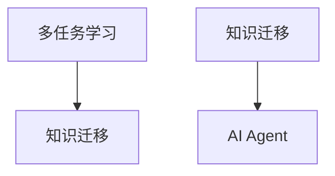
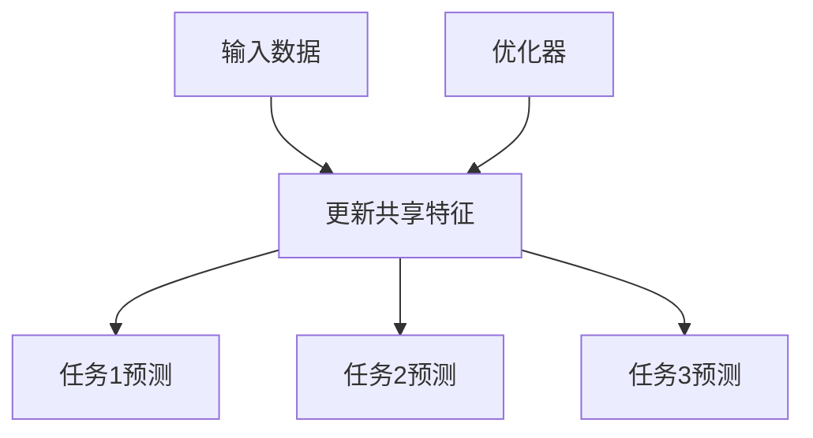
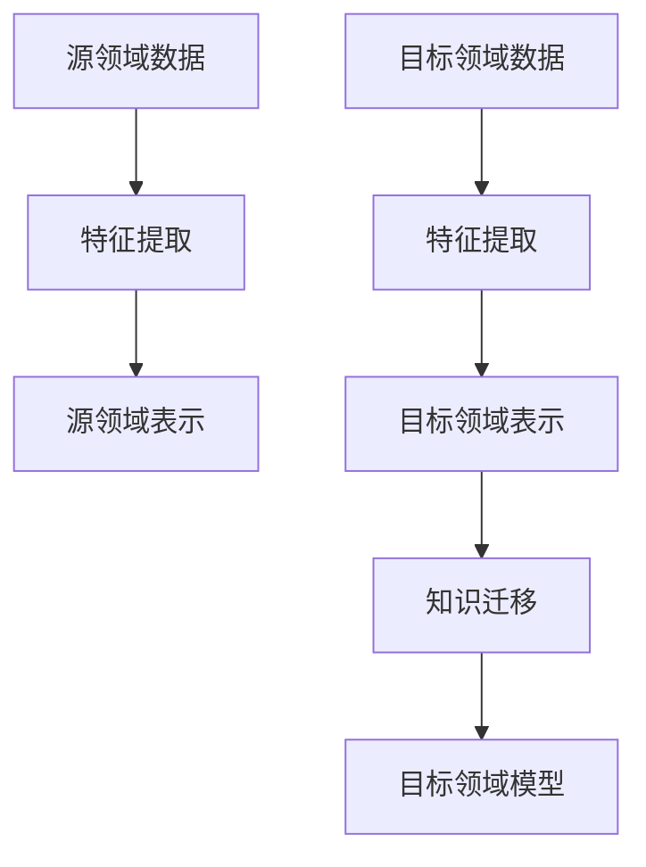
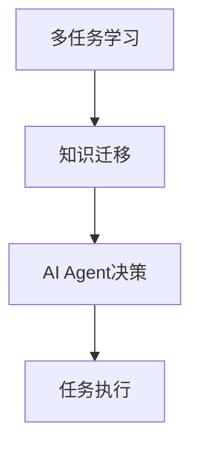
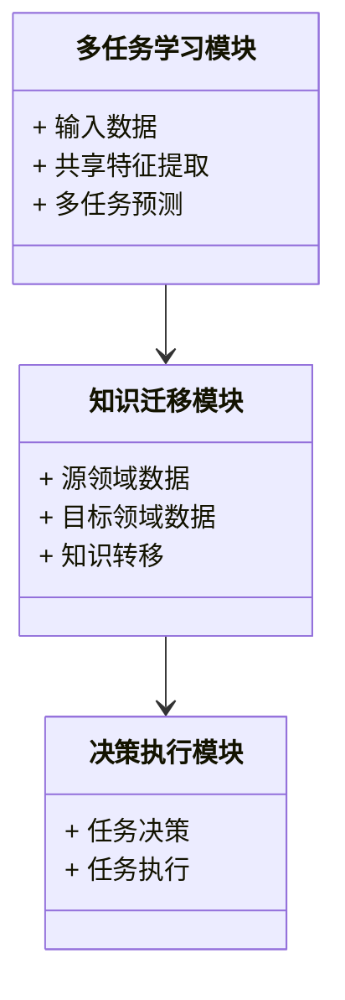
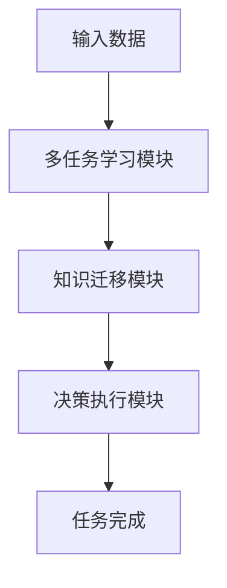

                 


# AI Agent的多任务学习与知识迁移

## 关键词：AI Agent，多任务学习，知识迁移，机器学习，人工智能

## 摘要：本文将详细探讨AI Agent在多任务学习与知识迁移中的应用。通过分析多任务学习和知识迁移的核心概念、算法原理、系统架构以及实际案例，本文旨在为读者提供一个全面的视角，帮助其理解如何通过多任务学习和知识迁移提升AI Agent的智能水平。文章内容包括背景介绍、核心概念对比、算法实现、系统设计以及项目实战等部分，确保读者能够从理论到实践全面掌握相关内容。

---

## 第1章: AI Agent的多任务学习与知识迁移概述

### 1.1 问题背景

#### 1.1.1 多任务学习的背景
多任务学习（Multi-Task Learning, MTL）是一种机器学习范式，旨在通过同时学习多个相关任务来提高模型的泛化能力和效率。传统单任务学习在面对多个任务时，需要分别训练多个独立模型，这不仅增加了计算成本，还可能导致模型无法充分利用任务之间的共性信息。因此，MTL通过共享不同任务之间的特征和参数，能够在多个任务之间实现知识共享，从而提高学习效率和模型性能。

#### 1.1.2 知识迁移的背景
知识迁移（Knowledge Transfer）是指将一个领域学到的知识和经验应用到另一个相关领域的过程。在机器学习和人工智能领域，知识迁移的核心在于如何将源领域的知识有效地迁移到目标领域，从而减少目标领域数据的依赖，提高模型的泛化能力。知识迁移广泛应用于图像识别、自然语言处理、推荐系统等领域。

#### 1.1.3 AI Agent的定义与特点
AI Agent（人工智能代理）是一种能够感知环境、执行任务并做出决策的智能体。AI Agent的特点包括自主性、反应性、目标导向性和社交能力。与传统的单任务模型相比，AI Agent需要在复杂动态的环境中完成多种任务，这使得多任务学习和知识迁移成为提升AI Agent智能水平的关键技术。

---

### 1.2 问题描述

#### 1.2.1 多任务学习的核心问题
多任务学习的核心问题是如何在多个任务之间共享参数或特征，同时保持对每个任务的特定适应能力。这需要解决以下问题：
1. 如何设计模型结构以实现任务之间的知识共享。
2. 如何平衡不同任务之间的学习权重。
3. 如何避免任务之间的相互干扰。

#### 1.2.2 知识迁移的核心问题
知识迁移的核心问题是如何将源领域的知识有效地迁移到目标领域。这需要解决以下问题：
1. 如何提取源领域的特征和表示。
2. 如何度量源领域和目标领域之间的相似性。
3. 如何设计迁移策略以减少领域适应的成本。

#### 1.2.3 AI Agent在多任务学习与知识迁移中的挑战
AI Agent在多任务学习与知识迁移中的挑战包括：
1. 复杂环境中的任务多样性。
2. 不同任务之间的知识共享与隔离。
3. 动态环境中的知识更新与迁移。

---

### 1.3 问题解决

#### 1.3.1 多任务学习的解决方案
多任务学习的解决方案包括：
1. 使用共享的模型参数或特征。
2. 设计任务间的关系网络。
3. 采用基于注意力机制的任务权重分配。

#### 1.3.2 知识迁移的解决方案
知识迁移的解决方案包括：
1. 使用领域适配器或桥梁模型。
2. 度量空间转换或特征对齐。
3. 基于对抗训练的领域适应。

#### 1.3.3 AI Agent的多任务学习与知识迁移的结合
通过结合多任务学习和知识迁移，AI Agent可以在复杂环境中实现多个任务的高效学习和知识共享。例如，在自然语言处理任务中，AI Agent可以同时学习文本分类和情感分析，并将源领域的知识迁移到目标领域。

---

### 1.4 边界与外延

#### 1.4.1 多任务学习的边界
多任务学习的边界包括：
1. 任务之间必须具有一定的相关性。
2. 任务的共享特征必须能够提高整体性能。
3. 避免任务之间的相互干扰。

#### 1.4.2 知识迁移的边界
知识迁移的边界包括：
1. 源领域和目标领域必须具有一定的相似性。
2. 知识迁移必须能够减少目标领域的数据需求。
3. 知识迁移必须能够提高目标领域的模型性能。

#### 1.4.3 AI Agent的边界与外延
AI Agent的边界与外延包括：
1. AI Agent的核心功能必须基于多任务学习和知识迁移。
2. AI Agent的决策必须基于动态环境和任务需求。
3. AI Agent的智能水平必须能够通过多任务学习和知识迁移不断提升。

---

### 1.5 概念结构与核心要素组成

#### 1.5.1 多任务学习的概念结构
多任务学习的概念结构包括任务、特征、模型参数和任务权重。任务通过共享特征和参数实现知识共享，任务权重用于平衡不同任务的学习优先级。

#### 1.5.2 知识迁移的概念结构
知识迁移的概念结构包括源领域、目标领域、特征表示和迁移策略。源领域的知识通过特征表示和迁移策略迁移到目标领域，从而实现领域适配。

#### 1.5.3 AI Agent的核心要素组成
AI Agent的核心要素组成包括感知、决策、执行和学习。感知通过多任务学习获取环境信息，决策通过知识迁移做出最优选择，执行通过多任务学习和知识迁移完成任务。

---

### 1.6 本章小结

---

## 第2章: AI Agent的多任务学习与知识迁移的核心概念与联系

### 2.1 多任务学习的原理

#### 2.1.1 多任务学习的定义
多任务学习是一种机器学习范式，旨在通过同时学习多个任务来提高模型的泛化能力和效率。

#### 2.1.2 多任务学习的核心原理
多任务学习的核心原理是通过共享不同任务之间的特征和参数，实现任务之间的知识共享和模型优化。

#### 2.1.3 多任务学习的关键技术
多任务学习的关键技术包括共享参数模型、任务关系网络和注意力机制。

---

### 2.2 知识迁移的原理

#### 2.2.1 知识迁移的定义
知识迁移是指将源领域的知识和经验应用到目标领域的过程。

#### 2.2.2 知识迁移的核心原理
知识迁移的核心原理是通过提取源领域的特征和表示，并将其迁移到目标领域，从而减少目标领域的数据依赖。

#### 2.2.3 知识迁移的关键技术
知识迁移的关键技术包括领域适配器、特征对齐和对抗训练。

---

### 2.3 多任务学习与知识迁移的关系

#### 2.3.1 多任务学习与知识迁移的联系
多任务学习与知识迁移的联系在于，多任务学习可以通过共享特征和参数，为知识迁移提供丰富的知识来源。

#### 2.3.2 多任务学习与知识迁移的区别
多任务学习关注多个任务之间的知识共享，而知识迁移关注源领域到目标领域的知识转移。

#### 2.3.3 多任务学习与知识迁移的协同作用
多任务学习与知识迁移可以协同作用，通过多任务学习获取丰富的知识，再通过知识迁移将知识应用到目标领域。

---

### 2.4 核心概念对比

#### 2.4.1 多任务学习与知识迁移的属性对比

| 属性          | 多任务学习                 | 知识迁移                  |
|---------------|---------------------------|--------------------------|
| 核心目标       | 提高多个任务的性能         | 提高目标领域的性能        |
| 知识共享方式   | 共享特征和参数             | 转移特征和表示            |
| 适用场景       | 多个相关任务              | 不同领域之间             |

#### 2.4.2 多任务学习与知识迁移的优缺点对比

| 优点/缺点      | 多任务学习                 | 知识迁移                  |
|----------------|---------------------------|--------------------------|
| 优点           | 提高模型的泛化能力         | 减少目标领域的数据依赖    |
| 缺点           | 任务之间的相互干扰       | 知识迁移的效果依赖于领域相似性 |

---

### 2.5 ER实体关系图



---

## 第3章: AI Agent的多任务学习与知识迁移的算法原理

### 3.1 多任务学习的算法实现

#### 3.1.1 多任务学习的算法流程



#### 3.1.2 多任务学习的数学模型

$$ \mathcal{L} = \lambda_1 \mathcal{L}_1 + \lambda_2 \mathcal{L}_2 + \lambda_3 \mathcal{L}_3 $$
其中，$\lambda_i$是任务$i$的权重系数，$\mathcal{L}_i$是任务$i$的损失函数。

---

### 3.2 知识迁移的算法实现

#### 3.2.1 知识迁移的算法流程



#### 3.2.2 知识迁移的数学模型

$$ p(y|x) = \argmax_{y} p(y|x, D_{\text{source}}, D_{\text{target}}) $$
其中，$D_{\text{source}}$是源领域数据，$D_{\text{target}}$是目标领域数据。

---

### 3.3 AI Agent的多任务学习与知识迁移的协同算法

#### 3.3.1 协同算法的流程



#### 3.3.2 协同算法的数学模型

$$ \theta = \argmin_{\theta} \sum_{i=1}^{n} \mathcal{L}_i(\theta) + \lambda \mathcal{L}_{\text{transfer}}(\theta) $$
其中，$\theta$是模型参数，$\mathcal{L}_i$是任务$i$的损失函数，$\mathcal{L}_{\text{transfer}}$是知识迁移的损失函数。

---

## 第4章: AI Agent的多任务学习与知识迁移的系统分析与架构设计

### 4.1 系统分析

#### 4.1.1 系统应用场景
AI Agent的多任务学习与知识迁移可以应用于智能助手、推荐系统、自动驾驶等领域。

#### 4.1.2 系统功能设计
1. 多任务学习模块
2. 知识迁移模块
3. 决策执行模块

---

### 4.2 系统架构设计

#### 4.2.1 领域模型



#### 4.2.2 系统架构图



---

## 第5章: AI Agent的多任务学习与知识迁移的项目实战

### 5.1 环境安装

#### 5.1.1 Python环境
安装Python 3.8及以上版本，安装TensorFlow、Keras、Scikit-learn等库。

#### 5.1.2 数据集准备
准备多任务学习和知识迁移所需的源数据和目标数据。

---

### 5.2 系统核心实现

#### 5.2.1 多任务学习代码实现

```python
import tensorflow as tf
from tensorflow import keras

# 定义多任务学习模型
def multi_task_model(input_shape, num_tasks):
    inputs = keras.Input(shape=input_shape)
    x = keras.layers.Dense(64, activation='relu')(inputs)
    task_outputs = []
    for _ in range(num_tasks):
        output = keras.layers.Dense(1, activation='sigmoid')(x)
        task_outputs.append(output)
    model = keras.Model(inputs=inputs, outputs=task_outputs)
    return model

# 编译模型
model = multi_task_model((input_dim,), num_tasks=3)
model.compile(optimizer='adam', loss={'binary_crossentropy'}, metrics=['accuracy'])
```

#### 5.2.2 知识迁移代码实现

```python
import tensorflow as tf
from tensorflow import keras

# 定义知识迁移模型
def knowledge_transfer_model(source_input_shape, target_input_shape):
    source_inputs = keras.Input(shape=source_input_shape)
    target_inputs = keras.Input(shape=target_input_shape)
    source_features = keras.layers.Dense(64, activation='relu')(source_inputs)
    target_features = keras.layers.Dense(64, activation='relu')(target_inputs)
    transfer_layer = keras.layers.Dense(32, activation='relu')(source_features)
    transfer_features = keras.layers.Dense(32, activation='relu')(transfer_layer)
    output = keras.layers.Dense(1, activation='sigmoid')(transfer_features)
    model = keras.Model(inputs=[source_inputs, target_inputs], outputs=output)
    return model

# 编译模型
model = knowledge_transfer_model((input_dim,), (input_dim,))
model.compile(optimizer='adam', loss='binary_crossentropy', metrics=['accuracy'])
```

---

### 5.3 代码应用解读与分析

#### 5.3.1 多任务学习代码解读
上述代码定义了一个多任务学习模型，包含共享特征提取层和多个任务输出层。模型通过共享特征层实现任务之间的知识共享。

#### 5.3.2 知识迁移代码解读
上述代码定义了一个知识迁移模型，包含源领域特征提取层、目标领域特征提取层和知识转移层。模型通过知识转移层实现源领域到目标领域的知识迁移。

---

## 第6章: 最佳实践、小结与注意事项

### 6.1 最佳实践

#### 6.1.1 多任务学习的最佳实践
1. 确保任务之间的相关性。
2. 设计合理的任务权重分配机制。
3. 使用有效的模型正则化方法。

#### 6.1.2 知识迁移的最佳实践
1. 选择合适的迁移策略。
2. 提前学习源领域知识。
3. 设计有效的特征对齐方法。

---

### 6.2 小结

通过本文的详细讲解，我们了解了AI Agent在多任务学习与知识迁移中的核心概念、算法原理和实际应用。多任务学习与知识迁移的结合能够显著提升AI Agent的智能水平，使其在复杂环境中完成多种任务。

---

### 6.3 注意事项

1. 多任务学习和知识迁移需要结合具体场景进行调整。
2. 注意任务之间的相互干扰和领域适应的挑战。
3. 确保模型的可解释性和鲁棒性。

---

## 第7章: 拓展阅读与进一步思考

### 7.1 拓展阅读

1. 多任务学习的经典论文《A Convex Formulation for Learning from Multiple Tasks》。
2. 知识迁移的经典论文《Learning Transferable Features with Convolutional Neural Networks》。

---

## 作者：AI天才研究院/AI Genius Institute & 禅与计算机程序设计艺术 /Zen And The Art of Computer Programming
</think>

---

# AI Agent的多任务学习与知识迁移

## 关键词：AI Agent，多任务学习，知识迁移，机器学习，人工智能

## 摘要：本文将详细探讨AI Agent在多任务学习与知识迁移中的应用。通过分析多任务学习和知识迁移的核心概念、算法原理、系统架构以及实际案例，本文旨在为读者提供一个全面的视角，帮助其理解如何通过多任务学习和知识迁移提升AI Agent的智能水平。文章内容包括背景介绍、核心概念对比、算法实现、系统设计以及项目实战等部分，确保读者能够从理论到实践全面掌握相关内容。

---

## 第1章: AI Agent的多任务学习与知识迁移概述

### 1.1 问题背景

#### 1.1.1 多任务学习的背景
多任务学习（Multi-Task Learning, MTL）是一种机器学习范式，旨在通过同时学习多个相关任务来提高模型的泛化能力和效率。传统单任务学习在面对多个任务时，需要分别训练多个独立模型，这不仅增加了计算成本，还可能导致模型无法充分利用任务之间的共性信息。因此，MTL通过共享不同任务之间的特征和参数，能够在多个任务之间实现知识共享，从而提高学习效率和模型性能。

#### 1.1.2 知识迁移的背景
知识迁移（Knowledge Transfer）是指将一个领域学到的知识和经验应用到另一个相关领域的过程。在机器学习和人工智能领域，知识迁移的核心在于如何将源领域的知识有效地迁移到目标领域，从而减少目标领域数据的依赖，提高模型的泛化能力。知识迁移广泛应用于图像识别、自然语言处理、推荐系统等领域。

#### 1.1.3 AI Agent的定义与特点
AI Agent（人工智能代理）是一种能够感知环境、执行任务并做出决策的智能体。AI Agent的特点包括自主性、反应性、目标导向性和社交能力。与传统的单任务模型相比，AI Agent需要在复杂动态的环境中完成多种任务，这使得多任务学习和知识迁移成为提升AI Agent智能水平的关键技术。

---

### 1.2 问题描述

#### 1.2.1 多任务学习的核心问题
多任务学习的核心问题是如何在多个任务之间共享参数或特征，同时保持对每个任务的特定适应能力。这需要解决以下问题：
1. 如何设计模型结构以实现任务之间的知识共享。
2. 如何平衡不同任务之间的学习权重。
3. 如何避免任务之间的相互干扰。

#### 1.2.2 知识迁移的核心问题
知识迁移的核心问题是如何将源领域的知识有效地迁移到目标领域。这需要解决以下问题：
1. 如何提取源领域的特征和表示。
2. 如何度量源领域和目标领域之间的相似性。
3. 如何设计迁移策略以减少领域适应的成本。

#### 1.2.3 AI Agent在多任务学习与知识迁移中的挑战
AI Agent在多任务学习与知识迁移中的挑战包括：
1. 复杂环境中的任务多样性。
2. 不同任务之间的知识共享与隔离。
3. 动态环境中的知识更新与迁移。

---

### 1.3 问题解决

#### 1.3.1 多任务学习的解决方案
多任务学习的解决方案包括：
1. 使用共享的模型参数或特征。
2. 设计任务间的关系网络。
3. 采用基于注意力机制的任务权重分配。

#### 1.3.2 知识迁移的解决方案
知识迁移的解决方案包括：
1. 使用领域适配器或桥梁模型。
2. 度量空间转换或特征对齐。
3. 基于对抗训练的领域适应。

#### 1.3.3 AI Agent的多任务学习与知识迁移的结合
通过结合多任务学习和知识迁移，AI Agent可以在复杂环境中实现多个任务的高效学习和知识共享。例如，在自然语言处理任务中，AI Agent可以同时学习文本分类和情感分析，并将源领域的知识迁移到目标领域。

---

### 1.4 边界与外延

#### 1.4.1 多任务学习的边界
多任务学习的边界包括：
1. 任务之间必须具有一定的相关性。
2. 任务的共享特征必须能够提高整体性能。
3. 避免任务之间的相互干扰。

#### 1.4.2 知识迁移的边界
知识迁移的边界包括：
1. 源领域和目标领域必须具有一定的相似性。
2. 知识迁移必须能够减少目标领域的数据需求。
3. 知识迁移必须能够提高目标领域的模型性能。

#### 1.4.3 AI Agent的边界与外延
AI Agent的边界与外延包括：
1. AI Agent的核心功能必须基于多任务学习和知识迁移。
2. AI Agent的决策必须基于动态环境和任务需求。
3. AI Agent的智能水平必须能够通过多任务学习和知识迁移不断提升。

---

### 1.5 概念结构与核心要素组成

#### 1.5.1 多任务学习的概念结构
多任务学习的概念结构包括任务、特征、模型参数和任务权重。任务通过共享特征和参数实现知识共享，任务权重用于平衡不同任务的学习优先级。

#### 1.5.2 知识迁移的概念结构
知识迁移的概念结构包括源领域、目标领域、特征表示和迁移策略。源领域的知识通过特征表示和迁移策略迁移到目标领域，从而实现领域适配。

#### 1.5.3 AI Agent的核心要素组成
AI Agent的核心要素组成包括感知、决策、执行和学习。感知通过多任务学习获取环境信息，决策通过知识迁移做出最优选择，执行通过多任务学习和知识迁移完成任务。

---

### 1.6 本章小结

---

## 第2章: AI Agent的多任务学习与知识迁移的核心概念与联系

### 2.1 多任务学习的原理

#### 2.1.1 多任务学习的定义
多任务学习是一种机器学习范式，旨在通过同时学习多个任务来提高模型的泛化能力和效率。

#### 2.1.2 多任务学习的核心原理
多任务学习的核心原理是通过共享不同任务之间的特征和参数，实现任务之间的知识共享和模型优化。

#### 2.1.3 多任务学习的关键技术
多任务学习的关键技术包括共享参数模型、任务关系网络和注意力机制。

---

### 2.2 知识迁移的原理

#### 2.2.1 知识迁移的定义
知识迁移是指将源领域的知识和经验应用到目标领域的过程。

#### 2.2.2 知识迁移的核心原理
知识迁移的核心原理是通过提取源领域的特征和表示，并将其迁移到目标领域，从而减少目标领域的数据依赖。

#### 2.2.3 知识迁移的关键技术
知识迁移的关键技术包括领域适配器、特征对齐和对抗训练。

---

### 2.3 多任务学习与知识迁移的关系

#### 2.3.1 多任务学习与知识迁移的联系
多任务学习与知识迁移的联系在于，多任务学习可以通过共享特征和参数，为知识迁移提供丰富的知识来源。

#### 2.3.2 多任务学习与知识迁移的区别
多任务学习关注多个任务之间的知识共享，而知识迁移关注源领域到目标领域的知识转移。

#### 2.3.3 多任务学习与知识迁移的协同作用
多任务学习与知识迁移可以协同作用，通过多任务学习获取丰富的知识，再通过知识迁移将知识应用到目标领域。

---

### 2.4 核心概念对比

#### 2.4.1 多任务学习与知识迁移的属性对比

| 属性          | 多任务学习                 | 知识迁移                  |
|---------------|---------------------------|--------------------------|
| 核心目标       | 提高多个任务的性能         | 提高目标领域的性能        |
| 知识共享方式   | 共享特征和参数             | 转移特征和表示            |
| 适用场景       | 多个相关任务              | 不同领域之间             |

#### 2.4.2 多任务学习与知识迁移的优缺点对比

| 优点/缺点      | 多任务学习                 | 知识迁移                  |
|----------------|---------------------------|--------------------------|
| 优点           | 提高模型的泛化能力         | 减少目标领域的数据依赖    |
| 缺点           | 任务之间的相互干扰       | 知识迁移的效果依赖于领域相似性 |

---

### 2.5 ER实体关系图


---

## 第3章: AI Agent的多任务学习与知识迁移的算法原理

### 3.1 多任务学习的算法实现

#### 3.1.1 多任务学习的算法流程


#### 3.1.2 多任务学习的数学模型

$$ \mathcal{L} = \lambda_1 \mathcal{L}_1 + \lambda_2 \mathcal{L}_2 + \lambda_3 \mathcal{L}_3 $$
其中，$\lambda_i$是任务$i$的权重系数，$\mathcal{L}_i$是任务$i$的损失函数。

---

### 3.2 知识迁移的算法实现

#### 3.2.1 知识迁移的算法流程


#### 3.2.2 知识迁移的数学模型

$$ p(y|x) = \argmax_{y} p(y|x, D_{\text{source}}, D_{\text{target}}) $$
其中，$D_{\text{source}}$是源领域数据，$D_{\text{target}}$是目标领域数据。

---

### 3.3 AI Agent的多任务学习与知识迁移的协同算法

#### 3.3.1 协同算法的流程


#### 3.3.2 协同算法的数学模型

$$ \theta = \argmin_{\theta} \sum_{i=1}^{n} \mathcal{L}_i(\theta) + \lambda \mathcal{L}_{\text{transfer}}(\theta) $$
其中，$\theta$是模型参数，$\mathcal{L}_i$是任务$i$的损失函数，$\mathcal{L}_{\text{transfer}}$是知识迁移的损失函数。

---

## 第4章: AI Agent的多任务学习与知识迁移的系统分析与架构设计

### 4.1 系统分析

#### 4.1.1 系统应用场景
AI Agent的多任务学习与知识迁移可以应用于智能助手、推荐系统、自动驾驶等领域。

#### 4.1.2 系统功能设计
1. 多任务学习模块
2. 知识迁移模块
3. 决策执行模块

---

### 4.2 系统架构设计

#### 4.2.1 领域模型


#### 4.2.2 系统架构图


---

## 第5章: AI Agent的多任务学习与知识迁移的项目实战

### 5.1 环境安装

#### 5.1.1 Python环境
安装Python 3.8及以上版本，安装TensorFlow、Keras、Scikit-learn等库。

#### 5.1.2 数据集准备
准备多任务学习和知识迁移所需的源数据和目标数据。

---

### 5.2 系统核心实现

#### 5.2.1 多任务学习代码实现

```python
import tensorflow as tf
from tensorflow import keras

# 定义多任务学习模型
def multi_task_model(input_shape, num_tasks):
    inputs = keras.Input(shape=input_shape)
    x = keras.layers.Dense(64, activation='relu')(inputs)
    task_outputs = []
    for _ in range(num_tasks):
        output = keras.layers.Dense(1, activation='sigmoid')(x)
        task_outputs.append(output)
    model = keras.Model(inputs=inputs, outputs=task_outputs)
    return model

# 编译模型
model = multi_task_model((input_dim,), num_tasks=3)
model.compile(optimizer='adam', loss={'binary_crossentropy'}, metrics=['accuracy'])
```

#### 5.2.2 知识迁移代码实现

```python
import tensorflow as tf
from tensorflow import keras

# 定义知识迁移模型
def knowledge_transfer_model(source_input_shape, target_input_shape):
    source_inputs = keras.Input(shape=source_input_shape)
    target_inputs = keras.Input(shape=target_input_shape)
    source_features = keras.layers.Dense(64, activation='relu')(source_inputs)
    target_features = keras.layers.Dense(64, activation='relu')(target_inputs)
    transfer_layer = keras.layers.Dense(32, activation='relu')(source_features)
    transfer_features = keras.layers.Dense(32, activation='relu')(transfer_layer)
    output = keras.layers.Dense(1, activation='sigmoid')(transfer_features)
    model = keras.Model(inputs=[source_inputs, target_inputs], outputs=output)
    return model

# 编译模型
model = knowledge_transfer_model((input_dim,), (input_dim,))
model.compile(optimizer='adam', loss='binary_crossentropy', metrics=['accuracy'])
```

---

### 5.3 代码应用解读与分析

#### 5.3.1 多任务学习代码解读
上述代码定义了一个多任务学习模型，包含共享特征提取层和多个任务输出层。模型通过共享特征层实现任务之间的知识共享。

#### 5.3.2 知识迁移代码解读
上述代码定义了一个知识迁移模型，包含源领域特征提取层、目标领域特征提取层和知识转移层。模型通过知识转移层实现源领域到目标领域的知识迁移。

---

## 第6章: 最佳实践、小结与注意事项

### 6.1 最佳实践

#### 6.1.1 多任务学习的最佳实践
1. 确保任务之间的相关性。
2. 设计合理的任务权重分配机制。
3. 使用有效的模型正则化方法。

#### 6.1.2 知识迁移的最佳实践
1. 选择合适的迁移策略。
2. 提前学习源领域知识。
3. 设计有效的特征对齐方法。

---

### 6.2 小结

通过本文的详细讲解，我们了解了AI Agent在多任务学习与知识迁移中的核心概念、算法原理和实际应用。多任务学习与知识迁移的结合能够显著提升AI Agent的智能水平，使其在复杂环境中完成多种任务。

---

### 6.3 注意事项

1. 多任务学习和知识迁移需要结合具体场景进行调整。
2. 注意任务之间的相互干扰和领域适应的挑战。
3. 确保模型的可解释性和鲁棒性。

---

## 第7章: 拓展阅读与进一步思考

### 7.1 拓展阅读

1. 多任务学习的经典论文《A Convex Formulation for Learning from Multiple Tasks》。
2. 知识迁移的经典论文《Learning Transferable Features with Convolutional Neural Networks》。

---

## 作者：AI天才研究院/AI Genius Institute & 禅与计算机程序设计艺术 /Zen And The Art of Computer Programming

