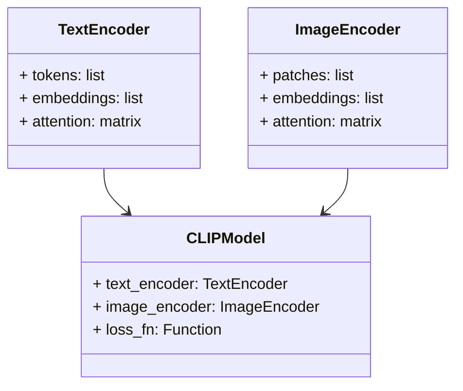
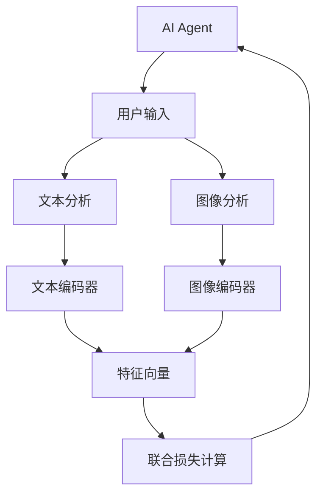
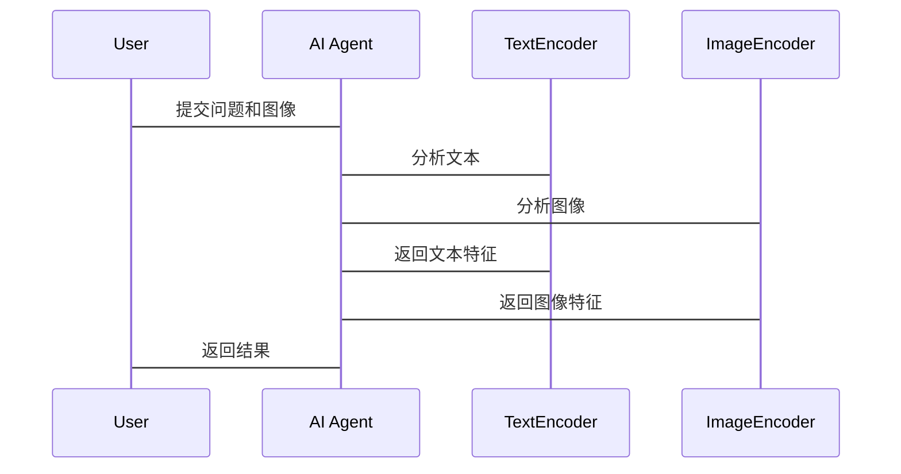

                 


# CLIP模型：实现AI Agent的跨模态理解

> 关键词：CLIP模型、跨模态理解、AI Agent、多模态学习、图像文本交互

> 摘要：本文将深入探讨CLIP模型在实现AI Agent跨模态理解中的作用。通过分析CLIP模型的核心原理、结构设计以及实际应用场景，结合系统架构设计和项目实战案例，全面解析如何利用CLIP模型提升AI Agent的多模态交互能力。

---

# 第一部分: CLIP模型的背景与概述

## 第1章: CLIP模型的起源与发展

### 1.1 跨模态理解的背景

#### 1.1.1 从单模态到跨模态的演进
现代AI技术正朝着多模态方向发展，单模态处理已无法满足复杂场景的需求。跨模态理解能够整合图像、文本等多种信息，为AI Agent提供了更强大的感知能力。

#### 1.1.2 跨模态理解的重要性
在AI Agent中，跨模态理解使其能够同时处理视觉和语言信息，提升交互效率和准确性。例如，在图像问答系统中，AI Agent需要同时理解图像内容和用户的问题。

#### 1.1.3 CLIP模型的提出背景
CLIP模型由OpenAI团队提出，旨在通过统一的模型结构实现图像和文本的跨模态理解，解决了传统模型在多模态任务中的割裂问题。

### 1.2 CLIP模型的核心概念

#### 1.2.1 跨模态数据的定义
跨模态数据指的是来自不同感官渠道的信息，例如图像、文本、音频等。CLIP模型主要处理图像和文本两种模态。

#### 1.2.2 跨模态理解的挑战
跨模态理解需要模型在不同模态之间建立关联，这涉及数据异构性、语义对齐等技术难题。

#### 1.2.3 CLIP模型的创新点
CLIP模型通过联合损失函数实现了图像和文本的共同优化，避免了传统模型中模态间割裂的问题。

---

## 第2章: CLIP模型的核心概念与特点

### 2.1 CLIP模型的基本原理

#### 2.1.1 文本编码器
文本编码器使用Transformer结构对输入文本进行编码，生成文本特征向量。

#### 2.1.2 图像编码器
图像编码器采用ViT（Vision Transformer）结构，将图像分割为多个patches，并进行全局注意力计算，生成图像特征向量。

#### 2.1.3 联合损失函数
CLIP模型通过对比学习的方式，最小化图像和文本特征向量之间的余弦相似度，实现跨模态对齐。

### 2.2 CLIP模型的结构特点

#### 2.2.1 统一特征空间
CLIP模型将图像和文本映射到同一个特征空间，使得不同模态的数据可以进行直接比较。

#### 2.2.2 对比学习机制
通过对比学习，CLIP模型能够学习到图像和文本之间的语义关联，提升跨模态理解能力。

---

## 第3章: CLIP模型与其他跨模态模型的对比

### 3.1 主流跨模态模型概述

#### 3.1.1 ViT
ViT专注于图像理解，通过将图像分割为patches并应用Transformer结构进行编码。

#### 3.1.2 BERT
BERT专注于文本理解，通过自注意力机制和遮蔽词预测任务进行预训练。

#### 3.1.3 DETR
DETR是一种基于Transformer的物体检测模型，通过去除RPN结构，直接预测物体位置和类别。

### 3.2 CLIP与其它模型的对比分析

#### 3.2.1 模型结构对比
| 模型 | 输入模态 | 模型结构 | 主要应用场景 |
|------|----------|----------|--------------|
| ViT  | 图像     | Transformer| 图像分类、检测 |
| BERT | 文本     | Transformer| 文本理解、生成 |
| DETR | 图像+文本 | Transformer| 物体检测     |
| CLIP | 图像+文本 | Transformer| 跨模态理解    |

#### 3.2.2 性能对比
CLIP模型在跨模态任务中表现出色，尤其在零样本学习（zero-shot learning）场景下，能够直接处理未见过的任务。

#### 3.2.3 适用场景对比
CLIP模型适用于需要同时处理图像和文本的场景，如图像问答、图像分类、多模态检索等。

---

## 第4章: CLIP模型在AI Agent中的应用价值

### 4.1 AI Agent的基本概念

#### 4.1.1 AI Agent的定义
AI Agent是一种能够感知环境、执行任务并做出决策的智能体，广泛应用于自动驾驶、智能助手、机器人等领域。

#### 4.1.2 AI Agent的核心功能
- 感知环境：通过传感器获取多模态数据。
- 交互能力：与用户进行自然语言对话。
- 决策能力：基于感知信息做出最优决策。

### 4.2 跨模态理解在AI Agent中的作用

#### 4.2.1 提升交互能力
通过跨模态理解，AI Agent能够更好地理解用户的意图，提供更精准的响应。

#### 4.2.2 增强环境理解能力
结合图像和文本信息，AI Agent能够更全面地理解环境，提高决策的准确性。

### 4.3 CLIP模型在AI Agent中的具体应用

#### 4.3.1 图像与文本的联合分析
在图像问答系统中，AI Agent可以同时分析图像内容和用户的问题，提供更准确的答案。

#### 4.3.2 多模态任务处理
CLIP模型可以应用于AI Agent的多模态任务，如图像分类、文本摘要、跨模态检索等。

#### 4.3.3 实际应用场景举例
- 智能助手：通过图像识别和自然语言处理，帮助用户完成复杂任务。
- 自动驾驶：结合视觉和语言信息，提升车辆的环境感知能力。

---

# 第二部分: CLIP模型的核心概念与原理

## 第5章: CLIP模型的结构与工作原理

### 5.1 模型的整体架构

#### 5.1.1 输入处理
CLIP模型接收图像和文本作为输入，分别通过图像编码器和文本编码器进行处理。

#### 5.1.2 编码器结构
- 文本编码器：基于Transformer的编码器，将输入文本映射到特征向量。
- 图像编码器：基于ViT的编码器，将输入图像分割为多个patches并进行全局注意力计算。

#### 5.1.3 联合损失函数
CLIP模型通过对比学习的方式，最小化图像和文本特征向量之间的余弦相似度，实现跨模态对齐。

### 5.2 文本编码器的实现细节

#### 5.2.1 Transformer结构
文本编码器采用标准的Transformer结构，包括编码器层和自注意力机制。

#### 5.2.2 Token embedding
每个输入的文本token都被映射到对应的嵌入向量。

#### 5.2.3 Positional encoding
通过位置编码，模型能够捕捉到文本的顺序信息。

### 5.3 图像编码器的实现细节

#### 5.3.1 ViT结构
图像编码器采用Vision Transformer结构，将图像分割为多个patches。

#### 5.3.2 Patch embedding
每个patch被映射到固定的维度，形成图像的嵌入向量。

#### 5.3.3 Global attention
通过全局注意力机制，模型能够捕捉到图像中的全局信息。

### 5.4 联合损失函数的实现细节

#### 5.4.1 对比学习机制
CLIP模型通过对比学习的方式，将图像和文本的特征向量进行对齐。

#### 5.4.2 余弦相似度
图像和文本特征向量之间的相似度通过余弦相似度进行衡量。

---

## 第6章: CLIP模型的数学原理

### 6.1 模型的数学表达

#### 6.1.1 文本编码器的数学表达
文本编码器将输入文本序列映射到一个d维的特征向量，表示为：
$$
\text{TextEncoder}(x) = t \in \mathbb{R}^d
$$

#### 6.1.2 图像编码器的数学表达
图像编码器将输入图像映射到一个d维的特征向量，表示为：
$$
\text{ImageEncoder}(I) = i \in \mathbb{R}^d
$$

#### 6.1.3 联合损失函数
CLIP模型的损失函数为对比损失，定义为：
$$
\mathcal{L} = -\log \frac{\exp(\text{sim}(t, i))}{\sum_{k} \exp(\text{sim}(t, i_k))}
$$
其中，$\text{sim}(t, i) = \frac{t \cdot i}{\|t\| \|i\|}$ 表示余弦相似度。

---

## 第7章: CLIP模型的系统分析与架构设计

### 7.1 项目背景介绍

#### 7.1.1 项目目标
本项目旨在通过CLIP模型实现一个AI Agent，具备图像和文本的跨模态理解能力。

#### 7.1.2 项目需求
- 实现图像和文本的联合编码。
- 提供跨模态检索和图像问答功能。

### 7.2 系统功能设计

#### 7.2.1 领域模型设计


#### 7.2.2 系统架构设计


### 7.3 系统接口设计

#### 7.3.1 输入接口
- 文本输入：接受用户输入的文本字符串。
- 图像输入：接受用户上传的图像文件。

#### 7.3.2 输出接口
- 文本输出：返回自然语言处理结果。
- 图像输出：返回图像处理结果。

### 7.4 系统交互流程

#### 7.4.1 序列图


---

## 第8章: 项目实战与实现

### 8.1 环境安装与配置

#### 8.1.1 安装依赖
安装PyTorch和Transformers库：
```bash
pip install torch transformers
```

#### 8.1.2 环境配置
设置PyTorch和Transformers的版本：
```bash
pip install torch==1.9.0 transformers==4.18.0
```

### 8.2 CLIP模型的PyTorch实现

#### 8.2.1 文本编码器实现
```python
import torch
from torch import nn
from transformers import BertTokenizer, BertModel

class TextEncoder(nn.Module):
    def __init__(self, tokenizer, model_name):
        super().__init__()
        self.tokenizer = tokenizer
        self.bert_model = BertModel.from_pretrained(model_name)
        self.dropout = nn.Dropout(0.1)
    
    def forward(self, text):
        tokens = self.tokenizer(text, return_tensors='pt', padding=True, truncation=True)
        outputs = self.bert_model(**tokens)
        pooled_output = outputs.last_hidden_state[:, 0, :]
        return self.dropout(pooled_output)
```

#### 8.2.2 图像编码器实现
```python
import torch
from torch import nn
from PIL import Image
import numpy as np

class ImageEncoder(nn.Module):
    def __init__(self, image_size=224):
        super().__init__()
        self.patch_size = 16
        self.image_size = image_size
        self.embed_dim = 768
        self.num_patches = (image_size // self.patch_size) ** 2
        self.encoder = nn.Sequential(
            nn.Conv2d(3, self.embed_dim, kernel_size=self.patch_size, stride=self.patch_size),
            nn.Flatten(),
            nn.Linear(self.num_patches * self.embed_dim, self.embed_dim)
        )
    
    def forward(self, image):
        image = image.resize((self.image_size, self.image_size))
        x = self.encoder(image)
        return x
```

#### 8.2.3 联合损失计算
```python
def contrastive_loss(x, y, temperature=0.05):
    x = F.normalize(x, dim=1)
    y = F.normalize(y, dim=1)
    similarity_matrix = torch.mm(x, y.T)
    labels = torch.arange(len(y), device=x.device)
    loss = F.cross_entropy(similarity_matrix, labels)
    return loss
```

### 8.3 应用案例分析

#### 8.3.1 图像问答系统
```python
def clip_image_qa(image, question, text_encoder, image_encoder):
    text_features = text_encoder(question)
    image_features = image_encoder(image)
    similarity = torch.mm(text_features, image_features.T)
    return similarity.max(dim=1).indices
```

#### 8.3.2 跨模态检索
```python
def clip_cross_modal_retrieval(images, texts, text_encoder, image_encoder):
    text_features = text_encoder(texts)
    image_features = image_encoder(images)
    similarities = torch.mm(text_features, image_features.T)
    return similarities
```

---

## 第9章: 最佳实践与小结

### 9.1 CLIP模型的关键点总结

#### 9.1.1 模型优势
- 统一特征空间：图像和文本映射到同一空间，便于跨模态对齐。
- 对比学习机制：通过对比损失，提升模型的跨模态理解能力。

#### 9.1.2 模型局限性
- 对比学习的鲁棒性：在某些场景下，对比学习可能不够稳定。
- 计算资源需求：CLIP模型的训练需要大量的计算资源。

### 9.2 使用建议

#### 9.2.1 数据预处理
- 确保输入数据的高质量和多样性。
- 对图像进行标准化处理，确保模型输入一致。

#### 9.2.2 模型调优
- 根据具体任务调整模型参数，如学习率、批量大小等。
- 可以尝试微调模型，针对特定任务进行优化。

### 9.3 注意事项

- 数据隐私：在实际应用中，需注意用户数据的隐私保护。
- 模型性能：根据应用场景选择合适的模型规模，避免资源浪费。

### 9.4 拓展阅读

- CLIP模型的论文：[CLIP: Connecting Text and Image via Cross-Modal Algebra](https://openai.com/research/clip/)
- 跨模态学习的最新进展：[Multimodal Learning](https://scholar.google.com/scholar?q=Multimodal+Learning)

---

作者：AI天才研究院/AI Genius Institute & 禅与计算机程序设计艺术 /Zen And The Art of Computer Programming

