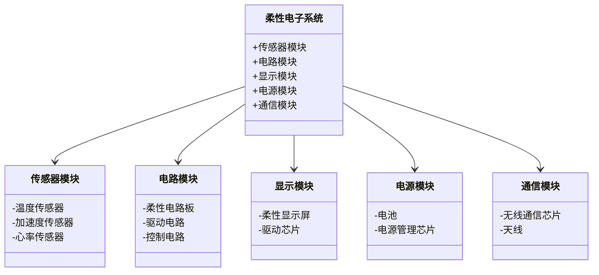
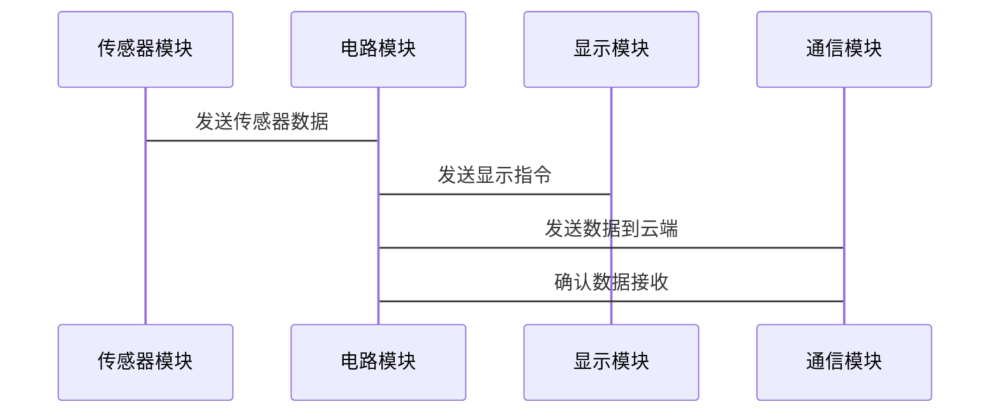

                 


# 价值投资中的新一代柔性电子技术前景

> 关键词：柔性电子技术，价值投资，市场前景，技术分析，投资策略

> 摘要：随着科技的进步，柔性电子技术正逐渐改变我们的生活方式和商业模式。本文将从技术角度分析柔性电子的核心原理、市场趋势以及投资价值，探讨其在投资领域中的潜力与挑战。通过对柔性电子技术的深入了解，结合实际案例和数学模型，为投资者提供科学的投资决策依据。

---

## 第1章 柔性电子技术的背景与概念

### 1.1 柔性电子技术的定义与特点
#### 1.1.1 柔性电子技术的基本概念
柔性电子技术是一种以柔性材料为基础，结合电子元器件制造技术的新兴领域。其核心在于将电子功能材料制成具有柔韧性和可弯曲特性的器件，能够在各种复杂环境中使用。

#### 1.1.2 柔性电子技术的核心属性
- **柔韧性**：器件可以在弯曲、拉伸等状态下正常工作。
- **轻薄性**：材料厚度通常在微米级别，重量轻。
- **可穿戴性**：适用于智能穿戴设备，如健康监测设备、智能服装等。
- **集成性**：可以集成传感器、电路和显示单元，形成一体化系统。

#### 1.1.3 柔性电子技术的演进历程
从早期的刚性电路板到柔性电路板，再到当前的柔性有机电子器件，柔性电子技术经历了从简单到复杂的演变过程。近年来，随着材料科学和制造技术的进步，柔性电子技术进入了快速发展阶段。

### 1.2 柔性电子技术的主要应用领域
#### 1.2.1 医疗健康领域的应用
柔性电子技术在医疗领域的应用广泛，包括：
- **可穿戴医疗设备**：如心率监测器、血压计等。
- **智能绷带**：能够实时监测伤口愈合情况。
- **植入式医疗设备**：如柔性生物传感器，用于体内监测。

#### 1.2.2 智能穿戴设备的创新
- **智能手表**：集成心率监测、运动监测等功能。
- **智能服装**：将传感器集成到衣物中，实时监测体温、运动数据等。
- **增强现实设备**：柔性显示屏的应用为AR设备提供了更轻便的解决方案。

#### 1.2.3 柔性显示屏的发展
- **可折叠手机**：柔性OLED显示屏的应用使得手机可以折叠。
- **电子皮肤**：用于机器人或假肢的柔性显示屏，提供触觉反馈。

### 1.3 柔性电子技术的市场现状
#### 1.3.1 全球市场格局分析
全球柔性电子市场呈现快速增长趋势，主要驱动力来自智能穿戴设备和医疗设备的需求。根据市场调研机构的数据，2023年全球柔性电子市场规模已超过100亿美元，预计未来几年年均增长率将保持在20%以上。

#### 1.3.2 中国市场发展特点
中国是全球最大的电子产品制造国，也是柔性电子技术的重要研发和应用市场。政府政策支持、企业技术创新以及庞大的市场需求共同推动了中国柔性电子市场的快速发展。

#### 1.3.3 技术瓶颈与未来趋势
尽管柔性电子技术发展迅速，但仍面临一些技术瓶颈：
- **材料稳定性**：柔性材料在长期使用中的稳定性问题。
- **制造成本**：柔性电子器件的制造成本较高，限制了其大规模应用。
- **技术标准**：缺乏统一的技术标准，影响了产业规模化发展。

未来，柔性电子技术将朝着更轻薄、更耐用、更智能化的方向发展。

### 1.4 柔性电子技术与价值投资的关系
#### 1.4.1 技术进步对投资价值的影响
柔性电子技术的创新将推动相关企业的市场竞争力提升，从而增加企业价值。例如，掌握柔性显示屏技术的公司可能在智能手表或折叠屏手机市场中占据优势。

#### 1.4.2 市场需求与投资机会的关联
随着柔性电子技术的广泛应用，市场需求将快速增长，这为投资者提供了丰富的投资机会。例如，投资于柔性电子材料供应商或智能穿戴设备制造商，可能获得较高的投资回报。

#### 1.4.3 产业链分析与投资策略
柔性电子技术的产业链包括材料供应商、器件制造商、设备供应商和系统集成商。投资者可以通过分析产业链各环节的竞争格局，选择具有竞争优势的企业进行投资。

---

## 第2章 柔性电子技术的核心概念与投资价值

### 2.1 柔性电子技术的核心原理
#### 2.1.1 柔性材料的特性与应用
柔性材料是柔性电子技术的核心，主要包括：
- **有机材料**：如聚酰亚胺（PI）、聚乙烯（PE）等。
- **无机材料**：如氧化物半导体、纳米材料等。

这些材料具有柔韧性好、导电性高、耐弯折等特点，适用于柔性电子器件的制造。

#### 2.1.2 柔性电路的设计与制造
柔性电路的设计需要考虑材料的延展性和电路的可靠性。制造工艺主要包括：
- **光刻技术**：用于图案化处理。
- **溅射技术**：用于沉积导电材料。
- **封装技术**：保护电路免受外界环境的影响。

#### 2.1.3 柔性电子器件的封装技术
封装技术是柔性电子器件制造的关键环节，主要包括：
- **层压封装**：将多层材料压合在一起，形成保护层。
- **柔性基板封装**：采用柔性基板材料，提高器件的柔韧性。

### 2.2 柔性电子技术的关键指标
#### 2.2.1 性能指标与技术参数
- **导电性**：材料的导电能力直接影响器件的性能。
- **柔韧性**：材料在弯曲或拉伸时的变形能力。
- **耐久性**：材料在长期使用中的稳定性。

#### 2.2.2 成本分析与经济效益
柔性电子技术的制造成本较高，主要原因是材料成本和制造工艺复杂。然而，随着技术进步和规模化生产，制造成本将逐步下降，经济效益将更加显著。

#### 2.2.3 可靠性与寿命评估
柔性电子器件的可靠性是影响其市场应用的重要因素。通过改进材料和制造工艺，可以提高器件的可靠性和使用寿命。

### 2.3 柔性电子技术的创新方向
#### 2.3.1 新型材料的开发
- **石墨烯**：具有优异的导电性和柔韧性。
- **纳米材料**：如纳米线和纳米片，可用于柔性传感器的制造。

#### 2.3.2 制备工艺的优化
- **印刷电子技术**：通过印刷工艺制造柔性电路，提高生产效率。
- **激光切割技术**：用于柔性材料的精密切割。

#### 2.3.3 器件结构的创新设计
- **三维结构**：通过堆叠或折叠的方式实现复杂功能。
- **柔性能源存储**：如柔性电池和超级电容器。

### 2.4 柔性电子技术的投资价值评估
#### 2.4.1 技术壁垒与竞争优势
柔性电子技术的高技术壁垒使得具有核心技术的企业具有竞争优势。投资者可以通过分析企业的研发能力、专利储备等因素，评估其技术壁垒。

#### 2.4.2 市场需求与增长潜力
柔性电子技术的市场需求主要来自智能穿戴设备、医疗设备和折叠屏手机等领域。随着技术进步和市场推广，需求将快速增长，为投资者带来丰厚的回报。

#### 2.4.3 产业链整合与协同效应
投资者可以通过投资于柔性电子产业链的上下游企业，实现资源整合和协同效应。例如，投资于材料供应商和设备制造商，可以形成稳定的供应链。

---

## 第3章 柔性电子技术的数学模型与投资分析

### 3.1 柔性电子技术的数学建模
#### 3.1.1 技术性能的数学表达
柔性电子器件的性能可以通过以下公式进行评估：
$$ R = \frac{\text{导电材料的电阻率}}{\text{材料的厚度}} $$

#### 3.1.2 成本与收益的关系模型
成本与收益的关系可以通过以下公式表示：
$$ \text{总成本} = \text{材料成本} + \text{制造成本} + \text{封装成本} $$

#### 3.1.3 市场需求的预测模型
市场需求的预测可以通过回归分析模型进行评估：
$$ D = a \times \text{市场规模} + b \times \text{技术成熟度} + c \times \text{市场竞争度} $$

### 3.2 投资价值评估的数学公式
#### 3.2.1 投资回报率（ROI）的计算公式
$$ ROI = \frac{\text{净利润}}{\text{总投资}} \times 100\% $$

#### 3.2.2 净现值（NPV）的计算公式
$$ NPV = \sum_{t=0}^{n} \frac{\text{现金流}_t}{(1 + r)^t} $$

#### 3.2.3 内部收益率（IRR）的计算公式
$$ IRR = \text{使 NPV = 0 的折现率} $$

### 3.3 柔性电子技术的市场风险分析
#### 3.3.1 市场波动对投资的影响
市场波动是柔性电子技术投资的主要风险之一。投资者可以通过多元化投资和风险 hedging 来降低市场波动的影响。

#### 3.3.2 技术替代风险的评估
技术替代风险是由于新技术的出现导致现有技术快速过时。投资者需要关注技术发展趋势，选择具有长期竞争优势的企业进行投资。

#### 3.3.3 产业链风险的数学模型
产业链风险可以通过以下公式进行评估：
$$ \text{产业链风险} = \sum_{i=1}^{n} \text{关键供应商风险} \times \text{依赖程度} $$

### 3.4 投资案例分析
#### 3.4.1 柔性显示屏制造商的投资分析
以柔性OLED显示屏制造商为例，投资者可以通过分析其市场份额、技术壁垒和财务状况，评估其投资价值。

#### 3.4.2 智能穿戴设备制造商的投资分析
智能穿戴设备制造商的投资价值可以通过其产品创新能力、市场占有率和盈利能力进行评估。

---

## 第4章 柔性电子技术的系统分析与架构设计

### 4.1 问题场景介绍
柔性电子技术的应用场景复杂多样，需要从系统角度进行整体分析。例如，在智能穿戴设备中，柔性电子技术需要与传感器、电路和显示单元协同工作。

### 4.2 系统功能设计
#### 4.2.1 领域模型 mermaid 类图


### 4.3 系统架构设计
#### 4.3.1 系统架构 mermaid 图


### 4.4 系统接口设计
系统接口设计需要考虑各模块之间的通信协议和数据传输方式。例如，传感器模块与电路模块之间的通信可以通过I2C或SPI接口实现。

### 4.5 系统交互 mermaid 序列图


---

## 第5章 柔性电子技术的项目实战

### 5.1 环境安装与配置
#### 5.1.1 操作系统与工具
- 操作系统：推荐使用Linux或macOS，因其具有良好的开发环境支持。
- 开发工具：如Git、Python、Jupyter Notebook等。

#### 5.1.2 柔性电子材料与设备
- 材料：柔性基板、导电材料、封装材料等。
- 设备：光刻机、溅射设备、封装设备等。

### 5.2 系统核心实现
#### 5.2.1 传感器模块实现
代码示例：
```python
import numpy as np
import pandas as pd

# 模拟传感器数据
def generate_sensor_data():
    temperature = np.random.uniform(25, 35, 100)
    acceleration = np.random.uniform(0, 10, 100)
    heart_rate = np.random.randint(60, 100, 100)
    return temperature, acceleration, heart_rate

temperature, acceleration, heart_rate = generate_sensor_data()
data = pd.DataFrame({
    'Temperature': temperature,
    'Acceleration': acceleration,
    'Heart Rate': heart_rate
})
print(data.head())
```

#### 5.2.2 电路模块实现
代码示例：
```python
from sklearn.linear_model import LinearRegression

# 模拟电路性能数据
X = np.array([[1, 2], [3, 4], [5, 6], [7, 8], [9, 10]])
y = np.array([2, 4, 6, 8, 10])

model = LinearRegression()
model.fit(X, y)
print(model.coef_)
```

#### 5.2.3 显示模块实现
代码示例：
```python
import matplotlib.pyplot as plt

# 模拟显示数据
x = np.linspace(0, 2*np.pi, 100)
y = np.sin(x)

plt.plot(x, y)
plt.title('Flexible Display Simulation')
plt.show()
```

### 5.3 实际案例分析
以某款智能手表为例，分析其柔性电子技术的应用。包括传感器模块、电路模块和显示模块的实现，以及系统的整体设计。

### 5.4 项目小结
通过实际项目的实现，我们可以看到柔性电子技术在智能穿戴设备中的广泛应用。项目的成功实施需要各模块之间的协同合作和系统的整体优化。

---

## 第6章 柔性电子技术的投资策略与未来展望

### 6.1 投资策略分析
#### 6.1.1 选择具有技术壁垒的企业
投资者应选择具有核心技术壁垒的企业进行投资，如柔性显示屏制造商和智能穿戴设备供应商。

#### 6.1.2 关注市场需求与技术趋势
投资者需要关注柔性电子技术的市场需求和技术发展趋势，选择具有增长潜力的领域进行投资。

#### 6.1.3 分散投资风险
通过分散投资和风险 hedging，投资者可以有效降低市场波动和技术替代带来的风险。

### 6.2 未来展望
随着技术进步和市场需求的增加，柔性电子技术将在更多领域得到应用。投资者应关注技术创新和市场动态，抓住投资机会。

---

## 作者：AI天才研究院/AI Genius Institute & 禅与计算机程序设计艺术 /Zen And The Art of Computer Programming

