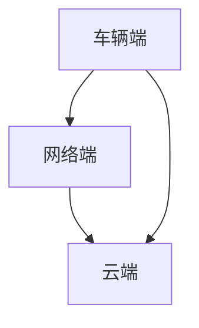
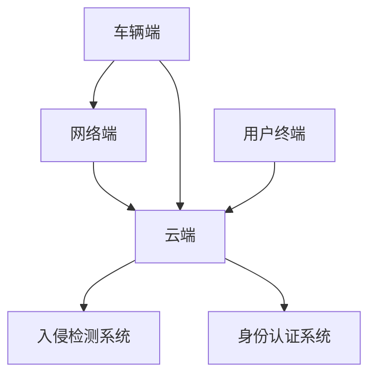
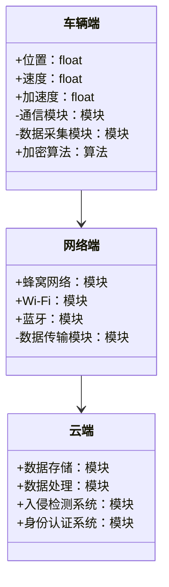
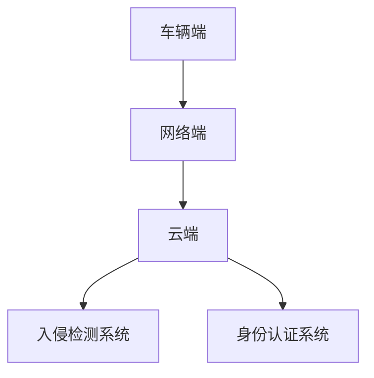

                 


# 价值投资中的智能交通车联网安全系统分析

> 关键词：价值投资、智能交通、车联网安全、系统分析、算法原理、架构设计

> 摘要：本文从价值投资的角度，分析智能交通车联网安全系统的构成、算法原理、系统架构和安全威胁，结合实际案例，探讨如何通过价值投资的方法，评估和选择车联网安全系统中的优质投资标的。文章详细介绍了车联网安全系统的组成部分，分析了加密算法、身份认证和入侵检测等核心算法的原理，并结合数学模型和公式，探讨了车联网安全系统的架构设计和优化方法。

---

## 第1章: 背景介绍

### 1.1 车联网安全系统的基本概念

#### 1.1.1 车联网的定义与特点
车联网（Vehicular Ad-hoc Networks, VANETs）是一种基于车辆之间通信的网络系统，通过车辆与车辆（V2V）、车辆与路侧基础设施（V2I）、车辆与云端（V2C）之间的通信，实现交通信息的实时共享和智能决策。车联网的特点包括：

1. **实时性**：车辆之间的通信需要极低的延迟，以确保交通安全。
2. **移动性**：车辆是移动节点，网络拓扑动态变化。
3. **安全性**：车联网的安全性直接关系到交通安全和用户隐私。
4. **可靠性**：车联网需要在复杂环境下稳定运行。

#### 1.1.2 车联网安全的重要性
车联网安全是保障智能交通系统（ITS）正常运行的核心。车联网安全问题主要体现在以下几个方面：

1. **数据隐私**：车辆产生的数据（如位置、速度、驾驶行为等）可能被滥用，威胁用户隐私。
2. **通信安全**：车辆之间的通信可能被篡改或伪造，导致交通事故。
3. **系统漏洞**：车联网系统可能存在漏洞，被黑客攻击，造成系统瘫痪。

#### 1.1.3 价值投资的背景与意义
价值投资是一种长期投资策略，通过分析企业的基本面，选择具有持续竞争优势和良好发展前景的企业进行投资。在车联网领域，随着智能交通系统的快速发展，车联网安全系统的市场需求不断增加。通过价值投资的方法，可以筛选出具有技术优势、市场占有率高、财务状况良好的企业，实现长期稳定的收益。

#### 1.1.4 车联网安全系统的边界与外延
车联网安全系统的边界包括车辆、路侧设备、云端平台和通信网络。外延则涉及智能交通管理、自动驾驶、共享出行等领域。车联网安全系统的边界与外延决定了其在智能交通系统中的重要作用。

### 1.2 价值投资与车联网安全的结合

#### 1.2.1 车联网安全系统的组成
车联网安全系统由以下部分组成：

1. **车辆端**：车载设备，如OBD、车载电脑等。
2. **网络端**：通信网络，包括蜂窝网络、Wi-Fi、蓝牙等。
3. **云端**：数据存储和处理平台，提供安全服务。

#### 1.2.2 价值投资在车联网安全中的应用
价值投资的核心是分析企业的核心竞争力、市场地位、财务状况和管理层质量。在车联网安全领域，投资者需要关注以下方面：

1. **技术创新**：企业是否掌握了核心安全技术，如加密算法、身份认证等。
2. **市场占有率**：企业在车联网安全市场的占有率。
3. **财务状况**：企业的盈利能力、现金流和债务情况。

#### 1.2.3 车联网安全系统的边界与外延
车联网安全系统的边界与外延决定了其在智能交通系统中的应用范围。边界包括车辆、路侧设备、云端平台和通信网络，外延则涉及智能交通管理、自动驾驶、共享出行等领域。

---

## 第2章: 核心概念与联系

### 2.1 车联网安全系统的组成

#### 2.1.1 车辆端
车辆端是车联网安全系统的起点，主要包括车载设备和车载系统。车载设备负责采集车辆数据（如速度、位置、加速度等），并通过通信模块将数据发送到云端或路侧设备。

#### 2.1.2 网络端
网络端是车联网安全系统的通信桥梁，主要包括蜂窝网络、Wi-Fi、蓝牙等无线通信技术。网络端需要保证数据的实时性和安全性，防止数据被篡改或窃取。

#### 2.1.3 云端
云端是车联网安全系统的数据处理中心，负责存储和处理车辆、路侧设备和用户终端的数据。云端需要具备强大的计算能力和高安全性，防止数据泄露和攻击。

### 2.2 价值投资在车联网安全中的应用

#### 2.2.1 投资标的筛选
在价值投资中，投资者需要筛选出具有竞争优势的企业。在车联网安全领域，投资者需要关注企业的技术创新能力、市场占有率和财务状况。

#### 2.2.2 车联网安全系统的边界与外延
车联网安全系统的边界与外延决定了其在智能交通系统中的应用范围。边界包括车辆、路侧设备、云端平台和通信网络，外延则涉及智能交通管理、自动驾驶、共享出行等领域。

#### 2.2.3 车联网安全系统的功能与价值
车联网安全系统的功能包括数据加密、身份认证、入侵检测等，其价值体现在保障交通安全、保护用户隐私和提升系统可靠性。

### 2.3 核心概念的实体关系图（Mermaid流程图）



---

## 第3章: 算法原理讲解

### 3.1 车联网安全中的加密算法

#### 3.1.1 AES加密算法
AES（Advanced Encryption Standard）是一种广泛使用的加密算法，用于保护车联网中的数据隐私。其基本原理是将明文分成块，通过多轮加密变换生成密文。

$$ AES加密过程：明文 \rightarrow 初始轮 \rightarrow 多轮变换 \rightarrow 密文 $$

#### 3.1.2 RSA加密算法
RSA（Rivest-Shamir-Adleman）是一种公钥加密算法，常用于身份认证和数据签名。其基本原理是基于大整数的因式分解。

$$ RSA加密过程：私钥 \rightarrow 公钥 \rightarrow 签名验证 $$

#### 3.1.3 椭圆曲线加密算法
椭圆曲线加密（ECC）是一种基于椭圆曲线数学的公钥加密算法，适用于资源受限的环境，如车载设备。

$$ ECC加密过程：私钥 \rightarrow 公钥 \rightarrow 加密/解密 $$

### 3.2 身份认证机制

#### 3.2.1 数字签名算法
数字签名算法用于验证数据的完整性和真实性。常用算法包括RSA和ECC。

$$ 数字签名过程：私钥 \rightarrow 签名 \rightarrow 公钥 \rightarrow 验证 $$

#### 3.2.2 车辆身份认证流程
车辆身份认证流程包括身份注册、认证请求和认证响应三个步骤。

1. **身份注册**：车辆向云端平台注册，获取公钥和证书。
2. **认证请求**：车辆向云端发送认证请求，附带签名数据。
3. **认证响应**：云端验证签名，返回认证结果。

#### 3.2.3 用户身份认证流程
用户身份认证流程包括用户注册、登录请求和登录响应三个步骤。

1. **用户注册**：用户向系统注册，设置用户名和密码。
2. **登录请求**：用户向系统发送登录请求，附带密码或令牌。
3. **登录响应**：系统验证用户身份，返回登录结果。

### 3.3 入侵检测系统

#### 3.3.1 基于异常检测的入侵检测
基于异常检测的入侵检测系统通过分析网络流量的异常行为，识别潜在攻击。

$$ 异常检测过程：流量监测 \rightarrow 异常特征提取 \rightarrow 攻击检测 $$

#### 3.3.2 基于模式匹配的入侵检测
基于模式匹配的入侵检测系统通过匹配已知攻击模式，识别潜在威胁。

$$ 模式匹配过程：流量监测 \rightarrow 模式匹配 \rightarrow 攻击检测 $$

#### 3.3.3 深度学习在入侵检测中的应用
深度学习技术可以通过训练神经网络模型，识别复杂的攻击模式。

$$ 深度学习过程：流量数据 \rightarrow 神经网络训练 \rightarrow 攻击分类 $$

---

## 第4章: 系统分析与架构设计方案

### 4.1 问题场景介绍

#### 4.1.1 项目介绍
本项目旨在设计一个车联网安全系统，实现车辆与云端平台之间的安全通信，保障数据隐私和系统安全。

#### 4.1.2 系统功能设计
系统功能包括数据采集、通信安全、入侵检测和用户认证。

1. **数据采集**：采集车辆的实时数据，如速度、位置、加速度等。
2. **通信安全**：通过加密算法保证数据传输的安全性。
3. **入侵检测**：实时监测网络流量，识别潜在攻击。
4. **用户认证**：通过身份认证机制，保障用户隐私。

#### 4.1.3 系统架构设计（Mermaid架构图）



### 4.2 系统架构设计

#### 4.2.1 领域模型（Mermaid类图）



#### 4.2.2 系统架构图



#### 4.2.3 系统接口设计
系统接口设计包括车辆端接口、网络端接口和云端接口。

1. **车辆端接口**：负责采集车辆数据，与网络端通信。
2. **网络端接口**：负责数据传输，保证通信安全。
3. **云端接口**：负责数据存储、处理和安全服务。

#### 4.2.4 系统交互图（Mermaid序列图）

```mermaid
sequenceDiagram
参与者 车辆端
参与者 网络端
参与者 云端
车辆端 -> 网络端: 发送数据
网络端 -> 云端: 传输数据
云端 -> 网络端: 返回确认
网络端 -> 车辆端: 返回确认
```

---

## 第5章: 项目实战

### 5.1 环境安装

#### 5.1.1 安装Python环境
安装Python 3.8及以上版本，并安装必要的库，如`mermaid`、`numpy`、`matplotlib`等。

#### 5.1.2 安装开发工具
安装PyCharm或VS Code等开发工具，配置Python解释器和相关插件。

### 5.2 系统核心实现源代码

#### 5.2.1 加密算法实现
实现AES加密算法的Python代码：

```python
from cryptography.hazmat.primitives.ciphers import Cipher, algorithms, modes
from cryptography.hazmat.primitives.asymmetric import padding
from cryptography.hazmat.primitives.asymmetric.rsa import RSAPublicKey, RSAPrivateKey

def aes_encrypt(plaintext, key):
    cipher = Cipher(algorithms.AES(key), modes.ECB())
    encryptor = cipher.encryptor()
    return encryptor.update(plaintext) + encryptor.finalize()

def aes_decrypt(ciphertext, key):
    cipher = Cipher(algorithms.AES(key), modes.ECB())
    decryptor = cipher.decryptor()
    return decryptor.update(ciphertext) + decryptor.finalize()
```

#### 5.2.2 入侵检测系统实现
实现基于异常检测的入侵检测系统：

```python
import numpy as np
from sklearn.ensemble import IsolationForest

def train_isolation_forest(X):
    model = IsolationForest(n_estimators=100, max_samples=256, random_state=42)
    model.fit(X)
    return model

def detect_anomalies(model, X_test):
    anomalies = model.predict(X_test)
    return anomalies == -1
```

### 5.3 代码应用解读与分析

#### 5.3.1 加密算法实现
上述代码实现了AES加密算法，用于保护车联网中的数据隐私。加密过程包括明文到密文的转换，解密过程包括密文到明文的转换。

#### 5.3.2 入侵检测系统实现
上述代码实现了基于Isolation Forest算法的异常检测，用于识别车联网中的潜在攻击。训练好的模型可以对新的数据进行异常检测，返回异常标志。

### 5.4 实际案例分析

#### 5.4.1 案例背景
假设我们有一个车联网系统，包含1000辆车辆，每辆车每隔1秒发送一次位置和速度数据。我们需要设计一个安全系统，保护这些数据不被篡改或窃取。

#### 5.4.2 案例分析
1. **数据采集**：每辆车通过车载设备采集位置和速度数据。
2. **数据加密**：使用AES加密算法对数据进行加密。
3. **数据传输**：通过蜂窝网络将加密数据传输到云端。
4. **入侵检测**：云端通过Isolation Forest算法检测异常流量。
5. **用户认证**：用户通过身份认证系统登录云端平台，查看车辆数据。

#### 5.4.3 案例小结
通过上述案例，我们可以看到车联网安全系统的各个组成部分协同工作的过程。加密算法保护了数据隐私，入侵检测系统保障了网络安全，用户认证系统确保了用户权限。

---

## 第6章: 最佳实践与小结

### 6.1 投资策略总结

#### 6.1.1 核心投资策略
1. **技术创新**：选择掌握核心安全技术的企业。
2. **市场地位**：关注企业在车联网安全市场的占有率。
3. **财务状况**：分析企业的盈利能力和发展潜力。

#### 6.1.2 风险控制
1. **分散投资**：避免将所有资金投入单一企业或领域。
2. **定期评估**：定期跟踪投资标的的业绩和市场变化。
3. **关注政策**：关注政府政策和行业法规的变化。

### 6.2 系统优化建议

#### 6.2.1 技术优化
1. **算法优化**：进一步优化加密算法和入侵检测算法，提高系统性能。
2. **安全性提升**：加强系统安全性，防止漏洞被利用。

#### 6.2.2 管理优化
1. **团队建设**：加强技术团队建设，提升研发能力。
2. **流程优化**：优化开发流程，提高效率和质量。

### 6.3 注意事项

#### 6.3.1 技术风险
车联网安全系统可能面临技术风险，如算法漏洞、系统崩溃等。

#### 6.3.2 市场风险
市场风险包括市场需求变化、竞争加剧等。

#### 6.3.3 政策风险
政策风险包括政府政策变化、法律法规调整等。

### 6.4 拓展阅读

#### 6.4.1 推荐书籍
1. 《网络安全技术及实践》
2. 《智能交通系统》
3. 《价值投资实战》

#### 6.4.2 推荐博客和资源
1. 博客：https://www.v2ex.com/
2. 资源：https://github.com/
3. 论文：IEEE Xplore数字图书馆

---

## 作者信息

作者：AI天才研究院/AI Genius Institute & 禅与计算机程序设计艺术 /Zen And The Art of Computer Programming

---

# END

