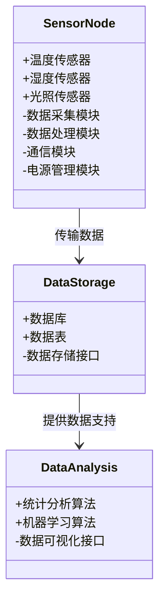
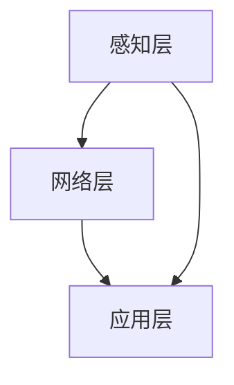
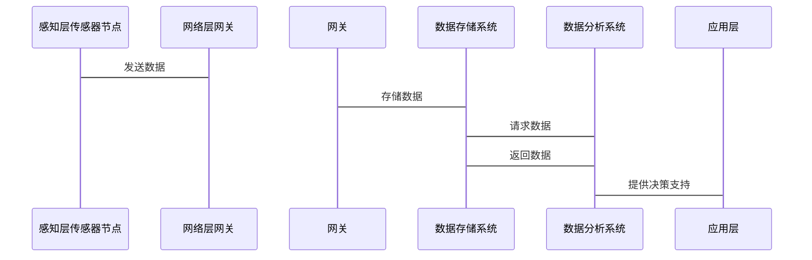

                 


# 价值投资中的智能农业传感器网络分析

> 关键词：智能农业，传感器网络，价值投资，数据分析，机器学习

> 摘要：智能农业传感器网络作为一种新兴的技术手段，正在逐渐成为价值投资者的重要工具。本文将从传感器网络的基本概念出发，分析其在农业领域的应用价值，探讨传感器网络如何帮助投资者做出更明智的决策。文章结合实际案例，详细讲解了传感器网络的核心算法、系统架构以及项目实战，为读者提供了一套完整的智能农业传感器网络分析方法。

---

# 第1章: 智能农业传感器网络概述

## 1.1 智能农业传感器的定义与背景

### 1.1.1 智能农业传感器的定义
智能农业传感器是一种能够感知、采集和传输农业环境数据的智能设备。它通过传感器节点采集土壤湿度、温度、光照强度、空气湿度、风速等环境参数，并通过无线通信技术将数据传输到云端或本地存储系统，供后续分析和决策。

### 1.1.2 智能农业传感器的发展背景
随着全球人口增长和气候变化的加剧，农业面临着前所未有的挑战。传统的农业管理方式效率低下，难以应对复杂的环境变化。智能农业传感器的出现，为农业现代化提供了技术支持。通过实时监测和数据驱动的决策，智能农业传感器网络能够显著提高农业生产效率，降低成本，并增强抗风险能力。

### 1.1.3 智能农业传感器的应用领域
智能农业传感器广泛应用于精准农业、环境监测、智能灌溉、农业保险等领域。例如，在精准农业中，传感器可以实时监测土壤湿度和作物生长状况，帮助农民优化灌溉和施肥策略；在农业保险中，传感器数据可以用于评估自然灾害对农作物的影响，从而快速理赔。

## 1.2 价值投资与农业传感器网络的结合

### 1.2.1 价值投资的基本概念
价值投资是一种投资策略，强调通过分析企业的基本面，寻找市场价格低于其内在价值的投资机会。在农业领域，价值投资者关注的因素包括土地价值、作物产量、市场价格波动等。

### 1.2.2 农业传感器网络在价值投资中的作用
农业传感器网络能够实时采集和分析农业环境数据，为投资者提供更准确的市场信息和决策支持。例如，传感器数据可以帮助投资者评估农作物的生长状况，预测产量波动，从而优化投资组合。

### 1.2.3 智能农业传感器网络的市场价值
智能农业传感器网络能够显著提高农业生产的效率和透明度，降低投资风险。通过传感器数据，投资者可以更准确地评估农业项目的盈利能力和抗风险能力，从而做出更明智的投资决策。

## 1.3 智能农业传感器网络的核心要素

### 1.3.1 传感器节点的组成与功能
传感器节点是智能农业传感器网络的基本单元，通常包括传感器、数据采集模块、通信模块和电源模块。传感器负责采集环境数据，数据采集模块将数据转换为数字信号，通信模块将数据传输到云端或本地存储系统，电源模块为整个节点提供电力支持。

### 1.3.2 传感器网络的拓扑结构
传感器网络的拓扑结构决定了数据传输的效率和可靠性。常见的拓扑结构包括星型网络、树型网络和网状网络。星型网络适用于小型农业园区，树型网络适用于大型农场，网状网络适用于复杂的农业环境。

### 1.3.3 数据采集与传输的关键技术
数据采集技术包括多传感器融合和高精度测量技术。多传感器融合通过结合多种传感器的数据，提高测量精度和可靠性。数据传输技术包括无线通信技术和低功耗设计，确保数据的实时性和稳定性。

## 1.4 本章小结
本章介绍了智能农业传感器网络的基本概念、发展背景和核心要素。传感器网络通过实时监测农业环境，为价值投资者提供了更准确的数据支持，帮助他们做出更明智的投资决策。

---

# 第2章: 智能农业传感器网络的核心概念与原理

## 2.1 智能农业传感器网络的体系结构

### 2.1.1 传感器节点的功能模块
传感器节点的功能模块包括数据采集模块、数据处理模块、通信模块和电源管理模块。数据采集模块负责采集环境数据，数据处理模块对数据进行预处理和融合，通信模块负责数据传输，电源管理模块负责电力供应和管理。

### 2.1.2 传感器网络的分层架构
传感器网络通常采用分层架构，包括感知层、网络层和应用层。感知层负责数据采集和初步处理，网络层负责数据传输和路由，应用层负责数据分析和决策支持。

### 2.1.3 网络通信协议的选择
常见的网络通信协议包括ZigBee、LoRa、NB-IoT等。ZigBee适用于短距离通信，LoRa适用于长距离通信，NB-IoT适用于低功耗和大范围覆盖。

## 2.2 传感器数据的采集与处理

### 2.2.1 数据采集的基本原理
数据采集是通过传感器感知环境参数，并将其转换为数字信号的过程。常见的传感器类型包括温度传感器、湿度传感器、光照传感器等。

### 2.2.2 数据预处理的关键步骤
数据预处理包括数据清洗、数据归一化和数据融合。数据清洗旨在去除噪声和异常值，数据归一化将数据标准化，数据融合通过结合多种传感器数据，提高测量精度。

### 2.2.3 数据融合的技术方法
数据融合方法包括加权平均、最小二乘法和卡尔曼滤波等。加权平均根据传感器的精度和可靠性分配权重，最小二乘法用于消除系统误差，卡尔曼滤波用于动态系统的状态估计。

## 2.3 传感器网络的数据分析与价值挖掘

### 2.3.1 数据分析的基本方法
数据分析方法包括统计分析、时间序列分析和机器学习。统计分析用于描述数据分布，时间序列分析用于预测趋势，机器学习用于分类和回归分析。

### 2.3.2 数据挖掘在农业传感器网络中的应用
数据挖掘技术包括聚类分析、关联规则挖掘和异常检测。聚类分析用于识别相似的区域，关联规则挖掘用于发现数据之间的关联性，异常检测用于识别异常事件。

### 2.3.3 价值投资中的数据驱动决策
通过传感器数据，投资者可以实时监控农业生产状况，预测市场供需变化，优化投资组合。数据驱动的决策能够显著提高投资效率和准确性。

## 2.4 本章小结
本章详细讲解了智能农业传感器网络的核心概念与原理，包括体系结构、数据采集与处理技术以及数据分析方法。传感器网络通过数据驱动的方式，为价值投资者提供了更精准的决策支持。

---

# 第3章: 智能农业传感器网络的算法原理

## 3.1 数据融合算法

### 3.1.1 数据融合的基本概念
数据融合是将多种传感器的数据结合起来，以提高测量精度和可靠性。常见的数据融合方法包括加权平均和卡尔曼滤波。

### 3.1.2 加权平均算法的实现
加权平均算法通过分配权重，将多种传感器的数据进行加权求和，得到最终结果。权重分配通常基于传感器的精度和可靠性。

### 3.1.3 数据融合的数学模型
加权平均算法的数学模型如下：
$$ y = \sum_{i=1}^{n} w_i x_i $$
其中，$w_i$ 是第 $i$ 个传感器的权重，$x_i$ 是第 $i$ 个传感器的测量值，$y$ 是融合后的结果。

## 3.2 异常检测算法

### 3.2.1 异常检测的基本原理
异常检测是通过分析数据分布，识别异常值的过程。常见的异常检测方法包括统计方法和机器学习方法。

### 3.2.2 基于统计的方法
基于统计的异常检测方法包括Z-score和t-score。Z-score方法通过计算数据点与均值的距离，判断是否为异常值。

### 3.2.3 基于机器学习的异常检测
基于机器学习的异常检测方法包括孤立森林和自动编码器。孤立森林通过随机选择特征，构建孤立树，识别异常值；自动编码器通过无监督学习，重建数据，识别异常值。

## 3.3 传感器网络的优化算法

### 3.3.1 网络优化的基本目标
传感器网络优化的目标包括最大化数据传输效率和最小化能耗。

### 3.3.2 节能优化算法
节能优化算法包括轮询 sleeping 和动态功率控制。轮询 sleeping 通过周期性关闭传感器节点，减少能耗；动态功率控制根据网络负载动态调整通信功率。

### 3.3.3 网络自愈算法
网络自愈算法用于检测和修复网络故障，确保数据传输的可靠性。常见的自愈算法包括路径冗余和节点重新配置。

## 3.4 本章小结
本章详细讲解了智能农业传感器网络的算法原理，包括数据融合算法、异常检测算法和网络优化算法。这些算法能够显著提高传感器网络的测量精度和运行效率。

---

# 第4章: 智能农业传感器网络的系统分析与架构设计

## 4.1 系统功能设计

### 4.1.1 数据采集模块的功能设计
数据采集模块负责采集环境数据，并将其转换为数字信号。模块包括传感器、数据转换电路和采集卡。

### 4.1.2 数据处理模块的功能设计
数据处理模块负责对采集到的数据进行预处理和融合。模块包括数据预处理算法和数据融合算法。

### 4.1.3 数据传输模块的功能设计
数据传输模块负责将处理后的数据传输到云端或本地存储系统。模块包括通信协议选择和数据压缩算法。

### 4.1.4 数据分析模块的功能设计
数据分析模块负责对传感器数据进行分析，生成决策支持信息。模块包括统计分析算法和机器学习算法。

## 4.2 系统架构设计

### 4.2.1 系统功能模块的类图


### 4.2.2 系统架构的分层架构图


### 4.2.3 系统接口设计
系统接口设计包括传感器节点接口、数据存储接口和数据分析接口。传感器节点接口负责数据采集和传输，数据存储接口负责数据存储和检索，数据分析接口负责数据分析和可视化。

### 4.2.4 系统交互的序列图


## 4.3 本章小结
本章详细讲解了智能农业传感器网络的系统分析与架构设计，包括功能模块设计、系统架构图和接口设计。传感器网络通过分层架构和模块化设计，实现了高效的数据采集、处理和分析。

---

# 第5章: 智能农业传感器网络的项目实战

## 5.1 环境搭建与传感器安装

### 5.1.1 环境搭建
环境搭建包括硬件设备安装和软件平台搭建。硬件设备包括传感器节点、通信模块和电源模块，软件平台包括数据采集软件和数据分析平台。

### 5.1.2 传感器安装
传感器安装需要根据农业园区的实际情况，选择合适的安装位置和方式。例如，土壤湿度传感器应安装在作物根部附近，光照传感器应安装在作物上方。

## 5.2 系统核心实现

### 5.2.1 数据采集与传输
数据采集代码示例：
```python
import serial
import time

ser = serial.Serial('COM3', 9600)
while True:
    data = ser.readline().decode().strip()
    print(f"传感器数据：{data}")
    time.sleep(1)
```

### 5.2.2 数据处理与分析
数据处理代码示例：
```python
import pandas as pd
import numpy as np

data = pd.read_csv('sensor_data.csv')
data['平均值'] = data[['温度', '湿度']].mean(axis=1)
print(data.head())
```

### 5.2.3 数据可视化
数据可视化代码示例：
```python
import matplotlib.pyplot as plt

data = pd.read_csv('sensor_data.csv')
plt.plot(data['时间'], data['温度'], label='温度')
plt.plot(data['时间'], data['湿度'], label='湿度')
plt.xlabel('时间')
plt.ylabel('值')
plt.legend()
plt.show()
```

## 5.3 案例分析与详细解读

### 5.3.1 案例背景
案例背景包括农业园区的基本情况和投资目标。例如，某农业园区计划种植小麦，希望通过传感器网络优化灌溉和施肥策略。

### 5.3.2 数据分析与决策支持
数据分析包括土壤湿度、温度、光照强度等数据的分析，帮助投资者评估作物生长状况和投资风险。

### 5.3.3 投资策略调整
基于传感器数据的分析结果，投资者可以调整投资策略，例如优化灌溉计划、调整施肥量和预测市场价格波动。

## 5.4 项目小结
本章通过实际案例分析，详细讲解了智能农业传感器网络的项目实战，包括环境搭建、系统实现和数据分析。传感器网络能够显著提高农业生产效率，降低投资风险。

---

# 第6章: 智能农业传感器网络的价值投资分析与最佳实践

## 6.1 数据质量管理

### 6.1.1 数据采集的准确性
数据采集的准确性是传感器网络的核心要求。需要通过传感器校准和数据预处理，确保数据的准确性。

### 6.1.2 数据存储的完整性
数据存储的完整性是数据分析的基础。需要通过数据备份和容错设计，确保数据的完整性和可靠性。

## 6.2 传感器网络的优化

### 6.2.1 传感器布局的优化
传感器布局的优化能够提高数据采集的效率和准确性。需要根据农业园区的实际情况，合理布置传感器节点。

### 6.2.2 网络通信的优化
网络通信的优化能够提高数据传输的效率和稳定性。需要选择合适的通信协议和优化网络拓扑结构。

## 6.3 价值投资策略的优化

### 6.3.1 数据驱动的投资决策
数据驱动的投资决策能够显著提高投资效率和准确性。通过传感器数据，投资者可以实时监控农业生产状况，预测市场供需变化。

### 6.3.2 投资组合的优化
投资组合的优化需要结合传感器数据和市场信息，动态调整投资策略。例如，通过传感器数据预测作物产量，优化农业保险的投资组合。

## 6.4 本章小结
本章详细讲解了智能农业传感器网络的价值投资分析与最佳实践，包括数据质量管理、传感器网络优化和投资策略优化。传感器网络通过数据驱动的方式，为投资者提供了更精准的决策支持。

---

# 作者：AI天才研究院/AI Genius Institute & 禅与计算机程序设计艺术 /Zen And The Art of Computer Programming

