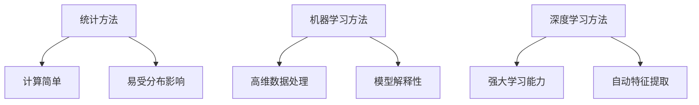
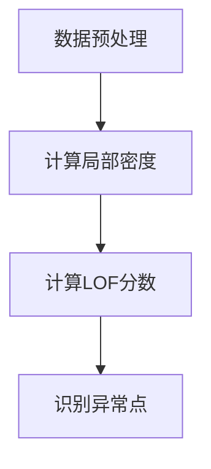
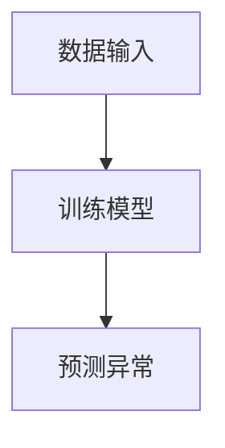
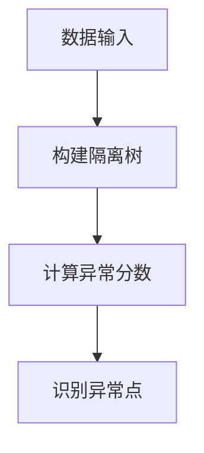
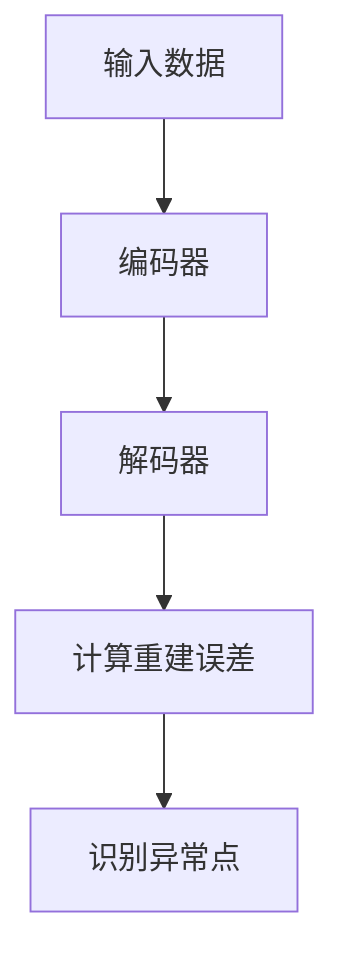
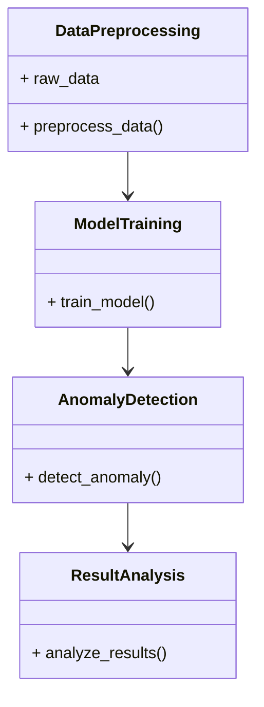
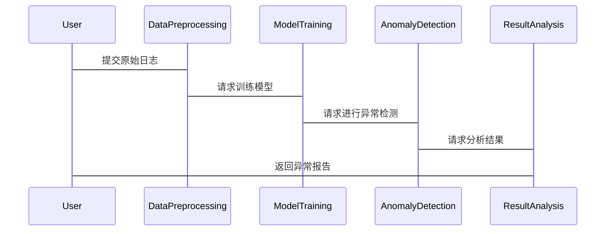

                 


# 如何识别企业的深度学习异常检测优势

> **关键词**：深度学习，异常检测，企业应用，技术优势，系统架构

> **摘要**：深度学习在异常检测中的应用为企业提供了强大的工具，能够识别传统方法难以发现的复杂模式。本文从背景介绍、核心概念、算法原理、系统架构到项目实战和最佳实践，全面解析深度学习异常检测的优势，帮助企业识别和利用这些优势。

---

## 第一部分：背景介绍

### 第1章：异常检测的基本概念

#### 1.1 问题背景

##### 1.1.1 企业数据安全的重要性

在当今数字化时代，企业收集和处理的数据量呈指数级增长。这些数据涵盖了业务运营的各个方面，包括交易记录、用户行为、系统日志等。数据的价值不仅在于其本身，更在于通过分析数据发现潜在的模式和洞察。然而，数据的安全性和完整性对于企业的生存至关重要。任何数据的异常或泄露都可能对企业造成重大损失，包括财务损失、声誉损害以及法律责任。

##### 1.1.2 异常检测的定义与目标

异常检测（Anomaly Detection）是指通过分析数据，识别出与预期模式或行为显著不同的数据点或事件。其目标是发现数据中的异常行为，这些异常可能是潜在的威胁、错误或机会。在企业中，异常检测广泛应用于欺诈检测、系统故障预警、用户行为分析等领域。

##### 1.1.3 异常检测的常见应用场景

- **欺诈检测**：在金融领域，异常检测用于识别 fraudulent transactions。
- **系统监控**：在IT运维中，异常检测用于发现系统故障或攻击行为。
- **用户行为分析**：在电子商务中，异常检测用于识别异常购买行为，防止滥用或欺诈。
- **医疗健康**：在医疗领域，异常检测用于识别患者的异常生理指标，辅助诊断。

#### 1.2 问题描述

##### 1.2.1 异常检测的核心挑战

- 数据稀疏性：异常事件通常比正常事件少，导致模型难以有效学习。
- 数据不平衡性：异常样本占比较小，可能导致模型偏向正常样本。
- 高维数据复杂性：企业数据通常是高维的，传统方法难以处理。
- 动态性：异常行为可能随时间变化，模型需要具备适应性。

##### 1.2.2 数据特征与异常的关联性

- 数据特征的分布直接影响异常检测的效果。
- 异常检测依赖于数据特征的显著变化，因此特征选择至关重要。

##### 1.2.3 异常检测的边界与外延

- 异常检测不仅仅是识别异常，还包括对异常进行分类和解释。
- 异常检测的外延包括异常原因的分析和应对策略的制定。

#### 1.3 问题解决

##### 1.3.1 异常检测的关键技术

- 统计方法：如3σ原则、Grubbs检验。
- 机器学习方法：如Isolation Forest、One-Class SVM。
- 深度学习方法：如Autoencoders、VAE。

##### 1.3.2 异常检测的核心要素组成

- 数据预处理：清洗、归一化、特征选择。
- 模型选择：根据场景选择合适的算法。
- 模型评估：使用合适指标如F1分数、ROC-AUC。

##### 1.3.3 异常检测的分类与方法

- 基于统计的方法。
- 基于机器学习的方法。
- 基于深度学习的方法。

---

## 第二部分：核心概念与联系

### 第2章：异常检测的核心概念原理

#### 2.1 异常检测的原理

##### 2.1.1 统计学方法

统计方法基于数据的分布特性，通过设定阈值来识别异常。例如，使用z-score或概率密度函数来判断数据点是否异常。

##### 2.1.2 机器学习方法

机器学习方法通过训练模型学习正常数据的分布，然后识别偏离该分布的数据点。常用算法包括Isolation Forest和One-Class SVM。

##### 2.1.3 深度学习方法

深度学习方法利用神经网络的强大表示能力，自动提取数据特征，适用于高维和复杂数据的异常检测。常用模型包括Autoencoders和VAE。

#### 2.2 异常检测方法的特征对比

##### 2.2.1 表格对比：统计方法 vs 机器学习方法 vs 深度学习方法

| 方法类型       | 优点                           | 缺点                               | 适用场景                     |
|----------------|--------------------------------|------------------------------------|------------------------------|
| 统计方法       | 计算简单，易于解释             | 易受数据分布影响，难以处理复杂场景 | 小数据集或低维数据           |
| 机器学习方法   | 可处理高维数据，模型解释性较好   | 对异常样本数量要求较高           | 中等规模数据                 |
| 深度学习方法   | 强大学习能力，自动特征提取       | 需大量数据训练，计算成本高         | 高维复杂数据                 |

##### 2.2.2 图形化展示：异常检测方法的特征对比



#### 2.3 ER实体关系图架构

```mermaid
erd
    customer
    transaction
    timestamp
    device
    location
    event_type
    action
    user_id
    risk_score
    is_anomaly
```

---

## 第三部分：算法原理讲解

### 第3章：异常检测算法的原理与实现

#### 3.1 统计学方法

##### 3.1.1 LOF算法

LOF（Local Outlier Factor）算法通过计算局部密度差异来识别异常点。其核心思想是，异常点的局部密度显著低于其周围区域的密度。

###### 使用mermaid流程图展示LOF算法的工作原理



###### LOF算法的数学模型

$$d(k) = \sum_{i=1}^{k} \frac{1}{\text{密度}(x_i)}$$

其中，密度表示数据点的局部密度。

##### 3.1.2 One-Class SVM

One-Class SVM用于单类分类，假设大部分数据属于一个类，异常点则属于另一个类。

###### 使用mermaid流程图展示One-Class SVM的工作原理



###### One-Class SVM的数学模型

$$\text{minimize} \frac{1}{2}\|w\|^2 + \frac{C}{\text{number of support vectors}} \sum_{i=1}^{\text{number of support vectors}} \xi_i$$

其中，w是法向量，C是惩罚参数，ξ是松弛变量。

---

### 第3章：异常检测算法的原理与实现（续）

#### 3.2 机器学习方法

##### 3.2.1 Isolation Forest

Isolation Forest是一种基于树结构的异常检测方法，通过构建隔离树将数据点隔离出来。

###### 使用mermaid流程图展示Isolation Forest的工作原理



#### 3.3 深度学习方法

##### 3.3.1 Autoencoders

Autoencoders是一种无监督学习模型，用于学习数据的低维表示，通过重建误差来识别异常点。

###### 使用mermaid流程图展示Autoencoders的工作原理



##### 3.3.2 VAE

VAE（Variational Autoencoders）是一种生成模型，通过最大化似然函数来识别异常点。

###### VAE的数学模型

$$\mathcal{L} = \mathbb{E}_{x,z}[\log p(x|z)] - \text{KL}(q(z|x) || p(z))$$

其中，L是损失函数，x是输入数据，z是潜在变量。

---

## 第四部分：系统分析与架构设计

### 第4章：系统分析与架构设计方案

#### 4.1 问题场景介绍

企业需要一个实时监控系统，能够自动检测系统日志中的异常行为，预防潜在的安全威胁。

#### 4.2 系统功能设计

##### 4.2.1 领域模型（mermaid 类图）



#### 4.3 系统架构设计

##### 4.3.1 系统架构（mermaid 架构图）

```mermaid
container Database {
    [存储原始日志]
}
container Preprocessing {
    [数据预处理]
}
container Model {
    [训练模型]
}
container Detection {
    [异常检测]
}
container Analysis {
    [结果分析]
}
Database --> Preprocessing
Preprocessing --> Model
Model --> Detection
Detection --> Analysis
```

#### 4.4 系统接口设计

- 数据接口：接收原始日志数据。
- 模型接口：提供训练好的模型。
- 检测接口：输出异常结果。

#### 4.5 系统交互流程（mermaid 序列图）



---

## 第五部分：项目实战

### 第5章：项目实战

#### 5.1 环境安装

- 安装Python、TensorFlow、Keras、Scikit-learn。

#### 5.2 核心代码实现

##### 5.2.1 数据预处理

```python
import pandas as pd
from sklearn.preprocessing import StandardScaler

data = pd.read_csv('logs.csv')
scaler = StandardScaler()
data_scaled = scaler.fit_transform(data)
```

##### 5.2.2 模型训练与检测

```python
from sklearn.ensemble import IsolationForest

model = IsolationForest(random_state=42)
model.fit(data_scaled)

# 预测异常
y_pred = model.predict(data_scaled)
outliers = data_scaled[y_pred == -1]
```

##### 5.2.3 结果分析

```python
from sklearn.metrics import classification_report

# 假设y_true为真实标签
print(classification_report(y_true, y_pred))
```

#### 5.3 代码应用解读与分析

- 数据预处理：标准化处理，确保模型输入的标准化。
- 模型选择：使用Isolation Forest进行异常检测，适用于小样本和高维数据。
- 结果分析：通过分类报告评估模型性能。

#### 5.4 实际案例分析和详细讲解剖析

以系统日志为例，通过训练好的模型检测异常登录行为，识别潜在的入侵行为。

#### 5.5 项目小结

通过项目实战，验证了Isolation Forest在异常检测中的有效性，同时展示了如何将理论应用于实际。

---

## 第六部分：最佳实践

### 第6章：最佳实践

#### 6.1 实践技巧

- 数据预处理：清洗、归一化、特征选择。
- 模型选择：根据数据特性选择合适的算法。
- 模型调优：调整参数，优化性能。
- 结果分析：解读结果，调整阈值。

#### 6.2 小结

深度学习在异常检测中具有显著优势，但需要根据场景选择合适的方法，并结合企业的实际需求进行优化。

#### 6.3 注意事项

- 数据隐私：确保数据处理符合隐私保护法规。
- 模型解释性：选择易于解释的模型，便于业务人员理解。
- 模型维护：定期更新模型，适应数据分布的变化。

#### 6.4 拓展阅读

- 《异常检测的挑战与解决方案》
- 《深度学习在网络安全中的应用》
- 《时间序列异常检测方法综述》

---

## 作者

**作者：AI天才研究院/AI Genius Institute & 禅与计算机程序设计艺术/Zen And The Art of Computer Programming**

---

通过本文的系统介绍，读者可以全面了解深度学习在企业异常检测中的优势，并掌握实际应用的方法。希望本文能为企业在异常检测领域的探索和实践提供有价值的参考和指导。

