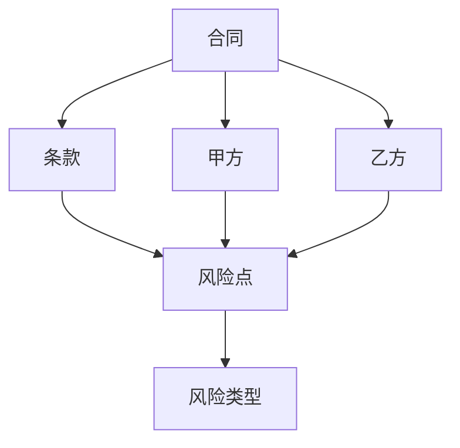
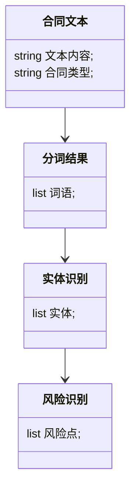
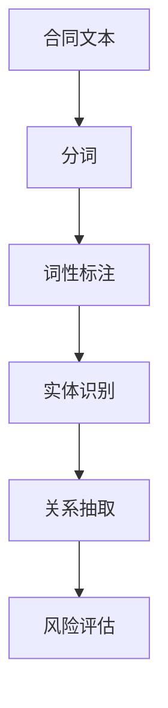
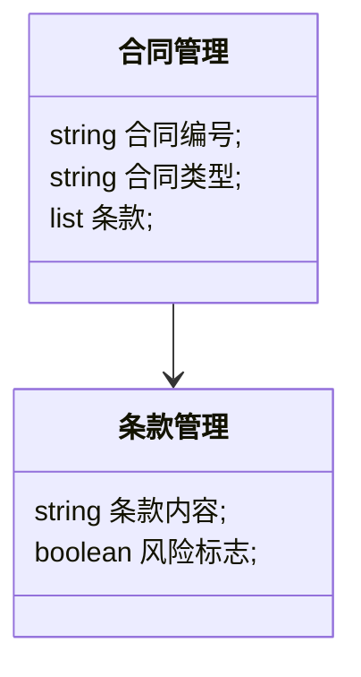
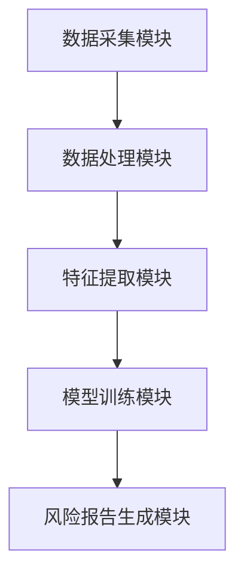

                 


# 构建基于NLP的金融合同风险识别系统

> 关键词：NLP, 金融合同, 风险识别, 自然语言处理, 机器学习, 合同分析, 风险管理

> 摘要：本文详细探讨了如何利用自然语言处理（NLP）技术构建一个高效的金融合同风险识别系统。文章从问题背景、核心概念、算法原理、系统架构设计到项目实战，全面解析了该系统的构建过程。通过分析合同文本的关键风险点，结合NLP技术，提出了一套完整的解决方案，并展示了实际应用中的案例分析。

---

# 第1章: 金融合同风险识别系统背景介绍

## 1.1 问题背景

### 1.1.1 金融合同风险识别的重要性  
金融合同是金融交易的核心依据，其内容涉及金额、期限、权利义务等关键条款。然而，合同文本通常复杂且冗长，人工审查效率低下且容易遗漏风险点。因此，构建一个自动化的金融合同风险识别系统具有重要意义。  

### 1.1.2 当前金融合同处理的痛点  
- **效率问题**：人工审查合同需要大量时间，且容易出错。  
- **风险遗漏**：合同中可能存在隐藏的风险条款，人工审查难以覆盖所有可能性。  
- **一致性问题**：不同合同的审查标准可能不一致，导致结果不统一。  

### 1.1.3 基于NLP的风险识别的优势  
自然语言处理技术能够从合同文本中提取关键信息，快速识别潜在风险，提高审查效率和准确性。  

## 1.2 问题描述

### 1.2.1 金融合同的主要类型  
- 贷款合同  
- 投资合同  
- 担保合同  
- 股权转让合同  

### 1.2.2 合同风险的主要来源  
- 合同条款的模糊性  
- 不合理的违约责任  
- 未明确的权利义务分配  

### 1.2.3 需要识别的关键风险点  
- 贷款利率是否过高  
- 是否存在担保责任免除条款  
- 是否存在无效条款  

## 1.3 问题解决思路

### 1.3.1 NLP技术在合同分析中的应用  
- 分词：将合同文本分割为词语。  
- 词性标注：识别词语的词性（名词、动词等）。  
- 实体识别：提取合同中的关键实体（如公司名称、金额等）。  
- 情感分析：判断合同条款的倾向性（如风险高或低）。  

### 1.3.2 风险识别的实现路径  
1. **数据预处理**：清洗合同文本，去除无关信息。  
2. **特征提取**：从合同中提取关键特征（如关键词、句法结构）。  
3. **模型训练**：利用机器学习算法（如SVM、随机森林）训练风险识别模型。  
4. **风险评估**：基于模型预测结果，生成风险报告。  

## 1.4 系统边界与外延

### 1.4.1 系统功能的边界  
- 仅处理中文合同文本。  
- 不支持图像识别功能。  

### 1.4.2 系统外延的考虑  
- 支持多种合同类型（如英文合同）。  
- 与外部数据库集成，获取更多背景信息。  

### 1.4.3 系统与外部系统的接口  
- 接收合同文本的输入接口。  
- 输出风险报告的接口。  

## 1.5 核心概念与组成

### 1.5.1 系统组成模块  
- 数据采集模块：获取合同文本。  
- 数据处理模块：清洗和分词。  
- 特征提取模块：提取关键特征。  
- 模型训练模块：训练风险识别模型。  
- 风险报告生成模块：输出风险报告。  

### 1.5.2 模块之间的关系  
- 数据采集模块 → 数据处理模块 → 特征提取模块 → 模型训练模块 → 风险报告生成模块。  

### 1.5.3 核心要素的定义与属性  
| 核心要素 | 定义 | 属性 |
|----------|------|------|
| 合同文本 | 待分析的合同内容 | 文本长度、关键词数量 |
| 风险点 | 可能导致损失的条款 | 风险等级、相关条款 |
| 实体 | 合同中的关键信息 | 类型（公司、金额）、位置 |

## 1.6 本章小结  
本章介绍了金融合同风险识别系统的背景、问题和解决思路，明确了系统的边界和核心组成。接下来的章节将深入探讨NLP技术在合同分析中的具体应用。

---

# 第2章: 基于NLP的核心概念与联系

## 2.1 NLP核心概念原理

### 2.1.1 自然语言处理的基本概念  
自然语言处理（NLP）是研究如何让计算机理解和生成人类语言的学科。其核心任务包括文本分类、实体识别、情感分析等。  

### 2.1.2 金融合同文本的特点  
- **专业性**：合同文本使用专业术语。  
- **结构化**：合同通常有固定的格式和条款。  
- **长文本**：合同文本通常较长。  

### 2.1.3 NLP在合同分析中的关键步骤  
1. **分词**：将合同文本分割为词语。  
2. **词性标注**：识别词语的词性。  
3. **实体识别**：提取合同中的关键实体。  
4. **关系抽取**：识别实体之间的关系。  
5. **风险评估**：基于实体和关系，评估风险。  

## 2.2 核心概念对比分析

### 2.2.1 NLP与传统文本处理的对比  
| 对比维度 | NLP | 传统文本处理 |
|----------|-----|---------------|
| 技术基础 | 统计学习、深度学习 | 基于规则 |
| 任务 | 文本分类、实体识别 | 字符统计、关键词提取 |
| 复杂度 | 高 | 低 |

### 2.2.2 金融合同文本与其他文本类型的对比  
| 对比维度 | 金融合同文本 | 普通新闻文本 |
|----------|---------------|---------------|
| 专业性 | 高 | 低 |
| 结构化 | 高 | 低 |
| 风险识别需求 | 高 | 低 |

### 2.2.3 不同NLP技术的优缺点对比  

| 技术 | 优点 | 缺点 |
|------|------|------|
| 词袋模型 | 简单高效 | 无法捕捉词序信息 |
| 词嵌入模型（如Word2Vec） | 能捕捉语义信息 | 需要大量数据 |
| 深度学习模型（如BERT） | 高精度 | 计算资源需求高 |

## 2.3 ER实体关系图  



## 2.4 领域模型类图  



## 2.5 本章小结  
本章详细介绍了NLP的核心概念及其在金融合同分析中的应用，通过对比分析和实体关系图展示了系统的逻辑结构。

---

# 第3章: 基于NLP的算法原理

## 3.1 算法原理概述

### 3.1.1 分词算法  
- 使用jieba分词工具对合同文本进行分词。  
- 示例代码：  
  ```python
  import jieba
  text = "借款合同双方应当遵循平等、自愿、诚实信用的原则"
  words = jieba.lcut(text)
  print(words)
  ```

### 3.1.2 词性标注  
- 使用NLTK库进行词性标注。  
- 示例代码：  
  ```python
  import nltk
  text = "借款合同双方应当遵循平等、自愿、诚实信用的原则"
  tokens = nltk.word_tokenize(text)
  tagged = nltk.pos_tag(tokens)
  print(tagged)
  ```

### 3.1.3 实体识别  
- 使用spaCy库进行实体识别。  
- 示例代码：  
  ```python
  import spacy
  nlp = spacy.load("zh_core_web_sm")
  text = nlp("借款人应当按期偿还贷款")
  for entity in text.ents:
      print(entity.text, entity.label_)
  ```

### 3.1.4 关系抽取  
- 使用依赖句法分析提取实体之间的关系。  
- 示例代码：  
  ```python
  doc = nlp("借款人应当按期偿还贷款")
  for token in doc:
      if token.dep_ == "ROOT":
          print(token.text)
  ```

## 3.2 数学模型与公式

### 3.2.1 词袋模型  
- 词袋模型将文本表示为词的集合。  
- 示例公式：  
  $$ f(word) = 1 \text{ 如果词出现在文本中，否则 } 0 $$  

### 3.2.2 词嵌入模型（如Word2Vec）  
- Word2Vec通过上下文预测词义。  
- 示例公式：  
  $$ P(word_i | context) = \frac{1}{1 + e^{-x_i}} $$  

### 3.2.3 深度学习模型（如BERT）  
- BERT通过微调任务生成上下文相关的词表示。  
- 示例公式：  
  $$ H = f(x, y) $$  

## 3.3 算法流程图  



## 3.4 本章小结  
本章详细讲解了NLP算法在金融合同风险识别中的应用，包括分词、词性标注、实体识别和关系抽取等步骤。

---

# 第4章: 金融合同风险识别系统分析与架构设计

## 4.1 系统分析

### 4.1.1 问题场景介绍  
金融合同风险识别系统需要处理多种合同类型，识别潜在风险点，并生成风险报告。  

### 4.1.2 项目介绍  
- 项目目标：构建一个高效、准确的金融合同风险识别系统。  
- 项目范围：支持多种合同类型，识别关键风险点。  

## 4.2 系统功能设计

### 4.2.1 领域模型  


### 4.2.2 功能模块  
- 数据采集模块：接收合同文本。  
- 数据处理模块：清洗和分词。  
- 特征提取模块：提取关键特征。  
- 模型训练模块：训练风险识别模型。  
- 风险报告生成模块：输出风险报告。  

## 4.3 系统架构设计

### 4.3.1 系统架构图  


### 4.3.2 技术选型  
- 前端：React  
- 后端：Flask  
- NLP库：spaCy、jieba  

## 4.4 系统接口设计

### 4.4.1 API接口  
- 接收合同文本的接口：`POST /api/upload`  
- 输出风险报告的接口：`GET /api/report`  

### 4.4.2 接口交互流程  
1. 用户上传合同文本。  
2. 系统调用数据处理模块清洗文本。  
3. 特征提取模块提取关键特征。  
4. 模型训练模块生成风险报告。  
5. 用户获取风险报告。  

## 4.5 系统交互流程图  

```mermaid
sequenceDiagram
参与者 用户
系统 后端系统
用户 -> 系统: 上传合同文本
系统 -> 用户: 返回风险报告
```

## 4.6 本章小结  
本章从系统分析到架构设计，详细介绍了金融合同风险识别系统的构建过程，明确了各模块的功能和接口设计。

---

# 第5章: 项目实战

## 5.1 环境安装

### 5.1.1 安装Python环境  
- 安装Python 3.8以上版本。  

### 5.1.2 安装NLP库  
- 使用pip安装：  
  ```bash
  pip install spacy jieba nltk
  ```

### 5.1.3 安装开发框架  
- 使用pip安装Flask：  
  ```bash
  pip install flask
  ```

## 5.2 核心代码实现

### 5.2.1 数据处理模块  
```python
import jieba

def preprocess(text):
    words = jieba.lcut(text)
    return words
```

### 5.2.2 风险识别模块  
```python
import spacy

nlp = spacy.load("zh_core_web_sm")

def identify_risk(text):
    doc = nlp(text)
    risks = []
    for token in doc.ents:
        if token.label_ == "RISK":
            risks.append(token.text)
    return risks
```

### 5.2.3 模型训练模块  
```python
from sklearn.feature_extraction.text import TfidfVectorizer
from sklearn.svm import SVC

vectorizer = TfidfVectorizer()
model = SVC()
```

## 5.3 代码应用解读与分析

### 5.3.1 数据处理模块  
- 使用jieba对合同文本进行分词，提取关键词。  

### 5.3.2 风险识别模块  
- 使用spaCy进行实体识别，提取风险相关实体。  

### 5.3.3 模型训练模块  
- 使用TF-IDF提取特征，训练SVM模型进行风险分类。  

## 5.4 实际案例分析

### 5.4.1 案例背景  
分析一份贷款合同，识别是否存在高风险条款。  

### 5.4.2 案例处理过程  
1. 分词：提取关键词如“贷款”、“违约”。  
2. 实体识别：识别“借款人”、“贷款金额”。  
3. 风险评估：判断是否存在高风险条款（如“逾期利息过高”）。  

## 5.5 项目总结

### 5.5.1 项目成果  
成功构建了一个金融合同风险识别系统，能够准确识别合同中的潜在风险点。  

### 5.5.2 经验与教训  
- 数据质量对模型性能影响较大。  
- 实体识别需要结合领域知识。  

## 5.6 本章小结  
本章通过实际案例展示了系统的构建过程，验证了系统的可行性和有效性。

---

# 第6章: 最佳实践、小结与拓展阅读

## 6.1 最佳实践

### 6.1.1 数据处理  
- 确保数据的完整性和准确性。  
- 对文本进行清洗和标准化处理。  

### 6.1.2 模型选择  
- 根据任务需求选择合适的模型（如SVM、随机森林）。  

### 6.1.3 系统优化  
- 使用缓存机制提高系统性能。  
- 结合领域知识优化实体识别模型。  

## 6.2 小结  
本文详细介绍了如何利用NLP技术构建金融合同风险识别系统，从问题背景、核心概念、算法原理到系统设计和项目实战，全面解析了系统的构建过程。  

## 6.3 注意事项  
- 确保系统的可扩展性。  
- 注意数据隐私和安全问题。  

## 6.4 拓展阅读  
- 《自然语言处理入门》  
- 《金融合同分析与风险评估》  
- 《深度学习在NLP中的应用》  

## 6.5 本章小结  
本章总结了全文内容，并给出了实际应用中的注意事项和拓展阅读的方向。

---

# 作者：AI天才研究院/AI Genius Institute & 禅与计算机程序设计艺术 /Zen And The Art of Computer Programming

