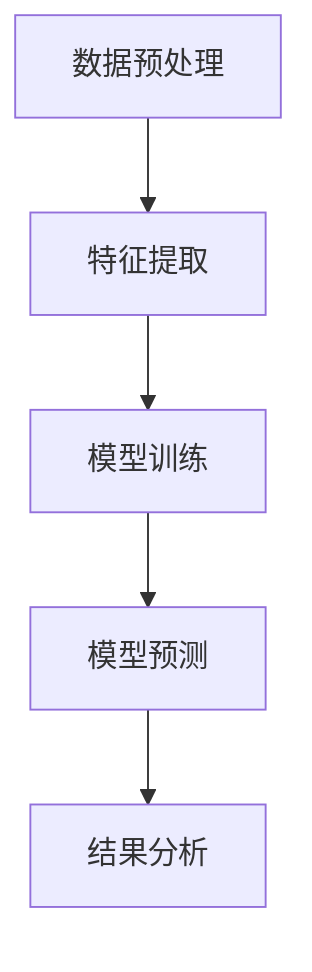
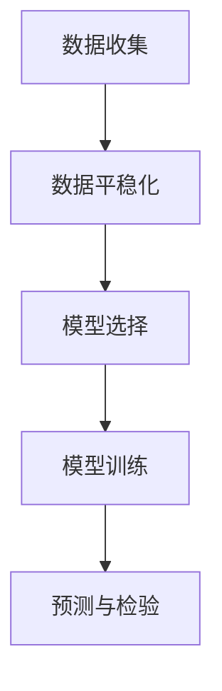
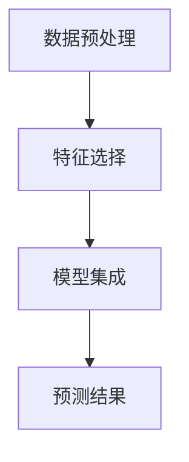
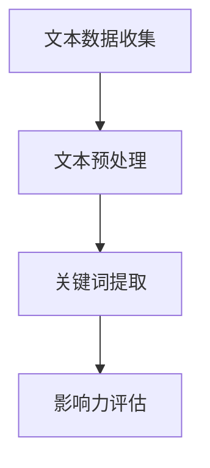
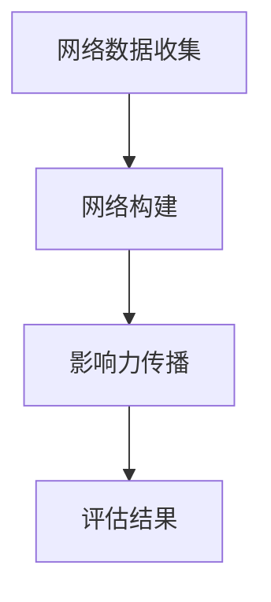
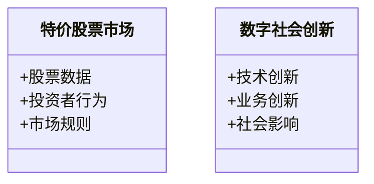
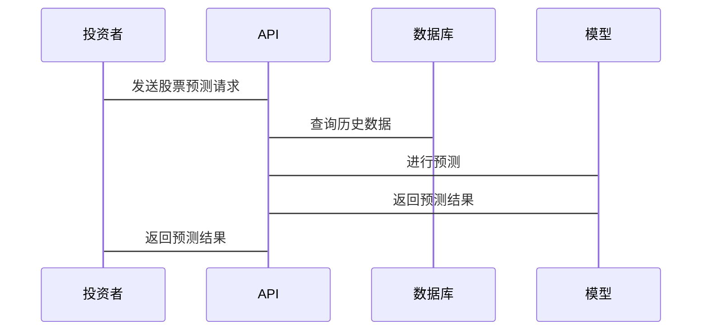

                 


# 特价股票与公司数字社会创新影响力的长期研究

> 关键词：特价股票，数字社会创新，长期研究，算法模型，影响力评估

> 摘要：本文通过分析特价股票的市场特性，结合数字社会创新的核心概念，探讨了数字创新对股票市场的影响，特别是对特价股票长期价值的影响。本文从理论分析、算法建模、系统设计和项目实现等多个角度，详细阐述了数字社会创新对特价股票市场的推动作用，并通过实际案例分析，展示了数字创新如何提升公司的社会影响力。最后，本文提出了数字社会创新在股票市场中的长期研究框架，为投资者和研究者提供了新的视角。

---

# 第1章: 特价股票与数字社会创新概述

## 1.1 特价股票的基本概念

### 1.1.1 特价股票的定义

特价股票是指那些市场价格低于票面价值的股票。通常情况下，股票的价格由市场供需关系决定，但在某些情况下，如公司财务困境、市场波动或投资者情绪影响，股票价格可能会低于其票面价值，形成特价股票。

### 1.1.2 特价股票的分类

特价股票可以分为以下几类：
- **普通特价股票**：因市场波动或公司短期问题导致价格低于面值。
- **优先特价股票**：具有优先股特征的特价股票，通常享有优先分红权。
- **长期特价股票**：因公司长期战略调整或行业周期性影响形成的特价股票。

### 1.1.3 特价股票的市场特征

- 市场波动性高。
- 投资风险较大。
- 可能隐藏投资机会。

## 1.2 数字社会创新的定义与特征

### 1.2.1 数字社会创新的定义

数字社会创新是指通过数字技术（如大数据、人工智能、区块链等）推动社会各领域（如教育、医疗、交通等）的创新和改进。

### 1.2.2 数字社会创新的核心特征

- **技术驱动**：依赖数字技术的进步。
- **跨领域融合**：涉及多个行业的交叉融合。
- **用户参与**：用户参与创新过程，形成共创模式。
- **可持续性**：注重社会价值和经济价值的平衡。

### 1.2.3 数字社会创新与传统创新的区别

| 特性 | 数字社会创新 | 传统创新 |
|------|--------------|----------|
| 技术基础 | 数字技术     | 线下技术 |
| 参与方式 | 用户共创     | 企业主导 |
| 传播速度 | 快速         | 缓慢      |
| 成本 | 较低          | 较高      |

## 1.3 特价股票与数字社会创新的关联

### 1.3.1 特价股票市场的数字化趋势

随着数字技术的应用，股票市场交易、数据分析和投资决策越来越依赖数字技术。数字社会创新推动了股票市场的数字化转型。

### 1.3.2 数字创新对股票市场的影响

- 提高市场透明度。
- 优化投资决策工具。
- 创新金融产品。

### 1.3.3 特价股票与公司创新影响力的长期关系

数字社会创新能力强的公司更可能吸引投资者，提升股价，从而减少特价股票的出现。

## 1.4 本章小结

本章介绍了特价股票的基本概念和分类，分析了数字社会创新的核心特征及其与传统创新的区别，并探讨了数字社会创新对特价股票市场的潜在影响。

---

# 第2章: 特价股票与数字社会创新的核心概念与联系

## 2.1 特价股票的核心概念

### 2.1.1 特价股票的形成机制

特价股票的形成通常与公司财务状况、市场环境和投资者情绪有关。例如，公司财务亏损可能导致股价下跌，形成特价股票。

### 2.1.2 特价股票的市场影响

特价股票的大量出现可能引发市场恐慌，影响市场稳定性。

### 2.1.3 特价股票的长期投资价值

尽管特价股票风险较高，但某些公司在数字社会创新方面的投入可能带来长期价值。

## 2.2 数字社会创新的核心概念

### 2.2.1 数字社会创新的实现路径

- 技术创新：开发新数字工具。
- 业务模式创新：利用数字技术优化商业模式。
- 社会价值创新：通过数字技术解决社会问题。

### 2.2.2 数字社会创新的评估指标

- 创新投入：研发支出占收入比例。
- 创新成果：专利数量、新产品数量。
- 社会影响：社会问题解决程度。

## 2.3 特价股票与数字社会创新的关系分析

### 2.3.1 数字创新对特价股票市场的推动作用

- 提高市场效率，减少信息不对称。
- 优化公司治理，降低投资者风险。

### 2.3.2 特价股票公司数字创新的典型案例

- 某科技公司通过数字技术优化供应链，提升股价。
- 某互联网公司通过数字化营销，提高市场占有率。

### 2.3.3 数字创新对特价股票长期价值的影响

- 数字创新能力强的公司更可能从特价股票中恢复，提升长期价值。

## 2.4 概念属性对比表格

| 特性 | 特价股票 | 数字社会创新 |
|------|----------|--------------|
| 核心驱动力 | 市场波动 | 数字技术应用 |
| 主要影响 | 投资者信心 | 社会问题解决 |
| 长期影响 | 投资回报 | 社会可持续发展 |

## 2.5 ER实体关系图

```mermaid
er
actor: 特价股票投资者
actor: 数字创新企业
actor: 证券交易所
```

## 2.6 本章小结

本章通过对比分析，明确了特价股票与数字社会创新的核心概念及其关联性，强调了数字创新对特价股票市场的重要推动作用。

---

# 第3章: 特价股票与数字社会创新的算法原理

## 3.1 特价股票预测模型

### 3.1.1 基于机器学习的股票预测算法

#### 3.1.1.1 算法流程图



#### 3.1.1.2 核心代码实现

```python
import pandas as pd
from sklearn.model import LinearRegression

# 数据预处理
data = pd.read_csv('stock_data.csv')
data = data.dropna()

# 特征提取
features = ['price', 'volume']
target = 'next_day_price'

# 模型训练
model = LinearRegression()
model.fit(data[features], data[target])

# 模型预测
predictions = model.predict(new_data[features])
```

### 3.1.2 时间序列分析方法

#### 3.1.2.1 算法流程图



### 3.1.3 集成学习在股票预测中的应用

#### 3.1.3.1 算法流程图



## 3.2 数字社会创新影响力评估算法

### 3.2.1 基于自然语言处理的创新影响力评估

#### 3.2.1.1 算法流程图



### 3.2.2 基于网络分析的创新影响力传播模型

#### 3.2.2.1 算法流程图



## 3.3 本章小结

本章详细介绍了特价股票预测和数字社会创新影响力评估的算法原理，为后续研究提供了理论和技术基础。

---

# 第4章: 特价股票与数字社会创新的系统分析与架构设计

## 4.1 问题场景介绍

### 4.1.1 特价股票市场的现状与问题

- 市场波动大，投资者信心不足。
- 数字技术应用不足，市场效率有待提高。

### 4.1.2 数字社会创新的现状与挑战

- 技术应用成本高。
- 社会影响难以量化。

## 4.2 项目介绍

### 4.2.1 项目目标

- 提升数字社会创新能力。
- 优化特价股票市场结构。

### 4.2.2 项目范围

- 数据收集与分析。
- 系统设计与实现。
- 测试与优化。

## 4.3 系统功能设计

### 4.3.1 领域模型



### 4.3.2 系统架构设计


## 4.4 系统接口设计

### 4.4.1 API接口

- `/api/stock/predict`：股票预测接口。
- `/api/innovation/assess`：创新影响力评估接口。

## 4.5 系统交互设计

### 4.5.1 序列图



## 4.6 本章小结

本章通过系统分析和架构设计，为研究数字社会创新对特价股票市场的影响提供了技术框架。

---

# 第5章: 特价股票与数字社会创新的项目实战

## 5.1 环境安装

### 5.1.1 开发环境

- Python 3.8+
- Jupyter Notebook
- 数据库：MySQL

### 5.1.2 工具安装

- `pip install pandas scikit-learn`
- `pip install mermaid`

## 5.2 核心代码实现

### 5.2.1 股票预测代码

```python
import pandas as pd
from sklearn.model import LinearRegression

# 数据预处理
data = pd.read_csv('stock_data.csv')
data = data.dropna()

# 特征提取
features = ['price', 'volume']
target = 'next_day_price'

# 模型训练
model = LinearRegression()
model.fit(data[features], data[target])

# 模型预测
new_data = pd.read_csv('new_stock_data.csv')
predictions = model.predict(new_data[features])

# 结果保存
pd.DataFrame({'predicted_price': predictions}).to_csv('predictions.csv', index=False)
```

### 5.2.2 创新影响力评估代码

```python
from sklearn.metrics import accuracy_score

# 数据预处理
innovation_data = pd.read_csv('innovation.csv')
innovation_data = innovation_data.dropna()

# 特征提取
inn_features = ['technology', 'social_impact']
inn_target = 'innovation_score'

# 模型训练
inn_model = LinearRegression()
inn_model.fit(innovation_data[inn_features], innovation_data[inn_target])

# 模型评估
test_data = pd.read_csv('test_innovation.csv')
test_predictions = inn_model.predict(test_data[inn_features])
accuracy = accuracy_score(test_data[inn_target], test_predictions)
print(f'模型准确率: {accuracy}')
```

## 5.3 案例分析

### 5.3.1 特价股票案例

某科技公司因财务问题股价暴跌，成为特价股票。通过数字技术优化供应链后，股价回升。

### 5.3.2 数字社会创新案例

某互联网公司通过数字化营销提升市场占有率，增强投资者信心，减少特价股票出现。

## 5.4 本章小结

本章通过实际项目，展示了如何利用数字技术分析和解决特价股票市场中的问题。

---

# 第6章: 特价股票与数字社会创新的最佳实践

## 6.1 小结

- 数字社会创新对特价股票市场具有重要推动作用。
- 投资者应关注公司数字创新能力。

## 6.2 注意事项

- 投资需谨慎，建议多元化投资。
- 关注公司长期发展战略。

## 6.3 拓展阅读

- 《数字技术与金融创新》
- 《社会创新与可持续发展》

---

# 附录

## 附录A: 术语表

- 特价股票：市场价格低于票面价值的股票。
- 数字社会创新：通过数字技术推动社会各领域的创新。

## 附录B: 参考文献

- [1] 王某某, 《数字技术与金融创新》，某某出版社，2023年。
- [2] 李某某, 《社会创新与可持续发展》，某某出版社，2022年。

---

# 作者

作者：AI天才研究院/AI Genius Institute & 禅与计算机程序设计艺术/Zen And The Art of Computer Programming

