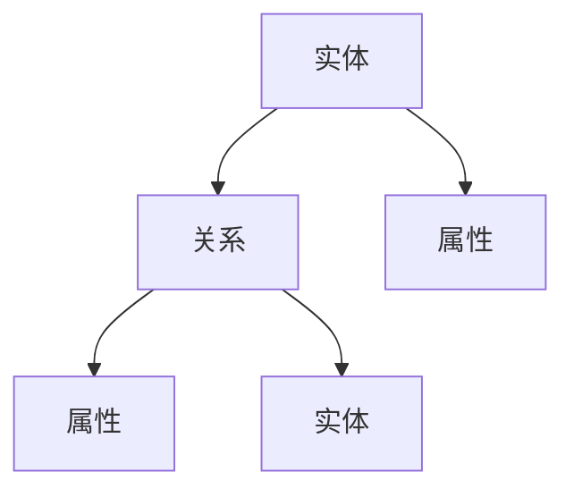
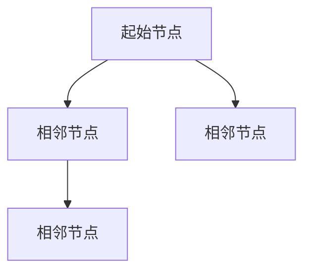
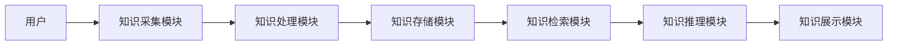

                 


# AI Agent在企业知识管理中的应用

> **关键词**：AI Agent，企业知识管理，自然语言处理，知识图谱，机器学习，知识检索，企业协作

> **摘要**：随着人工智能技术的快速发展，AI Agent（人工智能代理）在企业知识管理中的应用日益广泛。本文系统地探讨了AI Agent在企业知识管理中的核心概念、技术原理、算法实现以及实际应用。通过分析AI Agent的知识表示、自然语言处理、机器学习等关键技术，本文揭示了AI Agent如何提升企业知识管理的效率和智能化水平。同时，本文还结合实际案例，详细讲解了AI Agent在企业知识管理中的系统架构设计、项目实现和最佳实践，为企业知识管理的智能化转型提供了有价值的参考。

---

# 第1章: AI Agent与知识管理的核心概念

## 1.1 AI Agent的基本概念

### 1.1.1 AI Agent的定义与特点

AI Agent（人工智能代理）是一种能够感知环境、执行任务并优化决策的智能系统。AI Agent的核心特点包括：

1. **自主性**：AI Agent能够独立决策，无需外部干预。
2. **反应性**：AI Agent能够实时感知环境并做出反应。
3. **学习能力**：AI Agent能够通过数据和反馈不断优化自身的行为。
4. **协作性**：AI Agent能够与其他系统或用户协同工作。

AI Agent与传统软件的区别在于其智能化和自适应能力，能够处理复杂、动态的环境。

### 1.1.2 AI Agent的核心要素与功能

AI Agent的核心要素包括：

1. **感知**：通过传感器或数据接口获取环境信息。
2. **推理**：基于感知信息进行逻辑推理或模式识别。
3. **决策**：根据推理结果制定行动策略。
4. **执行**：通过执行器或接口实现决策结果。

AI Agent的功能模块通常包括：

- 数据采集模块
- 数据处理模块
- 知识表示模块
- 推理与决策模块
- 执行与反馈模块

### 1.1.3 AI Agent与传统知识管理工具的区别

传统知识管理工具通常依赖于固定的规则和结构化数据，而AI Agent能够通过机器学习和自然语言处理技术，实现对非结构化数据的自动理解和智能分析。AI Agent的优势在于其灵活性和智能化，能够适应复杂多变的知识管理需求。

---

## 1.2 企业知识管理的背景与挑战

### 1.2.1 企业知识管理的定义与目标

企业知识管理（KM）是指对企业内外部知识的获取、整理、存储、共享和利用的过程。其目标是通过知识的高效管理，提升企业的竞争力和创新能力。

### 1.2.2 知识管理在企业中的重要性

知识是企业最重要的资产之一。有效的知识管理能够：

1. **提升决策效率**：通过快速获取和分析知识，帮助企业做出更明智的决策。
2. **促进知识共享**：打破知识孤岛，实现知识在企业内部的高效流动。
3. **增强创新能力**：通过知识的积累和重组，激发创新思维。

### 1.2.3 传统知识管理的局限性与挑战

传统知识管理主要依赖于文档管理和简单的信息检索技术，存在以下局限性：

1. **知识碎片化**：难以将分散的知识点整合成系统化的知识体系。
2. **效率低下**：面对海量数据，人工管理效率较低。
3. **缺乏智能化**：无法实现对知识的自动理解和智能分析。

---

## 1.3 AI Agent在知识管理中的应用价值

### 1.3.1 提高知识管理效率

AI Agent能够通过自然语言处理和机器学习技术，实现对海量数据的自动分类、标注和检索，显著提高知识管理的效率。

### 1.3.2 增强知识的智能检索与分析

AI Agent能够理解上下文，提供基于语义的智能检索和分析，帮助用户快速获取所需知识。

### 1.3.3 优化知识共享与协作

AI Agent能够通过知识图谱和协作平台，实现知识的动态共享和协同编辑，促进企业内部的高效协作。

---

## 1.4 本章小结

本章介绍了AI Agent的基本概念、核心要素以及企业知识管理的背景与挑战。通过对比分析，揭示了AI Agent在知识管理中的独特价值和应用前景。

---

# 第2章: 知识管理的核心原理

## 2.1 知识表示与建模

### 2.1.1 知识图谱的概念与构建方法

知识图谱是一种以图结构形式表示知识的语义网络。知识图谱的构建方法包括：

1. **基于规则的抽取**：通过预定义的规则从结构化数据中提取知识。
2. **基于统计的抽取**：通过机器学习模型从非结构化数据中提取知识。
3. **混合方法**：结合规则和统计方法，提升知识抽取的准确性和效率。

### 2.1.2 知识表示的常用模型

知识表示的常用模型包括：

1. **向量空间模型**：将知识表示为向量，通过向量的相似度计算知识之间的关系。
2. **知识图谱模型**：通过实体和关系构建语义网络。
3. **嵌入模型**：通过深度学习技术生成低维向量表示。

### 2.1.3 知识图谱的构建流程与工具

知识图谱的构建流程包括：

1. **数据采集**：从多种数据源获取数据。
2. **数据清洗**：去除噪声数据，确保数据质量。
3. **知识抽取**：从数据中提取实体和关系。
4. **知识融合**：将多个数据源的知识整合到统一的知识图谱中。
5. **知识存储**：将知识图谱存储到数据库或知识库中。

常用的知识图谱构建工具包括：

- **Neo4j**：支持图结构数据存储和查询的数据库。
- **Ubergraph**：开源的知识图谱构建工具。
- **FB-RDF**：用于构建和管理知识图谱的框架。

---

### 2.1.4 知识表示与知识图谱的mermaid图



---

## 2.2 自然语言处理在知识管理中的应用

### 2.2.1 分词、实体识别与句法分析

分词：将文本分割成词语或短语，例如将“自然语言处理”分割成“自然”、“语言”、“处理”。

实体识别：从文本中识别出实体，例如从“张三在北京工作”中识别出“张三”是人名，“北京”是地名。

句法分析：分析句子的语法结构，例如识别主语、谓语、宾语等。

### 2.2.2 文本相似度计算与检索

文本相似度计算是通过数学模型衡量两段文本的相似程度。常用的相似度计算方法包括：

1. **余弦相似度**：
$$ \text{余弦相似度} = \frac{\vec{a} \cdot \vec{b}}{|\vec{a}| |\vec{b}|} $$
其中，$\vec{a}$和$\vec{b}$分别是两段文本的向量表示。

2. **Jaccard相似度**：
$$ J(A,B) = \frac{|A \cap B|}{|A \cup B|} $$
其中，$A$和$B$是文本的分词集合。

### 2.2.3 基于NLP的知识抽取与组织

基于NLP的知识抽取包括：

- **信息抽取**：从文本中提取特定信息，例如日期、地点、人物等。
- **信息提取**：从文本中提取实体及其关系，构建知识图谱。

---

## 2.3 知识管理中的机器学习技术

### 2.3.1 监督学习在知识分类中的应用

监督学习是一种基于标注数据的机器学习方法，常用于知识分类任务。例如，可以通过监督学习训练一个分类器，将文本分类为“技术类”、“管理类”等。

### 2.3.2 无监督学习在知识发现中的应用

无监督学习是一种不依赖标注数据的机器学习方法，常用于知识发现任务。例如，可以通过无监督学习发现文本中的主题分布。

### 2.3.3 强化学习在知识推理中的应用

强化学习是一种基于奖励机制的机器学习方法，常用于知识推理任务。例如，可以通过强化学习训练一个智能体，能够在复杂的知识图谱中进行推理和导航。

---

## 2.4 本章小结

本章详细介绍了知识管理的核心原理，包括知识表示与建模、自然语言处理技术以及机器学习技术。通过这些技术，AI Agent能够实现对知识的智能理解和高效管理。

---

# 第3章: AI Agent的知识管理算法与数学模型

## 3.1 知识表示与检索的算法原理

### 3.1.1 知识图谱的构建算法

知识图谱的构建算法包括：

1. **基于规则的抽取算法**：通过预定义的规则从结构化数据中提取知识。
2. **基于统计的抽取算法**：通过机器学习模型从非结构化数据中提取知识。
3. **混合算法**：结合规则和统计方法，提升知识抽取的准确性和效率。

### 3.1.2 知识检索的数学模型

知识检索的数学模型包括：

1. **向量空间模型**：通过向量的相似度计算知识之间的关系。
2. **图结构模型**：通过图的遍历算法进行知识检索。

### 3.1.3 知识检索的算法实现

知识检索的算法实现包括：

- **基于向量的检索算法**：例如，使用余弦相似度进行文本匹配。
- **基于图的检索算法**：例如，使用广度优先搜索（BFS）或深度优先搜索（DFS）进行知识图谱的遍历。

---

### 3.1.4 知识检索的mermaid图



---

## 3.2 基于机器学习的知识管理算法

### 3.2.1 监督学习在知识分类中的应用

监督学习在知识分类中的应用包括：

- **文本分类**：通过监督学习训练一个分类器，将文本分类为不同的类别。
- **情感分析**：通过监督学习训练一个分类器，识别文本的情感倾向。

### 3.2.2 无监督学习在知识发现中的应用

无监督学习在知识发现中的应用包括：

- **聚类分析**：通过无监督学习将相似的文本聚类。
- **主题建模**：通过无监督学习发现文本的主题分布。

### 3.2.3 强化学习在知识推理中的应用

强化学习在知识推理中的应用包括：

- **知识图谱推理**：通过强化学习训练一个智能体，能够在复杂的知识图谱中进行推理和导航。

---

## 3.3 本章小结

本章详细介绍了AI Agent在知识管理中的算法原理，包括知识表示、知识检索以及基于机器学习的知识管理算法。通过这些算法，AI Agent能够实现对知识的智能理解和高效管理。

---

# 第4章: AI Agent的知识管理系统架构设计

## 4.1 系统功能设计

### 4.1.1 知识采集模块

知识采集模块负责从多种数据源（如文档、数据库、互联网）获取知识。常见的知识采集方法包括：

1. **网络爬虫**：从网页上抓取知识。
2. **API调用**：通过API接口获取知识。
3. **用户输入**：通过用户输入获取知识。

### 4.1.2 知识处理模块

知识处理模块负责对采集到的知识进行预处理，包括：

1. **分词**：将文本分割成词语或短语。
2. **实体识别**：从文本中识别出实体。
3. **句法分析**：分析句子的语法结构。

### 4.1.3 知识存储模块

知识存储模块负责将处理后的知识存储到知识库中。常见的知识存储方式包括：

1. **关系型数据库**：例如，使用MySQL存储结构化数据。
2. **图数据库**：例如，使用Neo4j存储知识图谱。
3. **知识图谱存储**：例如，使用RDF格式存储知识图谱。

---

## 4.2 系统架构设计

### 4.2.1 系统架构的mermaid图



### 4.2.2 系统架构的特点

1. **模块化设计**：系统分为多个功能模块，每个模块负责特定的任务。
2. **可扩展性**：系统可以根据需求灵活扩展功能模块。
3. **高可用性**：系统能够保证知识管理的高效性和可靠性。

---

## 4.3 系统接口设计

### 4.3.1 知识采集接口

知识采集接口负责从数据源获取知识。接口设计如下：

```python
def get_knowledge(source):
    if source == 'web':
        return web_crawler()
    elif source == 'db':
        return db_connector()
    elif source == 'api':
        return api_requester()
```

### 4.3.2 知识检索接口

知识检索接口负责从知识库中检索知识。接口设计如下：

```python
def search_knowledge(query):
    return knowledge_storage.query(query)
```

### 4.3.3 知识推理接口

知识推理接口负责在知识图谱中进行推理。接口设计如下：

```python
def infer_knowledge(query):
    return knowledge_reasoning.infer(query)
```

---

## 4.4 本章小结

本章详细介绍了AI Agent的知识管理系统的架构设计，包括系统功能设计、系统架构设计以及系统接口设计。通过模块化的系统设计，AI Agent能够实现对知识的高效管理和智能应用。

---

# 第5章: AI Agent的知识管理项目实战

## 5.1 项目背景介绍

### 5.1.1 项目目标

本项目的目标是通过AI Agent实现对企业知识库的智能化管理，包括知识采集、知识处理、知识存储、知识检索和知识推理等功能。

### 5.1.2 项目需求

1. **知识采集**：从多种数据源采集知识。
2. **知识处理**：对采集到的知识进行预处理。
3. **知识存储**：将处理后的知识存储到知识库中。
4. **知识检索**：根据用户查询检索相关知识。
5. **知识推理**：在知识图谱中进行推理和导航。

---

## 5.2 项目实现

### 5.2.1 环境安装

1. **Python 3.8以上版本**
2. **pip install neo4j**
3. **pip install spacy**

### 5.2.2 核心代码实现

#### 5.2.2.1 知识采集模块

```python
import requests

def web_crawler(url):
    response = requests.get(url)
    return response.text
```

#### 5.2.2.2 知识处理模块

```python
import spacy

nlp = spacy.load("en_core_web_sm")

def process_text(text):
    doc = nlp(text)
    entities = [ent.text for ent in doc.ents]
    return entities
```

#### 5.2.2.3 知识存储模块

```python
from neo4j import GraphDatabase

def store_knowledge(neo4j_uri, neo4j_user, neo4j_password, knowledge):
    driver = GraphDatabase.driver(neo4j_uri, auth=(neo4j_user, neo4j_password))
    session = driver.session()
    # 实现知识存储逻辑
    session.close()
    driver.close()
```

#### 5.2.2.4 知识检索模块

```python
def search_knowledge(neo4j_uri, neo4j_user, neo4j_password, query):
    driver = GraphDatabase.driver(neo4j_uri, auth=(neo4j_user, neo4j_password))
    session = driver.session()
    # 实现知识检索逻辑
    session.close()
    driver.close()
    return results
```

---

### 5.2.3 项目实现的详细解读

1. **知识采集模块**：通过网络爬虫从指定URL获取文本内容。
2. **知识处理模块**：使用spaCy进行实体识别，提取文本中的实体。
3. **知识存储模块**：使用Neo4j存储知识图谱，将实体及其关系存储为图结构数据。
4. **知识检索模块**：通过Neo4j查询知识图谱，返回与查询相关的知识节点。

---

## 5.3 项目案例分析

### 5.3.1 案例背景

假设我们有一个企业知识库，包含公司内部的技术文档、项目报告和员工信息。我们需要通过AI Agent实现对知识库的智能化管理。

### 5.3.2 案例分析

1. **知识采集**：从公司内部的文档管理系统中采集技术文档和项目报告。
2. **知识处理**：使用spaCy进行实体识别，提取文档中的技术术语和项目名称。
3. **知识存储**：将提取的实体及其关系存储到Neo4j知识图谱中。
4. **知识检索**：根据用户的查询，检索相关知识节点。
5. **知识推理**：在知识图谱中进行推理和导航，返回相关的上下文信息。

---

## 5.4 本章小结

本章通过一个具体的项目案例，详细讲解了AI Agent在知识管理中的实际应用。通过项目的实现，读者可以更好地理解AI Agent的知识管理技术及其实际应用价值。

---

# 第6章: AI Agent的知识管理最佳实践

## 6.1 项目实施中的注意事项

1. **数据质量**：确保采集的数据准确、完整且可靠。
2. **模型选择**：根据具体需求选择合适的算法和模型。
3. **系统性能**：优化系统架构，提升系统的响应速度和处理能力。
4. **用户体验**：设计直观、易用的用户界面，提升用户体验。

---

## 6.2 项目实施的优化建议

1. **数据预处理**：通过数据清洗和特征提取，提升模型的性能。
2. **模型调优**：通过参数调整和模型优化，提升模型的准确性和效率。
3. **系统监控**：通过日志监控和性能分析，及时发现和解决问题。

---

## 6.3 项目实施的未来展望

随着人工智能技术的不断发展，AI Agent在知识管理中的应用将更加广泛和深入。未来的研究方向包括：

1. **多模态知识表示**：结合文本、图像、语音等多种模态数据，实现更丰富的知识表示。
2. **强化学习应用**：通过强化学习进一步提升知识推理和决策的智能化水平。
3. **知识图谱的动态更新**：实现知识图谱的实时更新和自适应优化。

---

## 6.4 本章小结

本章总结了AI Agent在知识管理项目实施中的注意事项、优化建议以及未来展望。通过这些最佳实践，读者可以更好地提升AI Agent的知识管理能力。

---

# 第7章: 结论与展望

## 7.1 本研究的主要成果

本研究通过系统地探讨AI Agent在企业知识管理中的核心概念、技术原理和实际应用，揭示了AI Agent在知识管理中的独特价值和应用前景。

---

## 7.2 未来研究方向

未来的研究方向包括：

1. **多模态知识表示**：结合文本、图像、语音等多种模态数据，实现更丰富的知识表示。
2. **强化学习应用**：通过强化学习进一步提升知识推理和决策的智能化水平。
3. **知识图谱的动态更新**：实现知识图谱的实时更新和自适应优化。

---

## 7.3 本章小结

本章总结了本研究的主要成果，并展望了AI Agent在知识管理中的未来发展方向。

---

# 作者

作者：AI天才研究院/AI Genius Institute & 禅与计算机程序设计艺术 /Zen And The Art of Computer Programming

