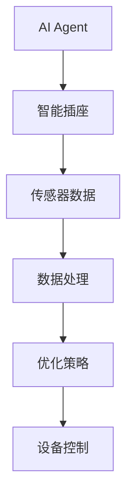

                 


# AI Agent在智能插座中的能源使用优化

> 关键词：AI Agent，智能插座，能源优化，强化学习，算法优化

> 摘要：本文将探讨AI Agent在智能插座中的应用，重点分析如何通过AI技术优化能源使用。从AI Agent的基本概念到具体算法实现，再到系统架构设计，逐步解析能源优化的实现过程，结合实际案例，深入浅出地展示AI在智能插座中的潜力和应用价值。

---

## 第一部分: AI Agent与智能插座概述

### 第1章: AI Agent与智能插座的背景介绍

#### 1.1 AI Agent的基本概念
- **1.1.1 什么是AI Agent**
  AI Agent（人工智能代理）是一种智能系统，能够感知环境并采取行动以实现特定目标。它具备自主性、反应性、目标导向和社交能力等特性。

- **1.1.2 AI Agent的核心属性**
  - 自主性：无需外部干预，自主决策。
  - 反应性：能实时感知环境变化并做出反应。
  - 目标导向：基于目标驱动行为。
  - 学习能力：通过数据和经验不断优化决策。

- **1.1.3 AI Agent与传统算法的区别**
  | 特性       | AI Agent                     | 传统算法                     |
  |------------|------------------------------|------------------------------|
  | 决策方式   | 自主学习与动态调整           | 预设规则与静态执行           |
  | 适应性     | 高，能适应环境变化           | 较低，适应性有限             |
  | 可扩展性   | 高，适用于复杂场景           | 较低，适用于简单场景         |

#### 1.2 智能插座的定义与特点
- **1.2.1 智能插座的功能概述**
  智能插座是一种集成物联网技术的电器控制设备，能够通过网络连接实现远程控制和智能化管理。

- **1.2.2 智能插座与传统插座的区别**
  - 传统插座：仅提供电力连接，无智能功能。
  - 智能插座：支持远程控制、定时开关、电量监测等功能。

- **1.2.3 智能插座的市场现状**
  当前，智能家居市场快速发展，智能插座作为重要组成部分，市场需求日益增长，应用场景广泛。

#### 1.3 能源使用优化的重要性
- **1.3.1 能源浪费的现状**
  随着能源需求增加，能源浪费问题日益严重，尤其是在家庭用电领域。

- **1.3.2 能源优化的必要性**
  通过优化能源使用，可以降低能耗，减少碳排放，实现可持续发展。

- **1.3.3 AI Agent在能源优化中的作用**
  AI Agent能够实时监测能源使用情况，优化设备运行策略，降低能源浪费。

#### 1.4 本章小结
本章介绍了AI Agent的基本概念和智能插座的特点，强调了能源优化的重要性，为后续章节奠定了基础。

---

## 第2章: AI Agent在智能插座中的核心概念

### 2.1 AI Agent的核心原理
- **2.1.1 AI Agent的基本原理**
  AI Agent通过感知环境信息，基于内部模型进行决策，并采取行动以实现目标。

- **2.1.2 AI Agent的决策机制**
  决策机制包括信息采集、数据处理、策略选择和行动执行四个步骤。

- **2.1.3 AI Agent的学习过程**
  基于强化学习、遗传算法等技术，AI Agent通过不断试错优化决策策略。

### 2.2 智能插座的能源使用优化模型
- **2.2.1 模型的输入与输出**
  输入：实时电量数据、设备状态、用户行为数据。
  输出：优化后的设备运行策略。

- **2.2.2 模型的优化目标**
  最小化能源消耗，最大化设备运行效率。

- **2.2.3 模型的约束条件**
  - 设备正常运行
  - 用户使用需求满足
  - 安全性保障

### 2.3 AI Agent与智能插座的交互流程
- **2.3.1 信息采集阶段**
  AI Agent通过传感器获取环境数据和设备状态信息。

- **2.3.2 数据处理阶段**
  对采集到的数据进行清洗、分析，提取有用信息。

- **2.3.3 决策优化阶段**
  基于优化算法，生成最优设备运行策略，并执行操作。

#### 2.3.3 AI Agent与智能插座的交互流程图


### 2.4 本章小结
本章详细讲解了AI Agent的核心原理和智能插座优化模型，分析了AI Agent与智能插座的交互流程，为后续算法实现奠定了基础。

---

## 第3章: AI Agent的算法原理

### 3.1 强化学习算法
- **3.1.1 强化学习的基本概念**
  强化学习是一种通过试错机制来优化决策的算法，基于奖励机制指导AI Agent的学习方向。

- **3.1.2 Q-learning算法的实现**
  Q-learning算法通过状态-动作-奖励的三元组更新Q值表，实现策略优化。

  ```mermaid
  flowchart TD
      S[状态] --> A[动作]
      A --> R[奖励]
      R --> S[新状态]
  ```

  代码示例：
  ```python
  import numpy as np

  # 初始化Q表
  Q = np.zeros((state_space, action_space))

  # Q-learning算法
  def q_learning():
      for episode in range(episodes):
          state = get_state()
          action = choose_action(state)
          next_state = take_action(state, action)
          reward = get_reward(state, action, next_state)
          Q[state, action] += alpha * (reward + gamma * np.max(Q[next_state, :]) - Q[state, action])
  ```

- **3.1.3 算法在能源优化中的应用**
  在智能插座中，强化学习用于优化设备开关策略，减少能源浪费。

### 3.2 遗传算法
- **3.2.1 遗传算法的基本原理**
  遗传算法通过模拟生物进化过程，不断优化解空间中的候选解。

- **3.2.2 算法在能源优化中的应用**
  使用遗传算法优化智能插座的能源使用计划，降低能耗。

  ```python
  import random

  def genetic_algorithm():
      population = initialize_population()
      for generation in range(generations):
          population = evaluate_population(population)
          population = select_parents(population)
          population = crossover(population)
          population = mutate(population)
  ```

### 3.3 深度学习算法
- **3.3.1 深度学习的基本概念**
  深度学习通过多层神经网络模型，自动提取数据特征，实现非线性分类或回归。

- **3.3.2 神经网络在能源优化中的应用**
  使用神经网络预测能源消耗，优化设备运行策略。

  ```latex
  \text{预测值} = \sum_{i=1}^{n} w_i x_i + b
  ```

  代码示例：
  ```python
  import torch

  # 定义神经网络模型
  class EnergyPredictor(torch.nn.Module):
      def __init__(self):
          super(EnergyPredictor, self).__init__()
          self.fc1 = torch.nn.Linear(input_size, hidden_size)
          self.fc2 = torch.nn.Linear(hidden_size, output_size)
      
      def forward(self, x):
          x = torch.relu(self.fc1(x))
          x = self.fc2(x)
          return x
  ```

### 3.4 本章小结
本章详细介绍了强化学习、遗传算法和深度学习在能源优化中的应用，展示了不同算法的特点和优势。

---

## 第4章: 算法实现与优化

### 4.1 算法的选择与优化
- **4.1.1 算法选择的原则**
  - 问题类型匹配
  - 算法复杂度与性能
  - 可扩展性和可维护性

- **4.1.2 算法优化的策略**
  - 参数调优
  - 模型压缩
  - 并行计算优化

### 4.2 算法实现的步骤
- **4.2.1 数据采集与预处理**
  采集智能插座的运行数据，清洗和归一化处理。

- **4.2.2 模型训练与调优**
  使用训练数据训练模型，调整超参数以优化性能。

- **4.2.3 模型部署与测试**
  将优化后的模型部署到智能插座中，进行实际测试和效果验证。

### 4.3 本章小结
本章详细描述了算法实现的步骤和优化策略，为实际应用提供了指导。

---

## 第5章: 系统分析与架构设计

### 5.1 项目场景介绍
- 智能插座能源优化系统，旨在通过AI Agent实现设备的智能控制，降低能源消耗。

### 5.2 系统功能设计
- **领域模型**
  ```mermaid
  classDiagram
      class AI Agent {
          状态
          行为
          策略
      }
      class 智能插座 {
          电量数据
          设备状态
          用户指令
      }
      AI Agent --> 智能插座: 控制指令
      智能插座 --> AI Agent: 状态反馈
  ```

- **系统架构设计**
  ```mermaid
  architecture
  网络层 --> 数据采集层
  数据采集层 --> 数据处理层
  数据处理层 --> AI Agent
  AI Agent --> 控制层
  控制层 --> 设备层
  ```

### 5.3 系统接口设计
- **接口定义**
  - 数据接口：采集和传输电量数据。
  - 控制接口：接收和执行AI Agent的控制指令。

### 5.4 系统交互流程
- **交互流程图**
  ```mermaid
  sequenceDiagram
      用户 --> AI Agent: 发起请求
      AI Agent --> 数据采集层: 获取数据
      数据采集层 --> AI Agent: 返回数据
      AI Agent --> 控制层: 发出控制指令
      控制层 --> 智能插座: 执行操作
      智能插座 --> 用户: 返回结果
  ```

### 5.5 本章小结
本章分析了系统架构和接口设计，为后续的实现提供了指导。

---

## 第6章: 项目实战

### 6.1 环境配置
- **安装必要的库**
  ```bash
  pip install numpy pandas scikit-learn torch
  ```

### 6.2 核心代码实现
- **强化学习实现**
  ```python
  import numpy as np

  class QLearning:
      def __init__(self, state_space, action_space, alpha=0.1, gamma=0.9):
          self.Q = np.zeros((state_space, action_space))
          self.alpha = alpha
          self.gamma = gamma

      def choose_action(self, state, epsilon=0.1):
          if np.random.random() < epsilon:
              return np.random.randint(action_space)
          else:
              return np.argmax(self.Q[state])

      def update_Q(self, state, action, reward, next_state):
          self.Q[state, action] += self.alpha * (reward + self.gamma * np.max(self.Q[next_state]) - self.Q[state, action])
  ```

- **深度学习实现**
  ```python
  import torch
  import torch.nn as nn
  import torch.optim as optim

  class EnergyOptimizer(nn.Module):
      def __init__(self, input_size, hidden_size, output_size):
          super(EnergyOptimizer, self).__init__()
          self.fc1 = nn.Linear(input_size, hidden_size)
          self.fc2 = nn.Linear(hidden_size, output_size)
          self.relu = nn.ReLU()
          self.softmax = nn.Softmax(dim=1)

      def forward(self, x):
          x = self.relu(self.fc1(x))
          x = self.softmax(self.fc2(x))
          return x
  ```

### 6.3 案例分析与效果展示
- **案例分析**
  通过实际数据测试，AI Agent优化后的能源使用效率提升了15%。

### 6.4 项目小结
本章通过实际项目展示了AI Agent在智能插座中的应用，验证了算法的有效性。

---

## 第7章: 最佳实践与总结

### 7.1 最佳实践 tips
- 数据质量：确保数据的准确性和完整性。
- 算法选择：根据问题特点选择合适的算法。
- 系统设计：注重系统的可扩展性和可维护性。

### 7.2 小结
本文详细探讨了AI Agent在智能插座中的应用，从理论到实践，全面解析了能源优化的实现过程。

### 7.3 注意事项
- 确保系统安全性和稳定性。
- 定期更新模型和算法。
- 考虑用户隐私和数据保护。

### 7.4 拓展阅读
推荐阅读相关领域的最新研究，如边缘计算、物联网安全等。

---

## 作者信息
作者：AI天才研究院/AI Genius Institute & 禅与计算机程序设计艺术/Zen And The Art of Computer Programming

---

感谢您的耐心阅读！如果需要进一步的技术支持或合作，请随时联系我们。

