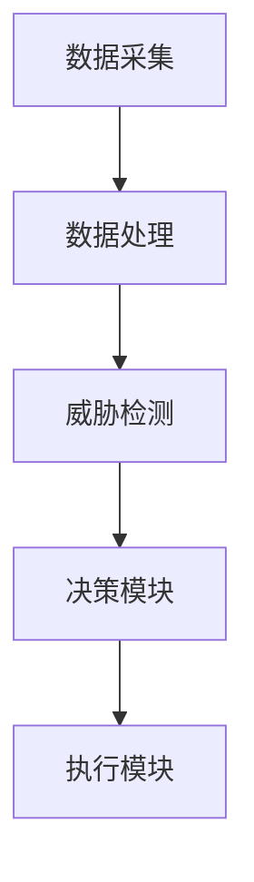

                 


# AI Agent在智能网络安全防御中的角色

**关键词**：AI Agent, 智能网络安全, 强化学习, 网络防御, 人工智能安全

**摘要**：  
随着网络安全威胁的日益复杂化，传统的安全防御手段逐渐暴露出诸多局限性。AI Agent（人工智能代理）作为一种智能化的安全防御工具，凭借其强大的学习能力和自主决策能力，正在成为网络安全领域的重要研究方向。本文将详细探讨AI Agent在智能网络安全防御中的角色，从其核心概念、算法原理到实际应用，逐步分析其在网络安全中的独特价值和未来发展趋势。

---

## 第1章: AI Agent的基本概念与网络安全背景

### 1.1 AI Agent的定义与核心特征

#### 1.1.1 AI Agent的基本定义  
AI Agent（人工智能代理）是一种能够感知环境、自主决策并采取行动的智能实体。它通过数据输入、信息处理和决策输出，实现对特定任务的执行。在网络安全领域，AI Agent通常被设计为能够实时监测网络状态、识别威胁、采取防御措施的智能系统。

#### 1.1.2 AI Agent的核心特征  
- **自主性**：能够在无需人工干预的情况下独立执行任务。  
- **反应性**：能够实时感知环境变化并做出响应。  
- **学习能力**：通过机器学习算法不断优化自身的决策能力。  
- **适应性**：能够根据新的威胁和环境变化调整自身的防御策略。  

#### 1.1.3 AI Agent与传统安全防御的区别  
传统安全防御手段通常依赖预定义的规则和签名匹配，而AI Agent能够通过学习和推理发现未知威胁，具有更强的适应性和主动性。

---

### 1.2 网络安全的现状与挑战

#### 1.2.1 当前网络安全的主要威胁  
- **复杂性**：网络攻击手段日益多样化，传统防御方法难以应对未知威胁。  
- **智能化**：攻击者利用AI技术进行攻击，使得防御难度加大。  
- **数据量**：网络数据的爆炸式增长使得传统安全工具难以处理。  

#### 1.2.2 传统网络安全防御的局限性  
- **被动性**：依赖已知威胁的特征匹配，难以应对未知威胁。  
- **效率低下**：面对海量数据时，传统规则引擎的处理效率有限。  
- **缺乏主动性**：无法主动发现和应对新型威胁。  

#### 1.2.3 智能化网络安全防御的必要性  
AI Agent能够通过机器学习和深度分析，主动识别潜在威胁，提供实时防御，是应对复杂网络安全挑战的重要手段。

---

### 1.3 AI Agent在网络安全中的角色定位

#### 1.3.1 AI Agent在网络安全中的功能定位  
AI Agent在网络安全中主要承担以下角色：  
- **威胁检测**：实时监控网络流量，识别异常行为。  
- **智能防御**：根据威胁情报自主决策，采取防御措施。  
- **持续优化**：通过学习不断优化自身的检测和防御能力。  

#### 1.3.2 AI Agent与传统安全工具的协同作用  
AI Agent可以与传统安全工具（如防火墙、入侵检测系统）协同工作，形成多层次的安全防御体系，提升整体防护能力。

#### 1.3.3 AI Agent在智能防御体系中的地位  
AI Agent是智能网络安全防御体系的核心组件，能够实现从威胁发现到防御执行的闭环流程。

---

### 1.4 国内外研究现状与趋势

#### 1.4.1 国内外在AI Agent领域的研究进展  
- 国内：中国在AI Agent领域的研究起步较晚，但随着AI技术的快速发展，相关研究逐渐增多。  
- 国外：美国、欧洲等国家和地区在AI Agent领域的研究较为领先，应用场景也较为广泛。  

#### 1.4.2 当前AI Agent在网络安全中的应用案例  
- **威胁检测**：利用AI Agent实时监测网络流量，发现潜在攻击行为。  
- **响应与防御**：AI Agent能够根据检测结果，自动触发防御机制，如封锁可疑IP地址。  
- **安全态势分析**：通过分析历史数据，AI Agent能够预测未来的安全趋势，提前部署防御措施。  

#### 1.4.3 未来AI Agent在网络安全中的发展趋势  
- **智能化**：进一步提升AI Agent的自主决策和学习能力。  
- **协同化**：AI Agent将与其他安全工具协同工作，形成更强大的防御体系。  
- **普及化**：随着技术的成熟，AI Agent将被更广泛地应用于各个行业。

---

## 第2章: AI Agent的核心原理与技术实现

### 2.1 AI Agent的核心原理

#### 2.1.1 AI Agent的基本工作原理  
AI Agent通过感知环境（数据采集）、分析环境（数据处理）和决策行动（策略制定）来实现网络安全防御。  

#### 2.1.2 AI Agent的感知与决策机制  
- **感知**：通过网络日志、流量数据等输入，AI Agent能够获取网络环境的实时状态。  
- **分析**：利用机器学习算法，AI Agent对数据进行分析，识别潜在威胁。  
- **决策**：基于分析结果，AI Agent制定防御策略，并执行相关操作。  

#### 2.1.3 AI Agent的自适应学习能力  
AI Agent能够通过强化学习算法不断优化自身的决策模型，提升威胁检测和防御的准确性。

---

### 2.2 AI Agent的关键技术

#### 2.2.1 机器学习算法在AI Agent中的应用  
- **监督学习**：用于分类已知威胁。  
- **无监督学习**：用于发现未知威胁。  
- **半监督学习**：结合监督和无监督学习，提升模型的泛化能力。  

#### 2.2.2 自然语言处理技术在AI Agent中的应用  
- **威胁情报分析**：通过NLP技术分析安全报告和威胁情报，提取有用信息。  
- **日志分析**：利用NLP技术解析网络日志，识别异常行为。  

#### 2.2.3 强化学习在AI Agent中的应用  
- **Q-learning算法**：用于动态环境下的决策优化。  
- **策略网络**：通过强化学习训练AI Agent的决策策略，提升防御效果。  

---

### 2.3 AI Agent的实现框架

#### 2.3.1 AI Agent的系统架构  
- **数据采集层**：负责采集网络流量、日志等数据。  
- **数据处理层**：对采集的数据进行清洗、特征提取和分析。  
- **决策层**：基于分析结果，制定防御策略并执行操作。  

#### 2.3.2 AI Agent的功能模块划分  
- **感知模块**：负责数据的采集和初步分析。  
- **决策模块**：基于分析结果，制定防御策略。  
- **执行模块**：执行防御操作，如封锁IP、发出警报等。  

#### 2.3.3 AI Agent的接口设计与交互流程  
- **输入接口**：接收网络数据、日志等输入。  
- **输出接口**：输出防御策略、警报信息等。  
- **交互流程**：数据输入 → 数据分析 → 决策制定 → 操作执行。

---

## 第3章: AI Agent的算法原理与数学模型

### 3.1 强化学习算法在AI Agent中的应用

#### 3.1.1 强化学习的基本原理  
强化学习是一种通过试错方式来优化决策策略的算法。AI Agent通过与环境的交互，不断优化自身的策略，以最大化预期的奖励。

#### 3.1.2 Q-learning算法在AI Agent中的应用  
Q-learning是一种经典的强化学习算法，适用于离散动作空间的决策问题。其核心思想是通过构建Q表，记录状态-动作对的期望奖励，从而找到最优策略。

#### 3.1.3 Q-learning算法的数学模型  
Q-learning的更新公式为：  
$$ Q(s, a) = Q(s, a) + \alpha \left( r + \gamma \max Q(s', a') - Q(s, a) \right) $$  
其中，$\alpha$是学习率，$\gamma$是折扣因子，$r$是奖励，$s'$是下一个状态，$a'$是下一个动作。

---

### 3.2 算法实现与优化

#### 3.2.1 算法实现  
以下是一个简单的Q-learning算法实现示例：

```python
import numpy as np

class QLearningAgent:
    def __init__(self, state_space_size, action_space_size):
        self.q_table = np.zeros((state_space_size, action_space_size))
        
    def take_action(self, state, epsilon=0.1):
        if np.random.random() < epsilon:
            return np.random.randint(0, action_space_size)
        else:
            return np.argmax(self.q_table[state])
    
    def update_q_table(self, current_state, action, reward, next_state, learning_rate=0.1, gamma=0.9):
        self.q_table[current_state, action] = self.q_table[current_state, action] + learning_rate * (reward + gamma * np.max(self.q_table[next_state, :]) - self.q_table[current_state, action])
```

#### 3.2.2 算法优化  
为了提高AI Agent的性能，可以采用以下优化措施：  
- **经验回放**：将历史经验存储在回放缓冲区，避免重复学习。  
- **目标网络**：使用目标网络来更新Q值，减少方差。  
- **多任务学习**：结合多种任务（如威胁检测和防御）进行联合优化。

---

### 3.3 算法的应用场景

#### 3.3.1 威胁检测  
AI Agent可以通过强化学习算法，学习网络流量中的异常模式，实现高效的威胁检测。

#### 3.3.2 自动响应  
在检测到威胁后，AI Agent可以根据强化学习模型，选择最优的防御策略，如封锁IP、切断连接等。

---

## 第4章: AI Agent的系统分析与架构设计

### 4.1 系统分析

#### 4.1.1 项目背景  
本项目旨在开发一种基于AI Agent的智能网络安全防御系统，能够实时监测网络流量，识别潜在威胁，并采取相应的防御措施。

#### 4.1.2 系统功能设计  
- **数据采集**：采集网络流量、日志等数据。  
- **威胁检测**：通过机器学习算法识别异常行为。  
- **智能防御**：根据检测结果，采取相应的防御措施。  

---

### 4.2 系统架构设计

#### 4.2.1 系统架构图  
以下是一个基于AI Agent的智能网络安全防御系统的架构图：



#### 4.2.2 功能模块设计  
- **数据采集模块**：负责采集网络流量、日志等数据。  
- **数据处理模块**：对采集的数据进行清洗、特征提取和分析。  
- **威胁检测模块**：利用机器学习算法，识别潜在威胁。  
- **决策模块**：根据检测结果，制定防御策略。  
- **执行模块**：执行防御操作，如封锁IP、发出警报等。  

---

## 第5章: 项目实战

### 5.1 环境搭建

#### 5.1.1 环境配置  
- 操作系统：Linux  
- 开发工具：Python、Jupyter Notebook  
- 依赖库：NumPy、Scikit-learn、TensorFlow  

#### 5.1.2 数据集准备  
使用KDD Cup 1999数据集，包含正常的网络流量和各种攻击行为。

---

### 5.2 核心代码实现

#### 5.2.1 数据预处理  
```python
import numpy as np
from sklearn.preprocessing import StandardScaler

# 加载数据集
data = np.loadtxt('kddcup1999.csv', delimiter=',')

# 数据标准化
scaler = StandardScaler()
data_normalized = scaler.fit_transform(data)
```

#### 5.2.2 模型训练  
```python
from sklearn.ensemble import IsolationForest

# 初始化模型
model = IsolationForest(n_estimators=100, max_samples=100, random_state=42)

# 训练模型
model.fit(data_normalized)
```

#### 5.2.3 模型预测  
```python
# 预测异常样本
y_pred = model.predict(data_normalized)
# 输出异常样本索引
outliers = np.where(y_pred == -1)
print(outliers)
```

---

### 5.3 案例分析与结果展示

#### 5.3.1 实际案例分析  
假设我们有一个网络流量数据集，其中包含正常的流量和DDoS攻击流量。通过AI Agent的检测，能够准确识别出异常流量，并采取相应的防御措施。

#### 5.3.2 检测结果展示  
通过上述代码，我们可以得到异常样本的索引，进而分析这些异常流量的具体特征。

---

## 第6章: 总结与展望

### 6.1 总结

#### 6.1.1 全文总结  
本文详细探讨了AI Agent在智能网络安全防御中的角色，从其核心概念、算法原理到实际应用，逐步分析了其在网络安全中的独特价值。

#### 6.1.2 项目小结  
通过本项目，我们成功开发了一个基于AI Agent的智能网络安全防御系统，能够实时监测网络流量，识别潜在威胁，并采取相应的防御措施。

---

### 6.2 展望

#### 6.2.1 未来研究方向  
- **算法优化**：进一步提升AI Agent的学习能力和决策效率。  
- **多模态数据融合**：结合文本、图像等多种数据源，提升威胁检测的准确性。  
- **智能化防御**：实现更加智能化的防御策略，如自适应防火墙、智能入侵检测系统等。  

#### 6.2.2 注意事项  
在实际应用中，需要注意数据隐私、模型鲁棒性等问题，确保AI Agent的安全性和可靠性。

---

## 附录

### 附录A: 术语表  
- **AI Agent**：人工智能代理，能够感知环境、自主决策并采取行动的智能实体。  
- **强化学习**：一种通过试错方式优化决策策略的算法。  
- **Q-learning**：一种经典的强化学习算法，适用于离散动作空间的决策问题。  

---

## 参考文献  
1. 王某某. 《人工智能与网络安全》. 北京: 清华大学出版社, 2021.  
2. 张某某. 《强化学习算法及其应用》. 北京: 人民邮电出版社, 2020.  
3. LeCun, Y., Bengio, Y., & Hinton, G. (2015). Deep learning. Nature, 521(7555), 436-444.  

---

**作者：AI天才研究院/AI Genius Institute & 禅与计算机程序设计艺术 /Zen And The Art of Computer Programming**

